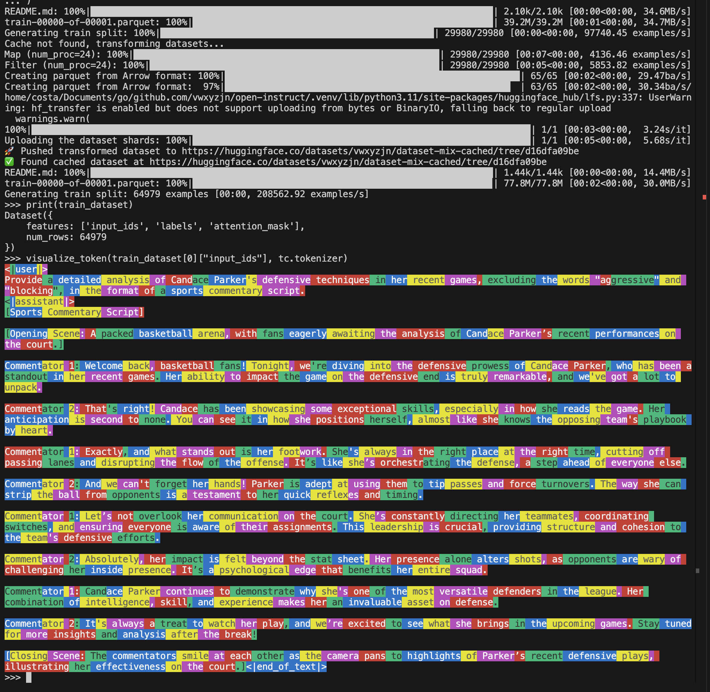
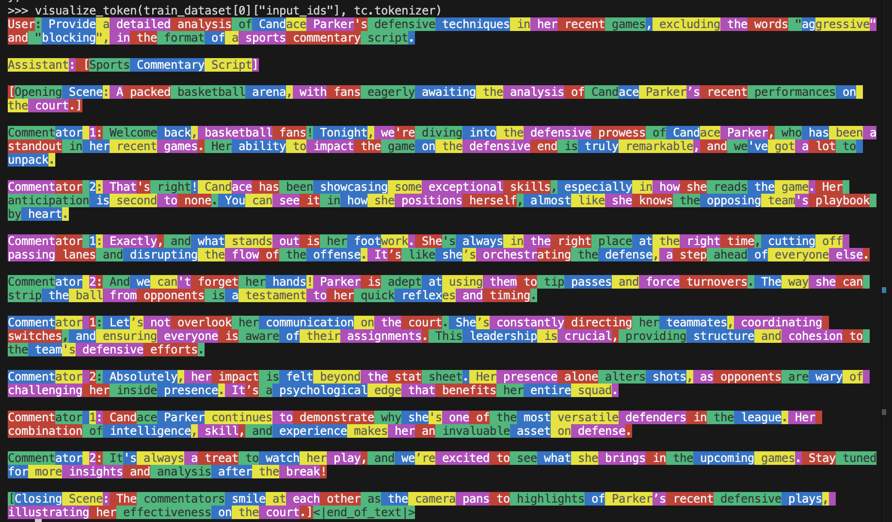

# Dataset Transformations

Dataset transformations are a key part of the training process. Typically, we are given some text dataset, and we tokenize and filter it to be used for training. 

Open Instruct includes a `dataset_transformation.py` utility which 

* handles dataset mixing
* handles different tokenization functions
* **caches** the tokenized dataset so we don't have to re-tokenize every time
    * This is especially important when we have 405B SFT models: 32 nodes are just spending like
    5 minutes to tokenize the dataset. This translates to 32 * 5 * 8 = 1280 minutes = 21 hours of
    wasted H100 time.
    * Sometimes we also launch on places that don't have a shared cache, so we would
    download individual datasets 32 times, and wait for concatenation and tokenization (actually 
    twice because the `with accelerator.main_process_first()` function assumes a shared cache)
    * Using a cache like this also minimizes the time to get first training output, making debug
    cycles faster.


## SFT Dataset Format

We expect the dataset to have a `messages` key, which is a list of dictionaries with `role` and `content` keys. For example,

* [allenai/tulu-3-sft-personas-instruction-following](https://huggingface.co/datasets/allenai/tulu-3-sft-personas-instruction-following)
* [allenai/tulu-3-sft-personas-code](https://huggingface.co/datasets/allenai/tulu-3-sft-personas-code)

Below is a minimal example of how `dataset_transformation.py` was used in the `finetune.py` script to mix, tokenize, and filter a dataset for SFT.

```python
from open_instruct.dataset_transformation import (
    TokenizerConfig,
    get_cached_dataset_tulu,
    visualize_token,
)
tc = TokenizerConfig(
    tokenizer_name_or_path="meta-llama/Llama-3.1-8B",
    tokenizer_revision="main",
    use_fast=True,
    chat_template_name="tulu",
)
dataset_mixer_list = [
    "allenai/tulu-3-sft-personas-instruction-following", "1.0",
    "allenai/tulu-3-sft-personas-code", "1.0",
]
dataset_mixer_list_splits = ["train"]
dataset_transform_fn = ["sft_tulu_tokenize_and_truncate_v1", "sft_tulu_filter_v1"]
transform_fn_args = [
    {"max_seq_length": 4096},
    {},
]
train_dataset = get_cached_dataset_tulu(
    dataset_mixer_list,
    dataset_mixer_list_splits,
    tc,
    dataset_transform_fn,
    transform_fn_args,
    target_columns=["input_ids", "attention_mask", "labels"],
    dataset_cache_mode="local",
)
print(train_dataset)
visualize_token(train_dataset[0]["input_ids"], tc.tokenizer)
```




You can also use a different `chat_template_name`. For example,

```python
tc = TokenizerConfig(
    # ...
    chat_template_name="simple_chat",
)
#...
```

would give us



