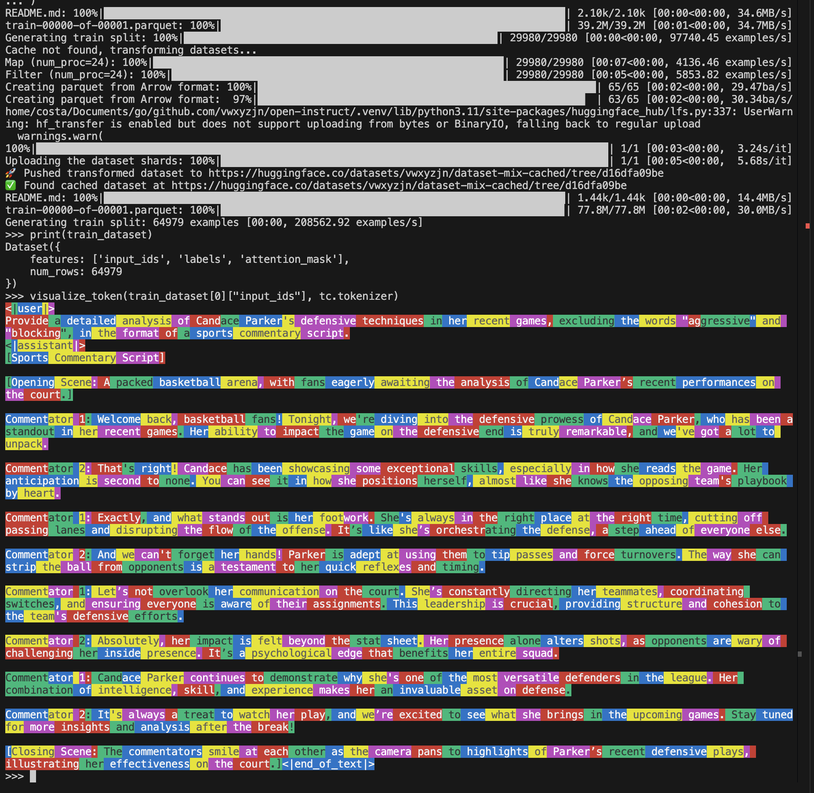
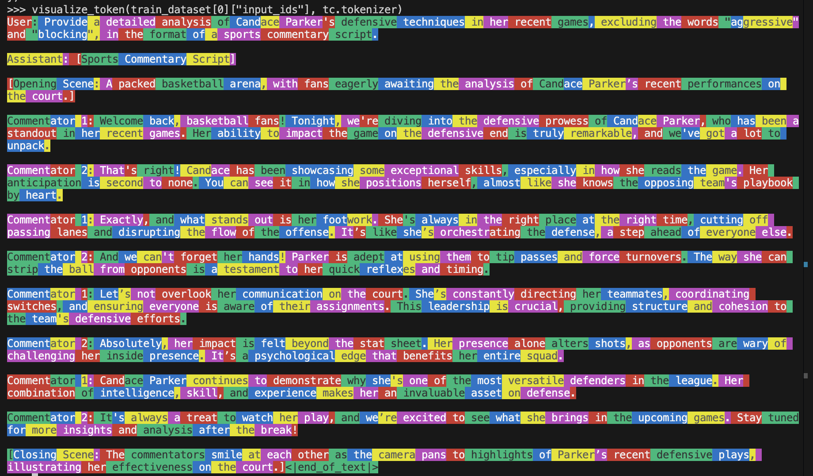

# Dataset Transformations

Dataset transformations are a key part of the training process. Typically, we are given some text dataset, and we tokenize and filter it to be used for training.

Open Instruct includes a `dataset_transformation.py` utility which

* handles dataset mixing
* handles different tokenization functions
* **caches** the tokenized dataset so we don't have to re-tokenize every time
    * This is especially important when we have 405B SFT models: 32 nodes are just spending like
    5 minutes to tokenize the dataset. This translates to 32 * 5 * 8 = 1280 minutes = 21 hours of
    wasted H100 time.
    * Sometimes we also launch on places that don't have a shared cache, so we would
    download individual datasets 32 times, and wait for concatenation and tokenization (actually
    twice because the `with accelerator.main_process_first()` function assumes a shared cache)
    * Using a cache like this also minimizes the time to get first training output, making debug
    cycles faster.


## SFT Dataset Format

We expect the dataset to have a `messages` key, which is a list of dictionaries with `role` and `content` keys. For example,

* [allenai/tulu-3-sft-personas-instruction-following](https://huggingface.co/datasets/allenai/tulu-3-sft-personas-instruction-following)
* [allenai/tulu-3-sft-personas-code](https://huggingface.co/datasets/allenai/tulu-3-sft-personas-code)

Below is a minimal example of how `dataset_transformation.py` was used in the `finetune.py` script to mix, tokenize, and filter a dataset for SFT.

You can run `python scripts/data/finetune_dataset_transformation.py` to see the output.


```python title="scripts/data/finetune_dataset_transformation.py" linenums="1"
--8<-- "scripts/data/finetune_dataset_transformation.py"
```




`--chat_template_name` must be a `CHAT_TEMPLATES` key, or `tokenizer_default`
to use the tokenizer's own template. Omitting the flag is the same as
`tokenizer_default`. An unrecognised name raises. `dataset_statistics.json`
records the resolved source (`registry:<name>` or `tokenizer:<path>`) and hash.

You can also use a different `chat_template_name`. For example,

```python
tc = TokenizerConfig(
    # ...
    chat_template_name="simple_chat",
)
#...
```

would give us




## Making a tag a single token

A tag the tokenizer splits into several pieces is a training/inference mismatch whenever its
last piece merges with the text that follows it. `<think>` is `<th` `ink` `>` in the Olmo
vocabularies, and the BPE merges that `>` forward: `>\n` is one token, so is `>\n\n`, and so is
`></`. A generation prompt ending in `<think>` therefore cannot produce the first token of any
turn whose reasoning starts on the next line, or whose think block is empty.

`reserved_slot_tokens` fixes this by renaming unused `<|extra_id_N|>` entries in place:

```python
tc = TokenizerConfig(
    # ...
    reserved_slot_tokens=["<think>", "</think>"],
)
```

Because the slots already exist, `vocab_size` and olmo-core's `padded_vocab_size()` are
unchanged, so no checkpoint is resized. The SFT trainer seeds each promoted row with the mean of
the rows for the pieces the string used to tokenize into. The promoted tokens are not marked
special, so `skip_special_tokens=True` decoding still shows them.

Setting this changes the token sequence of every turn containing the tag, so it changes the
dataset cache key. Leaving it unset keeps both.
