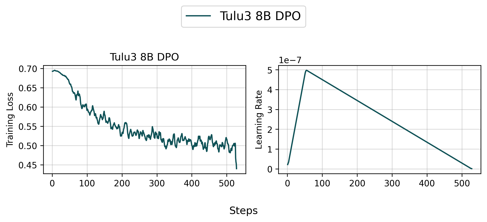
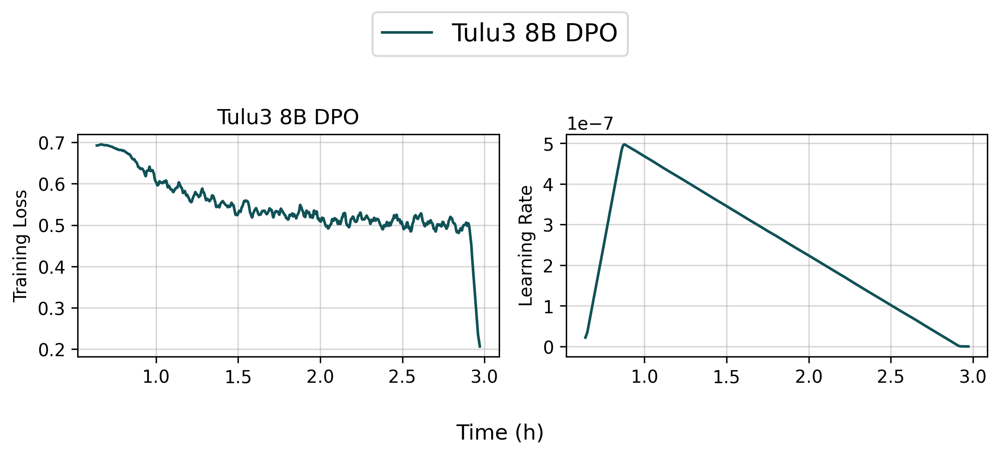
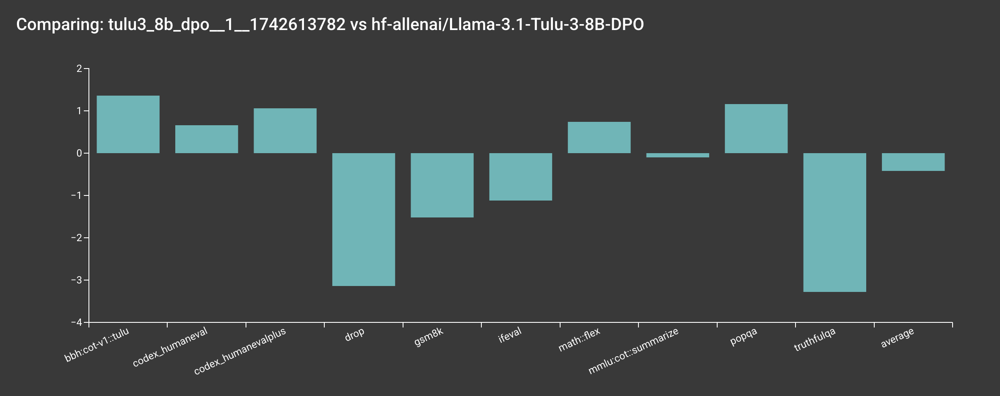
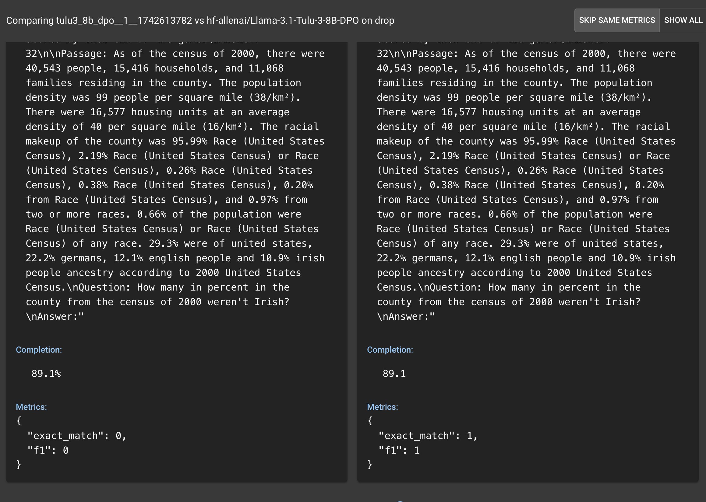
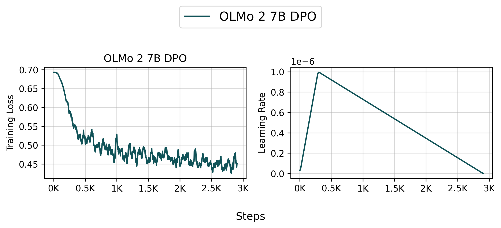
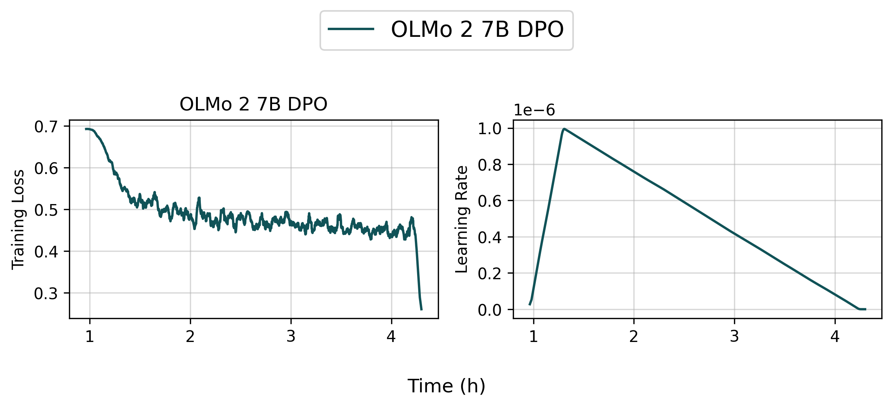
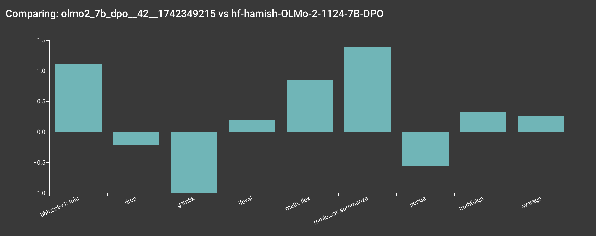
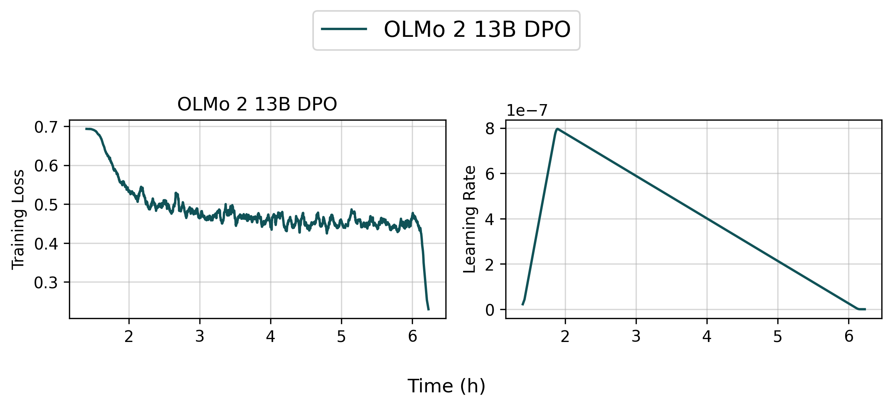
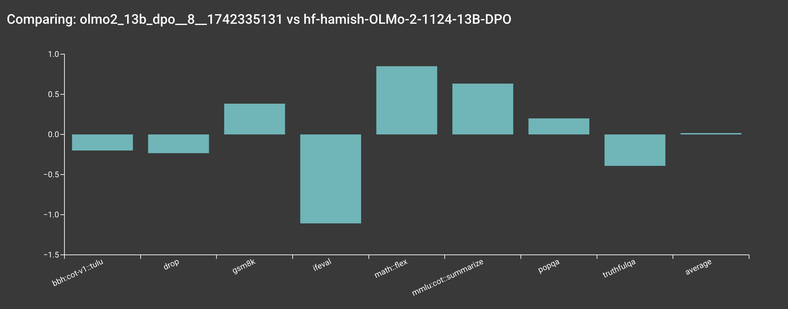

# Direct Preference Optimization (DPO)

We support Direct Preference Optimization (DPO) training on a variety of datasets.

## Implemented Variants

- `dpo_tune_cache.py` is the DPO implementation that directly optimizes model outputs based on human preferences.

## `dpo_tune_cache.py`

This implementation has the following key features:

- Auto save the trained checkpoint to HuggingFace Hub
- Supports LigerKernel for optimized training with fused operations
- Implements the DPO algorithm for direct preference optimization


There are several relevant implementation details:

1. To save memory, we 1) cache the logprobs of the reference model on the dataset, 2) remove the reference model from the memory after the logprobs are computed. This means that you won't see the initial training losses for a while until the logprobs are computed.
2. We use the `dpo_norm` loss type by default, which is a length-normalized loss. See the [SimPO](https://arxiv.org/abs/2405.14734) paper for more details.


### Debug (Single GPU)

You can run the script in a single GPU mode to debug the training process.

```bash
bash scripts/train/debug/dpo.sh
```


### Reproduce `allenai/Llama-3.1-Tulu-3-8B-DPO` (4 Nodes)

You can reproduce our `allenai/Llama-3.1-Tulu-3-8B-DPO` model by running the following command:

```bash
bash scripts/train/tulu3/dpo_8b.sh
```





??? note "👉 Tracked WandB Experiments (Click to expand)"

    <iframe loading="lazy" src="https://wandb.ai/ai2-llm/open_instruct_public/reports/Tulu3-8B-DPO--VmlldzoxMTg3NjY4Nw" style="width:100%; height:500px" title="Tulu3-8B-DPO"></iframe>


???+ info


    Based on our internal evaluation, the DPO model is roughly on par with the original `allenai/Llama-3.1-Tulu-3-8B-DPO` model, though there are some slight differences. Note that your results may vary slightly due to the random seeds used in the training.

    

    For example, DROP is lower than the reference, but DROP can be quite brittle due to parsing issues (see below).

    


???+ info

    We haven't quite figured out how to make our internal evaluation toolchains more open yet. Stay tuned!


### Reproduce `allenai/OLMo-2-1124-7B-DPO` (4 Nodes)

You can reproduce our `allenai/OLMo-2-1124-7B-DPO` model by running the following command:

```bash
bash scripts/train/olmo2/dpo_7b.sh
```

???+ info

    If you are an external user, `mason.py` will print out the actual command being executed on our internal server, so you can modify the command as needed.





??? note "👉 Tracked WandB Experiments (Click to expand)"

    <iframe loading="lazy" src="https://wandb.ai/ai2-llm/open_instruct_public/reports/OLMo-2-7B-DPO--VmlldzoxMTkyNzUyOA" style="width:100%; height:500px" title="OLMo2-7B-DPO"></iframe>

???+ info

    Based on our internal evaluation, the DPO model is roughly on par with the original `allenai/OLMo-2-1124-7B-DPO` model, though there are some slight differences. Note that your results may vary slightly due to the random seeds used in the training.

    

???+ info

    We haven't quite figured out how to make our internal evaluation toolchains more open yet. Stay tuned!


### Reproduce `allenai/OLMo-2-1124-13B-DPO` (4 Nodes)

You can reproduce our `allenai/OLMo-2-1124-13B-DPO` model by running the following command:

```bash
bash scripts/train/olmo2/dpo_13b.sh
```





??? note "👉 Tracked WandB Experiments (Click to expand)"

    <iframe loading="lazy" src="https://wandb.ai/ai2-llm/open_instruct_public/reports/OLMo-2-13B-DPO--VmlldzoxMTg3NjcyMQ" style="width:100%; height:500px" title="OLMo2-13B-DPO"></iframe>


???+ info

    Based on our internal evaluation, the DPO model is roughly on par with the original `allenai/OLMo-2-1124-13B-DPO` model, though there are some slight differences. Note that your results may vary slightly due to the random seeds used in the training.

    


???+ info

    We haven't quite figured out how to make our internal evaluation toolchains more open yet. Stay tuned!


### Training Metrics

During training, the following metrics are logged:

- `training_step`: Current training step
- `learning_rate`: The current learning rate from the learning rate scheduler
- `epoch`: Current epoch (as a fraction of total dataset)
- `train_loss`: The average training loss over the logged steps
- `logps/chosen`: Average log probabilities for chosen responses
- `logps/rejected`: Average log probabilities for rejected responses

For DPO and DPO-norm loss types, additional metrics are logged:

- `rewards/chosen`: Average rewards for chosen responses
- `rewards/rejected`: Average rewards for rejected responses
- `rewards/average`: Average of chosen and rejected rewards
- `rewards/accuracy`: Accuracy of preference prediction
- `rewards/margin`: Margin between chosen and rejected rewards

When using load balancing loss (for OLMoE), the following metric is also logged:

- `aux_loss`: Auxiliary loss for load balancing

The metrics are logged every `logging_steps` steps (if specified) and provide insights into:

- Training progress (loss, learning rate, epoch)
- Model behavior (log probabilities, rewards)
- Preference learning (accuracy, margin)
- Resource utilization (auxiliary losses)

## Acknowledgements

We would like to thank the following projects for general infrastructure:

- [DeepSpeedAI/DeepSpeed](https://github.com/deepspeedai/DeepSpeed)
- [HuggingFace/Transformers](https://github.com/huggingface/transformers)
