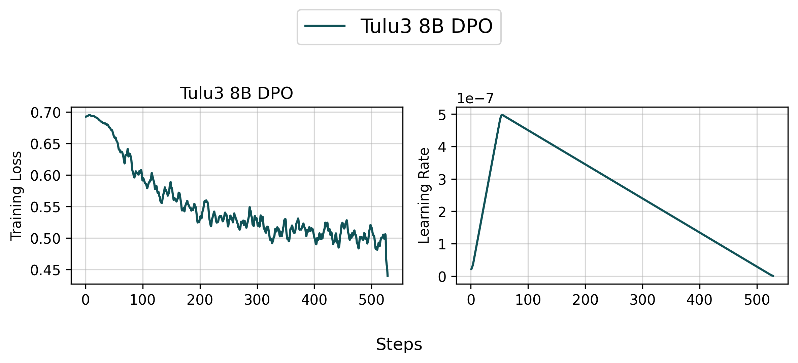
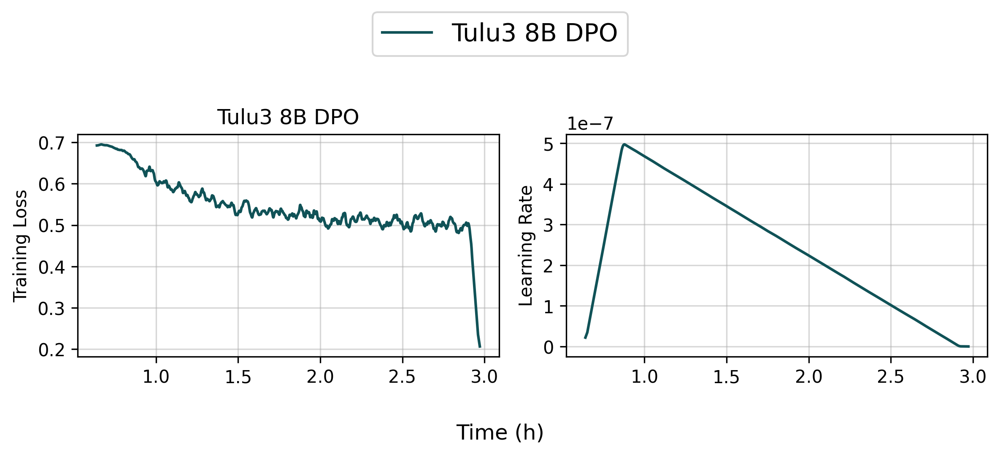
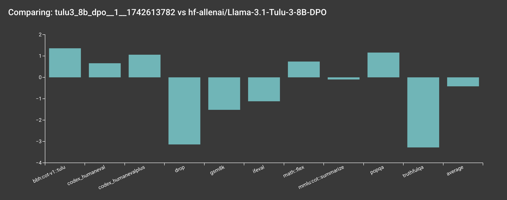
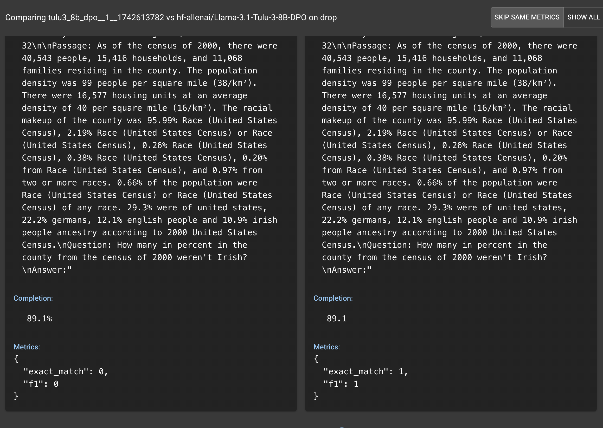
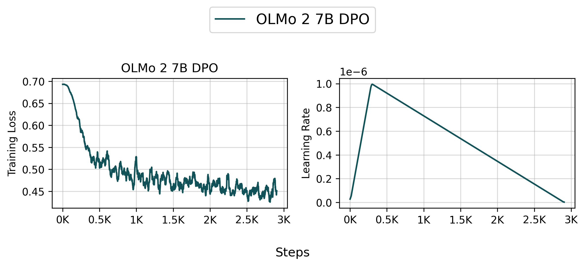
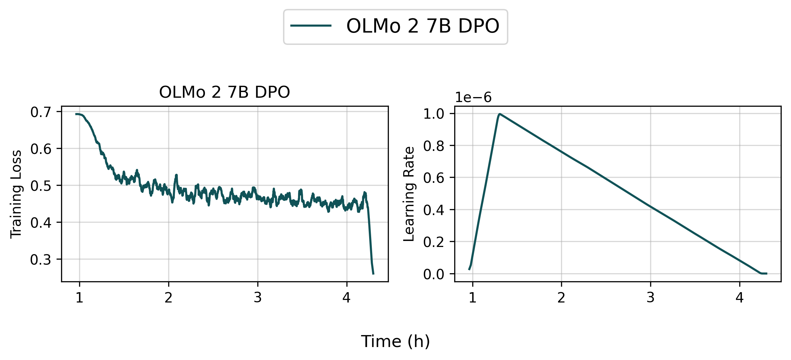
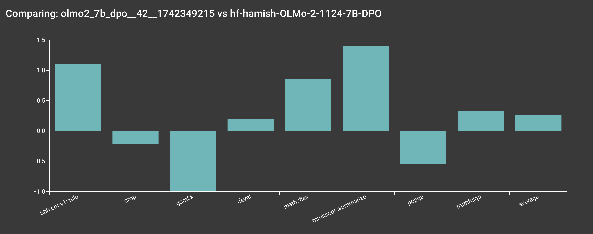
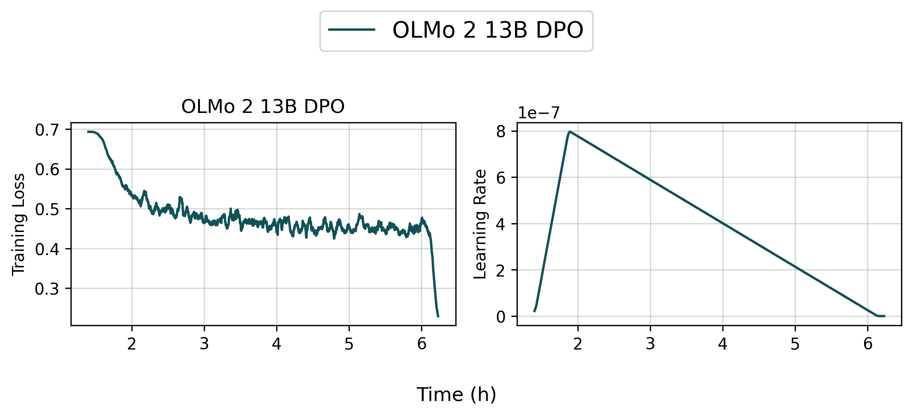
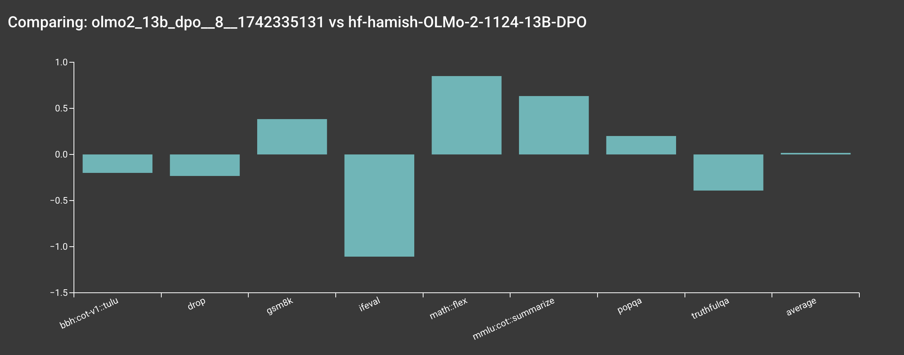

# Direct Preference Optimization (DPO)

We support Direct Preference Optimization (DPO) training on a variety of datasets.

## Implemented Variants

- `dpo.py` (recommended) is the DPO implementation built on OLMo-core's native training infrastructure (FSDP). It supports tensor parallelism, sequence packing, and `torch.compile`.
- `dpo_tune_cache.py` implements the same DPO algorithm as `dpo.py` but uses DeepSpeed instead of OLMo-core. `dpo.py` should be more efficient and easier to debug; prefer it for new work.

## `dpo.py` (OLMo-core)

### Debug Scripts

| Script | Scale | Description | Launch |
|--------|-------|-------------|--------|
| `scripts/train/debug/dpo/local.sh` | 1 GPU, local | Quick local test with OLMo-2-0425-1B. No Beaker required. | `bash scripts/train/debug/dpo/local.sh` |
| `scripts/train/debug/dpo/single_gpu.sh` | 1 GPU, Beaker | Single-GPU smoke test on Beaker with OLMo-2-0425-1B. | `./scripts/train/build_image_and_launch.sh scripts/train/debug/dpo/single_gpu.sh` |
| `scripts/train/debug/dpo/multi_node.sh` | 2 nodes (16 GPUs), Beaker | Multi-node test with OLMo-2-1124-7B. Exercises FSDP sharding, tensor parallelism, packing, and profiling. | `./scripts/train/build_image_and_launch.sh scripts/train/debug/dpo/multi_node.sh` |

### Olmo 3 Scripts

| Script | Scale | Description | Launch |
|--------|-------|-------------|--------|
| `scripts/train/debug/dpo/7b_instruct_dpo_olmo_core.sh` | 2 nodes (16 GPUs), Beaker | Debug script for Olmo 3 7B DPO with a multi-dataset mixer. | `./scripts/train/build_image_and_launch.sh scripts/train/debug/dpo/7b_instruct_dpo_olmo_core.sh` |
| `scripts/train/olmo3/7b_instruct_dpo_olmocore.sh` | 4 nodes (32 GPUs), Beaker | Production Olmo 3 7B Instruct DPO (OLMo-core). | `./scripts/train/build_image_and_launch.sh scripts/train/olmo3/7b_instruct_dpo_olmocore.sh` |
| `scripts/train/olmo3/7b_instruct_dpo.sh` | 4 nodes (32 GPUs), Beaker | Production Olmo 3 7B Instruct DPO (DeepSpeed/legacy). | `./scripts/train/build_image_and_launch.sh scripts/train/olmo3/7b_instruct_dpo.sh` |
| `scripts/train/olmo3/7b_think_dpo.sh` | 4 nodes (32 GPUs), Beaker | Olmo 3 7B Think DPO. | `./scripts/train/build_image_and_launch.sh scripts/train/olmo3/7b_think_dpo.sh` |
| `scripts/train/olmo3/32b_instruct_dpo.sh` | 8 nodes (64 GPUs), Beaker | Olmo 3 32B Instruct DPO. | `./scripts/train/build_image_and_launch.sh scripts/train/olmo3/32b_instruct_dpo.sh` |
| `scripts/train/olmo3/32b_think_dpo.sh` | 16 nodes (128 GPUs), Beaker | Olmo 3 32B Think DPO. | `./scripts/train/build_image_and_launch.sh scripts/train/olmo3/32b_think_dpo.sh` |

### Key Flags

| Group | Flag | Description | Default |
|-------|------|-------------|---------|
| **Experiment** | `--exp_name` | Name of this experiment | `"dpo_experiment"` |
| | `--run_name` | Unique run name (for W&B) | `None` |
| | `--seed` | Random seed for initialization and dataset shuffling | `42` |
| **Model** | `--model_name_or_path` | Model checkpoint for weight initialization | — |
| | `--attn_backend` | Attention backend: `flash_2`, `flash_3`, `auto` | `auto` |
| | `--model_revision` | Specific model version (branch, tag, or commit) | `None` |
| | `--config_name` | Pretrained config name or path if different from model | `None` |
| **DPO Algorithm** | `--beta` | Beta parameter for DPO loss | `0.1` |
| | `--loss_type` | Loss type: `dpo`, `dpo_norm`, `simpo`, `wpo` | `dpo` |
| | `--gamma_beta_ratio` | Gamma to beta ratio for SimPO loss (unused for DPO) | `0.3` |
| | `--label_smoothing` | Label smoothing for DPO/SimPO loss | `0.0` |
| | `--packing` | Use packing/padding-free collation | `False` |
| | `--concatenated_forward` | Concatenate chosen and rejected in one forward pass | `True` |
| | `--load_balancing_loss` | Include load balancing loss (for OLMoE) | `False` |
| | `--load_balancing_weight` | Weight for load balancing loss | `0.001` |
| **Training** | `--learning_rate` | Initial learning rate | `2e-5` |
| | `--num_epochs` | Total number of training epochs | `2` |
| | `--max_train_steps` | If set, overrides `num_epochs` | `None` |
| | `--per_device_train_batch_size` | Batch size per GPU | `8` |
| | `--gradient_accumulation_steps` | Gradient accumulation steps | `1` |
| | `--max_seq_length` | Maximum sequence length after tokenization | `2048` |
| | `--warmup_ratio` | Linear warmup fraction of total steps | `0.03` |
| | `--weight_decay` | Weight decay for AdamW | `0.0` |
| | `--max_grad_norm` | Maximum gradient norm for clipping (-1 = no clipping) | `-1` |
| | `--lr_scheduler_type` | LR scheduler: `linear`, `cosine`, `constant` | `linear` |
| | `--compile_model` | Apply `torch.compile` to model blocks | `True` |
| | `--activation_memory_budget` | Activation checkpointing budget (0.0–1.0) | `1.0` |
| | `--optimizer_type` | Optimizer type: `adamw` or `muon` | `adamw` |
| | `--optimizer_kwargs` | Extra kwargs for optimizer (e.g., `'{"mu": 0.95}'` for Muon) | `{}` |
| | `--fused_optimizer` | Use fused AdamW | `True` |
| | `--use_8bit_optimizer` | Use 8-bit optimizer from bitsandbytes | `False` |
| | `--sync_each_batch` | Sync grads every batch during grad accumulation (reduces memory) | `False` |
| | `--cache_logprobs_only` | Exit after building reference logprobs cache | `False` |
| | `--timeout` | Timeout for training process in seconds | `1800` |
| **Parallelism** | `--tensor_parallel_degree` | Tensor parallelism degree | `1` |
| | `--context_parallel_degree` | Context parallelism degree | `1` |
| | `--fsdp_shard_degree` | FSDP shard degree (`None` = auto) | `None` |
| | `--fsdp_num_replicas` | Number of FSDP replicas (`None` = auto) | `None` |
| **Data** | `--mixer_list` | List of datasets (local or HF) to sample from | — |
| | `--mixer_list_splits` | Dataset splits for training | `["train"]` |
| | `--chat_template_name` | Chat template to use | `None` |
| | `--transform_fn` | List of transform functions to apply to the dataset | — |
| | `--cache_dataset_only` | Exit after caching the dataset | `False` |
| | `--skip_cache` | Skip dataset caching | `False` |
| **LoRA** | `--use_lora` | Use LoRA for parameter-efficient training | `False` |
| | `--lora_rank` | Rank of LoRA | `64` |
| | `--lora_alpha` | Alpha parameter of LoRA | `16` |
| | `--lora_dropout` | Dropout rate of LoRA | `0.1` |
| **Checkpointing** | `--output_dir` | Output directory for checkpoints | `output/` |
| | `--checkpointing_steps` | Save every N steps or `epoch` | `500` |
| | `--keep_last_n_checkpoints` | How many checkpoints to keep (-1 for all) | `3` |
| | `--resume_from_checkpoint` | Resume from checkpoint folder | `None` |
| **Logging** | `--with_tracking` | Track experiment with Weights and Biases | `False` |
| | `--logging_steps` | Log training loss every N steps | `None` |
| | `--wandb_project` | W&B project name | `"open_instruct_internal"` |
| | `--wandb_entity` | W&B entity (team) name | `None` |
| **Hub** | `--push_to_hub` | Upload saved model to HuggingFace | `True` |
| | `--hf_entity` | User or org name of the model repository | `None` |
| | `--hf_repo_id` | ID of the saved model in HF Hub | `None` |
| **Eval** | `--try_launch_beaker_eval_jobs` | Launch Beaker evaluation jobs after training | `True` |
| | `--oe_eval_tasks` | Beaker evaluation tasks to launch | `None` |

---

## `dpo_tune_cache.py` (Legacy)

`dpo_tune_cache.py` uses DeepSpeed instead of OLMo-core FSDP. It accepts all the same flags as `dpo.py` above, with the following differences:

**Additional flags** (not in `dpo.py`):

| Group | Flag | Description | Default |
|-------|------|-------------|---------|
| **DeepSpeed** | `--zero_stage` | DeepSpeed ZeRO stage (0, 1, 2, or 3) | — |
| | `--offload_optimizer` | Offload optimizer states to CPU | `False` |
| | `--offload_param` | Offload parameters to CPU (only with ZeRO stage 3) | `False` |
| | `--zero_hpz_partition_size` | Hierarchical partition size for ZeRO stage 3 | `8` |
| **Optimization** | `--use_liger_kernel` | Use LigerKernel for optimized training | `False` |
| | `--use_qlora` | Use qLoRA (initializes model in quantized form) | `False` |
| | `--dpo_use_paged_optimizer` | Use paged optimizer from bitsandbytes | `False` |

**Flags not applicable** (ignored by `dpo_tune_cache.py`): `--attn_backend`, `--tensor_parallel_degree`, `--context_parallel_degree`, `--fsdp_shard_degree`, `--fsdp_num_replicas`, `--compile_model`.

Implementation details:

1. To save memory, `dpo_tune_cache.py` caches the logprobs of the reference model on the dataset, then removes the reference model from memory. The initial training losses won't appear until the logprobs are computed.
2. It uses the `dpo_norm` loss type by default, which is a length-normalized loss. See the [SimPO](https://arxiv.org/abs/2405.14734) paper for more details.

### Debug Scripts

| Script | Scale | Description | Launch |
|--------|-------|-------------|--------|
| `scripts/train/debug/dpo_integration_test.sh` | 1 GPU, Beaker | Single-GPU integration test with Qwen3-0.6B. | `./scripts/train/build_image_and_launch.sh scripts/train/debug/dpo_integration_test.sh` |
| `scripts/train/debug/dpo/multi_node_cache.sh` | 2 nodes (16 GPUs), Beaker | Multi-node test with Qwen3-0.6B and DeepSpeed Stage 3. Tests checkpointing. | `./scripts/train/build_image_and_launch.sh scripts/train/debug/dpo/multi_node_cache.sh` |
| `scripts/train/debug/dpo/checkpoint_integration_test.sh` | 2 nodes, Beaker | Two-run checkpoint resume test: trains 1 epoch, then resumes and trains 2 more. | `./scripts/train/build_image_and_launch.sh scripts/train/debug/dpo/checkpoint_integration_test.sh` |

### Reproduce `allenai/Llama-3.1-Tulu-3-8B-DPO` (4 Nodes)

You can reproduce our `allenai/Llama-3.1-Tulu-3-8B-DPO` model by running the following command:

```bash
bash scripts/train/tulu3/dpo_8b.sh
```





??? note "👉 Tracked WandB Experiments (Click to expand)"

    <iframe loading="lazy" src="https://wandb.ai/ai2-llm/open_instruct_public/reports/Tulu3-8B-DPO--VmlldzoxMTg3NjY4Nw" style="width:100%; height:500px" title="Tulu3-8B-DPO"></iframe>


???+ info

    Based on our internal evaluation, the DPO model is roughly on par with the original `allenai/Llama-3.1-Tulu-3-8B-DPO` model, though there are some slight differences. Note that your results may vary slightly due to the random seeds used in the training.

    

    For example, DROP is lower than the reference, but DROP can be quite brittle due to parsing issues (see below).

    


???+ info

    We haven't quite figured out how to make our internal evaluation toolchains more open yet. Stay tuned!


### Reproduce `allenai/OLMo-2-1124-7B-DPO` (4 Nodes)

You can reproduce our `allenai/OLMo-2-1124-7B-DPO` model by running the following command:

```bash
bash scripts/train/olmo2/dpo_7b.sh
```

???+ info

    If you are an external user, `mason.py` will print out the actual command being executed on our internal server, so you can modify the command as needed.





??? note "👉 Tracked WandB Experiments (Click to expand)"

    <iframe loading="lazy" src="https://wandb.ai/ai2-llm/open_instruct_public/reports/OLMo-2-7B-DPO--VmlldzoxMTkyNzUyOA" style="width:100%; height:500px" title="OLMo2-7B-DPO"></iframe>

???+ info

    Based on our internal evaluation, the DPO model is roughly on par with the original `allenai/OLMo-2-1124-7B-DPO` model, though there are some slight differences. Note that your results may vary slightly due to the random seeds used in the training.

    

???+ info

    We haven't quite figured out how to make our internal evaluation toolchains more open yet. Stay tuned!


### Reproduce `allenai/OLMo-2-1124-13B-DPO` (4 Nodes)

You can reproduce our `allenai/OLMo-2-1124-13B-DPO` model by running the following command:

```bash
bash scripts/train/olmo2/dpo_13b.sh
```





??? note "👉 Tracked WandB Experiments (Click to expand)"

    <iframe loading="lazy" src="https://wandb.ai/ai2-llm/open_instruct_public/reports/OLMo-2-13B-DPO--VmlldzoxMTg3NjcyMQ" style="width:100%; height:500px" title="OLMo2-13B-DPO"></iframe>


???+ info

    Based on our internal evaluation, the DPO model is roughly on par with the original `allenai/OLMo-2-1124-13B-DPO` model, though there are some slight differences. Note that your results may vary slightly due to the random seeds used in the training.

    


???+ info

    We haven't quite figured out how to make our internal evaluation toolchains more open yet. Stay tuned!


### Training Metrics

During training, the following metrics are logged:

- `training_step`: Current training step
- `learning_rate`: The current learning rate from the learning rate scheduler
- `epoch`: Current epoch (as a fraction of total dataset)
- `train_loss`: The average training loss over the logged steps
- `logps/chosen`: Average log probabilities for chosen responses
- `logps/rejected`: Average log probabilities for rejected responses

For DPO and DPO-norm loss types, additional metrics are logged:

- `rewards/chosen`: Average rewards for chosen responses
- `rewards/rejected`: Average rewards for rejected responses
- `rewards/average`: Average of chosen and rejected rewards
- `rewards/accuracy`: Accuracy of preference prediction
- `rewards/margin`: Margin between chosen and rejected rewards

When using load balancing loss (for OLMoE), the following metric is also logged:

- `aux_loss`: Auxiliary loss for load balancing

The metrics are logged every `logging_steps` steps (if specified) and provide insights into:

- Training progress (loss, learning rate, epoch)
- Model behavior (log probabilities, rewards)
- Preference learning (accuracy, margin)
- Resource utilization (auxiliary losses)

## Acknowledgements

We would like to thank the following projects for general infrastructure:

- [DeepSpeedAI/DeepSpeed](https://github.com/deepspeedai/DeepSpeed)
- [HuggingFace/Transformers](https://github.com/huggingface/transformers)
