# Supervised finetuning (SFT)

We support Supervised finetuning (SFT) on a variety of datasets.

## Implemented Variants

- **OLMo-core SFT** (recommended): Uses OLMo-core's native training infrastructure. For supported models (OLMo, Qwen, and more), this is more GPU-efficient. See `open_instruct/olmo_core_utils.py` for the current list of supported models.
- `finetune.py` is the legacy SFT implementation using DeepSpeed/Accelerate.

## OLMo-core SFT

The recommended SFT implementation uses [OLMo-core's SFT training script](https://github.com/allenai/OLMo-core/tree/main/src/scripts/train/sft). These scripts require a separate [OLMo-core](https://github.com/allenai/OLMo-core) clone — the `build_image_and_launch.sh` script only works for open-instruct jobs (DPO, RL), not for SFT. See the [OLMo-core documentation](https://github.com/allenai/OLMo-core) for setup and testing instructions.

### Olmo 3 SFT Scripts

Production SFT scripts for Olmo 3 models are available in `scripts/train/olmo3/`:

```bash
# Olmo 3 7B Instruct SFT (4 nodes)
bash scripts/train/olmo3/7b_instruct_sft.sh

# Olmo 3 7B Think SFT (4 nodes)
bash scripts/train/olmo3/7b_think_sft.sh

# Olmo 3 32B Instruct SFT
bash scripts/train/olmo3/32b_instruct_sft.sh

# Olmo 3 32B Think SFT
bash scripts/train/olmo3/32b_think_sft.sh
```

### Key Flags

OLMo-core SFT uses **YAML config files** rather than CLI flags. Configuration is handled via OLMo-core's config system. See the [OLMo-core documentation](https://github.com/allenai/OLMo-core) for available options.

---

## `finetune.py` (Legacy)


This implementation has the following key features:

- Auto save the trained checkpoint to HuggingFace Hub
- Supports LigerKernel for optimized training with fused operations


### Debug Scripts

**Single GPU integration test (runs locally or on Beaker):**

```bash
bash scripts/train/debug/sft_integration_test.sh
```

**Multi-node integration test (2 nodes) with sequence parallelism on Beaker:**

```bash
bash scripts/train/debug/sft_multinode_test.sh
```

**Quick local smoke test (single GPU, no Beaker):**

```bash
bash scripts/train/debug/finetune.sh
```

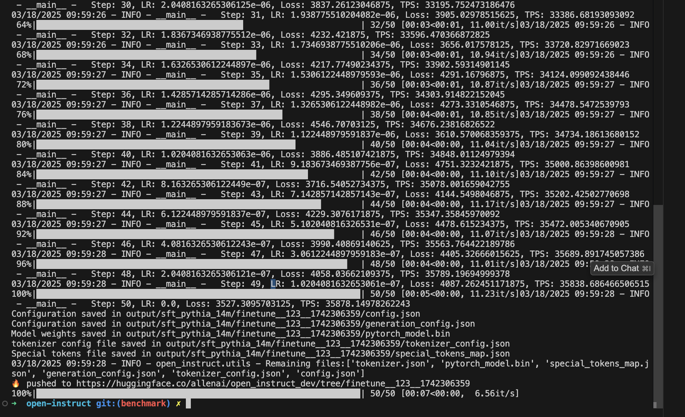

### Key Flags

| Group | Flag | Description | Default |
|-------|------|-------------|---------|
| **Model** | `--model_name_or_path` | Model checkpoint for weight initialization | — |
| | `--use_flash_attn` | Use flash attention | `True` |
| | `--use_liger_kernel` | Use LigerKernel for optimized training | `False` |
| **Training** | `--learning_rate` | Initial learning rate | `2e-5` |
| | `--num_train_epochs` | Total number of training epochs | `2` |
| | `--per_device_train_batch_size` | Batch size per GPU | `8` |
| | `--gradient_accumulation_steps` | Gradient accumulation steps | `1` |
| | `--max_seq_length` | Maximum sequence length after tokenization | — |
| | `--warmup_ratio` | Linear warmup fraction of total steps | `0.03` |
| | `--lr_scheduler_type` | LR scheduler: `linear`, `cosine`, etc. | `linear` |
| | `--gradient_checkpointing` | Use gradient checkpointing (saves memory) | `False` |
| | `--seed` | Random seed | `42` |
| **Data** | `--dataset_mixer_list` | List of datasets (local or HF) to sample from | — |
| | `--dataset_mixer_list_splits` | Dataset splits for training | `["train"]` |
| | `--chat_template_name` | Chat template to use | `None` |
| | `--packing` | Use packing/padding-free collation | `False` |
| **Parallelism** | `--sequence_parallel_size` | Ulysses sequence parallelism degree | `1` |
| **LoRA** | `--use_lora` | Use LoRA for parameter-efficient training | `False` |
| | `--lora_rank` | Rank of LoRA | `64` |
| | `--lora_alpha` | Alpha parameter of LoRA | `16` |
| **Checkpointing** | `--output_dir` | Output directory for checkpoints | `output/` |
| | `--checkpointing_steps` | Save every N steps or `epoch` | — |
| | `--resume_from_checkpoint` | Resume from checkpoint folder | `None` |
| **Logging** | `--with_tracking` | Track experiment with Weights and Biases | `False` |
| | `--logging_steps` | Log training loss every N steps | — |

### Reproduce `allenai/Llama-3.1-Tulu-3-8B-SFT` (8 Nodes)

You can reproduce our `allenai/Llama-3.1-Tulu-3-8B-SFT` model by running the following command:

```bash
bash scripts/train/tulu3/finetune_8b.sh
```

???+ info

    If you are an external user, `mason.py` will print out the actual command being executed on our internal server, so you can modify the command as needed.

    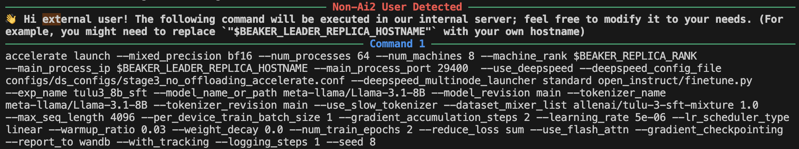


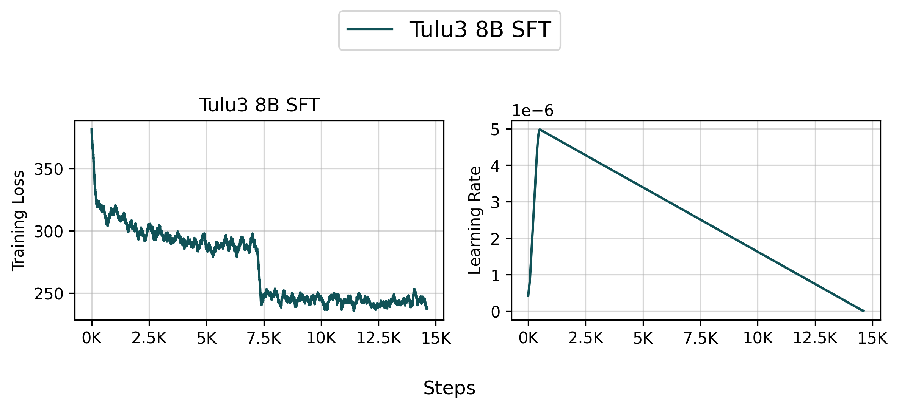
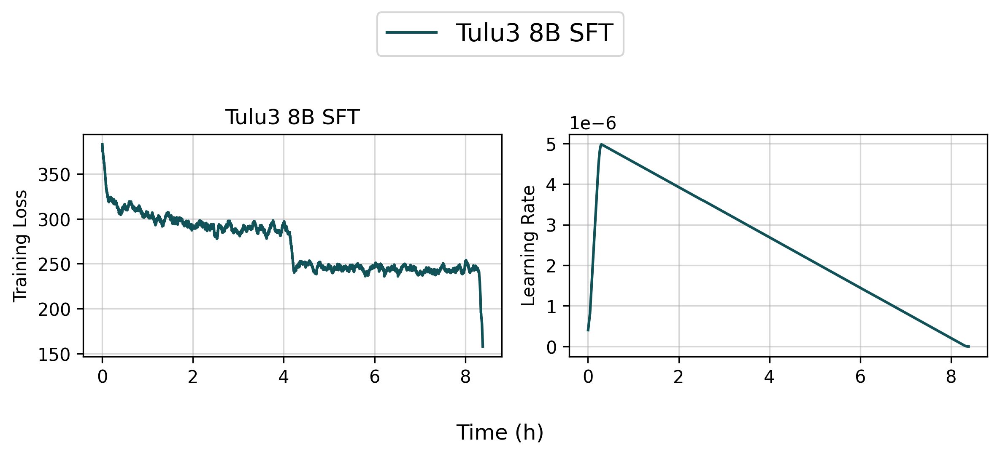


??? note "👉 Tracked WandB Experiments (Click to expand)"

    <iframe loading="lazy" src="https://wandb.ai/ai2-llm/open_instruct_public/reports/Tulu3-8B-SFT--VmlldzoxMTk0OTY4MA" style="width:100%; height:500px" title="Tulu3-8B-SFT"></iframe>


???+ info


    Based on our internal evaluation, the SFT model is roughly on par with the original `allenai/Llama-3.1-Tulu-3-8B` model, though there are some slight differences. Note that your results may vary slightly due to the random seeds used in the training.

    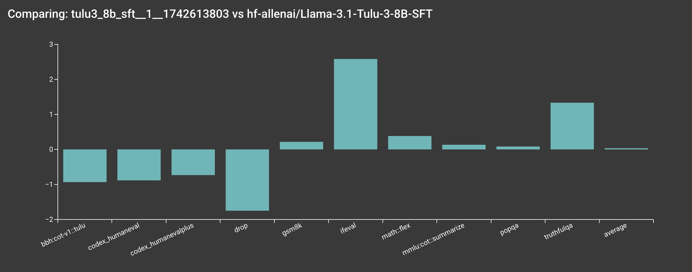

???+ info

    We haven't quite figured out how to make our internal evaluation toolchains more open yet. Stay tuned!


### Reproduce `allenai/OLMo-2-1124-7B-SFT` (8 Nodes)

You can reproduce our `allenai/OLMo-2-1124-7B-SFT` model by running the following command:

```bash
bash scripts/train/olmo2/finetune_7b.sh
```

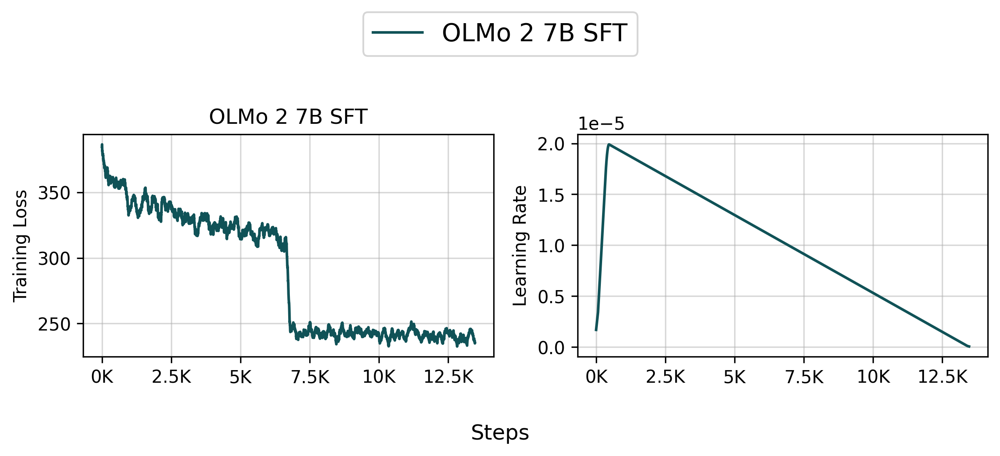
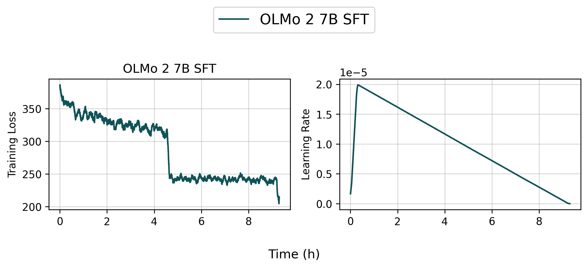


??? note "👉 Tracked WandB Experiments (Click to expand)"

    <iframe loading="lazy" src="https://wandb.ai/ai2-llm/open_instruct_public/reports/OLMo-2-1124-7B-SFT--VmlldzoxMTg1NzIxMw" style="width:100%; height:500px" title="OLMo2-1124-7B-SFT"></iframe>

???+ info

    Based on our internal evaluation, the SFT model is roughly on par with the original `allenai/OLMo-2-1124-7B` model, though there are some slight differences. Note that your results may vary slightly due to the random seeds used in the training.

    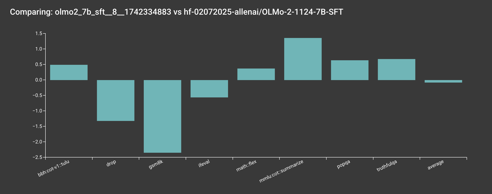

???+ info

    We haven't quite figured out how to make our internal evaluation toolchains more open yet. Stay tuned!


### Reproduce `allenai/OLMo-2-1124-13B-SFT` (8 Nodes)

You can reproduce our `allenai/OLMo-2-1124-13B-SFT` model by running the following command:

```bash
bash scripts/train/olmo2/finetune_13b.sh
```

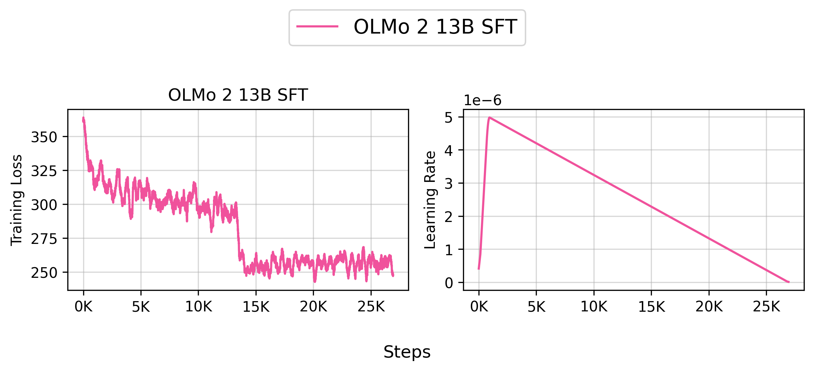
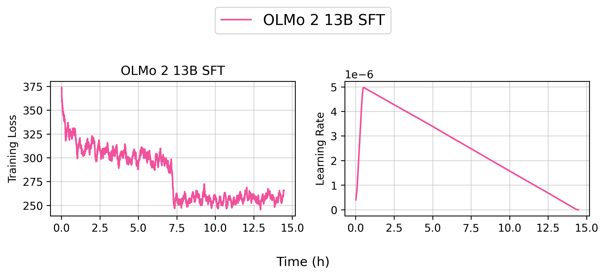


??? note "👉 Tracked WandB Experiments (Click to expand)"

    <iframe loading="lazy" src="https://wandb.ai/ai2-llm/open_instruct_public/reports/OLMo-2-13B-SFT--VmlldzoxMjA0MjUyNg" style="width:100%; height:500px" title="OLMo2-1124-7B-SFT"></iframe>

???+ info

    Based on our internal evaluation, the SFT model is roughly on par with the original `allenai/OLMo-2-1124-7B` model, though there are some slight differences. Note that your results may vary slightly due to the random seeds used in the training.

    

???+ info

    We haven't quite figured out how to make our internal evaluation toolchains more open yet. Stay tuned!


### Reproduce `allenai/OLMo-2-1124-32B-SFT` (8 Nodes)

You can reproduce our `allenai/OLMo-2-1124-32B-SFT` model by running the following command:

```bash
bash scripts/train/olmo2/finetune_32b.sh
```

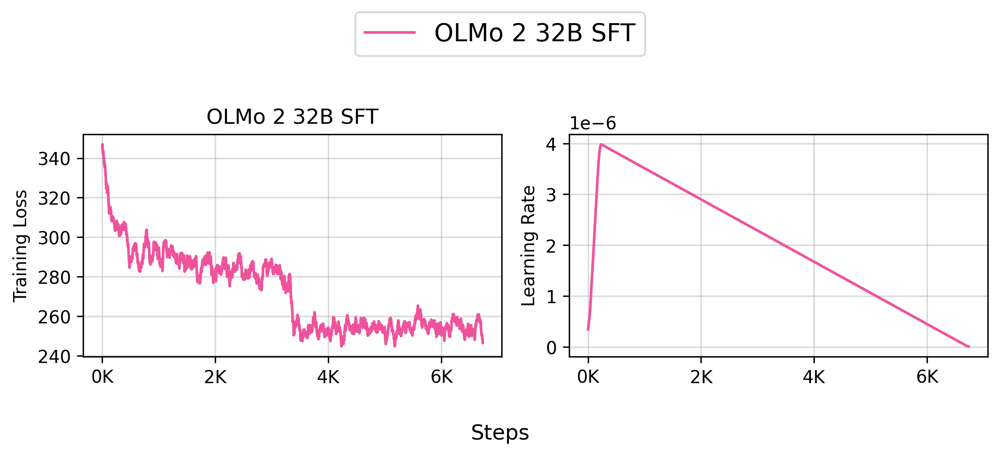
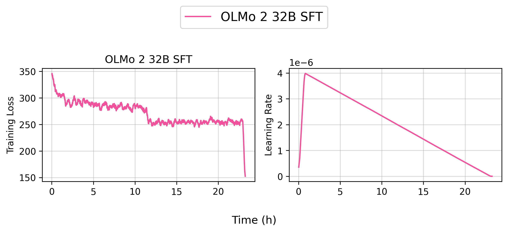


??? note "👉 Tracked WandB Experiments (Click to expand)"

    <iframe loading="lazy" src="https://wandb.ai/ai2-llm/open_instruct_public/reports/OLMo-2-32B-SFT--VmlldzoxMjA0MjUxOQ" style="width:100%; height:500px" title="OLMo2-1124-7B-SFT"></iframe>

???+ info

    Based on our internal evaluation, the SFT model is roughly on par with the original `allenai/OLMo-2-1124-7B` model, though there are some slight differences. Note that your results may vary slightly due to the random seeds used in the training.

    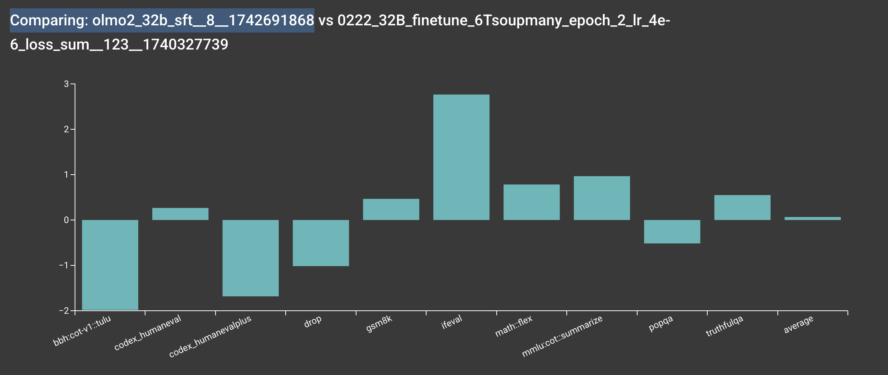

???+ info

    We haven't quite figured out how to make our internal evaluation toolchains more open yet. Stay tuned!


### Training Metrics

During training, the following metrics are logged:

- `learning_rate`: The current learning rate from the learning rate scheduler
- `train_loss`: The average training loss over the logged steps
- `total_tokens`: Total number of tokens processed (excluding padding)
- `per_device_tps`: Tokens per second processed per device (excluding padding)
- `total_tokens_including_padding`: Total number of tokens including padding tokens
- `per_device_tps_including_padding`: Tokens per second processed per device (including padding)

The metrics are logged every `logging_steps` steps (if specified) and provide insights into:
- Training progress (loss, learning rate)
- Training efficiency (tokens per second)
- Resource utilization (padding vs non-padding tokens)

## Acknowledgements

We would like to thank the following projects for general infrastructure:

- [DeepSpeedAI/DeepSpeed](https://github.com/deepspeedai/DeepSpeed)
- [HuggingFace/Transformers](https://github.com/huggingface/transformers)
