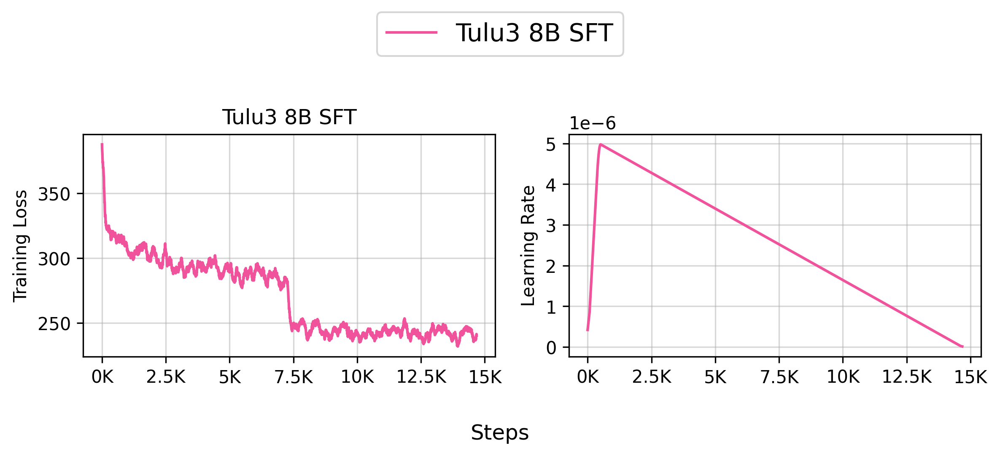

# Supervised finetuning (SFT)

We support Supervised finetuning (SFT) on a variety of datasets.


## Implemented Variants

- `finetune.py` is the original SFT implementation.


## `finetune.py`


This implementation has the following key features:

- Auto save the trained checkpoint to HuggingFace Hub
- Supports LigerKernel for optimized training with fused operations


### Debug (Single GPU)

You can run the script in a single GPU mode to debug the training process.

```bash
bash scripts/train/debug/finetune.sh
```


### Reproduce `allenai/Llama-3.1-Tulu-3-8B-SFT` (8 Nodes)

You can reproduce our `allenai/Llama-3.1-Tulu-3-8B-SFT` model by running the following command:

```bash
bash scripts/train/tulu3/finetune_8b.sh
```

???+ info

    If you are an external user, `mason.py` will print out the actual command being executed on our internal server, so you can modify the command as needed.

    


``` title="docs/algorithms/plot/finetune_plot.sh" linenums="1"
--8<-- "docs/algorithms/plot/finetune_plot.sh:1:12"
```





<iframe loading="lazy" src="https://wandb.ai/ai2-llm/open_instruct_public/reports/Tulu-3-8B-SFT--VmlldzoxMTg1NzIxMw" style="width:100%; height:500px" title="Tulu3-8B-SFT"></iframe>


Based on our internal evaluation, the SFT model is roughly on par with the original `allenai/Llama-3.1-Tulu-3-8B` model, though the `codex_humaneval` is a bit lower. Our original `allenai/Llama-3.1-Tulu-3-8B` was trained with more random seeds, so its slightly higher performance is expected.

???+ info

    We haven't quite figured out how to make our internal evaluation toolchains more open yet. Stay tuned!


### Training Metrics

During training, the following metrics are logged:

- `learning_rate`: The current learning rate from the learning rate scheduler
- `train_loss`: The average training loss over the logged steps
- `total_tokens`: Total number of tokens processed (excluding padding)
- `per_device_tps`: Tokens per second processed per device (excluding padding)
- `total_tokens_including_padding`: Total number of tokens including padding tokens
- `per_device_tps_including_padding`: Tokens per second processed per device (including padding)

The metrics are logged every `logging_steps` steps (if specified) and provide insights into:
- Training progress (loss, learning rate)
- Training efficiency (tokens per second)
- Resource utilization (padding vs non-padding tokens)

## Acknowledgements

We would like to thank the following projects for general infrastructure:

- [DeepSpeedAI/DeepSpeed](https://github.com/deepspeedai/DeepSpeed)
- [HuggingFace/Transformers](https://github.com/huggingface/transformers)


