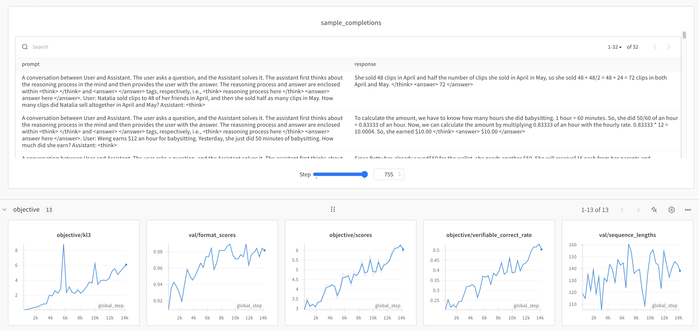

# Grouped Relative Policy Optimization (GRPO)

GRPO is an online RL method used in [DeepSeek R1 paper](https://arxiv.org/abs/2501.12948) and its first appearance is in [DeepSeekMath](https://arxiv.org/abs/2402.03300)

`open_instruct/grpo_vllm_thread_ray_gtrl.py` contains an implementation of GRPO.


## Get started


Here is a command to run GRPO on the Llama3.1-8b on [ai2-adapt-dev/rlvr_gsm8k_zs](https://huggingface.co/datasets/ai2-adapt-dev/rlvr_gsm8k_zs), which is simply a zero-shot version of the RLVR GSM8K dataset.


```bash
bash scripts/train/rlvr/grpo_llama3.1-8b.sh
```

The results look quite reasonable: with format score, score all going up, KL not exploding, and sequence length seems stable (at least at first)



