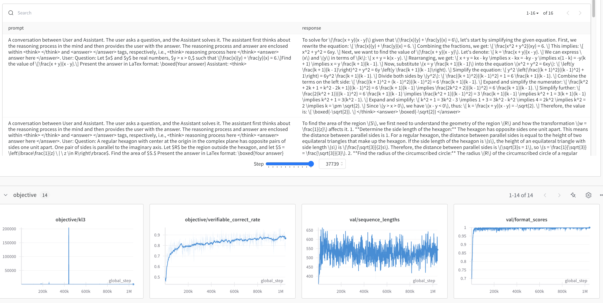
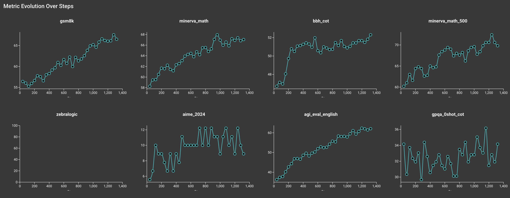
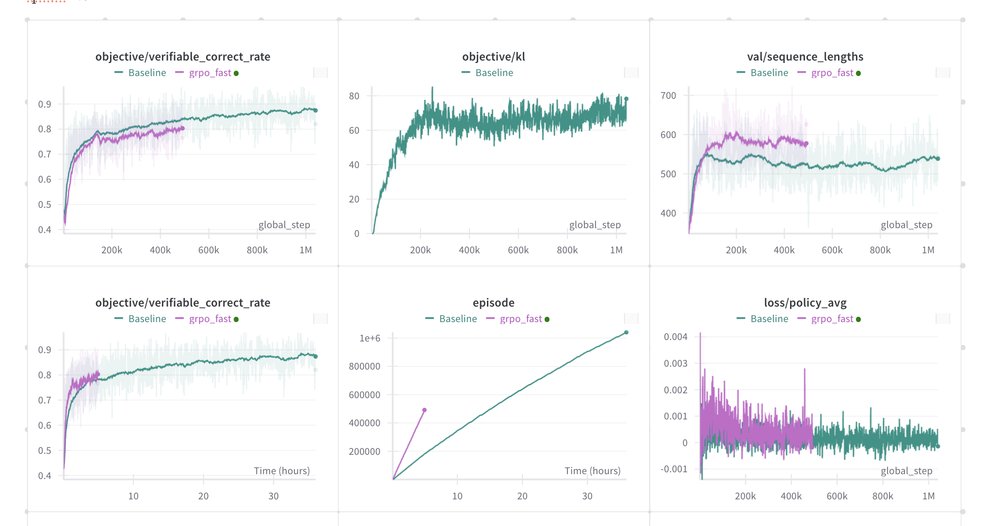

# Grouped Relative Policy Optimization (GRPO)

GRPO is an online RL method used in [DeepSeek R1 paper](https://arxiv.org/abs/2501.12948) and its first appearance is in [DeepSeekMath](https://arxiv.org/abs/2402.03300)

`open_instruct/grpo_vllm_thread_ray_gtrl.py` contains an implementation of GRPO.


## Implemented Variants

- `grpo_vllm_thread_ray_gtrl.py` is the original GRPO implementation, using vLLM and Ray.
- `grpo_fast.py` is a faster variant using [packing techniques](https://huggingface.co/blog/sirluk/llm-sequence-packing).


## `grpo_vllm_thread_ray_gtrl.py`


This implementation has the following features:

- Uses a thread-based approach to parallelize the training and inference processes, based on [Asynchronous RLHF](https://arxiv.org/abs/2410.18252).
- Uses vLLM and Ray to parallelize the training process, based on how [OpenRLHF](https://github.com/OpenRLHF/OpenRLHF) does it


### Debug (Single GPU)

You can run the script in a single GPU mode to debug the training process.

```bash
bash scripts/train/rlvr/grpo_mini.sh
```


### Qwen 2.5 7B with 2 nodes

Here is a command to run GRPO on the `Qwen/Qwen2.5-7B` on [ai2-adapt-dev/math_ground_truth_zs](https://huggingface.co/datasets/ai2-adapt-dev/math_ground_truth_zs), which is simply a zero-shot version of the RLVR MATH dataset. The training is done starting from a base model, similar to how [DeepSeek R1](https://arxiv.org/abs/2501.12948) does it.

```bash
bash scripts/train/rlvr/grpo_qwen2.5_7B_works.sh
```

The results look quite reasonable: with format score, score all going up, and sequence length seems stable (at least at first)



The corresponding evals look good as well:




## Explanation of the logged metrics


* `episode`: the global episode number training has gone through (e.g., `3000` means we have trained on 3000 data points already -- in the case of RLVR that is prompts, which can repeat)
* `lr`: the current learning rate
* `epoch`: the fraction or multiple of the epoch (e.g., `2.7` means we have trained on the dataset for 2 epochs and 70% of the third epoch)
* `objective/kl`: the KL divergence between the current policy and the reference policy (sum of the KL divergence of each response token)
* `objective/scores`: the scores of the current response, rated by a combination of reward model and other rewards (e.g., R1 style format reward, verifiable reward, etc.)
* `objective/rlhf_reward`: the RLHF reward, which is `objective/scores` - `beta` * `objective/kl`
* `objective/non_score_reward`: `beta` * `objective/kl`
* `objective/entropy`: the entropy of the current policy
* `objective/loss`: the DPO loss
* `objective/kl2`: the second variant of KL divergence used in the training process, calculated similarly to `objective/kl`
* `objective/kl3`: the third variant of KL divergence used in the training process, providing additional insights into policy divergence
* `objective/scores_mean`: the mean of the scores of the current response, providing an average measure of response quality
* `objective/reward_std`: the standard deviation of the rewards, indicating the variability in the reward distribution
* `objective/verifiable_correct_rate`: the rate at which responses are verifiably correct, providing a measure of response accuracy
* `loss/policy_avg`: the average policy loss, indicating the mean loss incurred during policy updates
* `policy/approxkl_avg`: the average approximate KL divergence, used to monitor policy stability
* `policy/clipfrac_avg`: the average fraction of updates where the policy was clipped, indicating how often clipping occurs
* `policy/entropy_avg`: the average entropy of the policy, providing a measure of policy randomness
* `time/from_scratch`: the time taken to train the model from scratch
* `time/training`: the time taken to do one training step
* `val/sequence_lengths`: the length of the sequences in the generated responses
* `val/num_stop_token_ids`: the number of stop tokens in the generated responses
* `val/ratio`: the mean ratio of the new policy to the old policy, used to assess policy updates
* `val/ratio_var`: the variance of the ratio of the new policy to the old policy, indicating the variability in policy updates
* `val/stop_token_rate`: the rate at which stop tokens appear in the responses, providing a measure of response termination
* `val/format_scores`: the mean format scores, indicating the quality of response formatting (only logged if `add_r1_style_format_reward` is enabled)


## `grpo_fast.py`

This implementation has the following features:

- Uses packing techniques to speed up the training process, inspired by [Open-Reasoner-Zero/Open-Reasoner-Zero](https://github.com/Open-Reasoner-Zero/Open-Reasoner-Zero)
- Uses a thread-based approach to parallelize the training and inference processes, based on [Asynchronous RLHF](https://arxiv.org/abs/2410.18252).
- Uses a data preparation thread to prepare the data for the training process.

In simpler tasks, we see 2x faster training, and even 10x faster for more complex tasks. With `grpo_fast.py`, we can run crank up `number_samples_per_prompt` and train on really large batch sizes.


### Debug (Single GPU)

You can run the script in a single GPU mode to debug the training process.

```bash
bash scripts/train/rlvr/grpo_fast_mini.sh
```

### Qwen 2.5 7B with 2 nodes

Here is a command to run GRPO on the `Qwen/Qwen2.5-7B` on [ai2-adapt-dev/math_ground_truth_zs](https://huggingface.co/datasets/ai2-adapt-dev/math_ground_truth_zs), very similar to the command above. However

```bash
bash scripts/train/rlvr/grpo_qwen_fast_2.5_7B.sh
```




## Acknowledgements

We would like to thank the following resources for GRPO theory:
- [DeepSeek R1](https://arxiv.org/abs/2501.12948)
- [DeepSeekMath](https://arxiv.org/abs/2402.03300)
- [Asynchronous RLHF](https://arxiv.org/abs/2410.18252)

We would like to thank the following resources for GRPO implementation:

- [Packing Techniques](https://huggingface.co/blog/sirluk/llm-sequence-packing)
- [OpenRLHF/OpenRLHF](https://github.com/OpenRLHF/OpenRLHF)
- [Open-Reasoner-Zero/Open-Reasoner-Zero](https://github.com/Open-Reasoner-Zero/Open-Reasoner-Zero)


We would like to thank the following projects for general infrastructure:

- [vLLM](https://github.com/vllm-project/vllm)
- [Ray](https://github.com/ray-project/ray)
- [DeepSpeedAI/DeepSpeed](https://github.com/deepspeedai/DeepSpeed)
- [HuggingFace/Transformers](https://github.com/huggingface/transformers)


