# Grouped Relative Policy Optimization (GRPO)

GRPO is an online RL method used in [DeepSeek R1 paper](https://arxiv.org/abs/2501.12948) and its first appearance is in [DeepSeekMath](https://arxiv.org/abs/2402.03300)


## Implemented Variants

- `grpo.py` is the recommended GRPO implementation, built on OLMo-core's native training infrastructure (FSDP). It uses Ray for distributed training with vLLM inference.
- `grpo_fast.py` is a faster variant using [packing techniques](https://huggingface.co/blog/sirluk/llm-sequence-packing) with DeepSpeed.

Both trainers use one policy-loss implementation. Let \(d\) be the configured
policy-ratio denominator and \(c\) the configured rollout correction. The
per-token score-function loss is

\[
-M_t\,\operatorname{stopgrad}\left(c_t r_t A_t\right)
\log \pi_\theta(a_t\mid s_t),\qquad
r_t=\frac{\pi_\theta}{d}.
\]

`policy_ratio_denominator=old_policy` sets \(d=\pi_{\text{old}}\) and retains
old-policy log probabilities for the duration of the PPO update.
`policy_ratio_denominator=rollout_policy` sets \(d=\mu\), using the vLLM
rollout log probabilities directly and skipping old-logprob computation and
storage. `rollout_importance_correction=clipped` sets
\(c=\operatorname{clip}(\pi_{\text{old}}/\mu)\);
`rollout_importance_correction=none` sets \(c=1\). A direct rollout-policy
ratio cannot also use the correction because that would count the rollout
denominator twice.

DAPO applies its directional lower/upper clip as a structural mask, CISPO caps
the detached ratio coefficient, and DPPO keeps the raw
\(\pi_\theta/\mu\) ratio. DPPO therefore requires the direct rollout-policy
denominator and no additional correction. Its retained ratio is intentionally
unbounded; monitor `val/rho_hist`, `val/rho_overflow_frac`, and gradient norms
when rollout probabilities can be extremely small.

The token-drop mask is configured by independent properties rather than a
named algorithm switch:

- `rho_mask_metric`: `none`, `ratio`, `tv`, or `kl`;
- `rho_mask_source`: compare `old_policy` or `current_policy` with \(\mu\);
- `rho_mask_level`: apply the statistic per `token` or per `sequence`; and
- `rho_mask_direction`: drop every threshold violation (`symmetric`) or only
  updates that move farther from \(\mu\) (`increase_only`).

For reference, the default IcePop behavior is `ratio + old_policy + token +
symmetric`; VACO is `tv|kl + old_policy + sequence + increase_only`; and DPPO
requires `tv|kl + current_policy + token + increase_only`. These are
compositions of the properties above, not separate configuration values.

All response, validity, clipping, and divergence masks are structural:
excluded selected-token log probabilities are removed from the autograd graph
and receive exactly zero policy gradient. Non-finite ratios fail only when the
token remains in the policy update; a token that the configured mask drops
cannot terminate a distributed run solely because its ratio overflowed.

### Migration guidance

The defaults preserve the previous DAPO/CISPO PPO behavior:
\(r=\pi_\theta/\pi_{\text{old}}\), with a clipped
\(\pi_{\text{old}}/\mu\) rollout correction and the existing per-token ratio
mask. Existing configurations do not silently switch their clip baseline to
\(\mu\).

Sequence-level masking is an exception: `rho_mask_level=sequence` now uses the
broadcast sequence statistic only for the keep/drop decision, while retained
tokens keep their per-token clipped \(\pi_{\text{old}}/\mu\) correction
weights. Previously the broadcast sequence-mean ratio was also used as the
clamp base and correction weight.

To replace `use_rho_correction=False` without changing its old meaning, use
`policy_ratio_denominator=old_policy`,
`rollout_importance_correction=none`, and `rho_mask_metric=none`. This remains
plain PPO weighting by \(\pi_\theta/\pi_{\text{old}}\); it does not expose an
unclamped \(\pi_\theta/\mu\) coefficient.

To opt into the direct DPPO path, set:

```bash
--loss_fn dppo \
--policy_ratio_denominator rollout_policy \
--rollout_importance_correction none \
--rho_mask_metric tv \
--rho_mask_source current_policy \
--rho_mask_level token \
--rho_mask_direction increase_only \
--rho_mask_upper_bound 0.1
```

Reference-KL masking is independently configurable for runs with `beta > 0`.
By default, `mask_reference_kl_with_policy=False` preserves the legacy
behavior: a token excluded from the policy loss can still receive
reference-KL gradient when its training and reference log probabilities are
valid. Set `mask_reference_kl_with_policy=True` to apply the final policy mask
to the KL term as well. KL estimator 3
always excludes tokens without a finite configured policy ratio because that
estimator multiplies by the ratio directly.

Binary-divergence thresholds use different units from the removed
`rho_mask_tv_divergence` implementation. VACO now thresholds the
probability-space binary TV or KL divergence, rather than the ratio-space
sequence mean of \(\lvert\rho-1\rvert\). Previous thresholds such as `2.0`
are not directly transferable; select a new threshold in the divergence's
scale and validate it from `val/rho_divergence` and `val/rho_drop_frac`.

## `grpo.py` (OLMo-core)

### Debug Scripts

| Script | Scale | Launch |
|--------|-------|--------|
| `scripts/train/debug/single_gpu_grpo.sh` | 1 GPU, Beaker | `./scripts/train/build_image_and_launch.sh scripts/train/debug/single_gpu_grpo.sh` |
| `scripts/train/debug/multi_node_grpo.sh` | 2 nodes (16 GPUs), Beaker | `./scripts/train/build_image_and_launch.sh scripts/train/debug/multi_node_grpo.sh` |
| `scripts/train/debug/tools/olmo_3_parser_multigpu.sh` | 2 nodes, tools, Beaker | `./scripts/train/build_image_and_launch.sh scripts/train/debug/tools/olmo_3_parser_multigpu.sh` |

### Olmo 3 Scripts

| Script | Scale | Description | Launch |
|--------|-------|-------------|--------|
| `scripts/train/olmo3/7b_instruct_rl.sh` | 8 nodes (64 GPUs) | Olmo 3 7B Instruct GRPO with multi-task reasoning datasets | `./scripts/train/build_image_and_launch.sh scripts/train/olmo3/7b_instruct_rl.sh` |
| `scripts/train/olmo3/7b_think_rl.sh` | 4 nodes (32 GPUs) | Olmo 3 7B Think GRPO with pipeline RL | `./scripts/train/build_image_and_launch.sh scripts/train/olmo3/7b_think_rl.sh` |
| `scripts/train/olmo3/32b_instruct_rl.sh` | 12 nodes (96 GPUs) | Olmo 3 32B Instruct GRPO | `./scripts/train/build_image_and_launch.sh scripts/train/olmo3/32b_instruct_rl.sh` |
| `scripts/train/olmo3/32b_think_rl.sh` | 28 nodes (224 GPUs) | Olmo 3 32B Think GRPO | `./scripts/train/build_image_and_launch.sh scripts/train/olmo3/32b_think_rl.sh` |
| `scripts/train/olmo3/7b_rlzero_math.sh` | 9 nodes (72 GPUs) | Olmo 3 7B RL-Zero for math | `./scripts/train/build_image_and_launch.sh scripts/train/olmo3/7b_rlzero_math.sh` |
| `scripts/train/olmo3/7b_rlzero_code.sh` | 5 nodes (40 GPUs) | Olmo 3 7B RL-Zero for code | `./scripts/train/build_image_and_launch.sh scripts/train/olmo3/7b_rlzero_code.sh` |
| `scripts/train/olmo3/7b_rlzero_general.sh` | 5 nodes (40 GPUs) | Olmo 3 7B RL-Zero for general tasks | `./scripts/train/build_image_and_launch.sh scripts/train/olmo3/7b_rlzero_general.sh` |
| `scripts/train/olmo3/7b_rlzero_instruction_following.sh` | 5 nodes (40 GPUs) | Olmo 3 7B RL-Zero for instruction following | `./scripts/train/build_image_and_launch.sh scripts/train/olmo3/7b_rlzero_instruction_following.sh` |
| `scripts/train/olmo3/7b_rlzero_mix.sh` | 4 nodes (32 GPUs) | Olmo 3 7B RL-Zero mixed (code, IF, general) | `./scripts/train/build_image_and_launch.sh scripts/train/olmo3/7b_rlzero_mix.sh` |

### Key Flags

Both `grpo.py` and `grpo_fast.py` share the same config classes and accept the same flags.

| Group | Flag | Description | Default |
|-------|------|-------------|---------|
| **Training** | `--learning_rate` | Initial learning rate | `2e-5` |
| | `--lr_scheduler_type` | LR scheduler: `linear`, `cosine`, etc. | `linear` |
| | `--per_device_train_batch_size` | Forward batch size per device | `1` |
| | `--total_episodes` | Total number of episodes in dataset | `100000` |
| | `--num_epochs` | Number of epochs to train | `1` |
| | `--num_mini_batches` | Mini-batches to split a batch into | `1` |
| | `--seed` | Random seed | `1` |
| **GRPO Algorithm** | `--beta` | KL coefficient for RLHF objective | `0.05` |
| | `--clip_lower` | Lower clip range | `0.2` |
| | `--clip_higher` | Higher clip range (see DAPO) | `0.272` |
| | `--loss_fn` | Loss function: `dapo`, `cispo`, or `dppo` | `dapo` |
| | `--policy_ratio_denominator` | Policy-ratio denominator: `old_policy` (PPO) or `rollout_policy` (direct) | `old_policy` |
| | `--rollout_importance_correction` | Rollout-to-old-policy correction: `clipped` or `none` | `clipped` |
| | `--rho_mask_metric` | Drop-mask statistic: `none`, `ratio`, `tv`, or `kl` | `ratio` |
| | `--rho_mask_source` | Policy compared with the rollout policy for masking | `old_policy` |
| | `--rho_mask_level` | Apply the mask statistic per `token` or `sequence` | `token` |
| | `--rho_mask_direction` | Drop all violations (`symmetric`) or only divergence-increasing updates (`increase_only`) | `symmetric` |
| | `--rho_clamp_lower_bound` | Lower bound for the clipped old-policy-to-rollout correction; `0` disables | `0.0` |
| | `--rho_clamp_upper_bound` | Upper bound for the clipped old-policy-to-rollout correction; `0` disables | `2.0` |
| | `--rho_mask_lower_bound` | Lower threshold for the configured drop-mask statistic; `0` disables | `0.0` |
| | `--rho_mask_upper_bound` | Upper threshold for the configured drop-mask statistic; `0` disables | `0.0` |
| | `--load_ref_policy` | Load and use reference policy for KL | `True` |
| | `--mask_reference_kl_with_policy` | Also remove reference-KL gradients from policy-masked tokens | `False` |
| **Rollout / Sampling** | `--num_unique_prompts_rollout` | Unique prompts per rollout | `16` |
| | `--num_samples_per_prompt_rollout` | Samples per prompt in rollout | `4` |
| | `--temperature` | Sampling temperature | `0.7` |
| | `--max_prompt_token_length` | Max tokens for prompts | `256` |
| | `--response_length` | Token length for responses | `256` |
| | `--pack_length` | Total pack length for packing | `512` |
| | `--async_steps` | Number of async generation steps | `1` |
| | `--active_sampling` | Enable active sampling | `False` |
| **Reward** | `--apply_verifiable_reward` | Apply verifiable reward | `True` |
| | `--verification_reward` | Verification reward value | `10.0` |
| | `--apply_r1_style_format_reward` | Apply R1-style format reward | `False` |
| **Infrastructure** | `--deepspeed_stage` | DeepSpeed stage (0, 2, or 3) | `0` |
| | `--sequence_parallel_size` | Sequence parallel size across GPUs | `1` |
| | `--num_learners_per_node` | GPUs per node for training | `[1]` |
| | `--single_gpu_mode` | Collocate vLLM and actor on same node | `False` |
| **vLLM** | `--vllm_num_engines` | Number of vLLM engines | `1` |
| | `--vllm_tensor_parallel_size` | Tensor parallelism size | `1` |
| | `--vllm_gpu_memory_utilization` | GPU memory utilization ratio | `0.9` |
| **Model** | `--model_name_or_path` | Model checkpoint for weight initialization | — |
| | `--gradient_checkpointing` | Use gradient checkpointing | `False` |
| | `--chat_template_name` | Chat template to use | `None` |
| **Saving** | `--output_dir` | Output directory for checkpoints | `output` |
| | `--save_freq` | Save every N train steps | `200` |
| | `--with_tracking` | Track experiment with Weights and Biases | `False` |

For details on how GRPO's HSDP sharding works, see [OLMo-core Sharding and Parallelism](olmo_core_sharding.md).

---


## `grpo_fast.py`

This implementation has the following features:

- Uses packing techniques to speed up the training process, inspired by [Open-Reasoner-Zero/Open-Reasoner-Zero](https://github.com/Open-Reasoner-Zero/Open-Reasoner-Zero)
- Uses a thread-based approach to parallelize the training and inference processes, based on [Asynchronous RLHF](https://arxiv.org/abs/2410.18252).
- Uses a data preparation thread to prepare the data for the training process.

In simpler tasks, we see 2x faster training, and even 10x faster for more complex tasks. With `grpo_fast.py`, we can run crank up `number_samples_per_prompt` and train on really large batch sizes.

It implements additional optimizations:

* `grpo_fast.py` also implements an optimization to skip zero gradient batches. If we solve a prompt 100% correct or 0% correct, the std of the group is 0. So `adv = (score - score.mean()) / (score.std + 1e-5) = 0 / 1e-5 = 0`, causing 0 gradients. `grpo_fast.py` will skip these batches before packing the sequences.

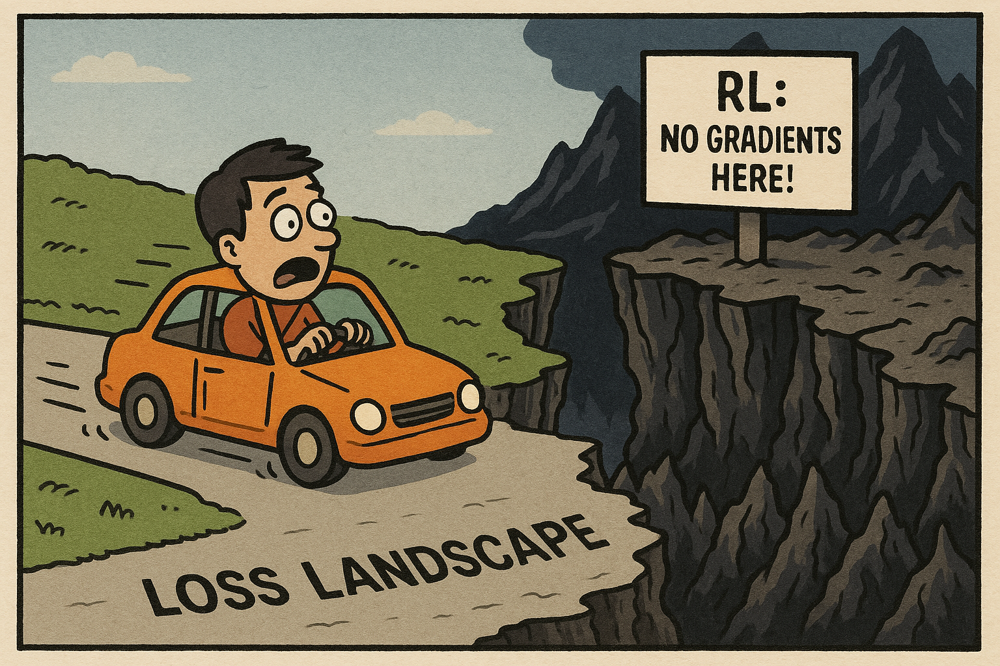

Figure taken from [this discord thread by @the_real_jrb](https://discord.com/channels/1179127597926469703/1208183216843005962/1357712190957682839)

* `grpo_fast.py` only applies the verification reward if the format reward is enabled (via `--additive_format_reward False` by default). See ([allenai/open-instruct/pull/659](https://github.com/allenai/open-instruct/pull/659)). A direct additive format reward is undesirable. In GRPO, the scale of the rewards is not relevant due to group normalization. For example, a group of [0, 0, 0, 0, 10], [0, 0, 0, 0, 11], [0, 0, 0, 0, 1] reward will have the same advantage.

Now imagine there are cases where the model generates a really long response (8k) gen length, but only get the format reward right, GRPO will push up the probs for this long response even though the response is not really correct. As a result, when using the format reward directly, we see the response length of unsolved prompts to fluctuate significantly, causing stability issues.

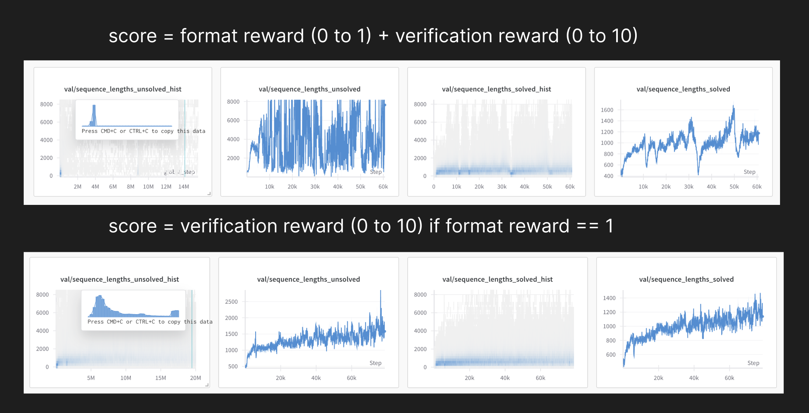

### Debug Scripts

| Script | Scale | Launch |
|--------|-------|--------|
| `scripts/train/debug/grpo_fast.sh` | 1 GPU, local | `bash scripts/train/debug/grpo_fast.sh` |
| `scripts/train/debug/grpo_fast_3_gpu.sh` | 3 GPUs (2 train, 1 inference), local | `bash scripts/train/debug/grpo_fast_3_gpu.sh` |
| `scripts/train/debug/grpo_integration_test.sh` | 1 GPU, Beaker | `./scripts/train/build_image_and_launch.sh scripts/train/debug/grpo_integration_test.sh` |

`grpo_fast.py` accepts the same flags as `grpo.py`. See the [Key Flags table above](#key-flags).

### Reproduce `allenai/Llama-3.1-Tulu-3.1-8B` (1 Nodes)

You can reproduce our `allenai/Llama-3.1-Tulu-3.1-8B` model by running the following command:

```bash
bash scripts/train/tulu3/grpo_fast_8b_single_node.sh
```

???+ info

    Here the `grpo_fast.py` actually use 6 GPUs for training and 2 GPUs for inference, so it's using less hardware but runs faster than the legacy `grpo_vllm_thread_ray_gtrl.py` which used 2 nodes (12 GPUs for training and 4 GPUs for inference).


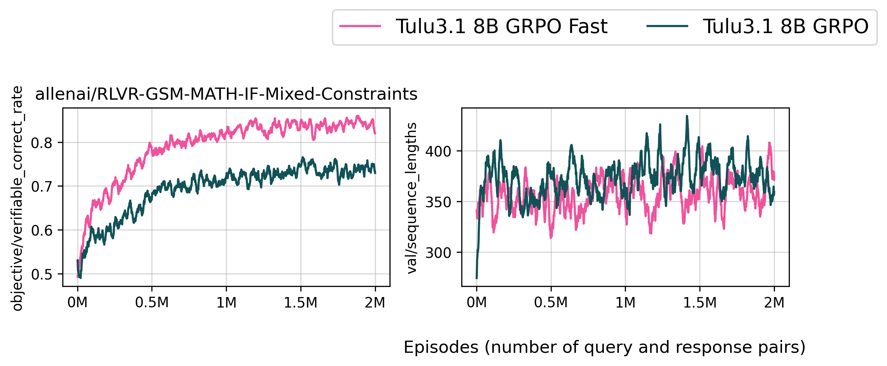
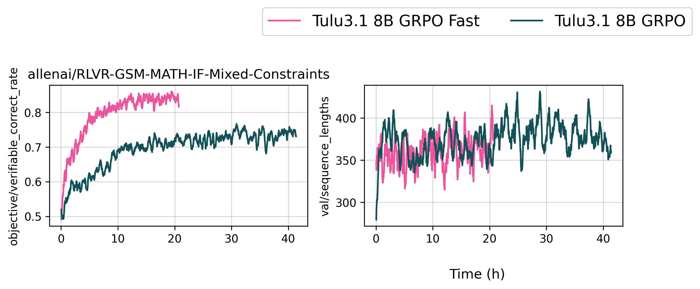

??? note "👉 Tracked WandB Experiments (Click to expand)"

    <iframe loading="lazy" src="https://wandb.ai/ai2-llm/open_instruct_public/reports/Tulu3-1-8B-GRPO-Fast--VmlldzoxMTk0NzcwOA" style="width:100%; height:500px" title="Tulu3-8B-GRPO-Fast"></iframe>

???+ info

    Below are some learning curves for the evaluation metrics during training. Basically, ifeval, gsm8k, and math:flex all go up.

    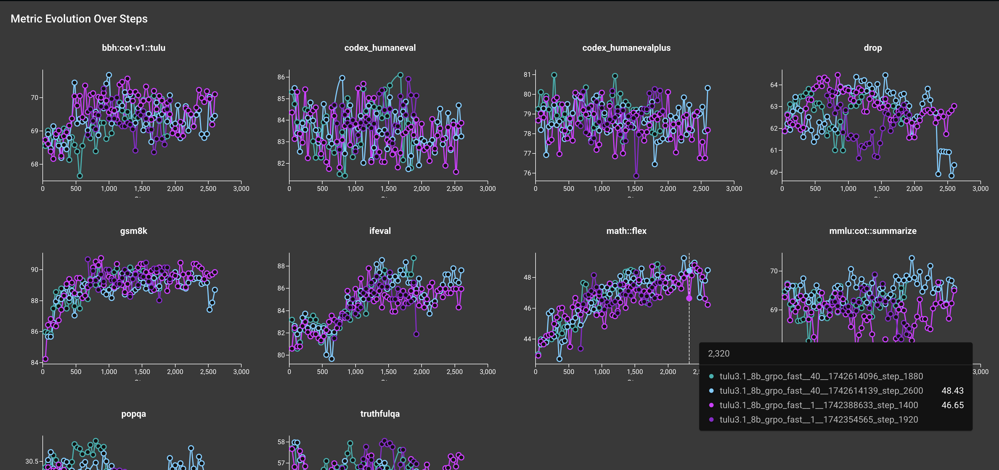

???+ info

    Based on our internal evaluation, the GRPO model is roughly on par with the original `allenai/Llama-3.1-Tulu-3.1-8B` model, though there are some slight differences. Note that your results may vary slightly due to the random seeds used in the training.

    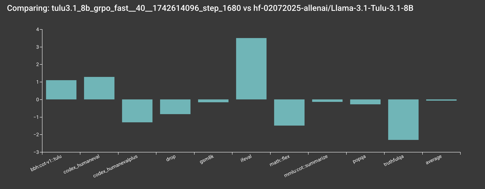


???+ info

    We haven't quite figured out how to make our internal evaluation toolchains more open yet. Stay tuned!


### (🧪 Experimental) Qwen 2.5 7B GRPO Fast Zero-style

We have

```bash
bash scripts/train/qwen/grpo_fast_7b.sh
```


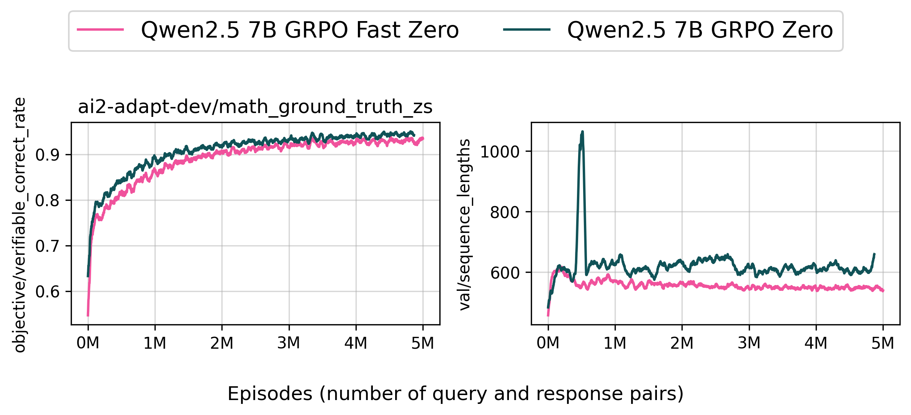
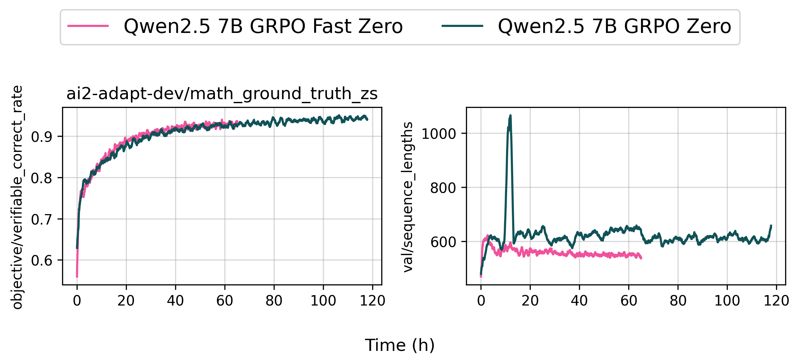


??? note "👉 Tracked WandB Experiments (Click to expand)"

    <iframe loading="lazy" src="https://wandb.ai/ai2-llm/open_instruct_public/reports/Qwen2-5-7B-GRPO-Fast-Zero--VmlldzoxMjA2NDExMA" style="width:100%; height:500px" title="Qwen2.5-7B-GRPO-Fast-Zero"></iframe>


???+ info

    Below are some learning curves for the evaluation metrics during training. Basically, ifeval, gsm8k, and math:flex all go up.

    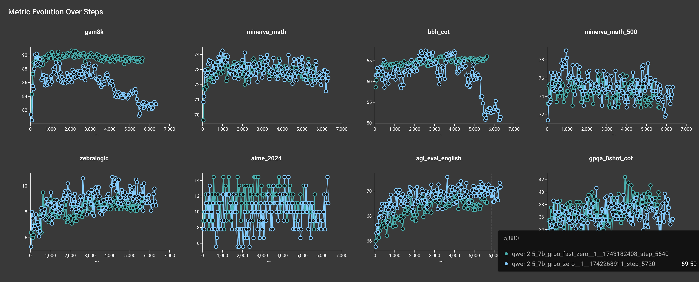

???+ info

    We haven't quite figured out how to make our internal evaluation toolchains more open yet. Stay tuned!


### (🧪 Experimental) Olmo2 7B GRPO Fast Zero-style

We have

```bash
bash scripts/train/olmo2/grpo_fast_7b_zero.sh
```


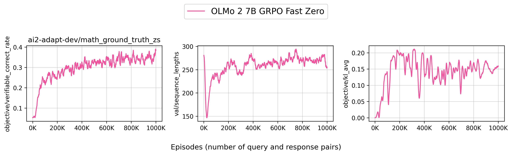
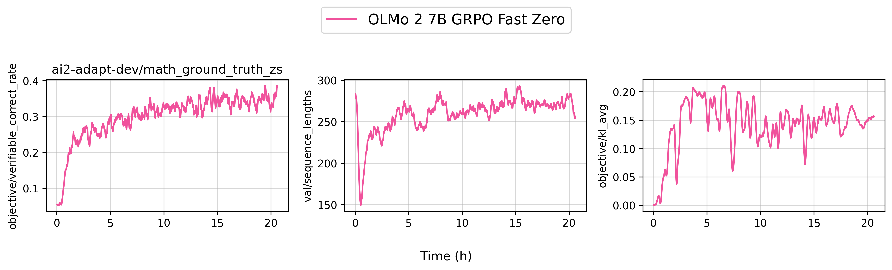

??? note "👉 Tracked WandB Experiments (Click to expand)"

    <iframe loading="lazy" src="https://wandb.ai/ai2-llm/open_instruct_public/reports/OLMo-2-7B-GRPO-Fast-Zero--VmlldzoxMjA0MjU4MQ" style="width:100%; height:500px" title="OLMo2-7B-GRPO-Fast-Zero"></iframe>

???+ info

    Below are some learning curves for the evaluation metrics during training. Basically, ifeval, gsm8k, and math:flex all go up.

    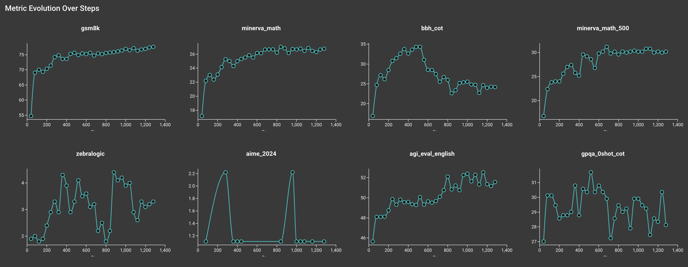


???+ info

    We haven't quite figured out how to make our internal evaluation toolchains more open yet. Stay tuned!


### (🧪 Experimental) Olmo2 13B GRPO Fast Zero-style

We have

```bash
bash scripts/train/olmo2/grpo_fast_13b_zero.sh
```


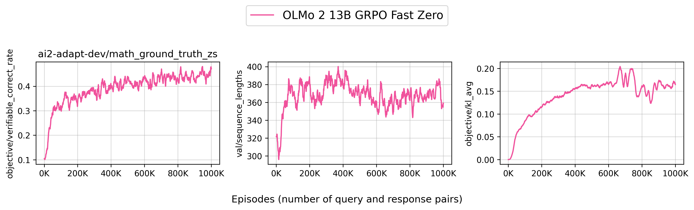
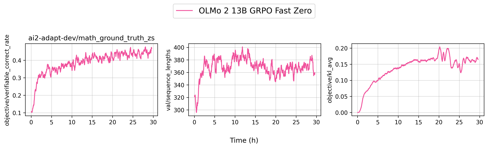

??? note "👉 Tracked WandB Experiments (Click to expand)"

    <iframe loading="lazy" src="https://wandb.ai/ai2-llm/open_instruct_public/reports/OLMo-2-13B-GRPO-Fast-Zero--VmlldzoxMjA0MjU4Mw" style="width:100%; height:500px" title="OLMo2-13B-GRPO-Fast-Zero"></iframe>

???+ info

    Below are some learning curves for the evaluation metrics during training. Basically, ifeval, gsm8k, and math:flex all go up.

    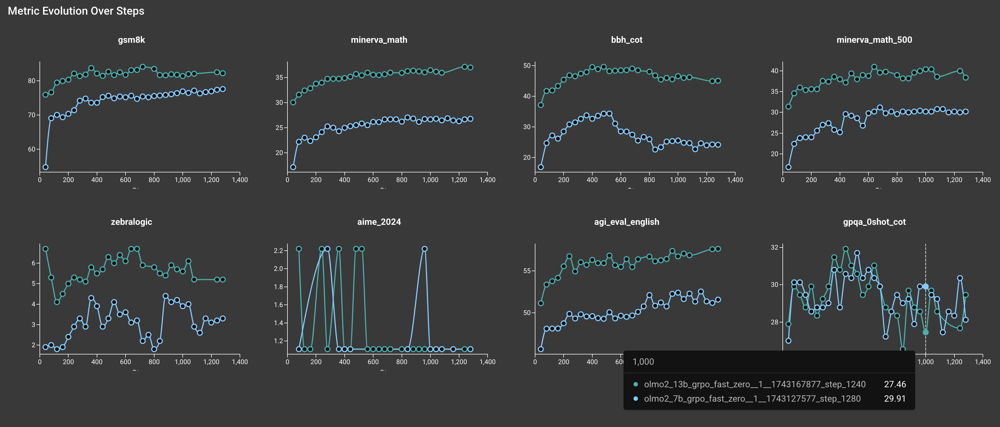


???+ info

    We haven't quite figured out how to make our internal evaluation toolchains more open yet. Stay tuned!


### Training Metrics

`grpo_fast.py` includes the following additional metrics beyond the standard training metrics:


* `other/real_batch_size_ratio`: In GRPO, as we train we actually get smaller and smaller batch sizes. This is because if we solve a prompt 100% correct or 0% correct, the std of the group is 0. So `adv = (score - score.mean()) / (score.std + 1e-5) = 0 / 1e-5 = 0`, causing 0 gradients. This metric is the ratio of the samples that have gradients vs the total number of samples,
* `other/packed_ratio`: The ratio of the packed sequences vs the total number of sequences. The lower the ratio, the more efficiently we have packed the sequences. E.g., if we have 100 sequences and the ratio is 0.1, it means we only have to do 10% of the forward passes than if we didn't pack.


### Reproduce `allenai/Llama-3.1-Tulu-3.1-8B` (2 Nodes)

These results were produced with the legacy [`grpo_vllm_thread_ray_gtrl.py`](https://github.com/allenai/open-instruct/blob/745bf58d321c/open_instruct/grpo_vllm_thread_ray_gtrl.py) script, which has since been removed. The experiments were run at commit [`745bf58d321c`](https://github.com/allenai/open-instruct/tree/745bf58d321c). They are preserved here for historical reference. See the [original launch script](https://github.com/allenai/open-instruct/blob/745bf58d321c/scripts/train/tulu3/grpo_8b.sh) for the launch command.

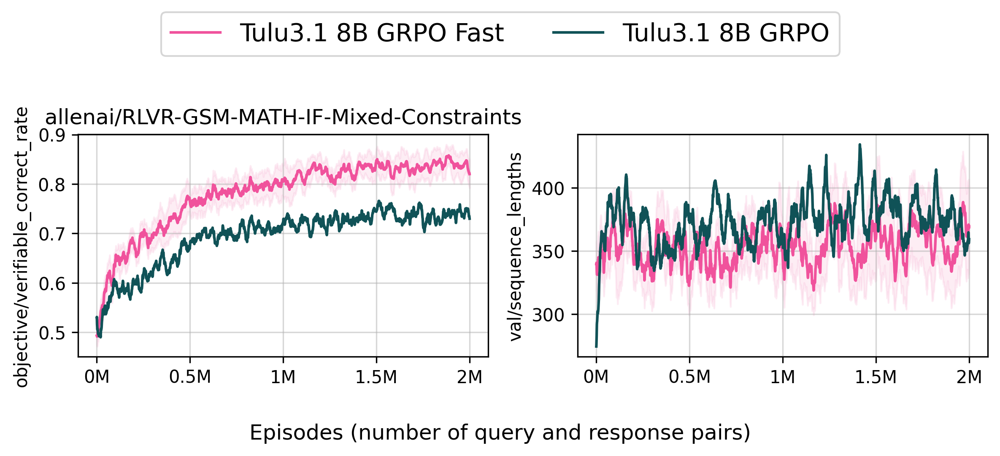
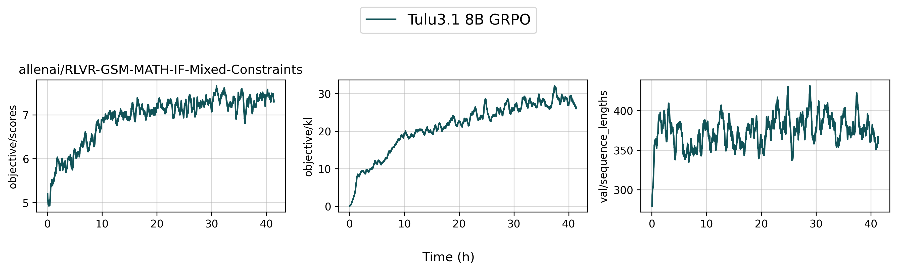


??? note "👉 Tracked WandB Experiments (Click to expand)"

    <iframe loading="lazy" src="https://wandb.ai/ai2-llm/open_instruct_public/reports/Tulu3-1-8B-GRPO--VmlldzoxMTkyNzc2MA" style="width:100%; height:500px" title="Tulu3-8B-GRPO"></iframe>


???+ info

    Below are some learning curves for the evaluation metrics during training. Basically, ifeval, gsm8k, and math:flex all go up.

    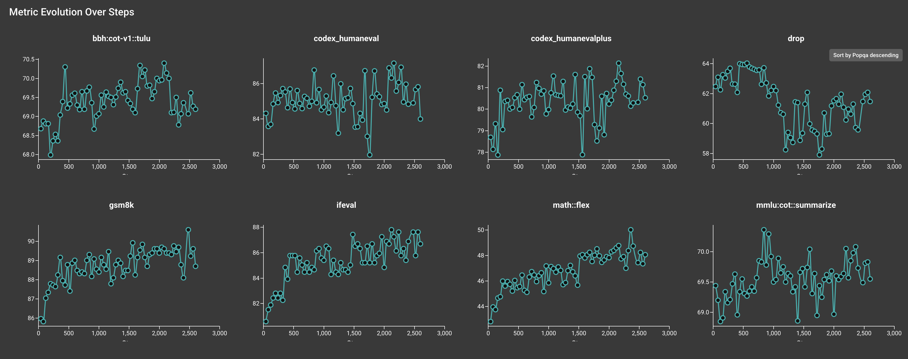


???+ info

    Based on our internal evaluation, the GRPO model is roughly on par with the original `allenai/Llama-3.1-Tulu-3.1-8B` model, though there are some slight differences. Note that your results may vary slightly due to the random seeds used in the training.

    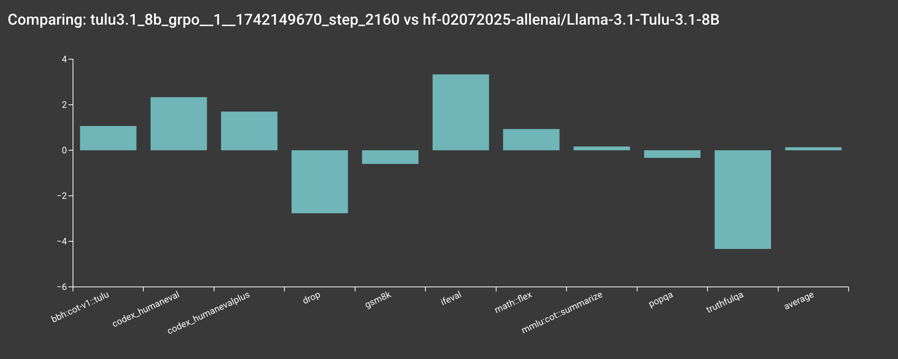


### Reproduce `allenai/OLMo-2-1124-7B-Instruct` but better (2 Nodes)

These results were produced with the legacy [`grpo_vllm_thread_ray_gtrl.py`](https://github.com/allenai/open-instruct/blob/745bf58d321c/open_instruct/grpo_vllm_thread_ray_gtrl.py), which has since been removed. See the [deleted script](https://github.com/allenai/open-instruct/blob/745bf58d321c/scripts/train/olmo2/grpo_7b.sh) for the original launch command.

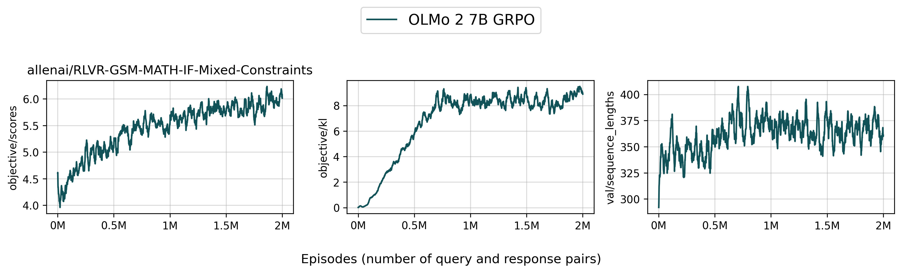
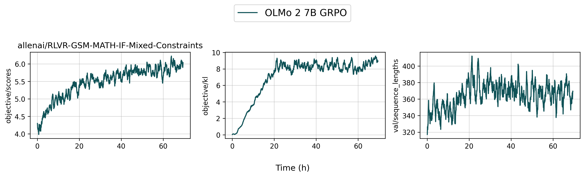

??? note "👉 Tracked WandB Experiments (Click to expand)"

    <iframe loading="lazy" src="https://wandb.ai/ai2-llm/open_instruct_public/reports/OLMo-2-7B-GRPO--VmlldzoxMTkyNzc1OA" style="width:100%; height:500px" title="OLMo2-7B-GRPO"></iframe>

???+ info

    Below are some learning curves for the evaluation metrics during training. Basically, ifeval, gsm8k, and math:flex all go up.

    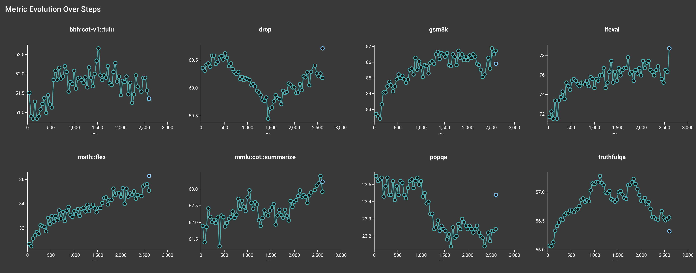


???+ info

    Based on our internal evaluation, the GRPO model actually outperforms the original `allenai/OLMo-2-1124-7B-Instruct` model. This is mostly because the original `allenai/OLMo-2-1124-7B-Instruct` was trained with PPO, which may suffer from not using a outcome reward model to initialize the value model (since it uses a genreal RM to initialize the value model). Note that your results may vary slightly due to the random seeds used in the training.

    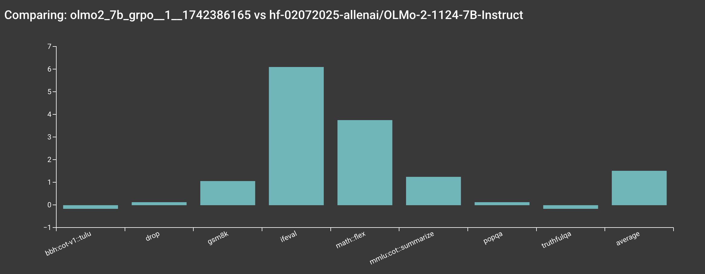


### (🧪 Experimental) Qwen 2.5 7B Zero-style

These results were produced with the legacy [`grpo_vllm_thread_ray_gtrl.py`](https://github.com/allenai/open-instruct/blob/745bf58d321c/open_instruct/grpo_vllm_thread_ray_gtrl.py), which has since been removed. See the [deleted script](https://github.com/allenai/open-instruct/blob/745bf58d321c/scripts/train/qwen/grpo_7b.sh) for the original launch command. Training was done on [ai2-adapt-dev/math_ground_truth_zs](https://huggingface.co/datasets/ai2-adapt-dev/math_ground_truth_zs) starting from a base model, similar to [DeepSeek R1](https://arxiv.org/abs/2501.12948).

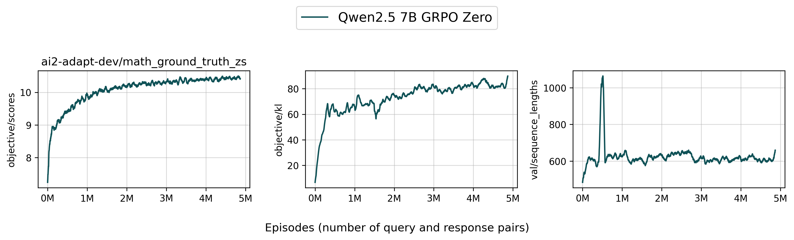
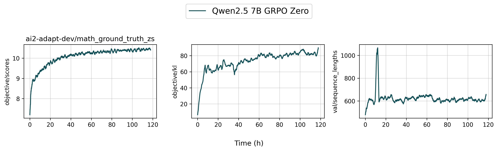


??? note "👉 Tracked WandB Experiments (Click to expand)"

    <iframe loading="lazy" src="https://wandb.ai/ai2-llm/open_instruct_public/reports/Qwen2-5-7B-GRPO-Zero--VmlldzoxMjA0MjY5OA" style="width:100%; height:500px" title="Qwen2.5-7B-GRPO-Zero"></iframe>

???+ info

    Below are some learning curves for the evaluation metrics during training. Basically, ifeval, gsm8k, and math:flex all go up.

    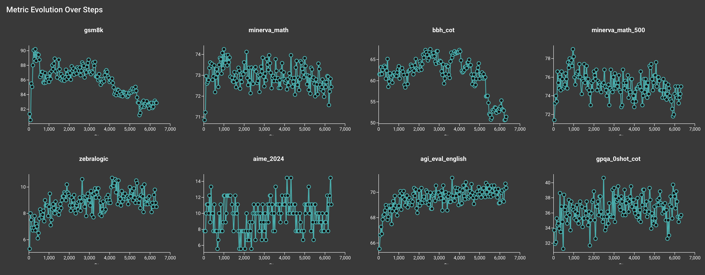


???+ info

    We haven't quite figured out how to make our internal evaluation toolchains more open yet. Stay tuned!


### Training Metrics

During training, the following metrics are logged:


* `episode`: the global episode number training has gone through (e.g., `3000` means we have trained on 3000 data points already -- in the case of RLVR that is prompts, which can repeat)
* `lr`: the current learning rate
* `epoch`: the fraction or multiple of the epoch (e.g., `2.7` means we have trained on the dataset for 2 epochs and 70% of the third epoch)
* `objective/kl`: the KL divergence between the current policy and the reference policy (sum of the KL divergence of each response token)
* `objective/scores`: the scores of the current response, rated by a combination of reward model and other rewards (e.g., R1 style format reward, verifiable reward, etc.)
* `objective/rlhf_reward`: the RLHF reward, which is `objective/scores` - `beta` * `objective/kl`
* `objective/non_score_reward`: `beta` * `objective/kl`
* `objective/entropy`: the entropy of the current policy
* `objective/loss`: the GRPO loss
* `objective/kl2`: the second variant of KL divergence used in the training process, calculated similarly to `objective/kl`
* `objective/kl3`: the third variant of KL divergence used in the training process, providing additional insights into policy divergence
* `objective/scores_mean`: the mean of the scores of the current response, providing an average measure of response quality
* `objective/reward_std`: the standard deviation of the rewards, indicating the variability in the reward distribution
* `objective/verifiable_correct_rate`: the rate at which responses are verifiably correct, providing a measure of response accuracy
* `loss/policy_avg`: the average policy loss, indicating the mean loss incurred during policy updates
* `policy/approxkl_avg`: the average approximate KL divergence, used to monitor policy stability
* `policy/clipfrac_avg`: the fraction of valid tokens excluded by DAPO's directional behavior-policy clip or capped by CISPO; this is separate from rho clamping and divergence filtering
* `policy/entropy_avg`: the average entropy of the policy, providing a measure of policy randomness
* `time/from_scratch`: the time taken to train the model from scratch
* `time/training`: the time taken to do one training step
* `val/sequence_lengths`: the length of the sequences in the generated responses
* `val/num_stop_token_ids`: the number of stop tokens in the generated responses
* `val/ratio`: the mean finite configured policy ratio, either \(\pi_\theta/\pi_{\text{old}}\) or \(\pi_\theta/\mu\)
* `val/ratio_var`: the variance of the configured policy ratio
* `val/rho_clipfrac`: the fraction of valid tokens whose rollout-to-old-policy correction was truncated by `rho_clamp_lower_bound` or `rho_clamp_upper_bound`
* `val/rho_drop_frac`: the fraction of valid tokens removed by the configured property-based drop mask; this does not include DAPO/CISPO clipping
* `val/rho_divergence`: the binary TV or KL statistic used by the configured mask
* `val/rho_overflow_frac`: the fraction of valid response tokens whose raw fp32 policy or correction ratio overflowed; masked or safely capped overflows do not terminate training
* `val/stop_token_rate`: the rate at which stop tokens appear in the responses, providing a measure of response termination
* `val/format_scores`: the mean format scores, indicating the quality of response formatting (only logged if `add_r1_style_format_reward` is enabled)
* `other/real_batch_size_ratio`: In GRPO, as we train we actually get smaller and smaller batch sizes. This is because if we solve a prompt 100% correct or 0% correct, the std of the group is 0. So `adv = (score - score.mean()) / (score.std + 1e-5) = 0 / 1e-5 = 0`, causing 0 gradients. This metric is the ratio of the samples that have gradients vs the total number of samples,
* `other/packed_ratio`: The ratio of the packed sequences vs the total number of sequences. The lower the ratio, the more efficiently we have packed the sequences. E.g., if we have 100 sequences and the ratio is 0.1, it means we only have to do 10% of the forward passes than if we didn't pack.


## Acknowledgements

We would like to thank the following resources for GRPO theory:

- [DeepSeek R1](https://arxiv.org/abs/2501.12948)
- [DeepSeekMath](https://arxiv.org/abs/2402.03300)
- [Asynchronous RLHF](https://arxiv.org/abs/2410.18252)

We would like to thank the following resources for GRPO implementation and Ray usage:

- [Packing Techniques](https://huggingface.co/blog/sirluk/llm-sequence-packing)
- [OpenRLHF/OpenRLHF](https://github.com/OpenRLHF/OpenRLHF)
- [Open-Reasoner-Zero/Open-Reasoner-Zero](https://github.com/Open-Reasoner-Zero/Open-Reasoner-Zero)


We would like to thank the following projects for general infrastructure:

- [vLLM](https://github.com/vllm-project/vllm)
- [Ray](https://github.com/ray-project/ray)
- [DeepSpeedAI/DeepSpeed](https://github.com/deepspeedai/DeepSpeed)
- [HuggingFace/Transformers](https://github.com/huggingface/transformers)
