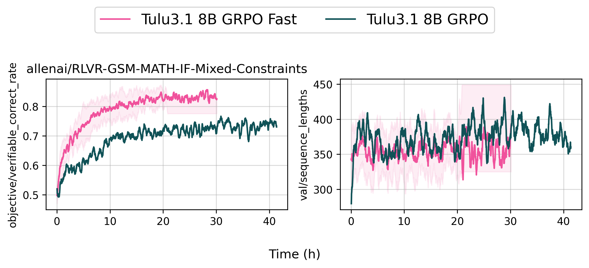
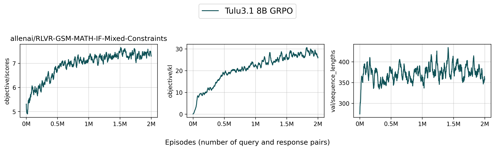

# Grouped Relative Policy Optimization (GRPO)

GRPO is an online RL method used in [DeepSeek R1 paper](https://arxiv.org/abs/2501.12948) and its first appearance is in [DeepSeekMath](https://arxiv.org/abs/2402.03300)


## Implemented Variants

- `grpo_fast.py` is a faster variant using [packing techniques](https://huggingface.co/blog/sirluk/llm-sequence-packing).
- `grpo_vllm_thread_ray_gtrl.py` is a more vanilla GRPO implementation, using vLLM and Ray.


## `grpo_fast.py`

This implementation has the following features:

- Uses packing techniques to speed up the training process, inspired by [Open-Reasoner-Zero/Open-Reasoner-Zero](https://github.com/Open-Reasoner-Zero/Open-Reasoner-Zero)
- Uses a thread-based approach to parallelize the training and inference processes, based on [Asynchronous RLHF](https://arxiv.org/abs/2410.18252).
- Uses a data preparation thread to prepare the data for the training process.

In simpler tasks, we see 2x faster training, and even 10x faster for more complex tasks. With `grpo_fast.py`, we can run crank up `number_samples_per_prompt` and train on really large batch sizes.

It implements additional optimizations:

* `grpo_fast.py` also implements an optimization to skip zero gradient batches. If we solve a prompt 100% correct or 0% correct, the std of the group is 0. So `adv = (score - score.mean()) / (score.std + 1e-5) = 0 / 1e-5 = 0`, causing 0 gradients. `grpo_fast.py` will skip these batches before packing the sequences.


Figure taken from [this discord thread by @the_real_jrb](https://discord.com/channels/1179127597926469703/1208183216843005962/1357712190957682839)

* `grpo_fast.py` only applies the verification reward if the format reward is enabled (via `--additive_format_reward False` by default). See ([allenai/open-instruct/pull/659](https://github.com/allenai/open-instruct/pull/659)). A direct additive format reward is undesirable. In GRPO, the scale of the rewards is not relevant due to group normalization. For example, a group of [0, 0, 0, 0, 10], [0, 0, 0, 0, 11], [0, 0, 0, 0, 1] reward will have the same advantage.

Now imagine there are cases where the model generates a really long response (8k) gen length, but only get the format reward right, GRPO will push up the probs for this long response even though the response is not really correct. As a result, when using the format reward directly, we see the response length of unsolved prompts to fluctuate significantly, causing stability issues.


### Debug (Single GPU)

You can run the script in a single GPU mode to debug the training process.

```bash
# single GPU
bash scripts/train/debug/grpo_fast.sh
# 3 GPU: 2 for training, 1 for inference (a more realistic setting for async training)
bash scripts/train/debug/grpo_fast_3_gpu.sh
```

### Reproduce `allenai/Llama-3.1-Tulu-3.1-8B` (1 Nodes)

You can reproduce our `allenai/Llama-3.1-Tulu-3.1-8B` model by running the following command:

```bash
bash scripts/train/tulu3/grpo_fast_8b_single_node.sh
```

???+ info

    Here the `grpo_fast.py` actually use 6 GPUs for training and 2 GPUs for inference, so it's using less hardware but runs faster than `grpo_vllm_thread_ray_gtrl.py` which uses 2 nodes (12 GPUs for training and 4 GPUs for inference).




??? note "👉 Tracked WandB Experiments (Click to expand)"

    <iframe loading="lazy" src="https://wandb.ai/ai2-llm/open_instruct_public/reports/Tulu3-1-8B-GRPO-Fast--VmlldzoxMTk0NzcwOA" style="width:100%; height:500px" title="Tulu3-8B-GRPO-Fast"></iframe>

???+ info

    Below are some learning curves for the evaluation metrics during training. Basically, ifeval, gsm8k, and math:flex all go up.

    

???+ info

    Based on our internal evaluation, the GRPO model is roughly on par with the original `allenai/Llama-3.1-Tulu-3.1-8B` model, though there are some slight differences. Note that your results may vary slightly due to the random seeds used in the training.

    


???+ info

    We haven't quite figured out how to make our internal evaluation toolchains more open yet. Stay tuned!


### (🧪 Experimental) Qwen 2.5 7B GRPO Fast Zero-style

We have

```bash
bash scripts/train/qwen/grpo_fast_7b.sh
```


??? note "👉 Tracked WandB Experiments (Click to expand)"

    <iframe loading="lazy" src="https://wandb.ai/ai2-llm/open_instruct_public/reports/Qwen2-5-7B-GRPO-Fast-Zero--VmlldzoxMjA2NDExMA" style="width:100%; height:500px" title="Qwen2.5-7B-GRPO-Fast-Zero"></iframe>


???+ info

    Below are some learning curves for the evaluation metrics during training. Basically, ifeval, gsm8k, and math:flex all go up.

    

???+ info

    We haven't quite figured out how to make our internal evaluation toolchains more open yet. Stay tuned!


### (🧪 Experimental) Olmo2 7B GRPO Fast Zero-style

We have

```bash
bash scripts/train/olmo2/grpo_fast_7b_zero.sh
```


??? note "👉 Tracked WandB Experiments (Click to expand)"

    <iframe loading="lazy" src="https://wandb.ai/ai2-llm/open_instruct_public/reports/OLMo-2-7B-GRPO-Fast-Zero--VmlldzoxMjA0MjU4MQ" style="width:100%; height:500px" title="OLMo2-7B-GRPO-Fast-Zero"></iframe>

???+ info

    Below are some learning curves for the evaluation metrics during training. Basically, ifeval, gsm8k, and math:flex all go up.

    


???+ info

    We haven't quite figured out how to make our internal evaluation toolchains more open yet. Stay tuned!


### (🧪 Experimental) Olmo2 13B GRPO Fast Zero-style

We have

```bash
bash scripts/train/olmo2/grpo_fast_13b_zero.sh
```


??? note "👉 Tracked WandB Experiments (Click to expand)"

    <iframe loading="lazy" src="https://wandb.ai/ai2-llm/open_instruct_public/reports/OLMo-2-13B-GRPO-Fast-Zero--VmlldzoxMjA0MjU4Mw" style="width:100%; height:500px" title="OLMo2-13B-GRPO-Fast-Zero"></iframe>

???+ info

    Below are some learning curves for the evaluation metrics during training. Basically, ifeval, gsm8k, and math:flex all go up.

    


???+ info

    We haven't quite figured out how to make our internal evaluation toolchains more open yet. Stay tuned!


### Training Metrics

See the Training Metrics for `grpo_vllm_thread_ray_gtrl.py` below for general metrics. `grpo_fast.py` includes the following additional metrics:


* `other/real_batch_size_ratio`: In GRPO, as we train we actually get smaller and smaller batch sizes. This is because if we solve a prompt 100% correct or 0% correct, the std of the group is 0. So `adv = (score - score.mean()) / (score.std + 1e-5) = 0 / 1e-5 = 0`, causing 0 gradients. This metric is the ratio of the samples that have gradients vs the total number of samples,
* `other/packed_ratio`: The ratio of the packed sequences vs the total number of sequences. The lower the ratio, the more efficiently we have packed the sequences. E.g., if we have 100 sequences and the ratio is 0.1, it means we only have to do 10% of the forward passes than if we didn't pack.


## `grpo_vllm_thread_ray_gtrl.py`


This implementation has the following features:

- Uses a thread-based approach to parallelize the training and inference processes, based on [Asynchronous RLHF](https://arxiv.org/abs/2410.18252).
- Uses vLLM and Ray to parallelize the training process, based on how [OpenRLHF](https://github.com/OpenRLHF/OpenRLHF) does it


### Debug (Single GPU)

You can run the script in a single GPU mode to debug the training process.

```bash
bash scripts/train/debug/grpo.sh
```


### Reproduce `allenai/Llama-3.1-Tulu-3.1-8B` (2 Nodes)

You can reproduce our `allenai/Llama-3.1-Tulu-3.1-8B` model by running the following command:

```bash
bash scripts/train/tulu3/grpo_8b.sh
```




??? note "👉 Tracked WandB Experiments (Click to expand)"

    <iframe loading="lazy" src="https://wandb.ai/ai2-llm/open_instruct_public/reports/Tulu3-1-8B-GRPO--VmlldzoxMTkyNzc2MA" style="width:100%; height:500px" title="Tulu3-8B-GRPO"></iframe>


???+ info

    Below are some learning curves for the evaluation metrics during training. Basically, ifeval, gsm8k, and math:flex all go up.

    


???+ info

    Based on our internal evaluation, the GRPO model is roughly on par with the original `allenai/Llama-3.1-Tulu-3.1-8B` model, though there are some slight differences. Note that your results may vary slightly due to the random seeds used in the training.

    


### Reproduce `allenai/OLMo-2-1124-7B-Instruct` but better (2 Nodes)

You can reproduce our `allenai/OLMo-2-1124-7B-Instruct` model by running the following command:

```bash
bash scripts/train/olmo2/grpo_7b.sh
```


??? note "👉 Tracked WandB Experiments (Click to expand)"

    <iframe loading="lazy" src="https://wandb.ai/ai2-llm/open_instruct_public/reports/OLMo-2-7B-GRPO--VmlldzoxMTkyNzc1OA" style="width:100%; height:500px" title="OLMo2-7B-GRPO"></iframe>

???+ info

    Below are some learning curves for the evaluation metrics during training. Basically, ifeval, gsm8k, and math:flex all go up.

    


???+ info

    Based on our internal evaluation, the GRPO model actually outperforms the original `allenai/OLMo-2-1124-7B-Instruct` model. This is mostly because the original `allenai/OLMo-2-1124-7B-Instruct` was trained with PPO, which may suffer from not using a outcome reward model to initialize the value model (since it uses a genreal RM to initialize the value model). Note that your results may vary slightly due to the random seeds used in the training.

    


### (🧪 Experimental) Qwen 2.5 7B Zero-style

Here is a command to run GRPO on the `Qwen/Qwen2.5-7B` on [ai2-adapt-dev/math_ground_truth_zs](https://huggingface.co/datasets/ai2-adapt-dev/math_ground_truth_zs), which is simply a zero-shot version of the RLVR MATH dataset. The training is done starting from a base model, similar to how [DeepSeek R1](https://arxiv.org/abs/2501.12948) does it.

```bash
bash scripts/train/qwen/grpo_7b.sh
```


??? note "👉 Tracked WandB Experiments (Click to expand)"

    <iframe loading="lazy" src="https://wandb.ai/ai2-llm/open_instruct_public/reports/Qwen2-5-7B-GRPO-Zero--VmlldzoxMjA0MjY5OA" style="width:100%; height:500px" title="Qwen2.5-7B-GRPO-Zero"></iframe>

???+ info

    Below are some learning curves for the evaluation metrics during training. Basically, ifeval, gsm8k, and math:flex all go up.

    


???+ info

    We haven't quite figured out how to make our internal evaluation toolchains more open yet. Stay tuned!


### Training Metrics

During training, the following metrics are logged:


* `episode`: the global episode number training has gone through (e.g., `3000` means we have trained on 3000 data points already -- in the case of RLVR that is prompts, which can repeat)
* `lr`: the current learning rate
* `epoch`: the fraction or multiple of the epoch (e.g., `2.7` means we have trained on the dataset for 2 epochs and 70% of the third epoch)
* `objective/kl`: the KL divergence between the current policy and the reference policy (sum of the KL divergence of each response token)
* `objective/scores`: the scores of the current response, rated by a combination of reward model and other rewards (e.g., R1 style format reward, verifiable reward, etc.)
* `objective/rlhf_reward`: the RLHF reward, which is `objective/scores` - `beta` * `objective/kl`
* `objective/non_score_reward`: `beta` * `objective/kl`
* `objective/entropy`: the entropy of the current policy
* `objective/loss`: the GRPO loss
* `objective/kl2`: the second variant of KL divergence used in the training process, calculated similarly to `objective/kl`
* `objective/kl3`: the third variant of KL divergence used in the training process, providing additional insights into policy divergence
* `objective/scores_mean`: the mean of the scores of the current response, providing an average measure of response quality
* `objective/reward_std`: the standard deviation of the rewards, indicating the variability in the reward distribution
* `objective/verifiable_correct_rate`: the rate at which responses are verifiably correct, providing a measure of response accuracy
* `loss/policy_avg`: the average policy loss, indicating the mean loss incurred during policy updates
* `policy/approxkl_avg`: the average approximate KL divergence, used to monitor policy stability
* `policy/clipfrac_avg`: the average fraction of updates where the policy was clipped, indicating how often clipping occurs
* `policy/entropy_avg`: the average entropy of the policy, providing a measure of policy randomness
* `time/from_scratch`: the time taken to train the model from scratch
* `time/training`: the time taken to do one training step
* `val/sequence_lengths`: the length of the sequences in the generated responses
* `val/num_stop_token_ids`: the number of stop tokens in the generated responses
* `val/ratio`: the mean ratio of the new policy to the old policy, used to assess policy updates
* `val/ratio_var`: the variance of the ratio of the new policy to the old policy, indicating the variability in policy updates
* `val/stop_token_rate`: the rate at which stop tokens appear in the responses, providing a measure of response termination
* `val/format_scores`: the mean format scores, indicating the quality of response formatting (only logged if `add_r1_style_format_reward` is enabled)
* `other/real_batch_size_ratio`: In GRPO, as we train we actually get smaller and smaller batch sizes. This is because if we solve a prompt 100% correct or 0% correct, the std of the group is 0. So `adv = (score - score.mean()) / (score.std + 1e-5) = 0 / 1e-5 = 0`, causing 0 gradients. This metric is the ratio of the samples that have gradients vs the total number of samples,
* `other/packed_ratio`: The ratio of the packed sequences vs the total number of sequences. The lower the ratio, the more efficiently we have packed the sequences. E.g., if we have 100 sequences and the ratio is 0.1, it means we only have to do 10% of the forward passes than if we didn't pack.


## Acknowledgements

We would like to thank the following resources for GRPO theory:

- [DeepSeek R1](https://arxiv.org/abs/2501.12948)
- [DeepSeekMath](https://arxiv.org/abs/2402.03300)
- [Asynchronous RLHF](https://arxiv.org/abs/2410.18252)

We would like to thank the following resources for GRPO implementation and Ray usage:

- [Packing Techniques](https://huggingface.co/blog/sirluk/llm-sequence-packing)
- [OpenRLHF/OpenRLHF](https://github.com/OpenRLHF/OpenRLHF)
- [Open-Reasoner-Zero/Open-Reasoner-Zero](https://github.com/Open-Reasoner-Zero/Open-Reasoner-Zero)


We would like to thank the following projects for general infrastructure:

- [vLLM](https://github.com/vllm-project/vllm)
- [Ray](https://github.com/ray-project/ray)
- [DeepSpeedAI/DeepSpeed](https://github.com/deepspeedai/DeepSpeed)
- [HuggingFace/Transformers](https://github.com/huggingface/transformers)
