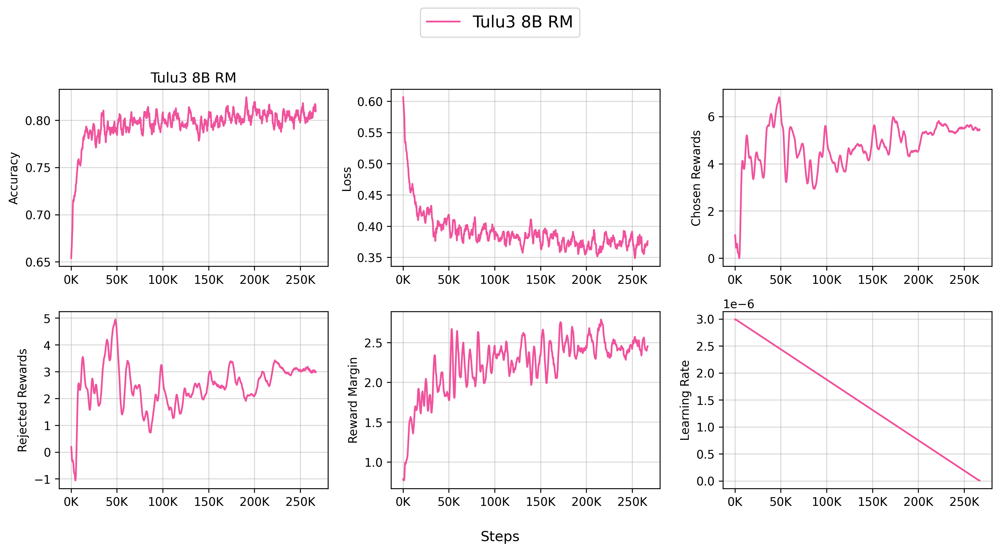
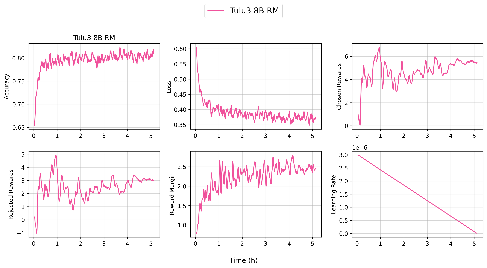

# Reward Modeling (RM)

We support training reward models, mostly based on [Learning to summarize from human feedback](https://arxiv.org/abs/2009.01325).


## Implemented Variants

- `reward_modeling.py` contains the script for training reward models.


## `reward_modeling.py`


This implementation has the following key features:

- Auto save the trained checkpoint to HuggingFace Hub
- Supports LigerKernel for optimized training with fused operations

There are several relevant implementation details:

1. The tokenizer pads from the right: when the length of the data points differ, the tokenizer pads from the right
1. Disable dropout in the model: this is actually an implementation detail in PPO training, but for consistency we also disable dropout in the reward model training (see p.3. in https://arxiv.org/pdf/1909.08593)
1. Layer initialization: we initialize the score's weight according to `std=1 / np.sqrt(model.config.hidden_size + 1)` (see p. 11 in https://arxiv.org/abs/2009.01325)


### Debug (Single GPU)

You can run the script in a single GPU mode to debug the training process.

```bash
bash scripts/train/debug/reward_modeling.sh
```


### Reproduce `allenai/Llama-3.1-Tulu-3-8B-RM` (8 Nodes)

You can reproduce our `allenai/Llama-3.1-Tulu-3-8B-RM` model by running the following command:

```bash
bash scripts/train/tulu3/reward_modeling_8b.sh
```






<iframe loading="lazy" src="https://wandb.ai/ai2-llm/open_instruct_public/reports/Tulu3-8B-RM--VmlldzoxMTkwOTgyNw" style="width:100%; height:500px" title="Tulu3-8B-RM"></iframe>


### Training Metrics

During training, the following metrics are logged:

* `episode`: the global episode number training has gone through (e.g., `3000` means we have trained on 3000 data points already)
* `epoch`: the fraction or multiple of the epoch (e.g., `2.7` means we have trained on the dataset for 2 epochs and 70% of the third epoch)
* `train/rm/accuracy`: the training accuracy of the training batch
* `train/rm/loss`: the logsigmoid loss of the reward modeling of the training batch
* `train/rm/chosen_rewards`: the reward of the chosen responses of the training batch
* `train/rm/rejected_rewards`: the reward of the rejected responses of the training batch
* `train/rm/reward_margin`: the reward margin (chosen_reward - rejected_reward) of the training batch
* `train/rm/lr`: the training learning rate


We also have `eval/rm/accuracy`, `eval/rm/loss`, `eval/rm/chosen_rewards`, `eval/rm/rejected_rewards`, `eval/rm/reward_margin` for the evalation dataset.


## Acknowledgements

We would like to thank the following projects for general infrastructure:

- [DeepSpeedAI/DeepSpeed](https://github.com/deepspeedai/DeepSpeed)
- [HuggingFace/Transformers](https://github.com/huggingface/transformers)
