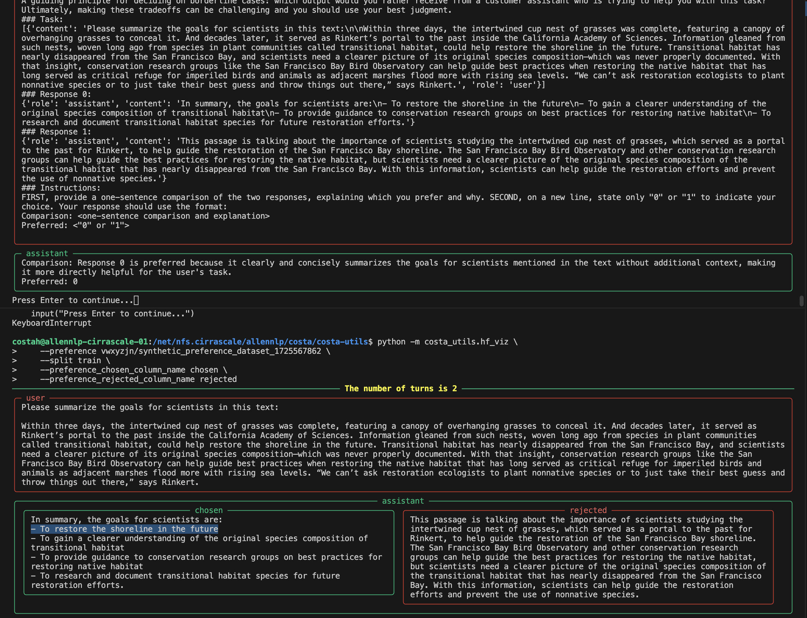

# Synthetic preference dataset

This section focuses explicitly on creating synthetic preference datasets.

# Debug run (use an interactive session)

This code supports HF models, local models and also API-based models (e.g., `gpt-4`). For generating completions, the code now accepts one model at a time, but we're working on adding an ensemble of models. Stay tuned.

```bash
# 1. first sample a bunch of completions given prompts
# Here is an example created dataset: https://huggingface.co/datasets/vwxyzjn/generation_1725567768
python open_instruct/rejection_sampling/generation.py \
    --dataset_mixer_list HuggingFaceH4/no_robots 100 \
    --dataset_splits train \
    --model_name_or_path allenai/llama-3-tulu-2-8b \
    --num_completions 3 \
    --save_filename output/completions.jsonl \
    --sanity_check \
    --push_to_hub
```

### Create preference pairs

```bash
# 2.1 do LLM as a judge to create synthetic preference dataset
# Here is an example created dataset: https://huggingface.co/datasets/vwxyzjn/synthetic_preference_dataset_1725567862
python open_instruct/rejection_sampling/synthetic_preference_dataset.py \
    --input_filename output/completions.jsonl \
    --model gpt-4o-2024-08-06 \
    --save_filename output/synthetic_preferences.jsonl \
    --num_completions 3 \
    --push_to_hub \
```


You can visualize the dataset via

```bash
python -m costa_utils.hf_viz \
    --sft vwxyzjn/synthetic_preference_dataset_1725567862 \
    --split train \
    --sft_messages_column_name whole_conversation

python -m costa_utils.hf_viz \
    --preference vwxyzjn/synthetic_preference_dataset_1725567862 \
    --split train \
    --preference_chosen_column_name chosen \
    --preference_rejected_column_name rejected
```



# Run through the entire dataset run

To run through the entire dataset you would need a lot more GPUs to finish the generation more quickly.


```bash
# NOTE: the scripts below only generate 400 prompts, so it's for demonstration purposes only. The scripts are highly scalable, and you could modify its `num_prompts=400` to something else like 300000 for the tulu dataset.

# you need to make sure your default beaker workspace has WANDB_API_KEY and HF_TOKEN secrets in them
beaker secret write HF_TOKEN xxxxxxxxxxxx
beaker secret write WANDB_API_KEY xxxxxxxxxxx

# Docker mode: using caches from WEKA
deploy_mode="docker_weka" bash scripts/synthetic_preference_dataset.bash

# Docker mode: using caches from NFS
deploy_mode="docker_nfs" bash scripts/synthetic_preference_dataset.bash

# Docker mode: do not use caches
deploy_mode="docker" bash scripts/synthetic_preference_dataset.bash

# If you have environment setup with NFS and want to launch debug mode:
deploy_mode="nfs" bash scripts/synthetic_preference_dataset.bash
```

You can see a demo [here](https://drive.google.com/file/d/1dq3KG15ajpOv8tFYEZGS4tlW7G55oOYP/view?usp=sharing)


