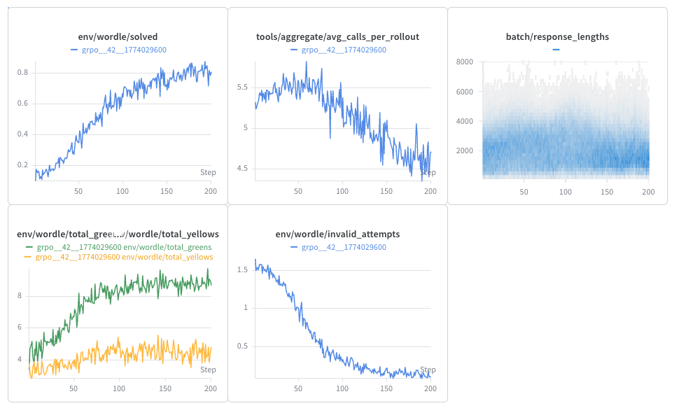

# Training Tool-Using Models and RL Environments

This page is for people who want to train models in Open-Instruct that do more than produce a single final answer. You can use it to:

- train a model to call tools such as Python, web search, browsing, or MCP servers
- train against stateful RL environments such as guessing games or Wordle
- combine intermediate environment rewards with a final verifier-based reward

The recommended workflow is user-facing and script-first: start from an existing debug or training script, choose the tool or environment setup you want, then adjust the configuration for your dataset and infrastructure. You should not need to build a new training loop just to add tool use.

Right now, Open-Instruct supports a simple interaction model where environment outputs are appended back into the conversation during multi-turn GRPO rollouts.

## Example Scripts

Start from one of these scripts. They are the fastest way to see the expected config shape and get a working run before customizing anything.

| Script | Description |
| --- | --- |
| `scripts/train/debug/tools/qwen3_vllm_hermes_parser_debug.sh` | Train a model to call common tools with a standard chat-style parser |
| `scripts/train/debug/tools/mcp_weather_debug.sh` | Train a model against tools exposed by an MCP server |
| `scripts/train/debug/tools/dr_tulu_parser_debug.sh` | Reproduce a DR-Tulu-style tool-calling setup |
| `scripts/train/debug/envs/guess_number_1gpu.sh` | Train against a built-in tool-style environment |
| `scripts/train/debug/envs/wordle_8gpu.sh` | Train against a built-in text environment. This uses `mason` to launch, so non-AI2 users will likely need to adapt the launcher. |

## Quick Parameter Overview

These are the main parameters you will usually touch when enabling tools or environments:

| Parameter | What it controls | Typical use |
| --- | --- | --- |
| `--tools` | Which tools or environments are active for the run | `--tools python serper_search`. Look at `TOOL_REGISTRY` for the full list. |
| `--tool_call_names` | The names the model sees and emits when calling those tools, in the order matching `--tools`. | `--tool_call_names code search` |
| `--tool_configs` | Per-tool or per-environment settings, set globally for the run. e.g.API endpoints, MCP server info, timeouts, environment defaults. Again, order must match `--tools`. | `--tool_configs {'api_key': '1234567890'} {}` |
| `--tool_parser_type` | How model output is parsed into tool calls. See [Parsers](#parsers) for more details. Use `vllm_*` unless you know what you are doing. | `--tool_parser_type vllm_hermes` |
| `--max_steps` | Maximum number of tool/environment interaction steps per rollout. | `--max_steps 200` |
| `--per_turn_max_tokens` | Optional per-turn token limit for each tool/environment interaction step. Useful if you want to allow many interactions (large overall response length) but limit amount of tokens per step. | `--per_turn_max_tokens 1024` |
| `--pass_tools_to_chat_template` | By default true, but you can turn it off if you have a custom system prompt or parser that already provides information about the tools. | `--pass_tools_to_chat_template True` |
| `--pool_size` | Number of worker actors per tool or environment. Increase if tool calls are becoming a bottleneck. Controls how many concurrent tool/environment interactions can run at once (e.g. useful for rate limits). By default, this is set to the number of rollouts per batch (`num_rollouts_per_batch * num_unique_prompts_rollout`). | `--pool_size 16` |
| `--reward_aggregator` | How per-step rewards are combined across the rollout. Can be `last` (just take the last step's reward) or `sum` (add up all step rewards). | `--reward_aggregator sum` |

## How the Rollout Works

At a high level, a tool- or environment-enabled rollout looks like this:

1. Open-Instruct builds the prompt from your dataset example.
2. The model generates one turn of text.
3. The parser either extracts a structured tool call or forwards the full text to a text environment.
4. The selected tool or environment returns a `StepResult`.
5. The `StepResult.result` text is formatted and appended back into the conversation.
6. Training continues until the rollout hits `max_steps` or a step returns `done=True`.
7. Per-step rewards are aggregated with `--reward_aggregator`, then combined with any final verifier reward.

The key implementation idea is that you configure the rollout from the script layer, while Open-Instruct handles the multi-turn dispatch loop underneath.

## Adding Your Own Tools or Environments

When adding your own tool or environment, there are three potential options:

| Class | Description |
| --- | --- |
| `Tool` | A stateless tool that can be called by the model. You only need to implement the `step` method. |
| `RLEnvironment` | A stateful environment that can be used to train a model. You need to implement the `reset` and `step` methods. Interfaces with the model via tool/function calling. |
| `TextRLEnvironment` | A stateful environment that receives the model's full generation at each step. Use this when you want custom parsing or reward logic without relying on structured tool calls. In practice, subclasses implement `_reset` and `text_step`. |

As a rule of thumb:

- use `Tool` for stateless request/response integrations like Python execution or web search.
- use `RLEnvironment` for stateful tasks where the model acts through tool/function calls, e.g. a docker sandbox.
- use `TextRLEnvironment` when the environment should inspect the model's raw text directly, e.g. proper multi-turn training with a simulated user.

`reset` is primarily for environment setup and returns the initial `StepResult` plus tool definitions. For stateless tools, the default `reset` implementation mainly exposes the tool schema.

Note that behind the scenes, Open-Instruct creates a worker pool for each tool or environment, and passes the config fields into the constructor. As such, each rollout gets a fresh instance of the tool or environment, and so **you can store state inside the tool or environment object if you want!**

After this, you need to add a config class for your tool or environment for any runtime parameters that are not part of the `EnvCall` interface!

### Config classes and how config wiring works

Each tool or environment is paired with a config dataclass that subclasses `BaseEnvConfig`. In practice, this is the object that holds the fixed settings for that tool or environment, such as API endpoints, timeouts, or game parameters.

These config elements can have defaults, be set globally for a run, and/or be overridden per-sample in the dataset. This can be useful if you want to use the same tool or environment with different settings for different samples.

### `tool_name` vs `tool_call_name`

By default, the name you pass in `--tools` is also the name the model uses when calling that tool. You can override the model-facing name with `--tool_call_names`.

For example:

```bash
--tools python serper_search \
--tool_call_names code search
```

In that case:

- Open-Instruct looks up `python` and `serper_search` in the registry, and creates environments using the corresponding classes.
- the model sees and calls `code` and `search` in its function calling interface.

This can be useful if you want to swap tool backends without changing the name the model uses, or if you want the tool names in training to better match some external setup you are reproducing.

### How tool definitions are exposed to the model

Tool definitions are the OpenAI-style function schemas returned by `get_tool_definitions()`. Open-Instruct collects these definitions from the active tool or environment pools and uses them in two places:

- to tell the parser which function names and argument schemas are valid
- to pass tool schemas into the chat template when `--pass_tools_to_chat_template` is enabled

This is the main connection between tools and environments: both ultimately expose tool definitions to the model, even if the underlying implementation is stateful.

For a plain `Tool`, `get_tool_definitions()` usually exposes a single function schema. For a stateful `RLEnvironment`, `get_tool_definitions()` can expose one or more actions the model may take. For `TextRLEnvironment`, `reset()` returns no tool definitions, because the model interacts through raw text instead of function calls.

For example, if you configure:

```bash
--tools python \
--tool_call_names code
```

then the model is shown a function definition named `code`, not `python`. If your dataset uses per-sample `tools` filtering, those entries should also use `code`, because that is the function name exposed to the model.

### Subclass implementation details

The `step` interface takes an `EnvCall` object, which contains:

- `name`: the tool or action name
- `args`: a keyword dict containing parsed arguments

These arguments should follow the [OpenAI function calling spec](https://developers.openai.com/api/docs/guides/function-calling), so in practice you should stick to JSON-serializable types.

The `step` method returns a `StepResult`, which contains the fields that matter during training:

- `result`: the observation text appended back into the conversation
- `reward`: the per-step reward
- `done`: whether the rollout should terminate early
- `metadata`: optional debugging or runtime information

The `reward` is stored per turn and then aggregated at the end of the rollout depending on `--reward_aggregator`. If `done=True`, generation stops immediately.

### Text environment implementation note

`TextRLEnvironment` has a slightly different contract than `Tool` or `RLEnvironment`. Instead of receiving a parsed tool call from the model, it receives the model's full text output. Internally, Open-Instruct wraps that text into a synthetic `EnvCall` under `args["text"]` and forwards it to `text_step`.

This is why text environments are the right fit when:

- the model should emit plain text rather than strict tool calls
- the environment needs to do its own parsing
- reward depends on text format or multi-turn text behavior

### Minimal implementation sketch

For most custom integrations, the required surface is intentionally small:

```python
class MyEnv(RLEnvironment):
    async def reset(self, **kwargs):
        return StepResult(result="initial observation"), tool_definitions

    async def step(self, call: EnvCall):
        return StepResult(result="next observation", reward=0.0, done=False)
```

For a text environment:

```python
class MyTextEnv(TextRLEnvironment):
    async def _reset(self, **kwargs):
        return StepResult(result="")

    async def text_step(self, text: str):
        return StepResult(result="feedback", reward=0.0, done=False)
```

## Parsers

Parsers are responsible for handling text formatting: both **extracting tool calls** from the model generation (either to call tools or to interact with environments) and **formatting environment observations** back into the conversation. We support three types of parsers right now:

| Parser | Description |
| --- | --- |
| `legacy` | XML-tag prompts within the assistant turn. Expects `<tool_name>...</tool_name>`; only passes the string inside to the tool. |
| `vllm_*` | Wrapper around vLLM's native parsers. Uses native vLLM parsing to extract tool calls, and then wraps to add observation formatting. We support `vllm_hermes`, `vllm_llama3_json`, `vllm_olmo3`, and `vllm_qwen3xml`, and it should be easy to add more. |
| `dr_tulu` | Wrapper around the `dr_agent_mcp` tool for DR-Tulu-style tool calling. |

**We recommend using `vllm_*` parsers unless you have a strong reason for using another parser.**

### Example Script: Wordle

The `scripts/train/debug/envs/wordle_8gpu.sh` script is a good example of how to train against a built-in text environment. It uses the `vllm_hermes` parser together with the `WordleTextEnv` class. The environment handles parsing guesses, generating feedback, and assigning rewards. Over 200 steps, the training curves should look something like this:



You can see the wandb for this run [here](https://wandb.ai/ai2-llm/open_instruct_internal/runs/1od05m9m?nw=nwuserhamishivi) and the beaker link [here](https://beaker.org/orgs/ai2/workspaces/open-instruct-dev/work/01KM66926V1PT6CBGR6ANDYS7J?taskId=01KM669270NVQF02Y1FXWHESVG&jobId=01KM6692AEMN8BZNPK1ZQQT90W).

### Example Script: DR Tulu

`./scripts/train/dr-tulu/dr_tulu_qwen35.sh` provides a script to replicate DR Tulu training with some differences: using `Qwen3.5-9B` as the starting model and using the model's existing tool calling parameters instead of a custom parser.

For rubric-based training, you can enable evolving rubrics with:
```bash
--apply_evolving_rubric_reward true \
--max_active_rubrics 5 \
```
`--max_active_rubrics` controls how many rubrics are active for a given prompt at once. You can save the generated evolving rubrics by setting `--cache_evolving_rubric_data_dir` to a folder path. Note that the verifer should be set to `rubric` for use with evolving rubrics.

For the evolving rubrics, you can set the judge and generation model with `RUBRIC_JUDGE_MODEL`, `RUBRIC_GENERATION_MODEL` respectively. Both use litellm to interface with providers, so you can use openai, vllm, etc.