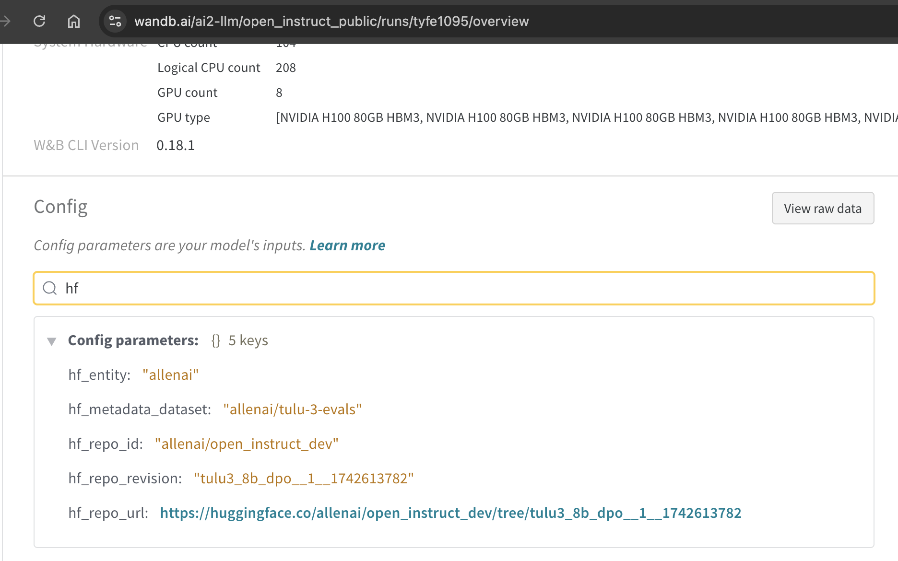
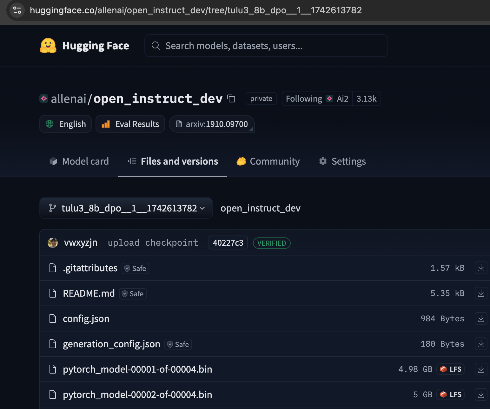
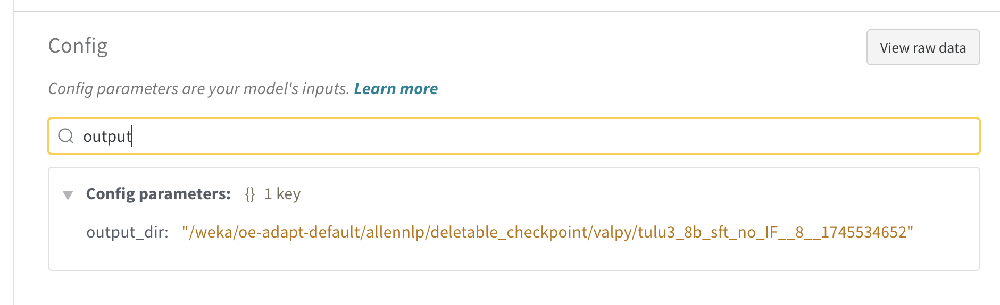

# Trained Model Location

When running our training scripts, the model will get uploaded to several places when applicable for redundancy, depending on the cluster environment:

* Hugging Face
* Google Cloud Storage
* Ai2's internal beaker dataset
* Local storage


## Hugging Face

Let's use [https://wandb.ai/ai2-llm/open_instruct_public/runs/tyfe1095](https://wandb.ai/ai2-llm/open_instruct_public/runs/tyfe1095) as an example. If you go to its wandb's Overview page -> config -> search for `hf`, then you can find this `hf_repo_url`.




To download, notice the `run_name` for this run is `tulu3_8b_dpo__1__1742613782`. So you can use the following command to download the model:

```bash
exp_name=tulu3_8b_dpo__1__1742613782
# first download the model
huggingface-cli download --revision $exp_name allenai/open_instruct_dev
# get the cache directory
exp_cache_dir=$(huggingface-cli download --revision $exp_name allenai/open_instruct_dev)
ls $exp_cache_dir
```
```
Downloading 'config.json' to '/weka/oe-adapt-default/allennlp/.cache/hub/models--allenai--open_instruct_dev/blobs/c0ed34722856586c3fa9ccb27bd52fb8e1d759a1.incomplete'
config.json: 100%|████████████████████████████████████████████████████████████| 984/984 [00:00<00:00, 5.84MB/s]
Download complete. Moving file to /weka/oe-adapt-default/allennlp/.cache/hub/models--allenai--open_instruct_dev/blobs/c0ed34722856586c3fa9ccb27bd52fb8e1d759a1
Downloading 'pytorch_model-00001-of-00004.bin' to '/weka/oe-adapt-default/allennlp/.cache/hub/models--allenai--open_instruct_dev/blobs/9da6b1637575b207617b84e84a5a974e8ee2a9fab55bd7e0343d6edf2a9f9f28.incomplete'
pytorch_model-00001-of-00004.bin: 100%|███████████████████████████████████▉| 4.98G/4.98G [00:07<00:00, 662MB/s]
Download complete. Moving file to /weka/oe-adapt-default/allennlp/.cache/hub/models--allenai--open_instruct_dev/blobs/9da6b1637575b207617b84e84a5a974e8ee2a9fab55bd7e0343d6edf2a9f9f28
Downloading 'pytorch_model-00002-of-00004.bin' to '/weka/oe-adapt-default/allennlp/.cache/hub/models--allenai--open_instruct_dev/blobs/667937dac38f3df4ffe7f5be637b54bed58c40b78c39550b639d12f6d57461b7.incomplete'
pytorch_model-00002-of-00004.bin: 100%|███████████████████████████████████▉| 5.00G/5.00G [00:07<00:00, 657MB/s]
Download complete. Moving file to /weka/oe-adapt-default/allennlp/.cache/hub/models--allenai--open_instruct_dev/blobs/667937dac38f3df4ffe7f5be637b54bed58c40b78c39550b639d12f6d57461b7
Downloading 'pytorch_model-00003-of-00004.bin' to '/weka/oe-adapt-default/allennlp/.cache/hub/models--allenai--open_instruct_dev/blobs/7d0471f489239e21a2063568974d4b118f294b5d1a381f306fe165729b6e88d3.incomplete'
pytorch_model-00003-of-00004.bin: 100%|███████████████████████████████████▉| 4.92G/4.92G [00:07<00:00, 678MB/s]
Download complete. Moving file to /weka/oe-adapt-default/allennlp/.cache/hub/models--allenai--open_instruct_dev/blobs/7d0471f489239e21a2063568974d4b118f294b5d1a381f306fe165729b6e88d3
Downloading 'pytorch_model-00004-of-00004.bin' to '/weka/oe-adapt-default/allennlp/.cache/hub/models--allenai--open_instruct_dev/blobs/ff53f644b12798a5e81c6c8072169a29b6a318a251d7d939687e2af333efe51e.incomplete'
pytorch_model-00004-of-00004.bin: 100%|███████████████████████████████████▉| 1.17G/1.17G [00:03<00:00, 337MB/s]
Download complete. Moving file to /weka/oe-adapt-default/allennlp/.cache/hub/models--allenai--open_instruct_dev/blobs/ff53f644b12798a5e81c6c8072169a29b6a318a251d7d939687e2af333efe51e
/weka/oe-adapt-default/allennlp/.cache/hub/models--allenai--open_instruct_dev/snapshots/40227c36fb1b5b714a71f9d635ead5a79c23507f
root@phobos-cs-aus-452:/weka/oe-adapt-default/costah/oi2/docs/algorithms/trained_model_location# # get the cache directory
root@phobos-cs-aus-452:/weka/oe-adapt-default/costah/oi2/docs/algorithms/trained_model_location# exp_cache_dir=$(huggingface-cli download --revision $exp_name allenai/open_instruct_dev)
root@phobos-cs-aus-452:/weka/oe-adapt-default/costah/oi2/docs/algorithms/trained_model_location# ls $exp_cache_dir
config.json                       pytorch_model-00003-of-00004.bin  special_tokens_map.json
generation_config.json            pytorch_model-00004-of-00004.bin  tokenizer_config.json
pytorch_model-00001-of-00004.bin  pytorch_model.bin.index.json      tokenizer.json
pytorch_model-00002-of-00004.bin  README.md
```

## Google Cloud Storage

Let's use [https://wandb.ai/ai2-llm/open_instruct_public/runs/tyfe1095](https://wandb.ai/ai2-llm/open_instruct_public/runs/tyfe1095) as an example. Because this run was conducted on the `ai2/augusta`, `mason.py` automatically appends `--gs_bucket_path gs://ai2-llm/post-training/` to the training args (for external users you can try doing the same append). Then, the model was automatically uploaded to

```
gs://ai2-llm/post-training//costah/output/tulu3_8b_dpo__1__1742613782
```


To download, you can run the following command:

```
gsutil -o "GSUtil:parallel_composite_upload_threshold=150M" \
    -o "GSUtil:parallel_thread_count=1" \
    -m \
    cp -r gs://ai2-llm/post-training//costah/output/tulu3_8b_dpo__1__1742613782 .
ls tulu3_8b_dpo__1__1742613782
```
```
root@phobos-cs-aus-452:/weka/oe-adapt-default/costah/oi2/tulu3_8b_dpo__1__1742613782# gsutil -o "GSUtil:parallel_composite_upload_threshold=150M" \
>     -o "GSUtil:parallel_thread_count=1" \
>     -m \
>     cp -r gs://ai2-llm/post-training//costah/output/tulu3_8b_dpo__1__1742613782 .
Copying gs://ai2-llm/post-training//costah/output/tulu3_8b_dpo__1__1742613782/config.json...
Copying gs://ai2-llm/post-training//costah/output/tulu3_8b_dpo__1__1742613782/generation_config.json...
Copying gs://ai2-llm/post-training//costah/output/tulu3_8b_dpo__1__1742613782/pytorch_model-00001-of-00004.bin...
Copying gs://ai2-llm/post-training//costah/output/tulu3_8b_dpo__1__1742613782/pytorch_model-00002-of-00004.bin...
Copying gs://ai2-llm/post-training//costah/output/tulu3_8b_dpo__1__1742613782/pytorch_model-00003-of-00004.bin...
Copying gs://ai2-llm/post-training//costah/output/tulu3_8b_dpo__1__1742613782/pytorch_model-00004-of-00004.bin...
Copying gs://ai2-llm/post-training//costah/output/tulu3_8b_dpo__1__1742613782/pytorch_model.bin.index.json...
Copying gs://ai2-llm/post-training//costah/output/tulu3_8b_dpo__1__1742613782/special_tokens_map.json...
Copying gs://ai2-llm/post-training//costah/output/tulu3_8b_dpo__1__1742613782/tokenizer.json...
Copying gs://ai2-llm/post-training//costah/output/tulu3_8b_dpo__1__1742613782/tokenizer_config.json...
Resuming download for ./tulu3_8b_dpo__1__1742613782/pytorch_model-00003-of-00004.bin component 0
Resuming download for ./tulu3_8b_dpo__1__1742613782/pytorch_model-00003-of-00004.bin component 1
Resuming download for ./tulu3_8b_dpo__1__1742613782/pytorch_model-00003-of-00004.bin component 2
Resuming download for ./tulu3_8b_dpo__1__1742613782/pytorch_model-00003-of-00004.bin component 3
| [10/10 files][ 15.0 GiB/ 15.0 GiB] 100% Done  52.1 MiB/s ETA 00:00:00
Operation completed over 10 objects/15.0 GiB.
root@phobos-cs-aus-452:/weka/oe-adapt-default/costah/oi2/tulu3_8b_dpo__1__1742613782# ls
tulu3_8b_dpo__1__1742613782
root@phobos-cs-aus-452:/weka/oe-adapt-default/costah/oi2/tulu3_8b_dpo__1__1742613782# ls tulu3_8b_dpo__1__1742613782
config.json                       pytorch_model-00003-of-00004.bin  tokenizer_config.json
generation_config.json            pytorch_model-00004-of-00004.bin  tokenizer.json
pytorch_model-00001-of-00004.bin  pytorch_model.bin.index.json
pytorch_model-00002-of-00004.bin  special_tokens_map.json
```


## Local storage / NFS

The local storage is quite ephemeral. Sometimes we try to assign an `output_dir` to a particular directory. For example, when launching with `mason.py`, we automatically overwrite the `output_dir` to be `/weka/oe-adapt-default/allennlp/deletable_checkpoint/$beaker_user/`. You can find the model in the following directory:





```
ls "/weka/oe-adapt-default/allennlp/deletable_checkpoint/valpy/tulu3_8b_sft_no_IF__8__1745534652"
config.json                       pytorch_model-00003-of-00004.bin  tokenizer_config.json
generation_config.json            pytorch_model-00004-of-00004.bin  tokenizer.json
pytorch_model-00001-of-00004.bin  pytorch_model.bin.index.json
pytorch_model-00002-of-00004.bin  special_tokens_map.json
```


## Beaker Dataset (Ai2's internal storage)

When possible, we try to upload the model to beaker dataset. You can find the model in corresponding beaker experiment by looking up `beaker_experiment_url` in the tracked wandb run.


You can download the model by running the following command:

```bash
exp_name=tulu3_8b_dpo__1__1742613782
dataset_id=01JPXXXKZPACGK5AZ1XSD5V54F
mkdir $exp_name
beaker dataset fetch "$dataset_id" -o $exp_name --concurrency 64
```
```
Downloading dataset 01JPXXXKZPACGK5AZ1XSD5V54F to tulu3_8b_dpo__1__1742613782
Files: 6          4 in progress ⠸
Bytes: 16.49 MiB  14.96 GiB in progress ⠸
```
