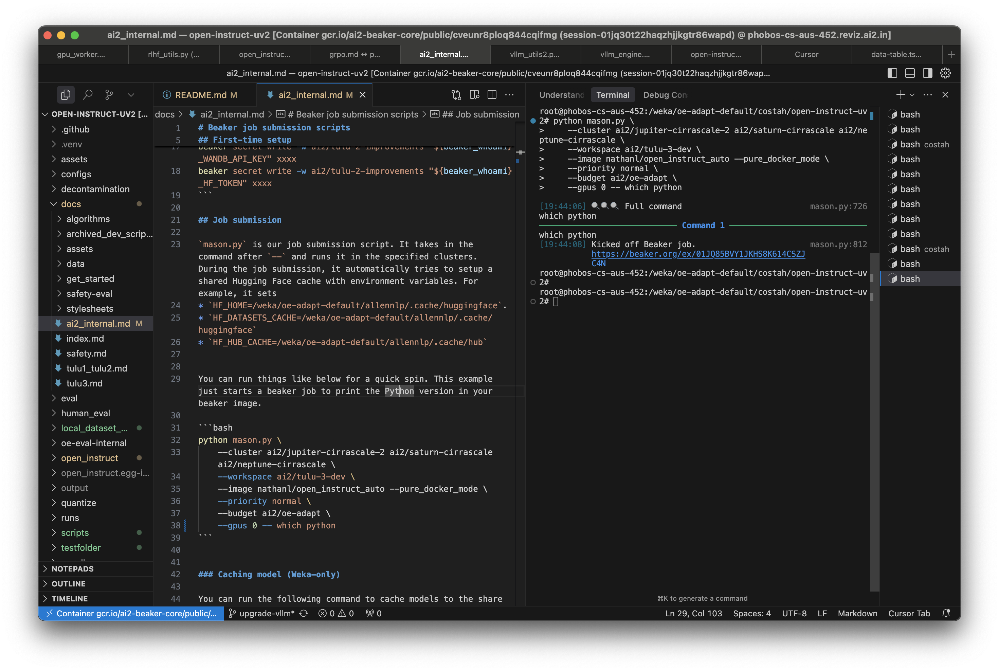
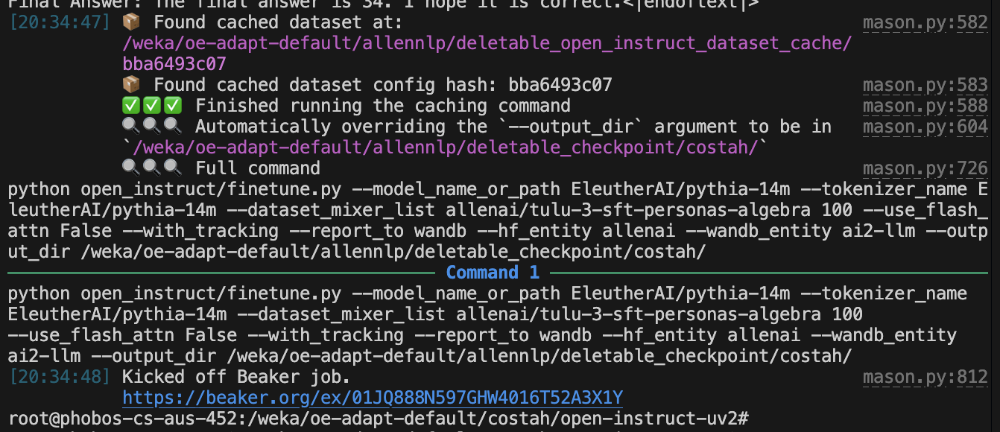
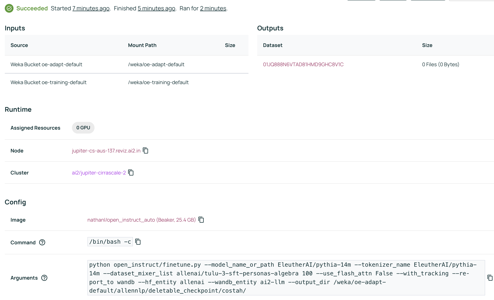
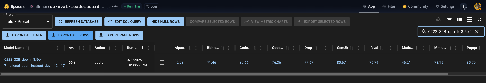

# Ai2 Internal Setup

This document details some best practices when working with our cluster.

## (One-time setup) VScode + Weka setup

You should join the `#vscode-weka-dev-workflow` slack channel to setup your VScode to work with weka.

After following the instructions there, you should end up with a VScode / Cursor setup that looks like this:

- Your terminal has direct access to the weka filesystem.
- You can run `beaker` commands from the terminal.
- You can edit files in the weka filesystem.
- You can run python scripts with the pyenv / uv environment.




## (One-time setup) Setup API keys

You need to first obtain API key or tokens from the following website:

* `BEAKER_TOKEN`: [https://beaker.org/user](https://beaker.org/user)
* `WANDB_API_KEY`: [https://wandb.ai/authorize](https://wandb.ai/authorize)
* `HF_TOKEN`: [https://huggingface.co/settings/tokens](https://huggingface.co/settings/tokens)

Then you need to write them in beaker secret as follows (replace the `xxxx` with your own API key or token)
```bash
beaker_whoami=$(beaker account whoami --format json | jq -r '.[0].name')
beaker secret write -w ai2/tulu-2-improvements "${beaker_whoami}_BEAKER_TOKEN" xxxx
beaker secret write -w ai2/tulu-2-improvements "${beaker_whoami}_WANDB_API_KEY" xxxx
beaker secret write -w ai2/tulu-2-improvements "${beaker_whoami}_HF_TOKEN" xxxx
beaker secret write -w ai2/tulu-3-dev "${beaker_whoami}_BEAKER_TOKEN" xxxx
beaker secret write -w ai2/tulu-3-dev "${beaker_whoami}_WANDB_API_KEY" xxxx
beaker secret write -w ai2/tulu-3-dev "${beaker_whoami}_HF_TOKEN" xxxx
```


## mason.py (for job submission)

`mason.py` is our job submission script. It basically takes your command and runs it in the specified clusters.

For example, let's say you have a training job like this:

```bash
python open_instruct/finetune.py \
    --model_name_or_path EleutherAI/pythia-14m \
    --tokenizer_name EleutherAI/pythia-14m \
    --dataset_mixer_list allenai/tulu-3-sft-personas-algebra 100 \
    --use_flash_attn False \
    --with_tracking --report_to wandb
```

You can take your command above and run it on the weka cluster with the following command (use `--` to separate the mason command from the python command):

```bash
python mason.py \
    --cluster ai2/jupiter ai2/saturn ai2/neptune \
    --workspace ai2/tulu-3-dev \
    --image nathanl/open_instruct_auto --pure_docker_mode \
    --priority normal \
    --budget ai2/oe-adapt \
    --gpus 0 -- python open_instruct/finetune.py \
    --model_name_or_path EleutherAI/pythia-14m \
    --tokenizer_name EleutherAI/pythia-14m \
    --dataset_mixer_list allenai/tulu-3-sft-personas-algebra 100 \
    --use_flash_attn False \
    --with_tracking --report_to wandb
```







`mason.py` does a few things:

**Auto set HF cache environment variables:**

During the job submission, it automatically tries to setup a shared Hugging Face cache with environment variables. For example, it sets

* `HF_HOME=/weka/oe-adapt-default/allennlp/.cache/huggingface`.
* `HF_DATASETS_CACHE=/weka/oe-adapt-default/allennlp/.cache/huggingface`
* `HF_HUB_CACHE=/weka/oe-adapt-default/allennlp/.cache/hub`

**Auto set `--hf_entity` and `--wandb_entity` arguments:**

so during runtime we issue fewer HF API calls, which sometimes could fail due to rate limiting.

**Auto caching datasets:**

mason.py will auto call `--cache_dataset_only` for you, so you do the tokenization locally instead of in the jobs, which saves idle GPU time in the actual jobs.


**Auto upload to Google Cloud Storage:**

When submitting to the `ai2/augusta` cluster, mason will try to read your model and upload it to Google Cloud Storage and download it to the job (since the cluster does not have a reliable shared filesystem).


## update_command_args.py (for sweep, benchmark, etc.)

The [/scripts/train](/scripts/train) directory contains many examples on how to launch jobs with mason.py. Sometimes the commands can get long and hard to manage, so we wrote a script called [update_command_args.py](/update_command_args.py) that can be used to add or update arguments in a shell script. For example,

```bash
python update_command_args.py scripts/train/tulu3/grpo_fast_8b.sh \
    --cluster ai2/augusta \
    --priority normal \
    --image costah/open_instruct_dev0320_11  --non_stop_penalty False | uv run bash
```

This will update the `--cluster`, `--priority`, `--image`, and `--non_stop_penalty` arguments in the script with the ones specified, making it easier to launch jobs with different configurations.


As another example, you can run something like this for a learning rate search:

```bash
for lr in 1e-6 1e-5 1e-4; do
    python update_command_args.py scripts/train/tulu3/grpo_fast_8b.sh \
        --exp_name grpo_fast_8b_lr_${lr} \
        --learning_rate $lr \
        --image costah/open_instruct_dev0320_11 --non_stop_penalty False | uv run bash
done
```

We also have a script called [scripts/train/benchmark.sh](/scripts/train/benchmark.sh) that keeps track of all the commands used to launch jobs in our public [wandb project `ai2-llm/open_instruct_public`](https://wandb.ai/ai2-llm/open_instruct_public).


## Ai2 Internal Evaluation

We provide a script integrated with beaker for use internally at Ai2. There are couple of use cases.

*1.* Run evals against a public Hugging Face model. Basically you need to prefix the model name with `hf-` and provide the location as the HF path (e.g. `meta-llama/Meta-Llama-3-8B-Instruct`).

```bash
for model in allenai/OLMoE-1B-7B-0125-Instruct allenai/OLMoE-1B-7B-0125-DPO allenai/OLMoE-1B-7B-0125-SFT allenai/OLMoE-1B-7B-0924-SFT allenai/OLMoE-1B-7B-0924-Instruct; do
python scripts/submit_eval_jobs.py \
    --model_name hf-$model \
    --cluster ai2/jupiter ai2/neptune ai2/saturn ai2/ceres  \
    --priority high \
    --location $model \
    --is_tuned \
    --workspace "tulu-3-results" \
    --priority high \
    --preemptible \
    --use_hf_tokenizer_template \
    --run_oe_eval_experiments \
    --evaluate_on_weka \
    --skip_oi_evals
done
```


*2.* Run evals against a model hosted on Beaker dataset. If it's a training run, you should try matching the `exp_name` and `run_id` with the training run.


```bash
model_name=0222_32B_dpo_lr_8.5e-7__allenai_open_instruct_dev__42__1741225304
url=https://wandb.ai/ai2-llm/open_instruct_internal/runs/7afq8x28
location=01JNMHSM8DDSFB3GJDBM5MP6J8
python scripts/submit_eval_jobs.py \
    --model_name $model_name \
    --cluster ai2/jupiter ai2/neptune ai2/saturn ai2/ceres  \
    --priority high \
    --location $location \
    --is_tuned \
    --workspace "tulu-3-results" \
    --preemptible \
    --use_hf_tokenizer_template \
    --run_oe_eval_experiments \
    --skip_oi_evals \
    --run_id $url
```

This will later show up in the [internal leaderboard](https://huggingface.co/spaces/allenai/oe-eval-leaderboard).




*3.* Run evals against a model hosted on weka.

```bash
python scripts/submit_eval_jobs.py \
    --model_name test_no_hf_upload \
    --location /weka/oe-adapt-default/costah/models/0129_grpo_math_kl_fix_zs_0.0_16_half-m_461_checkpoints/step_640 \
    --cluster ai2/saturn ai2/neptune \
    --is_tuned \
    --workspace "tulu-3-results" \
    --priority high \
    --preemptible \
    --use_hf_tokenizer_template \
    --beaker_image "nathanl/open_instruct_auto" \
    --run_oe_eval_experiments \
    --evaluate_on_weka \
    --oe_eval_tasks gsm8k::tulu,minerva_math::tulu \
    --run_id https://wandb.ai/ai2-llm/open_instruct_internal/runs/swf79vby \
    --skip_oi_evals \
    --oe_eval_max_length 8096
```


*4.* Run evals against a model on Google Cloud Storage.

```bash
python scripts/submit_eval_jobs.py \
    --model_name test_gs_location \
    --location gs://ai2-llm/post-training/allenai/Llama-3.1-Tulu-3.1-8B \
    --cluster ai2/augusta \
    --is_tuned \
    --workspace tulu-3-results \
    --preemptible \
    --use_hf_tokenizer_template \
    --beaker_image nathanl/open_instruct_auto \
    --oe_eval_tasks gsm8k::tulu \
    --skip_oi_evals \
    --gpu_multiplier 2 \
    --run_oe_eval_experiments
```


## Running with gantry

You can also run with gantry, if you want to test changes.
**Important**: Before you run any command with gantry, make sure you *commit and push*, since gantry will attempt to clone the repo with your local latest commit hash.

See the "One-Time Setup" section below before running commands. To test your setup, run the following command -- if this job succeeds, then you're ready to run evaluations with gantry.

```bash
gantry run --workspace {workspace} --budget ai2/oe-adapt --beaker-image kavelr/oe-safety --venv base --cluster ai2/jupiter --env-secret OPENAI_API_KEY=openai_api_key --env-secret HF_TOKEN=hf_token -- python -c 'print("Hello world")'
```

You can freely add any additional arguments to give to Beaker, such as a `--priority` tag which can be set to preemptible, normal, high, or urgent. AI2 policies may restrict the priorities that are available to users on certain clusters.

In the examples below, text within {} tags should be replaced with your own values.

As a convenience, you can use the `evaluation/gantry_run.sh` script which includes some necessary arguments. You can use it the same way as `gantry run`, but excluding these boilerplate arguments (take a look at the script to see what it includes). Example usage:

```bash
PYTHONPATH=safety-eval ./evaluation/gantry_run.sh --workspace {workspace} --cluster {cluster} --gpus {n_gpus} \
    --priority {priority} -- python evaluation/run_all_generation_benchmarks.py \
    --model_name_or_path allenai/tulu-2-dpo-7b \
    --model_input_template_path_or_name tulu2 \
    --report_output_path /results/metrics.json
```

### Extra Beaker Commands
Here is an example using the full `gantry run` command. Use the beaker image `seungjuh/oe-safety-support-olmo17`

**Important**: Please include all the beaker arguments exactly as in the examples unless intentionally modifying some configuration. Many of them are necessary to avoid job failures, such as `--beaker-image`, `--venv`, and `--env-secret`. Note that `openai_api_key` and `hf_token` are Beaker workspace secret names, so should *not* be replaced with actual values (see One-Time Setup).

Note that the `--` divides the gantry command from the evaluation command - you can edit the second part to run whatever eval suite you want from the `eval.py` script. Any additional Beaker arguments such as a dataset mount to use a model from a Beaker dataset or adding a priority tag can be added before the `--`.

You can also run all generator evaluations parallelized across the GPUs allocated to your batch job, like so:
```bash
gantry run --workspace {your_workspace} --cluster {cluster} --gpus {n_gpus} \
    --name {beaker_experiment_name} --task-name {beaker_task_name} --beaker-image seungjuh/oe-safety-support-olmo17 --venv base \
    --env-secret OPENAI_API_KEY=openai_api_key \
    --env-secret HF_TOKEN=hf_token \
    --budget {budget} -- python evaluation/run_all_generation_benchmarks.py \
    --model_name_or_path allenai/tulu-2-dpo-7b \
    --model_input_template_path_or_name tulu2 \
    --report_output_path /results/metrics.json --save_individual_results_path /results/all.json
```

Because the `--report_output_path` argument is set to `/results/metrics.json`, the output will automatically get logged to Beaker metrics in the experiment page ([example](https://beaker.org/ex/01HW8NKZ458MA1PSB1X4YQTH94/tasks/01HW8NKZ4DTDA8FEFDGWA7Q8XX/job/01HW8NM2QR5AYB53PYP32J2VAA)).


### Common Gotchas

If you're experiencing job failures, here are some things to check:

- Make sure your local changes are committed,  pushed, and up to date with the remote
- Make sure you have `--beaker-image seungjuh/oe-safety-support-olmo17` and `--venv base` in your `gantry run` command
- Check your GitHub personal access token is authorized to access the allenai organization
- Make sure the openai_api_key and hf_token secrets exist in your Beaker workspace
