# Async queues, capacity, and discarded work

The target is continuous useful generation and training. This requires matching
rates, not an unlimited queue: if generation is persistently slower the trainer
waits; if it is faster, bounded storage eventually pauses submission. A larger
buffer absorbs bursts but does not fix a sustained rate mismatch. Publication
still pauses the inference fleet; checkpoint/evaluation lifecycle drains are
separate costs. Queue selection remains FIFO.

## Where work waits

```mermaid
flowchart LR
    D[Prompt source and retry ledger] --> P[Producer group tasks]
    P --> H[Global generation semaphore]
    H --> S[Router and engine waiting requests]
    S --> G[Engine prefill and decode]
    G --> R[Reward or judge and sibling completion]
    R --> Q[Completed-group FIFO]
    Q --> B[Assemble rollout collection]
    B --> T[Shard, score, and optimize]
    T --> W[Publish weights]
    W --> B
```



| Boundary | What limits it | What releases capacity |
|---|---|---|
| Prompt source → producer | `async_max_concurrent_samples`, rounded down to whole groups (at least one group) | With `rollout_submission_granularity="group"`, the entire generation-and-reward group must finish. `sample` backfills when individual sample tasks finish, while still delivering whole groups for training. |
| Producer → generation function | A **global** semaphore of `sglang_server_concurrency × engine_count` | Generation returns; per-sample reward work runs after releasing this semaphore. |
| Router → engine execution | Each engine's `sglang_max_running_requests`, token/state pools, scheduling and routing | Requests finish or the scheduler changes their running/waiting status. The configured request maximum is not a guarantee of actual running capacity. |
| Responses → completed group | All siblings and required rewards must finish | The group becomes eligible for the completed buffer. Judge services can have their own concurrency limits. |
| Completed group → FIFO | `floor(async_data_buffer_capacity_factor × rollout_batch_size)` **groups** | Training dequeues a group or a stale group is discarded. |
| FIFO → collection | `rollout_batch_size` eligible whole groups | The collection is assembled, then converted/sharded for the trainer. There is no separate deep queue of already assembled trainer batches in this driver. |
| Collection → optimizer | `global_batch_size`, plus trainer topology and microbatching | Optimizer steps complete. A collection can contain multiple optimizer batches where the selected mode allows it. Refresh currently requires one. |

A full completed buffer blocks the producer's insertion of a completion and hence
new submissions. Other requests already submitted can still finish. Completed
results can therefore also reside in producer tasks waiting to be inserted: the
FIFO's reported capacity is not a bound on all resident response data. Lifecycle
drains temporarily reserve additional space for already-owned completions.

The refresh trial's explicit limit of 32 meant **eight producer groups × four
responses**. It was a small qualification setting, not a universal capacity or a
training-queue limit. Two engines with server concurrency 8 gave 16 HTTP slots;
the completed FIFO held four groups/16 responses with buffer factor 1. The engine
logs further capped running requests to five per engine for that trial's state
pool. Neither allocating more nodes nor increasing only the FIFO changes those
other limits.

## Structured defaults and overrides

For structured async run files, omission of `async_max_concurrent_samples` now
resolves at compile time to:

```
engines = inference GPUs / GPUs per engine
requested_slots = engines × min(server concurrency, max running requests)
producer_samples = round_up_to_whole_group(max(collection_samples, 2 × requested_slots))
completed_buffer_groups = floor(buffer_factor × rollout_batch_size)
```

The two-wave producer budget is a starting heuristic to keep work available while
siblings finish or grading runs, not a throughput guarantee. It scales with engines,
including tensor parallelism, rather than physical node count. It does not change
model memory allocation, routing, group submission order, or the optimizer batch.
It is not a strict cap on every resident partial group under sample backfill.

The completed buffer retains the existing default factor **2**, tied to collection
size instead of inference node count. Increasing trainer GPU count alone does not
change either batch size or completed buffer size. A large inference fleet should
not silently generate a proportionally large backlog of aging completed samples.

```toml
[async]
fully_async = true
# Omit async_max_concurrent_samples to derive it from the requested engine fleet.
# An explicit value is preserved; e.g. async_max_concurrent_samples = 128.
async_data_buffer_capacity_factor = 2.0
rollout_submission_granularity = "group"
```

`plan` reports `runtime.async_capacity`; structured `validate` prints its warnings.
The async worker logs the resolved capacities and warnings again at startup.
Warnings cover a producer below requested usable fleet slots, an HTTP gate below
engine capacity, group rounding, a buffer smaller than a collection, and a buffer
spanning more optimizer batches than the configured age budget can reasonably
cover. Invalid nonpositive producer limits or a buffer holding zero groups fail
validation. Low-level `[core]/[miles]` callers keep native defaults unless explicit;
the same capacity report diagnoses their resolved values at worker startup.

Static planning cannot establish model fit, actual KDA-state capacity, effective
router balance, judge throughput, or response latency. Inspect engine startup
limits and measured waits alongside the report. Useful sizing after a warm run is
roughly desired samples/second × mean generation-and-reward latency, with room for
variance; complete-group stragglers and lag filtering still matter.

## W&B: completed-queue drops versus useful delivery

The existing rollout logger forwards these metrics to W&B when tracking is enabled.
The namespace is `rollout/fully_async/completed_queue/`:

| Metric suffix | Meaning |
|---|---|
| `dropped_samples`, `dropped_groups`, `dropped_response_tokens` | Completed work discarded by the queue's age filter during this reporting window. Retrying its prompt does not recover that generation work. |
| `delivered_samples`, `delivered_groups`, `delivered_response_tokens` | Eligible work handed out by the queue, before any later collection filter or training failure. |
| `dropped_samples_fraction`, `dropped_response_tokens_fraction` | Dropped / (dropped + delivered), with zero when no decisions occurred. The token fraction captures expensive long responses. |
| `dropped_samples_by_length/*`, `delivered_samples_by_length/*`, `dropped_samples_fraction_by_length/*` | Disjoint response-token bins: 0–255, 256–511, 512–1023, 1024–2047, 2048–4095, 4096–8191, 8192–16383, and 16384+. |
| `dropped_samples_by_age/*`, `delivered_samples_by_age/*`, `dropped_samples_fraction_by_age/*` | Age bins 0, 1, 2, 3, 4, 5–8, 9–16, 17+, and unknown. Age is the **group's oldest behavior version** relative to the version supplied at dequeue, matching the queue's rejection decision. |
| `consumer_wait_seconds` | Time awaiting completed-buffer gets, including expiry filtering. This is a consumer wait measurement, not engine compute time or full GPU utilization. |

Counts are windowed and bins are bounded, including explicit zero values. Lengths
are captured before retry resets sample fields. No full text or response tensors
are retained by this accounting. These metrics exclude put-time abort/dynamic
filters, interrupted requests, and shutdown leftovers; they specifically measure
completed-queue decisions. Existing aborted/rejected-group metrics remain separate.
The short qualification runs had W&B disabled; these are newly added measurements,
not retrospectively available W&B series for those runs.

Keep discard fractions near zero while reducing consumer wait. Use the per-length
fractions, not just raw drop counts, to detect disproportionate loss of long work.
Do not divide tokens by idle seconds and call it efficiency: the units and async
overlap differ. Trainer wait, discard fraction, useful throughput, and publication
seconds should be inspected together. Mixed-policy refresh improves suffix age;
it does not erase the historical prefix's age for the current conservative filter.
