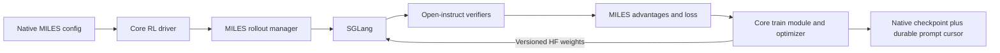

# MILES with an OLMo-core trainer

MILES + OLMo-core is the preferred path for supported models/workloads in this project. Start at the [operating guide](index.md). This page retains detailed implementation contracts and bounded qualification records; it is not a claim of universal GRPO replacement or production qualification.

MILES owns rollout scheduling, SGLang serving, behavior log probabilities, advantage construction, policy loss, and evaluation dispatch. `open_instruct.miles` connects that runtime to Core's model, backward synchronization, optimizer, and distributed checkpoint APIs. No Megatron or MILES FSDP trainer is selected by this entrypoint. Shared MILES argument and transport helpers are reused.


MILES placement options pass through the adapter: disaggregated trainers and
rollout engines are supported, and resident colocation has passed tiny-model
tests. Core trainer offload is rejected. The tested olmo-miles colocated recipe
also keeps its trainer resident while offloading rollout memory, so trainer
offload is not a prerequisite for that arrangement. Full SFT model colocation
still needs its own memory and lifecycle qualification here; the successful
SFT trial used two dedicated Core GPUs and one dedicated SGLang GPU.



For the published dense Think-DPO checkpoint, see
[Olmo 3 preparation and qualification](olmo3-pre-rl.md). The standard
Core adapter now supports its per-layer YaRN setup; the two-GPU 7B smoke and audit passed with zero-advantage batches;
nonzero-gradient full-model learning and optimizer resume remain unqualified.

## Reproduce the sources

The lock in `runtime/miles/runtime.lock.json` records exact bases and patch hashes. The original adapter started at Jacob's **`jacobm/moe-v2-core-gdn2`**, `169b8f9d06bce0276143876c82f630af483b03b7`. The current adapter is ported onto **`codex/small-hero-hf-20260909`**, base `b1fd2c9746e88baeb20e372bdca340d788d0f7e5`, preserving the earlier KDA/latent model support. MILES starts at `dbbab1566ae438f7202fff653eae938e07b1d4b6`. The Core patch adds an arbitrary-objective gradient lifecycle, explicit replay across backward recomputation, HF model construction using the branch's existing KDA and latent-MoE components, and dense-model HF conversion support. KDA/latent tensor conversion is provided by the Core lineage. The MILES patch includes the existing olmo-miles compatibility patches plus the explicit Core backend and lifecycle hooks.

```bash
python scripts/miles/prepare_runtime.py runtime/miles/sources
```

For offline development, append `--cache olmo-core=/path/to/OLMo-core --cache miles=/path/to/miles`. The script verifies patches, checks out the exact base, and applies them to new directories. It refuses to replace an existing directory. The reconstructed Core source is also used by the repository type checker; regular SFT/DPO package pins are unchanged.

The runtime is a separate source overlay on the image recorded in the lock. Load that Beaker image into Docker, then:

```bash
python scripts/miles/build_image.py --base-image YOUR_LOCAL_BASE_TAG --tag open-instruct:miles-core
```

The builder verifies the base image's immutable Docker ID. It fetches Core/MILES at the pinned revisions and applies checksum-verified patches inside the image. The image's own sources are used at runtime; sibling development worktrees are unnecessary. The base still contains historical Megatron packages; Core operation has also been checked with Megatron imports deliberately unavailable. Removing unused packages is a separate image-size task.

## Configure and run

For an inventory against our customized olmo-miles stack and bounded starting
configurations, see [Core run starters](../../configs/miles/README.md) and
[feature parity](feature-parity.md). The [project state](measurements/project-state.md)
identifies the canonical working branches and disposition of older worktrees.
The profiles distinguish tiny resident development and full-SFT EP2 synchronous
and bounded-async training. Admission-64 sync/async trials passed; longer combined
async/replay/restart and full-model colocation still need qualification.

`configs/miles/dense.toml` is an example with explicit mounted input/output paths. `configs/miles/prompts.jsonl` and `verifiers.json` show the prepared-data and mixed-verifier contracts. The reward registry is trusted run configuration. Samples select registered verifier names, targets, and weights, and cannot name arbitrary import paths.

```bash
python -m open_instruct.miles plan configs/miles/dense.toml
# In the Core RL image, with actual mounted data/model paths:
python -m open_instruct.miles validate /data/run.toml
python -m open_instruct.miles train /data/run.toml
```

`plan` is CPU-safe and only compiles configuration. `validate` invokes the pinned MILES parser; it does not prove model compatibility or serving readiness. `train` selects Core exclusively. MILES optimizer and loss flags keep MILES semantics. There is no legacy GRPO argument translator.

The implementation uses microbatch size one with gradient accumulation; optional [sequence packing](sequence-packing.md) combines document-isolated samples within each optimizer partition. `global_batch_size` must be a multiple of the trainer world size, and each collection must contain complete optimizer batches. `core.max_policy_lag` counts **optimizer steps**, including later steps in a multi-step collection. A collection containing N optimizer batches needs at least N−1 lag budget. The default zero is suitable for a synchronous one-step collection.

Async mode additionally requires `fully_async=true`, a positive lag budget, resident disaggregated rollout engines, and publication after each collection. Groups must carry complete, homogeneous behavior-policy versions. The buffer reserves enough lag for all optimizer steps in the collection, and the actor checks again at consumption.

Rollout routing replay requires both `use_rollout_routing_replay=true` and
`use_miles_router=true` in this pinned runtime. The SGLang router otherwise
strips expert-ID requests; an actual trial failed before an optimizer update
with missing routes, and configuration now rejects that combination early.
This is separate from Megatron's `use_routing_replay` flag, which Core rejects.
Tiny live replay with restart and full-model EP2 synchronous replay have passed.
The latter completed eight updates and 512 samples with exact expert IDs through
recomputation. Final-token auxiliary equivalence and combined async/replay/restart
remain outside that qualification.

The [additional datasource trials](feature-parity.md#additional-datasource-trials)
use pinned math and legacy IF datasets with the same SFT model and an independent
reward audit. They have their own committed-image debug launcher; ordinary
`train` configs can also consume prepared rows and trusted verifier registries.

## Checkpoints and publication

New checkpoints use schema 2 and persist both world size and expert-parallel
degree. Restore validates them, model configuration, cursor integrity and
rank-local state reads before any native checkpoint-loading collective. Legacy
schema-1 checkpoints are accepted only for single-rank EP1; multi-rank legacy
manifests need an explicit migration based on the original launch configuration.
Automatic inference or topology changes during resume are not supported.
The [topology follow-up](measurements/core-checkpoint-topology-20260910.json)
passed 31 targeted tests, including three native GPU exact-next-update restore
comparisons.


HF is the serving interchange format. SGLang starts from an HF checkpoint directory containing the model config, tokenizer, and weights; olmo-sglang maps those weights into its fused inference layout. The training model is native Core. The adapter can initialize it from the same HF checkpoint, and publishes subsequent policy updates directly as HF-named tensors. A Core-origin model therefore follows `Core checkpoint → HF export → SGLang`; it does not need a Megatron checkpoint or a Megatron conversion step. Updating the policy does not require saving and reloading an HF directory at each step.

HF format alone does not establish model support: the config, tensor mapping, and olmo-sglang implementation must agree on KDA, latent projections, gates, and normalization. Native Core checkpoints remain the resume format because they contain optimizer state that an HF serving export does not carry.

Core checkpoints contain native model/optimizer state, scheduler and per-rank RNG state. MILES persists its data cursor and, for async runs, pristine outstanding prompt groups. `complete.json` and `core-latest.json` are written only after both sides are complete; the manifest hashes the cursor. Resume uses `miles.load` pointing to the checkpoint root and resolves the next rollout before constructing the manager. It currently requires the same trainer world size and model configuration. Interrupted checkpoint directories are preserved under `.incomplete-*` names before retrying that rollout. Generated async responses are regenerated after restart; serving RNG and bitwise-identical future rollouts are not promised.

The pinned image also needs the existing olmo-miles FLA 0.5.2/Triton compatibility shim for KDA; the adapter installs it in each hybrid trainer process. That shim requires one KDA head width per process. Tiny hybrid test models use eight KDA heads to keep native DDP parameter offsets aligned for grouped matmul.

Publication pauses generation, transfers weights, commits the optimizer-step version, and resumes generation. Dense conversion gathers one parameter at a time. MoE conversion streams on the model device through Core's canonical HF converter. It retains the current expert slabs and output bucket, without staging a complete CPU model replica. Disaggregated publication uses one flattened NCCL broadcast per bucket. `core.stream_moe_export=false` and `core.weight_sync_mode="per_tensor"` select the baseline for comparisons. `publication.jsonl` records phase timings and tensor/byte/bucket counts when `miles.save` is set, even without an optimizer checkpoint interval. The bounded full SFT run measured this path; broader topology, memory and throughput qualification remain. HF evaluation exports include the tokenizer and MILES completion marker.

## Local MoE task and restart check

`tests/miles/local_moe.py` exercises real GSM8K verification, SGLang sampling,
MILES advantages/loss, native Core MoE updates, publication, and restart on one
24 GB RTX 4090. The trained local fixture is
`~/proj/OLMo-core/runs/local-4090-moe/step1090`: 32,447,104 parameters, two layers,
eight experts, top two routing, conventional attention. Its older checkpoint
stores flat FP32 optimizer master parameters. Preparation reads those parameters,
exports BF16 HF weights, checks an exact BF16 roundtrip, and compares native/HF
logits (observed cosine 0.9999961). The source checkpoint is read-only.

Inside the built image, with checkpoint, GPT2 tokenizer, cached public RLVR GSM8K
parquet, and a writable output directory mounted:

```bash
python tests/miles/local_moe.py prepare /validation/local-moe \
  --source /source/step1090 --tokenizer /tokenizer --dataset /data/train.parquet
python tests/miles/local_moe.py run /validation/local-moe
python tests/miles/local_moe.py run /validation/local-moe --resume
python tests/miles/local_moe.py audit /validation/local-moe
```

For a self-contained trial without a trained checkpoint, replace `prepare` with
`bootstrap /validation/public-toy-moe`. Bootstrap initializes a smaller random
conventional MoE and downloads pinned public GPT2 tokenizer and GSM8K revisions.
Use that output path for the subsequent commands. This needs network access only
for bootstrap. Run and audit can execute offline. GPU Docker requires the NVIDIA
container toolkit or explicit device/driver-library mounts on this host.

The task slice strips reference assistant solutions and uses a simple completion
prompt ending in `Answer:`; it is not the production chat template. Four responses
per prompt are scored by the actual `GSM8KVerifier`. Two fresh iterations and one
iteration after restart produced 12 responses under versions 0, 1, and 2. Audit
independently recomputes rewards, checks finite log probabilities, verifies the
prompt cursor and versions, and checks native master parameters changed. All
observed task rewards were zero: policy advantages were zero, and MoE auxiliary
losses drove the updates. This proves lifecycle plumbing, not learning quality.

The image now includes the verifier's missing Python dependencies and validates
positive/negative GSM8K answers during build. Live MoE export must recognize
Core's `MultiGroupDDP` wrapper; runtime regression tests exercise that path.

A bounded public-input Beaker trial uses the required committed-image wrapper:

```bash
MILES_BASE_IMAGE=olmo-miles:gate-01m24e7msdgn2qfw1t8z31bcks \
  ./scripts/train/build_image_and_launch.sh --miles scripts/train/debug/miles_core_moe.sh
```

It requests one Holmes GPU, a positive 15-minute allocation window, a 20-minute
timeout, and saves restart/audit evidence under `/output`. Saving is enabled here
because native restart is the acceptance objective. The launcher uses Beaker's
CLI schema because the installed mason SDK lacks `minRuntime`. It generates
fresh random weights in the allocation and fetches public task data; no local
trained model is uploaded. It does not run the repository GPU pytest script and
must not be cited as `GPU_TESTS=` evidence. The previous olmo-miles lessons applied
here are a pinned compiled runtime, baked source overlay, local preflight,
bounded workload, explicit allocation window, and checking artifacts after exit.
The first Jupiter attempt failed before training because its driver only supported
CUDA 12.8; this CUDA 13 image requires Holmes or another verified compatible
cluster. The command now checks CUDA before initialization. `NCCL_CUMEM_ENABLE=1`
is inherited by trainer and engines to avoid the allocator mismatch found in
olmo-miles. A two-GPU A/B trial uses
`scripts/train/debug/miles_core_moe_disaggregated.sh`: one trainer GPU and one
rollout GPU, baseline CPU export/per-tensor NCCL then streaming/flattened NCCL,
each with initial serving equality, two iterations, restart and an independent
audit. Its timeout is 25 minutes. This tiny-model comparison measures machinery
overhead; it is not evidence for production-model throughput.

The [two-GPU Holmes A/B trial](https://beaker.org/ex/01M251NYNKZ8D4SK3JBRH13PZF)
passed with exit code 0. Both arms completed two fresh optimizer steps, restored
in a separate process for step three, and passed independent audits of 12
responses, policy versions, task cursor continuation, and changed native weights.
All task rewards were zero; router auxiliary losses drove the updates. Across
three warm publications per arm, median publication time was 77.8 ms for the
CPU-staged/per-tensor baseline and 52.6 ms for streaming/flattened publication.
Median export/packing time was 15.2 ms versus 1.55 ms. The 49 HF tensors occupied
27.5 MB; flattening reduced transport collectives from 49 to one. Cold first
publications took 1.21–1.37 seconds including NCCL connection setup and are
excluded from those warm medians. This small sample does not establish a
production speedup. Audit artifacts and all timings are retained in
`docs/measurements/miles-core-local-20260910.json`.

## Validation and remaining acceptance work

Verified locally on an RTX 4090:

- 62 focused adapter and existing Core SFT/DPO tests, including four dense HF/Core logits comparisons and exact weight roundtrips, streamed conversion, masked tool-token handling, mixed rewards, and policy clocks.
- 13 Core-owned tests for KDA/latent factories and weight conversion, custom-objective accumulation, and router replay through backward recomputation.
- 15 pinned-runtime tests including real Core GPU optimizer updates and exact native checkpoint restores for Qwen3, KDA, and KDA+latent; MILES schedule equivalence; async prompt-cursor crash safety; and policy-group admission.
- A Ray/SGLang/Core smoke run completed two optimizer steps with published versions 0→1→2 and committed checkpoints. A fresh process resumed the cursor/model/optimizer/scheduler/RNG boundary and completed step 3 under version 2. Synthetic rewards test plumbing, not learning quality.
- `make style quality` passes after reconstructing the locked sources.

Repeat the runtime tests inside the built image:

```bash
python -m pytest tests/miles -q
PYTHONPATH=/opt/core-rl/tests/miles:$PYTHONPATH python tests/miles/smoke.py /tmp/core-smoke
PYTHONPATH=/opt/core-rl/tests/miles:$PYTHONPATH python tests/miles/smoke.py /tmp/core-smoke --resume
```

The Beaker smoke launcher uses the repository's required wrapper after committing:

```bash
MILES_BASE_IMAGE=YOUR_LOCAL_BASE_TAG ./scripts/train/build_image_and_launch.sh --miles scripts/train/debug/miles_core.sh
```

This is a training smoke run, not the repository GPU pytest job; its experiment ID must not be used as `GPU_TESTS=` in a PR.

The following remain required before deleting old GRPO code:

| Area | Current state / missing acceptance |
| --- | --- |
| Dense models | Tiny Llama, Qwen2, Qwen3, Olmo2 numerical parity; real training-scale model qualification remains |
| Conventional Olmo3Moe | Real local 32.45M MoE GSM8K lifecycle, initial serving-weight equality, native/HF parity, updates and separate-process restart verified; tiny EP2 training/publication/restart also passed on Beaker; larger-model qualification remains |
| KDA / latent Olmo Hybrid | Tiny KDA+latent model completed real SGLang/MILES/Core GSM8K iterations and separate-process restart; initial serving weights match and train/rollout mean logprob differences were 0.0023–0.0031; full SFT architecture passed two EP2 updates and a 64-response audit; full-model restart and longer-run qualification remain |
| Routing replay | Router/recompute gradients tested; serving route alignment, final unscored token's auxiliary loss, and full-model replay qualification remain |
| Tools / environments | Masks survive the adapter; the complete open-instruct multi-turn environment rollout bridge remains to be migrated |
| Mixed rewards | Existing verifier adapter tested with GSM8K; code/judge infrastructure, cleanup and complete registered-task coverage remain |
| Async | Producer lifecycle and durable ledger implemented; multi-GPU end-to-end endurance/failure qualification remains |
| Evaluation | MILES dispatch and HF export wired; full evaluation matrix remains |
| Parallelism | Dense FSDP and MoE EP paths constructed; multi-node qualification remains; TP/PP/CP rejected |
| Offload / packing | Trainer offload, dynamic packing and multi-sequence microbatches rejected |
| Recovery | Same-topology durable resume verified; automatic trainer-cell recovery and exact serving RNG replay unavailable |
| Performance | No throughput/memory acceptance claim; compare against the current olmo-miles Megatron baseline |

Additional local hybrid check:

```bash
python tests/miles/local_moe.py hybrid /validation/hybrid --fixture /validation/public-toy-moe
python tests/miles/local_moe.py run /validation/hybrid
python tests/miles/local_moe.py run /validation/hybrid --resume
python tests/miles/local_moe.py audit /validation/hybrid
```

The fixture caps total KV tokens at 4096 and concurrency at four, rather than
letting a tiny model size its cache from a large B300's available memory. For KDA,
it disables radix caching and caps recurrent state slots at 16. It also sets
`core.max_train_rollout_logprob_abs_diff=0.05`. The guard computes an active-token
mean across trainer ranks, excludes masked tool tokens, and rejects excessive
drift before any optimizer update. General runs leave this limit unset unless
configured, because intentionally stale async policies require a chosen drift
budget. Active-token non-finite log probabilities are always rejected.

For a matched export-only measurement, run
`python tests/miles/profile_export.py /path/to/hf /path/to/profile.json` in the
image. On the trained 32.45M toy model, ten alternating measured repetitions
(after warmup) gave median export/packing times 11.35 ms for CPU staging and
0.31 ms for streaming, with additional peak GPU allocation 31.8 MiB versus
2.25 MiB. This excludes transport and serving. The raw local evidence is in
`docs/measurements/miles-core-local-20260910.json`.

The first Holmes trial exposed a shutdown defect after successful distributed
training/publication: trainer teardown waited on the weight-update NCCL group
after its engine peers were gone. Cleanup now quiesces async production, retires
the weight group collectively while engines are alive, and then disposes engines
and trainers. Cleanup failures remain visible; a saved checkpoint does not turn
a failed shutdown into a passed trial.

The EP follow-up uses `scripts/train/debug/miles_core_moe_ep.sh` through the same
image wrapper. It requests three GPUs: two Core trainer ranks with EP=2 and one
SGLang engine. Both CPU-staged/per-tensor and streamed/flattened paths must pass
initial serving equality, two updates, restart, and the checkpoint audit. Its
[three-GPU trial](https://beaker.org/ex/01M2608GC3Z0VWC3R7J2X21RQ7)
passed both paths, including separate-process restart, independent response and
checkpoint audits, and clean teardown (exit 0). Median warm publication was
77.9 ms for the baseline and 63.0 ms for streaming, with three warm measurements
per arm. The source model was the random conventional toy MoE; this establishes
neither large-model throughput nor full-size hybrid EP correctness.

The full replacement is therefore unfinished. These are implementation or qualification gaps, not capabilities silently delegated to another trainer.

## Bounded SFT GSM8K trial

`scripts/train/debug/miles_core_sft_gsm8k.sh` launches the SFT step23607
`router-bf16-autocast-v2-hf` artifact already used by olmo-miles. It reads weights
from WEKA and uses the exact pinned chat template from that run's HF descriptor.
No Megatron training state is loaded. Two Core EP ranks and one dedicated SGLang
engine occupy three Holmes GPUs. The launcher bounds execution to 45 minutes
and requests a 30-minute allocation window at normal priority.

The workload is two updates, four prompts per update, four samples per prompt,
and 16 held-out questions before and after training (64 completions total).
Responses are capped at 4096 tokens inside a 6144-token context. These questions
are held out from this trial's updates, not certified absent from the source
model's SFT corpus. The 16-question comparison is a correctness check, not a
statistically useful learning claim. The audit reports mixed-reward groups,
accuracy, truncation, policy versions and publication timings; scores are
independently recomputed using open-instruct's GSM8K verifier.

Initial serving-weight comparison and the 0.05 mean train/rollout logprob drift
guard remain enabled. The script saves responses and diagnostics under a fresh
experiment-specific WEKA directory; it does not save optimizer checkpoints.
Only compact reports are copied to the Beaker result. The full checkpoint passed
this bounded EP2 run; longer training and full-model restart remain unqualified. This uses disaggregated placement because Core trainer offload is not
implemented; tiny resident colocation does not establish large-model offload.

```bash
MILES_BASE_IMAGE=olmo-miles:gate-01m24e7msdgn2qfw1t8z31bcks \
  ./scripts/train/build_image_and_launch.sh --miles scripts/train/debug/miles_core_sft_gsm8k.sh
```

The first full SFT attempt,
[01M261NF9E9GG112TBCQRY7TMK](https://beaker.org/ex/01M261NF9E9GG112TBCQRY7TMK),
passed initial weight equality and scored 13/16 before training (two truncated
answers). The first training batch scored 15/16, with one mixed-reward group.
It failed before an update because FA2's entrypoint is absent from the pinned
FA4 runtime. The SFT recipe now selects Core's FA4 backend and runs a small
forward/backward numerical preflight before loading the large model. The
preflight can be exercised on the workstation with `--backend torch`; actual
FA4 execution requires Blackwell.

Append `--decode-graphs` to the SFT launch wrapper command to enable decode
CUDA graphs capped at batch size four, with prefill graphs explicitly disabled. The initial eager baseline took 510 s
for held-out generation and 342 s for its first rollout, while the complete
37.0 GB initial weight publication took 3.48 s (0.32 s export/packing). These
are phase measurements from a failed training attempt, not a completed run
or a matched throughput comparison.

The generic Core configuration defaults to the portable Torch SDPA backend.
The B300 example and SFT trial explicitly select FA4; the compiled image does
not provide the FA2 API.


The corrected decode-only run,
[01M26438K8S3YHK7FDKYH46035](https://beaker.org/ex/01M26438K8S3YHK7FDKYH46035),
exited successfully after about 21.5 minutes. Both Core EP ranks completed two
optimizer updates. The audit independently checked all 64 completions, rewards,
and policy versions, including four mixed-reward training groups. Initial
serving weights matched exactly; active-token mean Core/SGLang logprob differences
were 0.02127 and 0.02128, below the configured 0.05 guard. Held-out accuracy was
14/16 before and 15/16 after; this sample does not establish learning quality.
Each held-out pass had one response reach the 4096-token cap.

Updated 37.0 GB weight publications took 3.82 and 3.83 seconds, with only
0.33 and 0.32 seconds spent exporting/packing. Each used 35 flattened NCCL
collectives. Training rollout generation took 34.5 and 53.6 seconds, reporting
685 and 802 response tokens per serving GPU per second. These are measurements
from this bounded run; the earlier eager attempt is not a matched benchmark.
Cold model initialization and kernel compilation remain substantial costs.
The source commit, arguments, checkpoint identity, full audit and phase metrics
are recorded in `docs/measurements/miles-core-sft-20260910.json`.

## Training contract checks

`python scripts/miles/check_contract.py OUTPUT` runs the contract suite inside
our pinned image and writes `contract.json`, JUnit XML and the complete test log.
The JSON includes source hashes, runtime versions and numerical measurements.
It uses random fixtures and does not download or expose trained checkpoints.

The independent policy reference explicitly indexes next-token logits and
computes clipped PPO terms without calling MILES' slicing, loss or reduction
helpers. Unequal response lengths, interior masked tokens, both advantage
signs, clipping, entropy and reference KL are exercised. The real MILES loss
and Core custom-objective hook are compared against it with microbatch sizes
1/2/4 and one/two real Gloo processes. FP32 tolerances are `atol=2e-7`,
`rtol=2e-6` for loss, gradients and AdamW updates. This establishes reduction
algebra, not native Core expert-parallel execution.

Auxiliary tests independently calculate per-sequence load balancing and router
z-loss. They compare gradient scaling under different microbatch/rank splits.
Router tests fix expert IDs and verify policy-only, auxiliary-only and combined
gradients, including activation recomputation. Native GPU tests compare the
next update after restoring a checkpoint with uninterrupted execution, requiring
exact model and optimizer state and identical scheduler/clock state for tiny
Qwen3, KDA and KDA+latent models.

For native EP, launch after committing through the normal image wrapper:

```bash
MILES_BASE_IMAGE=olmo-miles:gate-01m24e7msdgn2qfw1t8z31bcks \
  ./scripts/train/build_image_and_launch.sh --miles scripts/train/debug/miles_core_contract.sh
```

This uses two Holmes GPUs, a random tiny KDA+latent model and a fixed mixed-reward
batch. It compares Core EP1/EP2 with recomputation on/off, separately for policy,
auxiliary and combined objectives. Routes are recorded once from Core and reused;
this does not certify SGLang route capture. The comparison includes Adam first
and second moments as well as FP32 master parameters: first-step Adam parameter
updates alone can conceal uniform gradient-scaling errors. The declared BF16
screen is relative L2 error below 0.05 in each router/expert/dense state category.
This is a bounded numerical screen, not an exact-equality or full-model claim.
Only compact metrics are placed in Beaker results. Random input and state files
remain in the job's temporary directory.

Every real training step now records `training_contract_rankN.jsonl` beneath
`miles.save`, when supplied, and emits the same records to logs. Records include:

- Actual global sample, active-token and model-token counts; policy and auxiliary
  denominators; local accumulation count; response-versus-token reduction mode.
- Local normalized policy objective and weighted auxiliary terms separately.
  Averaging these local objectives across ranks gives the corresponding global
  objective; they are not already global metrics.
- Consumed/published policy versions, LR used/next, completed step and elapsed time.
- Globally reduced probability-error histograms, exact maximum, upper-bin estimates
  of p50/p95/p99, response-position thirds and response-length buckets. A null
  quantile upper bound means the overflow bin (>1.0), not missing observations.

`core.diagnostic_interval=N` additionally measures local gradient norms before
optimizer intake and sampled model updates every N optimizer steps. These are
explicitly not global optimizer norms: expert gradients may still need Core's
EP-MP rescaling, and FP8 stores outside `named_parameters` are outside coverage.
Update samples retain at most 256 values per named parameter, rather than cloning
the model. With `check_weight_update_equal=true`, the driver also checks serving
weights at publication boundaries whose rollout count is divisible by N
(and on initial publication). A fresh run compares its initial
publication against SGLang's original HF snapshot. Periodic and resumed checks
snapshot the **current** serving state, reset tensors, republish the same trainer
version, and compare exactly when quantization tolerance is disabled, over the
non-skipped tensors. This catches missing or inconsistent transfers;
it is not an independent proof of the export mapping for changed weights.
Logprob checks and the initial HF comparison supply separate evidence. The
round trip adds a second full transfer, with `repeated_version=true` in the
publication log; include both transfers when measuring diagnostic overhead.
The async producer remains paused until the check completes.
The interval defaults to zero, leaving these expensive probes disabled.

Runtime failures include non-finite active inputs/rewards, empty effective
batches, inconsistent rank schedules, stale policy versions, non-finite losses,
scheduler/clock disagreement and skipped optimizer steps. All ranks agree on
skip status before any policy clock advances. The existing mean score-drift guard
remains configurable; tail distributions are measured without inventing an
unqualified universal cutoff. A skip aborts the run; this is not transactional
rollback of ranks that already performed an optimizer update.

The entropy regression covers a discovered boundary bug: `tp.group=None` means
an unsharded vocabulary, while passing that value to a distributed entropy
collective would use the default DP group. Entropy now executes locally for an
unsharded vocabulary; real TP retains the existing distributed implementation.

The final extended suite passed 90 tests on the pinned runtime plus 29 targeted
host verifier tests.
[The report](measurements/core-contract-final-20260910.json) records
source hashes taken before execution and rejects source changes during the run.
Verifier targets are copied before dispatch, so legacy IF dictionary parsing
cannot mutate shared targets or change the result of repeated grading.
Local math and legacy IFEval each completed two updates and audited 64 responses;
[their report](measurements/core-datasources-local-20260910.json) separates
verifier acceptance from the random model's zero policy advantages.

Live SGLang-to-Core replay also passed two updates, a separate-process restart,
and a third update, with all 12 responses independently audited. See the
[replay report](measurements/core-replay-local-20260910.json). The pinned
SGLang router strips expert-ID requests, so this path requires
`use_miles_router=true`. The final unscored token still uses deterministic expert
IDs for its auxiliary forward; matching that auxiliary semantic to Megatron and
qualifying full-model replay remain open.

The [native EP comparison](https://beaker.org/ex/01M26G4QJBGWN4XJ14BZSY0XPM)
passed all twelve arms with exit code zero: EP1/EP2, policy/auxiliary/combined
losses and recomputation off/on, with fixed replayed routes. The maximum
category-level relative L2 error across optimizer moments and master weights was
5.79e-5 (first moments: 5.43e-6; second moments: 4.80e-8); the combined
first-moment superposition residual was at most 0.00777
relative to the component norms. Policy-only and auxiliary-only router moments
were independently nonzero. [The full report](measurements/core-native-ep-20260910.json)
retains the comparison definitions, all category errors and per-rank records.
This is native Core consistency on a fixed tiny batch, not Megatron parity.

The [full-SFT math/IF trial](https://beaker.org/ex/01M26GC6F3TRRQEXR9HJQR0XGG)
passed with exit code zero: two updates and 64 audited responses per task,
starting each task from the same SFT weights. Math had one mixed-reward group;
instruction following had four. Math hit the response cap on 63/64 responses,
so this demonstrates execution rather than math learning quality.
[The report](measurements/core-datasources-sft-20260910.json) records
policy drift, updates, publication and the uninstrumented final IF reporting pause.
Both Beaker jobs used commit `4a17027ef9f6`.

Remaining qualification includes a matched Megatron comparison, full-model
replay/restart, longer runs and additional topologies. The
[qualification plan](plans/qualification-plan.md) defines bounded follow-up
experiments and promotion criteria for the defaults.

The corrected [tiny resident profile](../../configs/miles/profiles/tiny-resident.toml)
also completed two updates and a separate-process third update through the public
entrypoint, with schema-2 checkpoints and a 12-response audit. Its 256-token
prompt budget plus 256-token response budget match the fixture's 512-token HF
context. [Evidence](measurements/core-tiny-default-20260910.json).
