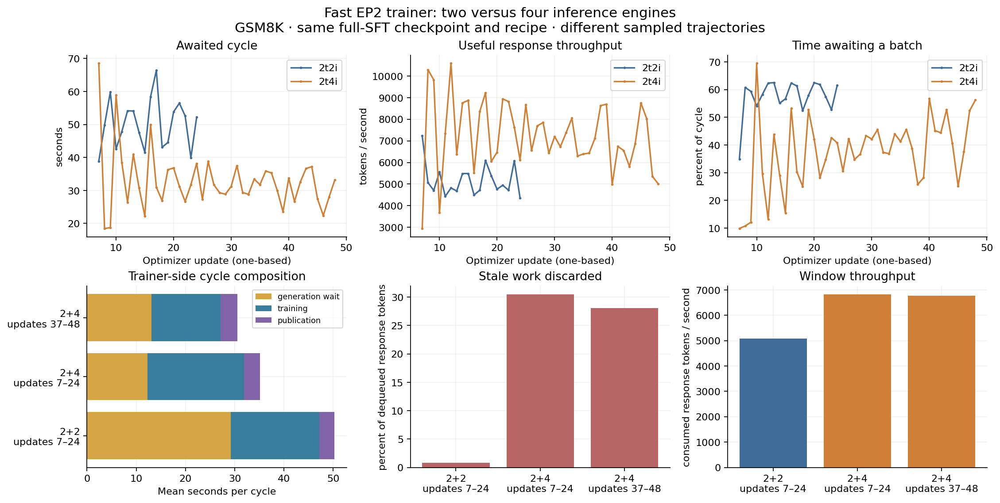

# Fast trainer: two versus four inference engines

The six-GPU follow-up completed all 48 updates on both trainer ranks and exited
zero. More engines improved useful throughput about 34%, but increased stale
discards substantially; this is not yet a recommended balanced configuration.

[Beaker](https://beaker.org/ex/01M2F2F86TZKY4A7VPTH6448K5),
[W&B](https://wandb.ai/ai2-llm/olmo-rl-comparison/runs/chs9u3nw),
[launch provenance](fast-2t4i-20260914/launch.json),
[resolved input](fast-2t4i-20260914/run-spec.json).

## Controlled comparison

The earlier [fast 2+2 qualification](full-sft-basket-20260914.md) completed
24 updates. This case keeps its fully SFT checkpoint, GSM8K data, seed, objective,
batch 128, EP2 trainer, packing 6144, recomputation off, guarded scoring skip,
router replay, FIFO queue, lag two, mixed-policy refresh, and per-engine
32-request admission/running/decode-graph limits. Producer admission remains
512 responses and the completed queue remains 128 responses. Only the number
of TP1 engines changes from two to four, and duration from 24 to 48 updates.
This doubles aggregate HTTP admission from 64 to 128 slots. One six-GPU Holmes
allocation uses urgent priority and a one-hour minimum runtime. No judge,
evaluation, save or HF export is included in this throughput experiment.

The same immutable base image and committed runtime overlay mechanism as the
2+2 comparison are retained. The native packaged image is not used for this
matched comparison. Passive node-local Triton cubin counts/write times and
15-second NVML samples are added; no compiler dispatch is patched. Standard
pipeline/engine occupancy sampling remains every two seconds. Triton artifact
writes do not measure compiler CPU duration or capture every compiler family.
The standard occupancy summarizer caps sample hold at ten seconds, so 15-second
NVML sampling deliberately leaves gaps rather than imputing full coverage.

## Measurement plan

Validate every optimizer update on both ranks, the initial scoring-skip check,
request/version contracts and completed shutdown. Report updates 6–23 against
the previous window, then separately the final two twelve-update windows. Use
actual artifact growth and phase timings to judge warmness; six warmup updates
alone are not a claim that compilation has ended. If compilation persists, show
it and retain its costs in the complete-window result.

Compare consumed response tokens per cycle second, training/publication/collection
wait, completed-buffer occupancy, stale drops by tokens/length/age, terminal
unused responses, engine running/waiting requests, memory, and sampled GPU busy
fraction. Hardware busy fraction is not SM occupancy or compute efficiency.
Different engine counts alter sampled trajectories; this is a throughput screen,
not a matched-batch numerical speedup claim.

## Starting evidence

In the fast 2+2 warm window, useful throughput was 5,089 response tokens/s;
collection occupied 58.1% of the cycle. HTTP admission held all 64 slots while
about 422 requests waited. Each engine averaged 29.6 running requests. The
completed queue was empty 55.6% of sampled time and never full. Inference used
about 85 GiB of 269 GiB per GPU and averaged 82–84% NVML GPU busy time. These
observations favor more inference capacity over a larger completed buffer.

The older, slower-trainer c64 run discarded 37% of dequeued response tokens;
that result cannot establish the best concurrency after speeding up training.
The live c128/c256 transport failures remain unresolved, even though frozen
single-engine tests ran successfully at those larger batch sizes.

## Completed result

All 48 optimizer updates and the initial scoring-skip check passed on both ranks.
The initial check compared 168,516 active response tokens with maximum and mean
absolute difference zero. This checks scoring elision against the explicit
scorer, not exact equality to serving probabilities. No HTTP failure or GPU OOM
occurred. Final shutdown drained successfully; no save/eval/export was requested.

Below, update numbers are **one-based** (artifact rollout IDs are zero-based).
Cycle seconds include awaited collection, training and publication; startup and
terminal drain are excluded. Token throughput counts response tokens actually
consumed by training. Discard fractions divide stale response tokens by consumed
plus stale response tokens in that window, excluding terminal leftovers.

| Window | Useful response tok/s | Mean cycle s | Awaited collection s | Training s | Publication s | Awaited fraction | Stale token fraction |
|---|---:|---:|---:|---:|---:|---:|---:|
| 2+2, updates 7–24 | 5,089 | 50.22 | 29.17 | 17.98 | 3.07 | 58.1% | 0.8% |
| 2+4, updates 7–24 | 6,821 | 35.12 | 12.31 | 19.55 | 3.25 | 35.1% | 30.5% |
| 2+4, updates 25–36 | 7,087 | 32.00 | 12.93 | 15.67 | 3.41 | 40.4% | 23.3% |
| 2+4, updates 37–48 | 6,765 | 30.55 | 13.06 | 14.07 | 3.42 | 42.8% | 28.1% |

The previous run's final twelve updates (13–24) measured 5,034 tok/s, 50.90 s
cycles, 59.1% awaited collection and zero stale drops. Its optimizer median was
16.46 s versus 13.09 s in the new final window. The new batches contain fewer
response tokens, so this is not evidence that the unchanged trainer kernels
became faster. Comparing useful tokens/s is more informative than cycle count.
The matched-window gain is 34.0%; the final-window comparison gives 34.4%.
Four to six total GPUs is a 50% allocation increase, so useful throughput per
allocated GPU fell about 10% in this short screen.

[Full window analysis](fast-2t4i-20260914/comparison.json),
[vector figure](fast-2t4i-20260914/comparison.svg).

## Warmup and queues

Observed trainer cache counts still grew during updates 7–24. The two large
worker caches stopped growing by the end of that window; three serving caches
added one binary each during updates 25–36. None of the six observed caches
added a cubin in updates 37–48. This last window is the cleanest measured steady
state. It does not prove absence of compilation in other compiler families.

During that final window:

- All 128 aggregate HTTP slots were occupied; about 331 requests waited for HTTP
  admission. The producer still owned approximately 128 four-response groups.
- Engines averaged 26.9–27.1 running requests each, with about 4.2 queued in each
  engine. Reported engine generation throughput was 2.29–2.34k tok/s each. Those
  are sampled serving counters, distinct from useful training throughput.
- The completed queue averaged 10.15 groups (40.6 responses), was empty 38.4% of
  sampled time and full 2.2%. It held 32 groups at capacity.
- 332 responses were dropped versus 1,536 consumed: 17.8% by sample count,
  28.1% by response tokens. All dropped-sample age counters were age three;
  configured maximum age was two. Of those 332, 132 reached the 4096-token cap,
  105 had 2048–4095 tokens, and 95 were shorter.
- Inference GPUs used approximately 85.5 GiB each of 268.6 GiB. Their sampled
  NVML busy means were 73–88%. Fifteen-second sampling with a ten-second hold
  provides only 65.4% coverage; this is not measured warp occupancy or MFU.

The completed queue being mostly below capacity does not mean all generated
work is usable. Groups can age while their slower siblings finish, and mixed
responses retain the age of their original prefix. Faster updates advance the
policy clock more quickly. These mechanisms are consistent with the observed
age-three drops, but this run does not attribute each group's aging time to a
specific queue or generation phase.

Final draining left **150 groups / 600 responses / 1,154,720 response tokens**
unused in the completed buffer, versus 143 / 572 / 1,193,865 in the old run.
The lifecycle drain temporarily expands capacity from 32 to 160 groups to finish
owned requests. Thus this terminal inventory is not ordinary steady-state buffer
occupancy or evidence of a linear accumulation rate. Terminal requests were all
joined; no unfinished HTTP requests remained. Leftovers are separate from stale
work discarded during training.

## Next comparison

Retain the qualified trainer settings. This result does not justify simply
adding still more inference GPUs: first reduce admitted work at fixed 2+4/32
engine capacity (for example 512 to 256 responses), measuring useful throughput,
trainer wait, age/length drops and terminal inventory together. A smaller budget
may reduce aging but can also starve engines when groups have slow siblings; that
is an experiment, not a promised improvement.

Once the HTTP candidate is qualified, a 2+2/64-per-engine comparison would test
whether the same 128 running slots can be supplied with fewer inference GPUs.
Do not infer its live-pipeline stability from isolated engine tests. No new
concurrency run was launched as part of this result analysis, and the stale-work
problem remains explicit rather than changing FIFO or silently increasing lag.
