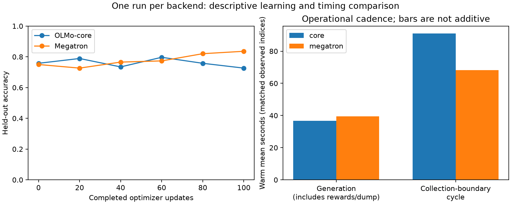

# GSM8K: completed 100-update comparison

> Historical evidence. For current operating instructions, start at the [MILES guide](../index.md).

Both systems completed 100 updates and passed the independent retained-response audit.
Megatron improved from 96 to 107 correct out of 128; Core moved from 97 to 93.
Core's warm operational cycle took 33.4% longer. These runs establish a difference
worth investigating, not a causal explanation or a verdict on the Core approach.

[Reproducible comparison data](gsm8k-final-20260911.json),
[complete configuration inventory](gsm8k-configuration-differences-20260911.md),
and [campaign provenance](gsm8k-parity-20260910.json) accompany this report.

## Learning behavior

| Completed updates | Core correct /128 | Megatron correct /128 |
|---:|---:|---:|
| 0 |97 |96 |
| 20 |101 |93 |
| 40 |94 |98 |
| 60 |102 |99 |
| 80 |97 |105 |
| 100 |93 |107 |

Core's endpoint change is −3.125 percentage points; Megatron's is +8.594 points.
The final gap is 14 questions, or 10.938 points. The difference in endpoint changes
is 15 questions, or 11.719 points. Core temporarily led at updates20 and60, so the
endpoints should be read with the complete curve. There is one training seed per
backend and only128 held-out questions; this does not estimate between-run variance.
Held-out evaluation used greedy temperature0 and one completion per question in
both systems. The optimizer learning rate was the same constant1e-6 in both systems.

At the final evaluation,84 questions were correct in both systems,9 only in Core,
23 only in Megatron, and12 in neither. Within Core,12 initially wrong questions
became correct and16 initially correct questions became wrong. Within Megatron,
19 became correct and8 became wrong. Even before RL,17 questions had different
correctness between systems despite their aggregate scores differing by just one.
That initial divergence matters when interpreting later question-level changes.

| Response behavior | Core initial → final | Megatron initial → final |
|---|---:|---:|
| Mean held-out response tokens |1782 →1664 |1748 →1218 |
| Responses reaching4096-token cap |18 →24 |20 →18 |
| Mean training reward over1600 samples |0.806875 |0.805625 |
| Mean training response tokens |1816 |1898 |
| Training groups with mixed rewards /400 |127 |116 |

Eleven of Core's16 lost answers hit the cap at the final evaluation. That is an
association, not proof that a longer cap would recover those answers. At the final
endpoint, Core had22 incorrect capped responses and13 incorrect responses below
the cap; Megatron had12 and9. These are outcome-selected subsets, not matched
evaluation populations. Some capped responses already contained a correct
extractable answer (Core2, Megatron6), so truncation does not imply reward zero.
Megatron
produced substantially shorter held-out responses late in training, while average
training reward across the run was nearly identical. Training reward alone would
have missed the held-out difference. With standard-deviation normalization disabled,
all-equal reward groups have zero centered policy advantage, but router auxiliary
losses can still update their routers.

## Performance

Both allocations used three B300s: two trainer GPUs with EP2 and one dedicated
SGLang GPU. The primary comparison uses the same90 warm, consecutive generation-end
intervals, excluding startup, the first five indices, and scheduled evaluation
crossings. A cycle contains training/publication of the preceding rollout and
collection of the next. Generation means use the same95 warm rollout indices.
There are no missing/conflicting timing records in either parser output.

| Measurement | Core | Megatron | Interpretation |
|---|---:|---:|---|
| Warm operational cycle, mean |91.065s |68.242s |Core1.334× duration; Megatron1.334× cadence |
| Warm operational cycle, median |90.341s |66.814s |Same90 matched intervals |
| Rollout collection, mean |36.788s |39.527s |Includes generation, reward work, debug dumping |
| Pre-update scoring |44.328s |4.182s |Core is a broader collection-end→score-contract boundary; Megatron is its native log-prob timer |
| Optimizer/training timer, mean |6.170s |17.384s |Both exclude preceding scoring; instrumentation/rank reductions differ |
| Weight publication, mean |3.728s |5.884s |Matched completed steps5–99; backend-specific scopes |
| Scheduled→exit allocation |198.70min |180.74min |Includes startup, evaluations, teardown; no queue time |
| Allocated GPU-hours |9.935 |9.037 |Three GPUs throughout |

The wall-clock result is clear: Core's overall warm cadence is slower, despite its
shorter recorded optimizer phase. Across the same95 warm Megatron batches,
[reconstruction from audited lengths](gsm8k-warm-padding-20260911.json) finds
3,095,640 real tokens expanded to5,712,688 padded forward positions:1.845× real
length, with45.8% of positions artificial. This is a token-workload difference,
not a measured FLOP ratio or proof of its share of runtime. It would be misleading
to claim that Core is faster from its6.17s training timer alone. The large pre-update interval is the main
observed difference. The completed [frozen-runtime scorer profile](core-score-profile-20260911.md)
found230.458s for the first score pass and a1.243s mean across three identical
warm repeats, with bitwise-identical log probabilities. Cold SwiGLU specialization
alone consumed about41.4s of host JIT time per rank across150–151 variants; FLA
kernels added85.9–93.2s. Warm repeats had zero JIT misses or artifact writes.
This supplies a concrete compilation optimization target and shows that warm
model scoring itself can be cheap. It does not prove that compilation accounts
for the entire historical44.328s interval: the diagnostic uses one retained batch
at initial weights, while training sees changing lengths and routes. The
historical interval must not be labeled pure GPU time or pure orchestration time.
Rank-local compilation durations also cannot be added across concurrent ranks.

The structured comparison retains the95 individual Core score/optimizer/
publication boundaries. The publication table separately aligns completed optimizer
steps5–99 in both systems, correcting their different policy-version conventions;
[all aligned component measurements](gsm8k-weight-sync-20260911.json) are retained.

Phase means are diagnostic, not additive. They use different boundaries and some
use different index conventions; subtracting them from a cycle mean does not
measure orchestration. Across the matched95 rollout batches, Core generated2,735,986 response tokens and
Megatron2,862,836. Dividing those token totals by native collection time gives
782.8 and762.4 response tokens/s respectively. This modest2.7% rate difference
includes rewards, dumps, scheduling and stragglers; it is not pure decoder
throughput. No GPU utilization percentage was measured for this pair. Generated lengths and sampler implementations differ,
so rollout seconds are an operational comparison, not an isolated SGLang benchmark.
Cold startup substantially offsets the warm-cycle difference in total runtime:
process start→initial publication took652.7s for Core and1918.8s for Megatron;
process start→initial evaluation summary took940.5s and2221.6s. These are broad
startup boundaries, not isolated checkpoint-read timers. Subsequent publication→
evaluation-summary intervals ranged230.5–280.6s for Core and197.4–298.8s for
Megatron, with changing response lengths. All six evaluation boundaries are in
[the retained timeline](gsm8k-startup-eval-boundaries-20260911.json).
Neither100-update run saved resumable checkpoints, so this pair cannot measure save
throughput. A separate full-model check subsequently verified exact save/fresh-load state
integrity on both ranks, with a222GB native checkpoint and about532s for the
save/reload interval. That interval includes optimizer reload and is not pure disk
write throughput. Independent fresh-start trajectories differed; see the
[durability report](core-durable-full-20260911.json).

The instrumented warm trace further bounds scoring work: each rank made eight
forward calls; log-prob helper CPU ranges totaled only7.7–8.2ms. Non-NCCL GPU
activity occupied a union of about171ms per rank; NCCL kernel intervals were
asymmetric (586ms versus25ms), which can include waiting for the other rank.
The instrumented pass took1.752s versus1.243s without tracing, so its host gaps
cannot be extrapolated directly into normal orchestration cost. Full interval
unions and overlap definitions are in the scorer profile.

## Weight synchronization detail

Both arms published the same29,669 tensors, totaling37.03GB (34.49GiB), each time.
They streamed tensors in HF-compatible names/layouts using flattened NCCL buckets
of approximately1GiB. Core used35 transport buckets and Megatron36. This is live
GPU weight publication; neither arm rewrote an HF checkpoint to disk per update.
Both were on one node, so these timings do not qualify cross-node RDMA throughput.

For matched completed updates5–99, Core's export/layout/gather interval averaged
0.436s, and its combined bucket transport and serving-load interval3.222s. Megatron
recorded1.103s gathering,0.252s conversion,0.259s metadata broadcast, and3.409s
waiting for engine loading. Its0.019s NCCL broadcast timer measures the launch
side, not complete transfer latency; the engine wait includes asynchronous work.
The telemetry also reports9,762 trainer gather collectives versus36 serving
transport collectives per publication. Those are different operations, and should
not be described as9,762 network sends to SGLang. The remaining baseline component
time is explicitly retained as unattributed, not relabeled as orchestration.

Weight publication is faster in Core in this comparison and is a small part of
its91s cycle. The measured mapping/conversion work provides no support for the
concern that HF-format conversion is the dominant cost here.

## What was matched, and what was not

Both used the same Abhishek Dolci-think SFT step23607 checkpoint, frozen400 training
prompts and128 held-out questions, four prompts ×four completions/update, length
limits, reward definition, constant LR, Adam parameters, clipping bounds0.2/0.28,
router auxiliary coefficients, replay-off mode, and disaggregated GPU topology.
The65536 in the source path denotes context length, not SFT update count. This is
the older18.5B latent/KDA model, not the12.5B hero architecture.

The differences most likely to affect interpretation are:

1. **Core's old scoring path rounded SwiGLU differently from its gradient-enabled
   training path.** A targeted correction is in the new Core runtime, with direct
   unchanged-weight forward checks. It was not retroactively applied to Core100.
   We have not established that this explains the learning gap.
2. **Router auxiliary objectives differ for unequal sequence lengths and padding.**
   Core weights real-token counts; Megatron's sequence objective and padded forward
   include different weights/positions. MILES pads each microbatch to the maximum
   sequence length across that trainer rank's rollout shard, even with microbatch1
   and padding multiple1. This is separate from the old DeepEP alignment hack. Identical coefficients do not make these
   losses identical. Fixed equal-length tests validate each implementation, while
   deliberately removing this online difference.
3. **Serving sampler and token-pool settings differed.** Core100 explicitly used
   PyTorch sampling and32768 tokens; Megatron100 resolved to FlashInfer and an
   automatic pool. Core's resolved prefill chunk was not retained in startup logs.
   The new500 pair explicitly uses PyTorch/32768/16384 on both arms.
4. **Trainer kernels, precision/reduction order, diagnostics, and initialization
   differ.** Core imports HF tensors; Megatron loads native distributed state.
   Matching installed library versions does not make these execution paths equal.

The complete inventory records immutable application/trainer/image revisions,
software versions, optimizer and loss settings, layout, publication, and known
unknowns. We do not describe the new500 pair as a pure horizon extension: Core also
contains the scoring correction and Megatron has aligned serving settings. Core500
also carries the later olmo-sglang adapter11ae9f6, versus81a312 in Megatron500.
Its new per-head QK gain and scalable-softmax branches are disabled by this old
checkpoint's configuration; the source revision difference remains recorded.
The new initial scores are Core99/128 and Megatron98/128. Their future gains must
use those baselines, and the cause of the small cross-allocation initial changes
is not established.

## Correctness evidence and limits

[Core100](https://beaker.org/ex/01M26P6XX6SN886DCVZ68WMQK2) and
[Megatron100](https://beaker.org/ex/01M26YNP5E64YGNXR85TA2RP4Q) both exited0.
The [independent paired audit](https://beaker.org/ex/01M279KT4PQNC2HGZ7JVB1TDBJ)
also exited0. Per backend it checked100 training dumps containing1600 responses
and six held-out evaluations containing768 responses against prepared IDs, token
lengths, recomputed rewards, and expected policy versions. Completed optimizer
steps were aligned despite the backends' different initial version conventions.
Initial full serving-weight checks and Core runtime training contracts passed.
This establishes that the measured curves correspond to actual updates on the
intended data and weights. It does not prove mathematical equivalence or explain
the outcome difference.

Separate fixed-token optimizer, EP, and auxiliary-loss checks support the adapter
contract. They retain measured finite-precision differences rather than asserting
bitwise equality. The frozen Core100 rounding issue remains explicitly visible in
this result. The separate profiler supplies timing evidence, not a retrospective change to
the completed run. Subsequent fixes and longer-run outcomes remain new evidence.

## Follow-up comparisons

The heavily SFT-trained500-update pair starts fresh from the same checkpoint and
repeats the400 prompts five times, with held-out evaluation every20 updates and
native saves every100. The lightly SFT-trained Core200 comparison uses the actual
historical checkpoint and ordered training recipe. Its historical native128-question
track used temperature1/chat prompting; its separate full1319-question offline
track used greedy raw-QA prompting and a512-token cap. Those two evaluation tracks
are preserved separately. The valid historical200-update Megatron anchor improved
26→77/128 on its native track and230→274/1319 on its offline track. These scores
must not be compared directly with the heavily SFT-trained128-question curve.

See [the learning campaign protocol](learning-comparisons-20260911.md) and
[the historical light-SFT protocol](light-sft1000-gsm8k.md) for live run
identities, settings, and unresolved qualification work.

Validation of the comparison tooling:66 focused audit/checkpoint/extension/profiler
tests passed. Repository `make style` and `make quality`, including type checking,
and explicit Ruff checks of the experiment tooling passed.
