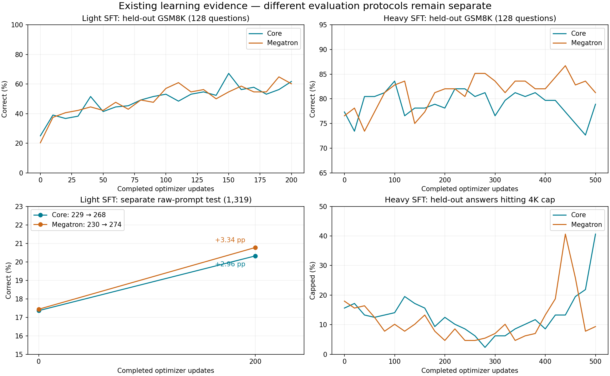

# Learning confidence across models and frameworks

This is the working report for the broad comparison program, not a GSM8K-only
replacement. It reuses existing olmo-miles runs, records incomplete experiments,
and identifies the missing matched original Open Instruct control. The current
MILES/Core GSM8K run is one independent learning control while code-service
reliability is investigated.

## Relaunch with measured serving and recovery fixes — September 15, 21:00 UTC

This section is the current-runs ledger. The tracked qualification configs were
removed from git by the starter consolidation (`3a41d194a`); the configs of the
runs below live in Git-ignored `runs/relaunch-20260915/` and their resolved
specifications are retained in [relaunch-20260915.json](relaunch-20260915.json).
Predecessor configs are archived under `runs/miles-archive-20260915/`.

| Arm | Experiment | Continues from | Changes | State at submission |
| --- | --- | --- | --- | --- |
| Dense broad basket, g16 | [01M2KEBH81YA9SH0HQ88XDD5YM](https://beaker.org/ex/01M2KEBH81YA9SH0HQ88XDD5YM) | single-node run checkpoint 5 (`01M2J19078AMKBCTARS065FZ9S`) | full decode CUDA graphs, admission 8 → 16, save every update | started 21:13 UTC |
| MoE broad basket, c16 | [01M2KF9EW2ZX50X477D6CZWECG](https://beaker.org/ex/01M2KF9EW2ZX50X477D6CZWECG) | robust-20260915 checkpoint 45 (`01M2J039655AS5BM5KZ9YQNQ3F`) | admission 8 → 16; EP8 topology retained | submitted 21:20 UTC after the robust run was stopped past checkpoint 45 |
| Dense GSM8K Core control, r4 | [01M2KEPRMD3NGSJEV9GM7VR0HF](https://beaker.org/ex/01M2KEPRMD3NGSJEV9GM7VR0HF) | r3 checkpoint 150 (`01M2HZKS5S3EJTP6QY3KBERG7D`) | full decode CUDA graphs, admission 8 → 16, save every 5 | started 21:14 UTC; r3 stopped at 21:13 after checkpoint 150 committed |
| Original Open Instruct GSM8K comparator | [01M2K1SFCHC33S3R4JF9PWAF0F](https://beaker.org/ex/01M2K1SFCHC33S3R4JF9PWAF0F) | unchanged | none | completed 200 updates and saved its final model at 20:58 UTC |

All three Core relaunches use base image `01M2CJG5RQQ93GEYNYAS7ASCQJ` with the
committed overlay `a20f785ff`, which adds two runtime changes: warm Triton
caches are published in the background after the first committed checkpoint of
each process and every tenth thereafter, and the code-service HTTP retry budget
is bounded to three retries (about two minutes per failed sample instead of the
measured 517–530 s). Model, data, objective, optimizer, batch geometry, response
budget and KV pools are unchanged. Each relaunch is a new run identity that loads
the predecessor's committed native checkpoint through `miles.load`; automatic
preemption recovery then prefers checkpoints in the new run's own output root.

Why these changes, from the [timing diagnosis](../baseline-timing-20260915/README.md)
and the live logs of September 15:

- Both dense arms served with decode graphs disabled: 22–27 output tokens/s per
  stream and 192–215 tokens/s per engine at eight running requests. The MoE
  engines on the same image run 1,200 tokens/s per engine with graphs, and the
  original comparator's vLLM engines complete the same 64-sample GSM8K update in
  2.2 minutes versus 7.0 for the Core arm. No dense config had ever enabled graphs.
- The dense broad run's second allocation completed updates 6–9 at 44–50 minutes
  each and was preempted eight minutes before its next save, leaving no durable
  progress from a 34 GPU-hour allocation. Saving every update costs about 39 s
  without inference drain.
- The MoE engines reported full-token KV usage of 0.10–0.14 at admission 8 with a
  786,432-token pool, so admission 16 fits without changing the pool.
- Every restart logged Triton cache `miss` for all workers; the MoE's first update
  after the 19:24 UTC restart took 57 minutes against 8 warm.

Not done: EP4 trainers with 11 engines. Two blockers were found. Core RL resume
rejects any trainer topology change (`validate_topology` in
`open_instruct/miles/checkpoint.py`), so the EP8 checkpoint at update 45 cannot
continue at EP4. The topology planner also places trainers on exclusive nodes,
so 4 trainers + 11 engines + 1 judge plans to three nodes with eight idle GPUs
(`runs/relaunch-20260915/moe-broad-ep4-i11.toml` validates but is not launched).
An EP4/11 arm therefore means a fresh MoE run and a placement change to the
planner; both are recorded here as open decisions rather than made silently.

The r3 control was stopped immediately after checkpoint 150 committed, before
its scheduled update-150 held-out evaluation, so that evaluation must be run on
the frozen checkpoint separately; r4 evaluates at update 200. Scheduling
protection is unchanged at a four-hour minimum runtime on urgent priority; the
workspace remains several hundred percent over its allocation target inside
`ai2/oe-scaling`, which is why every job is preempted at exactly four hours.

### First measurements after relaunch — September 15, 22:20 UTC

| Arm | Updates observed | Cadence | Engine decode at ≥12 running | Notes |
| --- | --- | --- | --- | --- |
| Dense GSM8K r4 | 151 → 185 in 46 min | **1.4 min/update** (r3: 7.0) | 1,214 tokens/s per engine | KV usage ≤ 0.10; first warm-cache publication succeeded |
| Dense broad g16 | 6 → 8 | **14 min/update** (predecessor: 47) | 699 tokens/s per engine | KV usage mean 0.35, max 0.87; five code-service failures now cost 126 s each instead of 517–530 s |
| MoE broad c16 | restored checkpoint 45 at 21:48 UTC | first update pending (cold compile; previous restart took 37 min from restore) | 1,775 tokens/s per engine at 16 running | KV usage mean 0.22, max 0.38; one benign health-check abort during the first publication |

The dense GSM8K control gained the most because its updates were dominated by
single-stream straggler decode. Dense g16 remains generation-bound at about
2.6 million response tokens per update; at 16 running requests its per-engine
rate falls as contexts lengthen, and the 32K-response KV pool now approaches
occupancy during the longest tails. Both dense runs restored the predecessor
checkpoints and prompt ledgers, and both published a warm Triton cache after
their first committed checkpoint through the new background publication.

### Dense GSM8K control completed — September 15, 22:57 UTC

r4 ran updates 151–200 in 69 minutes (median 1.4 min per update), evaluated the
512 held-out questions in 15.6 minutes (r3 took 58–71 minutes at update 50 and
100), and exited zero at 22:57 UTC after its final export and cache publication.
Held-out RLVR GSM8K accuracy along the Core arm, greedy, one response per question:

| Update | Core arm | Original comparator (evaluates the policy before the labelled update) |
| ---: | ---: | ---: |
| 0 | 441/512 (86.13%) | 437/512 (85.35%) |
| 100 | 444/512 (86.72%) | matched export evaluation retained separately |
| 150 (pre-150 for original) | not evaluated: r3 was stopped after the checkpoint commit | 451/512 (88.09%) |
| 200 | 441/512 (86.13%), mean response 4,413 tokens | final export saved 20:58 UTC; matched evaluation pending |

These are held-out rows from the RLVR training source, not the official GSM8K
test split, and no learning verdict follows from them: run the full test
evaluation (`scripts/miles/gsm8k_test_eval.py`) on the initial and final exports
of both arms before comparing. Open follow-ups: evaluate the r3 update-150
checkpoint, and evaluate the original's final export with the same frozen
prompts and 32K cap used for its update-100 export.

### MoE broad basket: first post-training evaluation at update 50 — September 15, 23:49 UTC

The c16 continuation committed checkpoint 50 at 23:22 UTC and evaluated all
four domains (128 held-out prompts each, greedy, one response) in 27 minutes.
Update-zero values are the retained initial evaluation of the same model and
prompts ([broad-initial-32k.json](broad-initial-32k.json)).

| Domain | Update 0 reward | Update 50 reward | Capped at 32K, update 0 → 50 | Mean response tokens, update 0 → 50 |
| --- | ---: | ---: | ---: | ---: |
| Math | 0.039 (5/128) | 0.047 (6/128) | 82% → 80% | 28,960 → 28,754 |
| Instruction following | 0.255 | 0.241 | 66% → 68% | 22,495 → 23,198 |
| Code | 0.078 (10/128) | 0.109 (14/128) | 70% → 72% | 23,303 → 24,011 |
| General judged | 0.623 | 0.658 | 34% → 34% | 12,278 → 11,962 |

Fifty updates at learning rate 1e-6 moved nothing beyond noise on 128-prompt
sets, and the length distribution is the dominant fact: 70–80 percent of math,
code and instruction-following responses still hit the 32K cap, so most prompt
groups carry zero or near-zero reward and little advantage signal. This is the
same behavior the 4K-cap attempts showed, now with eight times the budget.
Compare update 100 before drawing conclusions; the informative signal to watch
is whether the capped fraction and mean length start falling.

Trainer warmup after the 21:26 UTC restart lasted five updates: scoring plus
train time fell 1842 → 1079 → 735 → 648 → 451 s before the evaluation. The
warm figure from the previous allocation was 44 s. The background compiler-cache
publication ran after checkpoint 50; the next restart will show whether the
restored cache removes this warmup.

### Warm cadence at admission 16 — September 16, 00:25 UTC

| Arm | Updates | Warm cadence | Wait for batch | Score + train | Engines |
| --- | --- | --- | --- | --- | --- |
| MoE c16 | 51 → 57 after the evaluation | **2.7–4.9 min/update** (admission 8: 7.8) | 2.4–3.3 min | 93 s and still falling toward the 44 s seen last allocation | 14.7 running of 16, 74% of samples full |
| Dense g16 | 6 → 17 | 13.3 min/update (predecessor 47) | 11.0 min | 153 s | 8.9 running of 16, KV-limited; 49% of samples at ≤4 running |

The MoE change paid off roughly twofold once the trainer warmed; its remaining
143 updates project to about 9 hours of warm training. The dense arm remains
generation-bound by its KV pool and the whole-group tail; the prepared
`dense-broad-kv` continuation (static fraction 0.85, requested pool 458,752
tokens) is the next change, to be applied at its four-hour preemption.

### Preemptions at four hours and the first warm-cache restart — September 16, 02:40 UTC

Both MILES arms were preempted at exactly their four-hour minimum runtime
(dense g16 at 01:13 UTC after update 21, MoE c16 at 01:26 UTC after update 70),
again by `ai2/oe-scaling` group balancing. The MoE's automatic resume restored
checkpoint 70 and, for the first time, restored **warm Triton caches on every
trainer and serving rank** (`status: hit`, 1–16 s each) from the background
publication made after checkpoint 50. Its first update after restore took
15 minutes including the first 256-sample collection, versus 39 minutes at the
previous cold restart. The dense arm was relaunched as the `kv` continuation
([01M2KWWP9GVQ55D1DP2GWY748F](https://beaker.org/ex/01M2KWWP9GVQ55D1DP2GWY748F),
static fraction 0.85, requested pool 458,752 tokens) from checkpoint 21 and is
queued behind the group slot limit.

The original-framework basket arm (arm 1 of the three-arm design) has its data
prepared (101,434 training and 512 held-out rows, every prompt token equal to
the MILES frozen tokens). Its first smoke was preempted on Jupiter after 30
minutes while the two-GPU judge compiled; the relaunch starts the judge eagerly
(ready in 90 s), protects the smoke for two hours, and is running
([01M2KXHQ5PDXRZDVQT86RK4JWB](https://beaker.org/ex/01M2KXHQ5PDXRZDVQT86RK4JWB)).
Receipts: [relaunch-20260915.json](relaunch-20260915.json).

### MoE update-100 evaluation lost to the engine drain timeout — September 16, 05:20 UTC

The MoE continuation reached update 100 at 04:45 UTC (warm cadence 4.4 min per
update after the cache-restored restart) and committed checkpoint 100, then its
shared-engine evaluation timed out: evaluation first drains in-flight training
requests under `core.engine_drain_timeout` (900 s), and at admission 16 with the
code service returning read timeouts (127 s per attempt, several in flight) the
engines did not go idle in time. The driver exited 1 at 05:05 UTC. The run was
relaunched from checkpoint 100 as
[01M2M9W9BN8WJRNH3ESSHZV9B9](https://beaker.org/ex/01M2M9W9BN8WJRNH3ESSHZV9B9)
with a 2,700 s drain budget; the same budget is set on the pending dense
continuation. The update-100 held-out evaluation is not repeated by the
continuation and must be produced from the checkpoint-100 export separately.

The original-framework arm (arm 1) is training on two Jupiter nodes
([01M2M3D8QC3DJY1Q033YPESGSK](https://beaker.org/ex/01M2M3D8QC3DJY1Q033YPESGSK)):
step 1 generated 256 samples in 1,075 s at 3,607 tokens/s across ten eager
vLLM engines, versus 917 tokens/s from two engines in the single-node smoke.

### Arm 1 steady cadence — September 16, 05:42 UTC

After its initial 512-prompt evaluation drained off the shared engines, the
original-framework basket arm settled at **12–14 minutes per driver step**
(steps 4–6: 747, 820 and 716 s), of which 673 s is waiting for the 256-sample
collection and about 90 s is training on four learners; the trainer is idle
about 85 percent of the time, as in the MILES dense arm. Initial held-out mean
reward across all 512 prompts was 0.38 (all domains pooled, the original's
single `eval/scores`). Projection: 100 steps in about 21 hours of run time plus
two evaluations, before Jupiter preemptions. Dense MILES arm: update 33 at
12.4 min per update; MoE continuation from checkpoint 100 is queued for slots.

### Dense admission 24: more occupancy, same cadence — September 16, 09:31 UTC

The dense continuation at admission 24 (checkpoint 37 onward) raised mean
running requests per engine from 8.8 to 11.9 and per-engine decode from 690 to
762 tokens/s with three retractions in an hour, but updates 38–43 still took
12.6 minutes median. The dense arm's cadence is set by the slowest group in each
256-sample batch under whole-group submission, not by admission or KV capacity;
the pool change and the admission change together bought nothing measurable.
Remaining levers are structural (sample-level backfill, or a second engine node,
which the planner cannot place without idling GPUs) and are not applied.

### MoE continuation killed by one lost HTTP connection — September 16, 10:45 UTC

The checkpoint-100 continuation rendezvoused after its second replica waited
about an hour for slots, restored, and completed update 101, then died: one
policy-refresh request to the serving router hit an httpx `ReadError`
(connection reset) at 10:01 UTC. The refresh path deliberately refuses to
resample a request whose delivery is unknown, and that refusal propagated out
of the producer and exited the driver. The producer now discards such a group
and requeues its pristine prompts through the same ledger path a preemption
uses, regenerating them under the current weights, with a budget of eight
consecutive transport failures before the run fails (overlay `d6fb0f05e`,
117 runtime tests). Relaunched from checkpoint 100 as
[01M2MWPWN1630EFRQCYB2KVZXX](https://beaker.org/ex/01M2MWPWN1630EFRQCYB2KVZXX).
The dense arm runs the older overlay and carries the same exposure until its
next restart.

### All three arms lost to a full shared filesystem — September 16, 15:50 UTC

At 15:24–15:27 UTC every arm exited with `OSError: [Errno 28] No space left on
device`: dense c24b ([01M2N0PEXEN2TZGGGZFYSVHMTT](https://beaker.org/ex/01M2N0PEXEN2TZGGGZFYSVHMTT))
after update 66, MoE c16e ([01M2N0PNTM3HQXWXNXY5J8A656](https://beaker.org/ex/01M2N0PNTM3HQXWXNXY5J8A656))
during startup before its first update, and the original arm 1
([01M2M3D8QC3DJY1Q033YPESGSK](https://beaker.org/ex/01M2M3D8QC3DJY1Q033YPESGSK))
after driver step 37 while writing its per-step trace file. A read-only probe
showed `/weka/oe-training-default` at 1.8 PB used with 0 available and
`/weka/oe-adapt-default` at 451 of 455 TB; inodes were at 5 percent. Our own run
directories total about 8 TB (native checkpoints are 41 GB for the dense model
and 207 GB for the MoE; the dense arms had accumulated 61 of them at one per
update, the MoE arms 20), under 0.5 percent of the filesystem, so the fill came
from elsewhere; the user began a cleanup and free space was 3.4 TB at 15:40 UTC.

Surviving state: dense c24b's newest complete checkpoint is update 65 (the
update-66 write was the one that failed); MoE c16 checkpoint 100 is intact; arm 1's
last DeepSpeed checkpoint is `global_step26`, so its steps 27–37 (about three
hours) are repeated. Nothing was deleted by the loop.

Relaunched at 15:47–15:48 UTC on the same commit (`88e471b66`):

| Arm | Experiment | Continues from | Change |
| --- | --- | --- | --- |
| Dense c24c | [01M2NE8AHWQXT87EXY3F038V55](https://beaker.org/ex/01M2NE8AHWQXT87EXY3F038V55) | c24b checkpoint 65 | `save_interval` 1 → 5; a per-update dense save was writing about 5.5 TB over the remaining run |
| MoE c16f | [01M2NE8HDC7Z352AGWBQ3VNW64](https://beaker.org/ex/01M2NE8HDC7Z352AGWBQ3VNW64) | c16 checkpoint 100 | none (c16e never trained) |
| Original arm 1 | [01M2NE8N15FHRWV5ZVGWGHS590](https://beaker.org/ex/01M2NE8N15FHRWV5ZVGWGHS590) | `global_step26`, same output directory | none; `--stage resume` |

MILES has no checkpoint-retention setting, so older native checkpoints stay on
disk until deleted by hand; the per-update dense saves were chosen on
September 15 when an update took 47 minutes and a preemption could lose hours.
At the current 10–12 minutes per update a five-update window bounds the loss to
about an hour. If the filesystem fills again before the cleanup lands, the
relaunches fail at their first checkpoint (dense update 70, MoE update 105, arm 1
step 50) or, for arm 1, at its next per-step trace write.

### Evaluation drains are bounded by the in-flight budget, not the timeout — September 16, 12:00 UTC

The dense arm's update-50 evaluation failed the same way the MoE's update-100
did, now with a 2,700 s drain budget: at 11:45 UTC the producer was still
draining owned groups (7, then 4, then 3 active) when the budget expired, and
864 refresh requests completed during the drain window. Shared-engine
evaluation first lets every group the producer owns run to completion, and
`async_max_concurrent_samples = 1024` lets it own about four 256-sample
batches, so the drain takes roughly four update-times: about 50 minutes for the
dense arm, 30 for the MoE. No timeout that short was ever going to pass.

Both arms are relaunched with `async_max_concurrent_samples = 512` (two
batches in flight; lag limit two makes more than that unusable anyway) and a
5,400 s budget as a backstop, under the transport-failure overlay `d6fb0f05e`:
dense [01M2N0PEXEN2TZGGGZFYSVHMTT](https://beaker.org/ex/01M2N0PEXEN2TZGGGZFYSVHMTT)
from checkpoint 50, MoE [01M2N0PNTM3HQXWXNXY5J8A656](https://beaker.org/ex/01M2N0PNTM3HQXWXNXY5J8A656)
from checkpoint 100. Neither continuation repeats the lost evaluation, so the
dense update-50 and MoE update-100 held-out scores must come from checkpoint
exports evaluated separately. Both checkpoints exist.

## Superseded active runs — September 15, 03:06 UTC

| Arm | Experiment | State |
| --- | --- | --- |
| MoE broad, protected restart | [01M2HDRSBP66D7QXJGH9RQ5N48](https://beaker.org/ex/01M2HDRSBP66D7QXJGH9RQ5N48) | Running; fresh 200-update target, save every 5 |
| Dense broad, protected replacement | [01M2HG0XFGPA5JFA8MPW01J4JF](https://beaker.org/ex/01M2HG0XFGPA5JFA8MPW01J4JF) | Started; fresh 200-update target, save every 5 |
| Dense GSM8K/Core | [01M2GQK5F7T1YTVPPVD9E3S43Q](https://beaker.org/ex/01M2GQK5F7T1YTVPPVD9E3S43Q) | 50 optimizer updates; first held-out evaluation in progress |
| Dense GSM8K/original, retained groups | [01M2HG94A2BA5FSFWDAZFNFJSS](https://beaker.org/ex/01M2HG94A2BA5FSFWDAZFNFJSS) | Started; explicit Core-aligned group-retention adjustment |

The superseded dense broad and original filtering-only runs were stopped. Their
logs remain in their original result datasets and WEKA directories. Monitoring
now tracks these four current identities, not their predecessors. The restored
judge error message retains its prior `request failed` wording; behavior matches
the running robust jobs. The full related CPU/runtime test basket passed 47 tests,
and the historical image passed 20 original-adapter tests. No new final learning
endpoint exists yet.

## Protected continuations — September 15, 03:05 UTC

Dense GSM8K reached 50 optimizer updates and began the 512-question held-out
evaluation. MoE robust restart is running; dense robust replacement is submitted
as [01M2HG0XFGPA5JFA8MPW01J4JF](https://beaker.org/ex/01M2HG0XFGPA5JFA8MPW01J4JF).
The dense predecessor reached 7 updates without a checkpoint and is being
replaced. Both robust profiles keep the same frozen inputs, topology, lengths and
optimization, but use the repaired judge parser/fallback, five-update native saves,
48h allocations and retained initial evaluation. If 200 updates exceed an
allocation, continuation must load a committed native checkpoint; do not splice
fresh-start step numbers onto the previous learning curve.

Original full B64 run `01M2HDDJKQE4TSPYKFJFEN662Q` has not performed an optimizer
call after its first six collections. Historical pruning left 0–12 responses,
which packed into fewer than four trainer shards. The B512 qualifier concealed
this small-batch problem. The corrected benchmark opts into
`--keep-zero-advantage-groups`, retaining all 16×4 responses like Core and leaving
their computed advantages unchanged. This is an explicitly modified historical
baseline, not an unmodified published recipe. It changes which samples enter the
loss denominator and permits optimizer momentum updates on all-zero-advantage
collections, matching Core's retention behavior more closely. Token-mean versus
response-mean loss and pack-remainder dropping remain documented differences.
The default historical pruning path is preserved for reproduction. The corrected
launcher records the opt-in and actual successful training calls, and saves native
state every 25 iterations. Twenty original-image tests pass; Ruff passes.

## Progress — September 15, 02:12 UTC

Original framework qualifier `01M2H7NFWZB8ERKFJ6XYAQABQ3` exited zero, completed
three optimizer calls and exported both intermediate/final public HF models.
The 200-driver-iteration GSM8K comparator is submitted as
[01M2HDDJKQE4TSPYKFJFEN662Q](https://beaker.org/ex/01M2HDDJKQE4TSPYKFJFEN662Q).
Count actual optimizer calls separately: original zero-advantage filtering still
changes effective exposure. The larger qualifier batch was not the comparison.

Dense GSM8K reached 44 updates; dense basket reached 5. Neither has reached its
first post-training evaluation at 50. Dense basket takes about 30 minutes per
collection despite 40–50 second optimizer calls. At that rate, 200 updates exceed
its 24-hour allocation, and its first save at 50 is too late. The dense basket replacement uses the protected parser/fallback, five-update
saves and a 48-hour limit. It starts fresh and reuses initial-evaluation evidence;
its predecessor's partial optimizer updates are not carried over.

MoE basket failed after 25 optimizer calls. Three judge attempts returned a
Markdown `**SCORE:** 1` line that the JSON-style parser rejected. The result bundle
has no committed checkpoint marker, consistent with first save scheduled at 50.
These updates cannot be claimed as resumable. A fresh restart retains frozen
inputs and initial-evaluation evidence, saves every five updates, and allows 48h.
The parser now accepts a single explicit Markdown score line. Exhausted malformed
or failed transport replies produce tagged zero rewards, with per-sample evidence
and `rollout/general_judge/{samples,errors,error_fraction}`. Configuration/context
errors remain fatal and startup judge canaries explicitly use strict mode.
These changes are present in the new robust profiles only. The MoE protected
restart is [01M2HDRSBP66D7QXJGH9RQ5N48](https://beaker.org/ex/01M2HDRSBP66D7QXJGH9RQ5N48).
Twenty focused runtime tests passed, including parser rejection, measured fallback,
strict canaries, context policy and service counters; Ruff passed.

## Progress — September 15, 00:28 UTC

All three MILES runs remain active: MoE basket 14 completed optimizer updates,
dense basket 2, dense GSM8K 29. No post-training held-out checkpoint has reached
its first scheduled evaluation at update 50 yet. MoE optimizer wall time fell
from 838 seconds initially to 75 seconds at updates 13–14; do not use its cold
step timing as the steady-state estimate. Dense basket's second optimizer call
took 51 seconds, but the interval between updates was 32 minutes, dominated by
work outside the optimizer. Long generation remains the completion bottleneck.

The original expandable-allocator qualifier completed three training calls
(21.97, 8.22 and 8.99 seconds) without OOM, then failed saving the first HF export.
The previous metadata fix targeted the DeepSpeed wrapper before unwrapping; the
inner HF model still had `do_sample=false`, temperature 0.6 and top_p 0.95. The
fix now sets sampling metadata on the actual model immediately before export.
An executable regression test runs the historical save method on a wrapped toy
model and validates the saved Transformers GenerationConfig and unchanged weights.
The optimizer ledger also now uses an explicit absolute path: the historical
trainer rewrites `args.output_dir`, which displaced the previous ledger. All 17
original-image tests and Ruff pass. Training/objective/sampling arguments are
unchanged. The 200-iteration original run remains gated on a complete qualifier.

A live MoE code-verifier request exhausted retries after 521.64 seconds with HTTP
503 and received a tagged zero reward; the run continued. Include such service
failures separately from model correctness in the final report.

## Active identities — September 14, 23:24 UTC

| Run | Experiment | Status / target |
| --- | --- | --- |
| Fully SFT MoE, four domains | [01M2GVVKXSS2E1X1FHYNQ8P555](https://beaker.org/ex/01M2GVVKXSS2E1X1FHYNQ8P555) | Running; 5 optimizer updates observed; qualified 128K judge; target 200 |
| Dense Think-SFT, same four domains | [01M2GVVT4CMSPS4TQSYTYSE9TG](https://beaker.org/ex/01M2GVVT4CMSPS4TQSYTYSE9TG) | Initial evaluation complete; collecting training responses; same judge; target 200 |
| Dense GSM8K protected control | [01M2GQK5F7T1YTVPPVD9E3S43Q](https://beaker.org/ex/01M2GQK5F7T1YTVPPVD9E3S43Q) | Running; 21 optimizer updates observed; target 200, eval every 50, save every 25, 48-hour ceiling |
| Original framework hardware qualifier | [01M2H38X7KPNQKRZD89VYF988C](https://beaker.org/ex/01M2H38X7KPNQKRZD89VYF988C) | Running since 23:24 UTC after allocation-limit wait; expandable allocator retry; 4 H100 trainers + 4 inference; 3 driver iterations of 512 responses |

[Repair launch receipts](repair-launches.json) supersede `active-launches.json`
for the broad benchmarks. The former MoE broad run failed the 40,960-token judge
context guard. The former dense broad run was stopped at zero optimizer updates
to adopt the same qualified judge. Both new profiles keep 32K policy responses;
only the judge capacity/concurrency/timeout changes. Initial evaluation repeats.

The GSM8K r2 control completed its initial 441/512 evaluation before a fresh r3
restart with saves every 25 updates and a 48-hour limit. R3 skips repeating initial
evaluation; verify prepared hashes before combining its curve with the r2 score.

Historical full-checkpoint preparation checked all 64 norm shapes and 6512 frozen
prompt token hashes: [proof](original-retrofit-preparation.json). The old automatic
original-framework continuation stopped on its failed B300 trial. **No automatic
200-update original run is armed.** H100 qualification uncovered zero-advantage
filtering that can skip driver iterations; the new overlay counts completed
training calls separately and fixes export-only generation metadata. Its larger
smoke batch is a hardware/mechanics exercise, not a matched learning benchmark.
No new 200-update endpoint exists yet.

Read-only local monitor: `/tmp/learning-confidence-current-watch/status.json`.
See the dated repair section below for all failures, fixes and qualification.

## Comparison objective and current starting measurements

The goal is infrastructure validation with these imperfect checkpoints: measure
whatever learning signal exists and compare its direction and scale. Low starting
reward and capped responses are recorded outcomes, not reasons to abandon a run
or change its held-out set. All active policy runs retain the 32K response budget.

| Initial held-out mean, 128 entries per domain | MoE step23607 SFT | Dense Olmo 3 Think-SFT |
| --- | ---: | ---: |
| Math | 0.0390625 | 0.25 |
| Instruction following | 0.2548177083 | 0.3010416667 |
| Code | 0.078125 | 0.140625 |
| General judge | 0.62265625 | 0.74921875 |

[Full initial metrics](broad-initial-32k.json) include lengths, truncation and
repetition. Math/code here are binary success averages; IF and general are graded
means. These two arms use the same frozen question identities but different
models/tokenizers, so their absolute scores are **not** a framework parity test.
Report per-domain changes from these starts, reward-service failure coverage,
completed updates and training token/sample exposure. Preserve the historical
same-checkpoint Core/Megatron GSM8K comparisons as separate evidence. The new
same-checkpoint dense comparison is Core versus original Open Instruct on GSM8K;
the original arm remains a mechanics qualifier until it actually trains and saves.

The preceding original H100 qualifier failed in backward: a 6.46 GiB allocation
with 4.70 GiB free and 7.47 GiB reserved but unused. The retry enables
`PYTORCH_CUDA_ALLOC_CONF=expandable_segments:True`, preserving the model, response
budget and loss. This is a candidate fragmentation fix, not yet a verified fix.
Its source is `363b3fdd9`; the focused original-image tests passed (9 tests), and
Ruff passed. Jupiter initially deferred it because the budget used 168/168 slots;
it became scheduled at 23:22 UTC and started at 23:24 UTC. Initialization and
first weight publication passed. Backward remains unqualified. No other user's
jobs were touched.

The subsequent completion gate rejects an export-only run with zero optimizer
updates and invalid/duplicate update ledgers; its original-image suite passed
15 tests and Ruff passed. This does not modify the already running qualifier.
The full original launcher now allows 48 hours; it is not yet launched.

The MoE's fourth optimizer call took about 650 seconds. Do not project that as
settled throughput yet: compilation may still taper. Its 24-hour job ceiling is a
completion risk if this persists. Native saves occur every 50 updates. A further
allocation must continue from a completed native checkpoint (including optimizer,
rollout state and update clock), keep the target at 200 total updates, and record
any discarded in-flight generations. Do not silently restart training from HF or
claim exact uninterrupted async equivalence. Coordinated multi-node auto-resume
is explicitly gated off; a continuation requires a fresh run identity and explicit
checkpoint load after the preceding run is terminal.

## Current runs — September 14, 19:24 UTC

The first 32K MoE attempt stopped before training when one symbolic math grading
request exceeded its 45-second subprocess budget. Code fallback worked at its
own boundary, but did not cover this separate local verifier timeout. The dense
basket was deliberately stopped during initial evaluation so both restarts use
the same timeout policy; neither 32K basket attempt had reached an optimizer step.

The corrected policy kills/replaces the stuck math worker and records a tagged
zero reward. Unexpected worker/configuration failures and cancellation still
propagate. Six new tests, including a real hanging subprocess followed by a
successful request, and four existing metrics tests passed in the MILES image.
`rollout/math_verifier/timeout_fraction` separates these ungraded answers from
ordinary incorrect answers; `OI_MILES_MATH_TIMEOUT_POLICY=raise` restores strict
behavior. Data, model weights, optimization, lengths and topology are unchanged.

- [MoE basket restart](https://beaker.org/ex/01M2GP10EKTRDDC4MD924FGDRM).
- [Dense basket restart](https://beaker.org/ex/01M2GP1D9Q4ZNGVJF3ATN1V9VN).
- [Dense GSM8K control](https://beaker.org/ex/01M2GK81TBNVB6DEEAXC2Q3XTY) remains running unchanged.

The two basket restarts use source `724a3baa1` over base image
`01M2CJG5RQQ93GEYNYAS7ASCQJ`. [Immutable receipts](robust-launches.json) retain
full resolved configurations. They are running experiments, not completed
learning comparisons.

## Restarted broad baselines — September 14, 18:35 UTC

Code-verifier failures now default to logged/tagged zero rewards rather than
terminating the run, matching original Open Instruct's continuation behavior.
Strict service-failure handling remains opt-in. The implementation passed 28
focused tests including real HTTP retry exhaustion and recovery; four additional
rollout-metric tests passed in the actual MILES runtime image. See the
[historical service audit and policy](historical-code-service.md).

| Run | Beaker | Allocation | Workload |
| --- | --- | --- | --- |
| Fully SFT MoE | [01M2GK6NNB1BV8C50AXBVW319D](https://beaker.org/ex/01M2GK6NNB1BV8C50AXBVW319D) | EP8 + 7 inference + 1 judge | Frozen math/IF/code/general basket, 200 updates |
| Dense Olmo 3 Think-SFT | [01M2GK7CYF7BKJZR97QSA5ZJF4](https://beaker.org/ex/01M2GK7CYF7BKJZR97QSA5ZJF4) | FSDP8 + 7 inference + 1 judge | Same frozen basket identities, 200 updates |
| Dense GSM8K control, retry | [01M2GK81TBNVB6DEEAXC2Q3XTY](https://beaker.org/ex/01M2GK81TBNVB6DEEAXC2Q3XTY) | FSDP2 + 4 inference | 6000 training / 512 held-out RLVR rows, 200 updates |

All were allocated on urgent Holmes with four-hour minimum runtime. By 19:06 UTC,
both basket runs had reached their initial math evaluation and the GSM8K control
was halfway through its initial held-out evaluation. No new learning endpoint is
available yet.

Both basket restarts preserve all four domains and their original frozen inputs.
The response budget increases from 4096 to 32768, with context/packing 34816,
activation recomputation, and eight running sequences per inference engine.
Dense KV-cache capacity rises from 131072 to 294912 tokens. These are explicit
memory adjustments for the larger budget, not the previously qualified 4K
throughput configuration. Batch size remains 256, learning rate 1e-6, same seed
17. Evaluate and checkpoint every 50 updates. The MoE keeps qualified decode
graphs/radix/replay; the dense path keeps graphs/radix/replay disabled. See the
[complete immutable launch receipts](restart-launches.json).

The first GSM8K attempt exited before training because `NCCL_SOCKET_IFNAME=ib`
selected an interface absent in its single-node bridge network. The fresh retry
removes this restriction and lets NCCL choose an available interface. It has no
code-service or judge dependency. The multi-node basket runs use host networking.
All three submissions use source `dc8c2661d6a3c97566662c157f2039a05e5093d0` and
base image `01M2CJG5RQQ93GEYNYAS7ASCQJ` with the recorded source overlay.

## What the completed runs tell us

| Starting model and evaluation | MILES/Core | olmo-miles/Megatron | Evidence |
|---|---:|---:|---|
| Light SFT, native held-out GSM8K, 200 updates | 32 → 79 /128 (+36.72 pp) | 26 → 77 /128 (+39.84 pp) | Complete curves; same historical questions and sampling recipe, different runtimes/topology |
| Light SFT, separate raw-prompt official test, 200 updates | 229 → 268 /1319 (+2.96 pp) | 230 → 274 /1319 (+3.34 pp) | All 2638 retained Core answers independently rescored; zero disagreements |
| Heavy SFT, first 100 updates of the 500-update pair | 99 → 107 /128 (+6.25 pp) | 98 → 106 /128 (+6.25 pp) | Recovered logged evaluations |
| Heavy SFT, final 500-update endpoint | 99 → 101 /128 (+1.56 pp) | 98 → 104 /128 (+4.69 pp) | Both jobs exited zero; full curves retained |

The light-SFT runs show a substantial native-evaluation learning signal and
similar endpoint performance in both implementations. Their separate raw-prompt
full-test gains also agree closely. These are encouraging bounded results, not
statistical equivalence: there is one training seed per backend, inference
implementations and topology differ, and the native and raw-prompt evaluations
must remain separate. The raw-prompt format is not an estimate of the model's
best instruction-following capability.

The heavy-SFT trajectories are nonmonotonic. More updates were not automatically
better. The final accuracy gap is three questions, but Core's final capped-answer
fraction was 40.625%, versus 9.375% for Megatron. Some capped responses can still
receive credit, so this behavior difference must not be erased by summarizing
accuracy alone. The plot retains it without claiming a cause.

For the Core light-SFT full-test endpoints, matched IDs and labels were checked:
80 questions changed from wrong to correct, 41 from correct to wrong, 188 stayed
correct and 1010 stayed wrong. Net gain: 39. This independent rescore does not
revalidate all historical optimizer, publication or checkpoint contracts.
The heavy-SFT recovery checks policy-version/update alignment and all 26 scheduled
evaluation records per arm; its retained generations have not been independently
re-audited in this report yet.

The older 100-update campaign remains separate: Core 97→93, Megatron 96→107.
It used an earlier Core scoring path and other different settings. It must not be
silently combined with the later 500-update pair as a single learning trajectory.
See [its report](../gsm8k-results-20260911.md) and
[configuration inventory](../gsm8k-configuration-differences-20260911.md).

## Broad task coverage: available starts, missing learning endpoints

Both recent basket attempts used the same 101434 training rows, 512 held-out
questions and four-domain reward setup, but different policy models/tokenizers.
These are **update-zero mean rewards**, not improvements or framework comparisons.
IF and judged rewards are fractional; they are not binary accuracy percentages.

| Domain (128 questions each) | Heavy-SFT MoE initial reward | Dense Olmo 3 Think-SFT initial reward | MoE / dense fraction capped at 4K |
|---|---:|---:|---:|
| Math | 0.0078125 | 0.0078125 | 92.97% / 91.41% |
| Instruction following | 0.20208 | 0.28034 | 72.66% / 42.97% |
| Code, function and stdio | 0.109375 | 0.109375 | 71.88% / 76.56% |
| General judged quality | 0.67422 | 0.77578 | 34.38% / 25.00% |

The MoE attempt completed 18 optimizer updates and the dense attempt 11, then
both exhausted external code-execution HTTP retries. Neither reached its first
scheduled post-training held-out evaluation. They establish partial integration
execution, not broad-task learning. We do not have final checkpoint learning
numbers from either run. The 4K cap also left math near a reward floor for both
models. That budget was inherited from efficiency tests; it should not be treated
as a universal learning benchmark setting.

The follow-up keeps a matched response budget across arms and measures completion
and mixed-reward groups before committing to long trajectories. The current dense
GSM8K control uses a 32K ceiling and local rewards. Broader math/IF/code/judge
learning remains in scope; external-service failures will not be converted to
incorrect-answer rewards to make a run finish.

## Coverage and remaining work

| Comparison / purpose | Status | Next required evidence |
|---|---|---|
| Light MoE SFT: Core versus Megatron | Both 200-update runs complete; report recovered | Preserve configuration caveats; no new Megatron run needed just to duplicate this signal |
| Heavy MoE SFT: Core versus Megatron | Both 500-update runs complete; full curves recovered | Generation/length analysis and retained-sample audit of the extension |
| Current dense Think-SFT: MILES/Core GSM8K | Submitted for 200 updates on 2 trainers + 4 engines | Initial reward distribution, learning curve, final common evaluation and resumable save |
| Dense Think-SFT: original Open Instruct versus MILES/Core | Original image downloaded; pair not yet launched | GPU qualification of the reference, matching frozen data/optimizer/exposure, common final evaluator |
| Dense and MoE: broad Dolci task basket | Incomplete after 11 and 18 updates | Diagnose code timeouts, useful response budget, 200-update learning endpoints per domain |
| Current optimized versus historical runtime | Historical results give context, not exact parity | Separate changes in packing, replay, async scheduling, scoring and sampler settings |

For the new comparison, 200 steps is an initial observation point. Extend toward
400 from resumable checkpoints if the signal is inconclusive and updates are
healthy. A persistent directional gap calls for diagnosis and possibly another
seed, not automatic indefinite extension. Match response/sample exposure as well
as nominal optimizer steps; historical and current batches are different sizes.

## Cost and performance boundaries

The heavy-SFT 500-update runs used three B300 GPUs each. Scheduled-to-exit cost
was **31.46 GPU-hours Core** and **32.15 GPU-hours Megatron**, including startup,
evaluation and checkpointing, excluding queue time. This is total campaign cost,
not a claim of equal training throughput. Those Core runs predate later compiler
and checkpoint optimizations, so they are not the current performance baseline.

The light-SFT comparison used different allocations: four GPUs for Core versus
two colocated GPUs historically for Megatron. Do not infer backend efficiency
from their wall times alone. Current phase-level optimization measurements remain
in [the 2-trainer/4-engine report](../fast-2t4i-20260914.md); they are a different
workload from these historical learning comparisons. Broad-run time spent in
inference, training, verification and orchestration still needs a common report
once sustained runs complete.

## Provenance and reproducibility

- Light Core200: [Beaker](https://beaker.org/ex/01M27EWCG7P03CNY40E5WSXX1D).
- Historical light Megatron200: [Beaker](https://beaker.org/ex/01M12Y23YZS5ZJWBK45CKQJ7DP).
- Heavy Core500: [Beaker](https://beaker.org/ex/01M279ZFM6RBC223RJJ6QHN9MP).
- Heavy Megatron500: [Beaker](https://beaker.org/ex/01M278B5E9HME181B04HT6391P).
- MoE basket, incomplete: [Beaker](https://beaker.org/ex/01M2F7N19DQ3YJMRJAXJ1K4H59).
- Dense basket, incomplete: [Beaker](https://beaker.org/ex/01M2FBGGE8K8XJ7WJKCTE4KHMB).
- Failed first dense GSM8K launch: [Beaker](https://beaker.org/ex/01M2GDHWYJX9VH4J94RS2QQWK3),
  source `44a893788`; exited before training because of the NCCL interface restriction.
- Active dense GSM8K retry: [Beaker](https://beaker.org/ex/01M2GK81TBNVB6DEEAXC2Q3XTY),
  source `dc8c2661d`, immutable base `01M2CJG5RQQ93GEYNYAS7ASCQJ` with committed overlay.

[Machine-readable evidence](recovered-evidence.json) contains curves, original
log/answer SHA256 digests, job status, evaluation boundaries and paired counts.
[The light-SFT protocol](../light-sft1000-gsm8k.md) and
[heavy-SFT protocol](../learning-comparisons-20260911.md) retain model/data/runtime
identities and known differences. Generation samples and original-framework
results remain pending additions; this report marks those gaps explicitly.

## Original Open Instruct comparator qualification

`scripts/miles/launch_original_baseline.sh` uses the committed-image wrapper to
run the actual original image `01K7B0Z1KKP8AFKV2YKENMQ53B` (October 2025), not
MILES. Its CPU preparation runs on Saturn and adapts the current Core GSM8K
control's 6000 training and 512 held-out rows. It checks every prompt token hash
through the original `rlvr_tokenize_v2` transform, preserves source identities and
labels, and rejects changed filtering or train/eval overlap. A tokenizer-only
passthrough template prevents adding a second template to already-rendered
prompts; it does not change model weights.

A three-update, six-GPU qualifier uses 64 training prompts and eight held-out
questions before the full 200-update, full-heldout comparator is authorized to
start. Both use two DeepSpeed learners and four vLLM engines, response 32768,
pack/context 34816, 16 prompts x four samples, LR 1e-6, centered advantages,
clipping 0.2/0.28, KL zero, training temperature 1, greedy evaluation and seed17.
The trainer adjustments align Adam beta2 from its hardcoded 0.999 to 0.95 and
make `eval_on_step_0` actually schedule an initial evaluation with interval 50.
The exact original source hash and each unique replacement are checked and
recorded; seven tests pass in the original image. The periodic original evaluations
sample the policy before updates 50/100/150/200, hence completed-update labels
49/99/149/199. They must not be plotted as post-update 50/100/150/200. The exported
final model is post-update 200 and can be evaluated separately.
All proposed CLI options were checked against the image's dataclasses before
submission; this is not a claim of runtime qualification.

Remaining differences include vLLM/SGLang numerics, DeepSpeed/HF/Core execution,
packed token-mean versus response reduction, and the historical GSM8K verifier.
They remain visible in the invocation receipt; this is a rough implementation
comparison rather than a claim of exact algorithmic parity. Original-framework
GPU execution is still unqualified until that separate smoke succeeds.

The [CPU preparation retry](https://beaker.org/ex/01M2GMYARVE95SRYZDTH8P6Z12)
passed on September 14 at 19:06 UTC: all 6000 training and 512 evaluation prompt
token sequences match Core exactly. [Input-parity proof](original-input-parity.json)
retains the artifact digests. The first attempt failed because `str.splitlines()`
split Unicode separators embedded in valid JSON strings; file-line iteration fixes
that reader bug. All six comparator tests passed in the original image.

The [three-update GPU trial](https://beaker.org/ex/01M2GN0YT6XVX0MAX7PC635YZQ)
has acquired six Holmes GPUs and is pulling the original image. Its launch revision
is `2806460af`; [receipts](original-launches.json) distinguish preparation from
GPU execution. The full original 200-update run remains gated on the trial.

The first GPU trial stopped before model loading: the historical CLI defaults to
`push_to_hub=True` and required an HF credential. Publishing is now explicitly
disabled. The [retry](https://beaker.org/ex/01M2GNC6R97113K90EM8ND6GXF) has started
Ray and model actors (19:15 UTC); source `5b9c43245`. It uses evaluation interval
one, so it already exercises initial-policy evaluation without the interval-50
scheduling adjustment needed by the full run. Neither failed startup performed
an optimizer update.

The original GPU retry exposed a checkpoint/model-class naming mismatch before
training: the historical `Olmo3ForCausalLM` prototype has per-head Q/K norms, while
the published checkpoint has global Q/K norms. The published Think recipe actually
used `Olmo2RetrofitForCausalLM`, with global norms and mixed sliding/full attention.
Compatibility qualification now targets that implementation in its published-run
image `01KA3FGCMVYGVEX2NG7Q2JWZ8E`; no checkpoint tensors will be reshaped to fit
the prototype. The original 200-update comparison is still not launched.

The metadata alias passed a CPU equivalence check against public Transformers
4.57.0: all 3968 logits are identical and maximum Q-normalization gradient error
is 1.46e-11. The two-layer probe includes full/sliding attention, grouped-query
attention, nonuniform global norm weights and YaRN. [Proof](original-retrofit-parity.json).
Full-checkpoint preparation checks every Q/K norm shape, changes only config
`model_type`/`architectures`, and links unchanged source weights. Export restores
public Olmo 3 config and the original chat template. Nine tests passed in the
historical Think image. A fresh CPU preparation and GPU trial are still required.

At 19:45 UTC the dense GSM8K control completed its initial evaluation: **441/512
(86.13%)**, median response 1525 tokens, mean 4805.83, and 49 capped responses
(9.57%). All samples report policy version zero. The long response tail made this
evaluation take 3718 seconds. [Recorded metrics](dense-gsm8k-initial.json). This is
a starting score, not an RL gain; training-cycle measurements and an endpoint are
still pending.

The historical retrofit's full-checkpoint CPU preparation passed on Saturn:
[Beaker](https://beaker.org/ex/01M2GPZSQFFGFNM545229AYB19). All 64 normalization
shapes and all 6512 prompt token hashes pass. Its three-update GPU trial is
[Beaker](https://beaker.org/ex/01M2GQ7M7QZHDZS4AKM488BJ9S). A bounded local
continuation in `/tmp/original-baseline-sequence.py`, pinned to detached checkout
`.worktrees/miles-original-executor` at `bbfdb130f`, launches the original
200-update run only after zero exit, three completed updates and restored public
HF exports. State and receipts are in `/tmp/original-baseline-sequence/`; a failed
gate stops the sequence without automatic retries. The 200-update original run
is not yet launched.

The corrected MoE run exercised the timeout fallback live at 19:53:15 and
19:53:33 UTC: both 45-second symbolic-math timeouts were logged as zero rewards
and evaluation continued. This confirms the fix reached the running image; it is
not a final timeout-rate estimate. The retained per-sample diagnostics, rather
than duplicated driver warning lines, must supply the final grading coverage.

## September 14: judge-context and historical hardware repairs

The MoE 32K robust run failed before training because a judge request needed
48,181 input tokens plus 2,048 output, exceeding the configured 40,960 total.
These are judge-tokenizer tokens, not the policy's generation tokens. The judge
also includes the question, rubric and (for reference grading) reference answer.
The strict context guard rejected the complete request; it did not truncate it.
A candidate explicit `qwen3-yarn-128k` extension follows Qwen's published YaRN
configuration. It remains opt-in and requires a standalone long-context GPU
qualification before a broad-run restart. It changes judge numerics, so paired
broad runs must use the same judge configuration. Original checkpoint files stay
unchanged. The candidate reduces judge concurrency from 16 to 4 and increases
request timeout from 120 to 600 seconds for long prefills.

The original-framework B300 smoke failed in its hardware-name lookup. The first
Jupiter H100 retry, 01M2GT3ER9V1J4VRH4D3RDZB6B, instead exhausted device memory
while initializing Adam on two trainers: a 3.77 GiB allocation with 2.74 GiB free.
The next candidate uses four H100 trainers and four inference GPUs, keeping the
64-response global batch, checkpoint, frozen data, objective and LR unchanged.
Do not compare its raw trainer timings with the two-B300 Core control as if the
hardware/topology were equal.

The first CPU budget audit (01M2GT8HMKAC4462240XBX73KT) exited successfully but
returned invalid two-token counts because Transformers returned a dictionary.
Those aggregate counts are rejected; the corrected audit explicitly requests
lists of token IDs and verifies that rendering preserves its input.

The corrected CPU audit, [01M2GTQY3AEX7JHS0HBJBR6SHT](https://beaker.org/ex/01M2GTQY3AEX7JHS0HBJBR6SHT),
passed and covered all 20,489 judged training rows and 128 judged held-out rows.
Largest static grading prompt: 7,477 training tokens / 1,455 held-out tokens,
including rubric and framing, excluding candidate answer. No static prompt alone
exceeds the old budget. Thus the failed held-out request's size is dominated by
candidate re-tokenization, not an unusually large reference. See `judge-budget.json`.
The pinned Qwen config advertises 40,960 positions and has no rope scaling.

The first isolated GPU probe, 01M2GTQTR1RZ4WFFHKSX5ZJKBX, failed before model load:
its reused CPU launcher set LD_LIBRARY_PATH to CUDA compatibility libraries,
causing CUDA error 803 on a GPU node. The GPU variant now leaves driver library
selection to the image/runtime, with a regression test. Its retry is
[01M2GTY8B5ZKMVVXE2Z6DNXRNG](https://beaker.org/ex/01M2GTY8B5ZKMVVXE2Z6DNXRNG).
The four-trainer/four-engine H100 retry is
[01M2GTQPTPSEQCY3W3W2PZXDM9](https://beaker.org/ex/01M2GTQPTPSEQCY3W3W2PZXDM9).
Neither was qualified at submission; inspect final markers and exit status.

The second judge probe reached CUDA but failed the serving context guard. In the
pinned SGLang build, YaRN with `original_max_position_embeddings` does not multiply
the configured maximum; Transformers 5 also reads `rope_parameters`. The candidate
now explicitly sets the serving maximum to 131072 and both legacy/new RoPE fields.
A CPU check using the actual Qwen config and pinned SGLang helpers confirmed
`get_context_length == 131072` and effective factor-4 YaRN at theta 1,000,000.
No unsafe longer-context environment override is used.

The four-H100 original smoke cleared initialization and first weight sync (2.951s).
Its first collection then exposed another comparison difference: the historical
trainer filters zero-variance groups (15/16 here) and skips the driver iteration
if the remaining packed samples cannot fill all ranks. Its old completion marker
incorrectly called driver iterations optimizer updates. Future launches now record
successful training calls separately; the already-running smoke's marker must not
be trusted as an optimizer count. No automatic full run is armed from that marker.

The small H100 smoke later failed at HF export: the historical
`get_olmo3_generation_config` supplied sampling temperature/top-p with
`do_sample=False`, which its Transformers version rejects when saving. The
benchmark overlay now sets `do_sample=True` on that **export-only** generation
config; training and vLLM decoding keep their explicit sampling settings.
The next hardware smoke draws 128 prompts x four samples from the full frozen
training pool to exercise filtering/packing on four ranks. This larger smoke is
not the matched 64-response learning benchmark. Full-run defaults remain separate;
its batch/filtering difference must be resolved before arming a 200-update run.

The final judge GPU gate [01M2GVCA5QT9G32743Z5CSX4MH](https://beaker.org/ex/01M2GVCA5QT9G32743Z5CSX4MH)
passed with exit 0: 12 complete, parseable grades across both rubrics and short,
50K and 100K backgrounds; all six correct/incorrect pairs ranked correctly.
Actual largest request: 100,270 input tokens plus 2,048 reserved output. Per-request
elapsed times at 100K were 4.08–11.68s; these are sequential canaries with prefix
reuse, not a concurrent throughput benchmark. Over-budget requests still failed
before inference. Details are in `judge-yarn-qualification.json`. This checks the
long-context mechanism and simple grading discrimination, not broad judge quality.

Both broad-run replacement profiles now use this same qualified judge, four
concurrent calls and 600-second request timeout. Policy response budgets, frozen
data, trainer settings and objectives remain unchanged. The prior dense broad
run is being stopped before its first optimizer step to avoid mixing judge
configurations across the two arms. Initial evaluation is repeated in the fresh
run; no optimizer checkpoint is being resumed.
