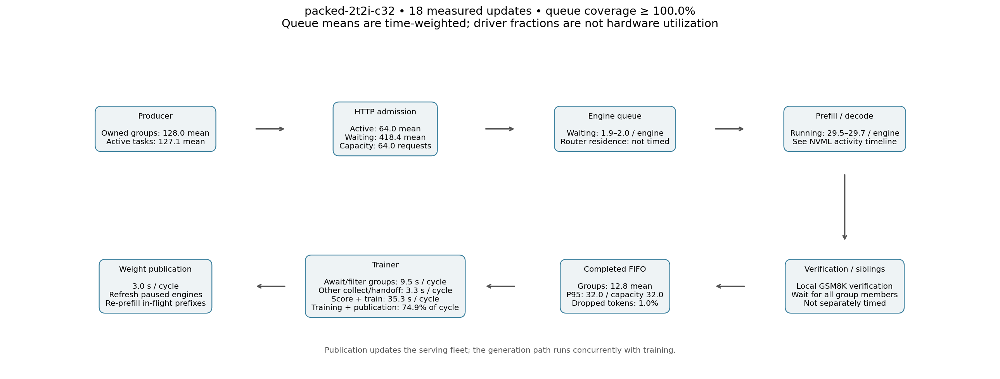
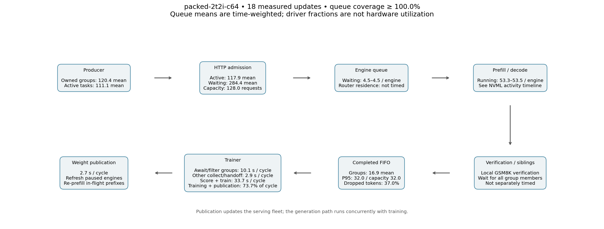

# Packed trainer and inference capacity screening

These are full-SFT KDA/latent-MoE results on B300, not hero-shape results. No
optimizer/precision defaults have been promoted from this screen.

## Live RL, two EP trainer GPUs and two TP1 inference GPUs

Both successful runs used 24 updates, batch 128, 6144-token packing, dynamic
routed SwiGLU rows, FA4, replay, activation recomputation, standalone scoring,
and exhaustive replay diagnostics. The warm window is updates 6–23. Samples
and their lengths differ between runs, so compare useful token throughput
rather than only step latency. Startup, evaluation, checkpointing, and terminal
drain are excluded from these warm rates.

| Per-engine concurrency | Useful response tokens/s | Median score s | Median forward/backward/optimizer s | Awaited collection fraction | Warm stale-token discard fraction |
| --- | ---: | ---: | ---: | ---: | ---: |
| 32 | 4930 | 6.83 | 25.19 | 25.1% | 0.98% |
| 64 | 4812 | 6.48 | 22.67 | 26.3% | 36.97% |

Awaited collection includes queue expiry filtering and handoff; it is not purely
inference compute. Median components do not sum to median cycle time. Warm
compilation may still contribute; the independent trainer screen records actual
compiler activity to resolve this.

The all-rank replay audit passed all 24 updates in both jobs: all 19 routed
layers, 64 samples per rank per update, zero mismatched recorded expert IDs,
and replay observed in gradient-enabled training and backward recomputation.
This validates replay use and alignment, not learning-curve parity.

Final lifecycle accounting, **after draining already-owned work**, found:

| Concurrency | Unused complete groups | Unused complete responses | Unused response tokens | Fraction of all accounted response tokens |
| --- | ---: | ---: | ---: | ---: |
| 32 | 160 | 640 | 1,288,265 | 15.69% |
| 64 | 155 | 620 | 1,356,212 | 12.97% |

These are terminal unused completions, distinct from stale queue drops. The
fraction denominator includes all updates' consumed tokens, stale drops, and
terminal completions; it excludes unobserved aborted/dynamically filtered work.
The completed queue temporarily expands during shutdown. Consequently the final
inventory can exceed the ordinary 128-response queue limit. Zero or low warm
drops never implied zero accumulation.

The 128- and 256-concurrency live refresh runs failed at 8 and 6 completed
updates, respectively, with MILES-router `ReadError` and returned HTTP 503. They
are **not qualified configurations**. The available log does not establish a
GPU OOM or capacity ceiling; many engine requests still succeeded near the
failure. Do not silently retry responses and lose behavior/version provenance.

Runs:

1. [Packed c32](https://beaker.org/ex/01M2EPST6YAD4B4PJWCZAEXFR9)
2. [Packed c64](https://beaker.org/ex/01M2EPSY7ZS8KAQ8W6REQ762VC)
3. [Packed c128, failed](https://beaker.org/ex/01M2EQMMT53AMHBYXS3W7F7RWP)
4. [Packed c256, failed](https://beaker.org/ex/01M2EQMTBBGF0K6GKMTE43PNV6)

## Independent inference capacity

One TP1 B300 engine; same initial HF model; 512-token distinct inputs and 2048
output tokens per response, ignore-EOS, returned routes and logprobs. Warm
repeats 2–3 after a short warmup and one full-length batch. Rates include
prefill and result delivery and are weighted by total elapsed time.

| Concurrent sequences | Warm output tokens/s/GPU |
| --- | ---: |
| 32 | 4,749 |
| 64 | 6,171 |
| 128 | 8,205 |
| 256 | 10,749 |
| 512 | 13,535 |

Throughput was still rising at 512. This demonstrates additional batch capacity
in the frozen engine, not reliability of the HTTP fleet router or live mixed
policy refresh at those limits. Pools were sized for 512, memory fraction 0.9,
and decode graphs captured through 512 for the entire experiment. This differs
from the live runs' 0.6 fraction and smaller pools.

[Completed fixed-policy sweep](https://beaker.org/ex/01M2ER5D8WRAS7BQ1DG7Q7N438).
A [512/1024 follow-up](https://beaker.org/ex/01M2ETMM7YMRGHMA5QAEJP3A7Z) uses
workload-sized pools, as described in
[the campaign notes](packing-concurrency-20260914.md).

## Current interpretation

Packing reduces trainer work; raising inference concurrency alone does not
improve useful live throughput in these runs and can increase stale work.
Optimize the trainer on identical retained batches, establish robust high-load
refresh/transport, and then rebalance producer admission and queue capacity.
The [trainer screening plan](../plans/trainer-throughput-20260914.md) retains
the dynamic-row safeguard and measures scoring, backward, optimizer, and
compilation separately.

The next c128 repeat changes only failure diagnostics: the router logs the
underlying exception chain, selected endpoint, request path, and active count.
It still returns 503 and releases ownership on a transport error. It does not
retry generation or log prompts/headers. This distinguishes a failed connection
from engine compute failure without changing policy bookkeeping.

## Measured queue views for completed runs

These diagrams cover the two completed packed RL runs. The ongoing trainer-only
and transport-diagnostic experiments are not included. Queue means are
sample-time-weighted; CPU driver occupation is not GPU hardware utilization.
Final drain inventory is reported separately above.

Warm timelines: [c32](packed-capacity-20260914/packed-2t2i-c32-steady-pipeline.png),
[c64](packed-capacity-20260914/packed-2t2i-c64-steady-pipeline.png).
