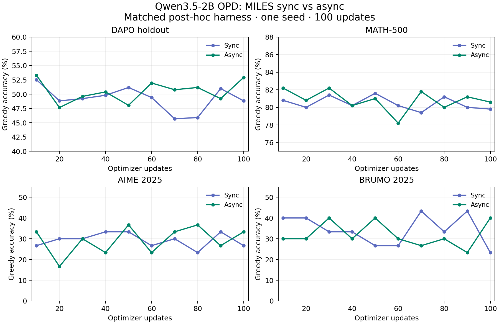

# Qwen3.5-2B OPD: async versus the sync v5 baseline

Kevin requested this comparison on September 21: run the 2B async counterpart,
log policy age, discarded samples/tokens, response lengths, truncation, and trainer
waiting time; compare learning with MILES sync and the Open Instruct sync/async gap.

## Recipe and controls

- Student `Qwen/Qwen3.5-2B`, revision `15852e8c16360a2fea060d615a32b45270f8a8fc`.
- Teacher: the same verifier-DPPO 2B checkpoint ending `__42__1788675225`.
- Same rendered `qwen35-math-v1` prompts, seed 42, 128 prompts × 2 responses,
  16,384 response tokens, LR 1e-6, KL coefficient 1, response-mean loss,
  rollout-engine student log probabilities and native PPO clipping.
- 100 optimizer updates; greedy evaluation and HF exports every ten updates.
  `hf-9` means ten updates, `hf-99` means 100 updates.
- Same allocation as sync v5: **8 B300s on Holmes**, with four trainer GPUs
  (TP2), three TP1 student engines, and one teacher GPU. The original throughput
  handoff's H100 description does not describe this actual sync run.
- Async: native `train_async.py`, fully asynchronous producer, group submission,
  1,024 producer samples, 256 completed groups (512 responses), FIFO,
  stale/aborted prompts dropped, publication after each update, maximum age three
  optimizer updates at consumption. The configured pause mode is `retract`, but the pinned version-publication
  patch aborts outstanding requests before resuming generation. Completed buffered
  responses remain eligible; this is not the Core mixed-policy refresh path.
- **TIS remains off.** The sync baseline uses rollout log probabilities, which
  native MILES forbids combining with TIS. Turning TIS on would change the
  student-side OPD signal and PPO anchor, confounding the scheduling comparison.
- Retain two native optimizer checkpoints in this new run, and every saved HF
  export. Existing baseline data is untouched.

Config: `configs/miles/opd/qwen35-2b-opd-async-lag3.toml`.
Image: `01M2V7V946ZN9N9STPK0H04YWM`, plus a committed wrapper code overlay.
Qualification: a separate four-update smoke (4×2 responses, 512 tokens) exercises
teacher scoring, async/eval transitions, checkpoint/audit and fresh export reload
before the full recipe. Passing it establishes mechanics only.

## Metrics and interpretation

| Measurement | Retained metric |
|---|---|
| Trainer time outside training | `perf/train_wait_time` |
| Fraction outside training | `perf/wait_time_ratio` |
| Training / optimizer time | `perf/train_time`, `perf/actor_train_time` |
| Update interval | `perf/step_time` |
| Collection latency | `perf/rollout_time`, `rollout/fully_async/collection_seconds` |
| Async queue waiting | `rollout/fully_async/completed_queue/consumer_wait_seconds` |
| Policy age at consumption | `rollout/fully_async/consumed_age_mean`, `consumed_age_max` |
| Dropped/delivered groups, samples and response tokens | `rollout/fully_async/completed_queue/*` |
| Discard rates by length and age | `completed_queue/dropped_samples_fraction_by_length/*`, `dropped_samples_fraction_by_age/*` |
| Other queue outcomes | `rollout/fully_async/aborted_groups_filtered`, `stale_groups_filtered` |
| Response distribution | `rollout/response_len/*`, `rollout/truncated_ratio`, `rollout/repetition_frac` |
| Mixed-version responses | `rollout/weight_version/mixed_version_ratio` |
| Learning and update health | Per-dataset greedy eval, reverse KL/advantages, loss, gradient norm, audit and export reload |

`train_wait_time` includes publication, checkpoint and evaluation overhead between
training calls. Compare ordinary steps separately from those boundaries; exclude
the first two updates after initialization/resume. Async queue/collection time can
overlap training and **must not be labeled trainer idle time**. Native
`perf/tokens_per_gpu_per_sec` divides delivered tokens by collection latency and
is not actual async engine generation throughput. Normalize useful delivered
tokens and update wall time against all eight allocated GPUs for cost comparisons.

MILES native async prefetch assembles batch N+1 before updating N. The OPD adapter
checks queue age against the version that will consume that batch, including this
one-update offset. Its first publication after initialization/resume is version 1.
The restart ledger retains prefetched prompt identities until their own update
is checkpointed, so preemption does not silently skip prefetched batches.

## Existing sync baseline

Experiment: <https://beaker.org/ex/01M2NJB3HF380VQ1554FZPSKN7>.
Final result dataset: `01M2QF9GDANQKN5NPP8760WRKX`, `run/training.log`.
The training log contains all 100 rollout IDs and five repeated updates; retain
the last occurrence per ID. Excluding startup/resume warmup and steps immediately
following periodic save/eval gives this preliminary ordinary-step summary:

| Metric | Mean | Median |
|---|---:|---:|
| Trainer wait | 555.1 s | 557.2 s |
| Training | 64.4 s | 63.8 s |
| Update interval | 619.5 s | 621.1 s |
| Wait fraction | 89.6% | 89.7% |

The extraction and raw metrics are retained under
`opd-campaign-scratch/miles-async2b/`. Final comparisons must use matched update
ranges and explicitly account for preemption/replayed updates.

This asks whether MILES reproduces the Open Instruct 2B async collapse. A stable
MILES async curve would show the failure is not inevitable for async OPD; different
batch selection, clipping and publication semantics mean it would not isolate a
single cause. The 100-update comparison matters because Open Instruct collapsed
at update 100 as well as early in training.

## Final comparison — 2026-09-23

Completed analysis: 2026-09-23T02:25:02Z.

MILES async did not reproduce the Open Instruct 2B collapse. All 100 optimizer updates, the audit, fresh final-export reload, and all ten matched checkpoint evaluations passed. Ordinary updates were 10.80% shorter, but responses were also shorter and useful tokens per allocated GPU-second were 3.22% lower. This is one seed and a particular async implementation; it does not establish that async universally improves learning or identify the cause of the Open Instruct failure.

### Matched learning results

Each cell is **async / sync** accuracy in percent. Same historical greedy evaluation harness, image, datasets, seed 42 and 16,384-token cap. `hf-N` represents N+1 optimizer updates. These are post-hoc scores, not the separate in-run SGLang evaluations.

| Updates | DAPO | MATH-500 | AIME 2025 | BRUMO 2025 |
|---:|---:|---:|---:|---:|
| 10 | 53.32 / 52.54 | 82.20 / 80.80 | 33.33 / 26.67 | 30.00 / 40.00 |
| 20 | 47.66 / 48.83 | 80.80 / 80.00 | 16.67 / 30.00 | 30.00 / 40.00 |
| 30 | 49.61 / 49.22 | 82.20 / 81.40 | 30.00 / 30.00 | 40.00 / 33.33 |
| 40 | 50.39 / 49.80 | 80.20 / 80.20 | 23.33 / 33.33 | 30.00 / 33.33 |
| 50 | 48.05 / 51.17 | 81.00 / 81.60 | 36.67 / 33.33 | 40.00 / 26.67 |
| 60 | 51.95 / 49.41 | 78.20 / 80.20 | 23.33 / 26.67 | 30.00 / 26.67 |
| 70 | 50.78 / 45.70 | 81.80 / 79.40 | 33.33 / 30.00 | 26.67 / 43.33 |
| 80 | 51.17 / 45.90 | 80.00 / 81.20 | 36.67 / 23.33 | 30.00 / 33.33 |
| 90 | 49.22 / 50.98 | 81.20 / 80.00 | 26.67 / 33.33 | 23.33 / 43.33 |
| 100 | 52.93 / 48.83 | 80.60 / 79.80 | 33.33 / 26.67 | 40.00 / 23.33 |

At 100 updates: DAPO **52.93 vs 48.83 (+4.10 pp)**; MATH-500 **80.60 vs 79.80 (+0.80 pp)**; AIME **33.33 vs 26.67**; BRUMO **40.00 vs 23.33**. Across all ten checkpoints, mean DAPO async-minus-sync is +1.27 pp. Checkpoints are correlated and there is no multi-seed uncertainty estimate. AIME and BRUMO each have only 30 questions.

### Timing and eight-GPU cost

Both training arms used 8 B300s: 4 Megatron trainer GPUs (TP2), 3 TP1 student SGLang engines, and 1 teacher engine. Deduplicate sync replayed updates by retaining the last occurrence. Compare the same 87 ordinary update IDs, excluding the first two updates of every attempt and updates immediately after periodic save/evaluation. Native logs reproduce the W&B timing exactly.

| Measurement | Sync | Async |
|---|---:|---:|
| Ordinary update interval | 619.30 s | 552.41 s |
| Trainer time outside training | 555.11 s | 490.07 s |
| Training time | 64.19 s | 62.34 s |
| Weighted wait fraction | 89.64% | 88.72% |
| Allocated GPU-minutes per ordinary update | 82.57 | 73.65 |
| First job start to final exit | 25 h 35 m | 20 h 12 m |
| Sum of running attempts | 23 h 50 m | 20 h 12 m |
| Allocated training-job GPU-hours | 190.73 | 161.65 |

Ordinary updates save **66.89 seconds (10.80%)**; wait saves **65.04 seconds (11.72%)**. Sync was preempted twice and repeated five updates. Its additional restart/queue costs confound the larger end-to-end reduction; the ordinary matched comparison is the cleaner scheduling measurement. Total job costs include startup, save/evaluation, audit and shutdown; post-hoc evaluation jobs are additional and excluded.

`perf/train_wait_time` measures time outside training, including publication and save/evaluation overhead; it is not a pure rollout-idle profiler. The ordinary-step filter removes save/evaluation boundaries, but publication remains included. Across the 100 deduplicated update intervals, recorded time sums to 21.64 h sync versus 19.59 h async. This interval sum excludes work after the final training call, including final evaluation/audit/reload, so it is not the end-to-end runtime. Reported async collection (mean 533.97 s) and queue wait (524.66 s) overlap training and must not be added as trainer idle.

### Policy age, useful work and discarded work

- Configured maximum consumption age: 3 optimizer updates; weights published after every update. Actual batch maximum age was 0 for 1 batch, 1 for 4, and 2 for 95. Mean response age was **1.192 updates**.
- Delivered response age counts: age 0 = 256; age 1 = 20,172; age 2 = 5,172; age 3 or older = 0.
- Delivered 12,800 prompt groups / **25,600 responses / 274,277,904 response tokens**.
- Mean response length: async **10713.98** vs sync **12432.88** tokens. Truncation: async **24.00%** vs sync **36.83%**. Length and sample selection differ, so faster updates are not identical generated-token workloads.
- Delivered response tokens per allocated GPU-second over the same ordinary IDs: async **621.32**, sync **642.00**. This normalizes useful delivered tokens by update wall time and all eight GPUs; it is not raw generation-engine throughput.
- Completed-queue stale drops: **0 groups, samples and response tokens**, with zero drops in every recorded age/length bin. Upstream stale-group filtering also reports zero.
- **49,517 aborted-group filter events** were logged before completed-queue admission across the 100 collection windows. The native counters reset each window. A group is rejected if it contains an aborted sample; this includes partial or queued requests and is not 49,517 complete generated responses. Do not interpret zero completed-queue drops as zero wasted generation.
- **Limitation:** upstream aborted partial-token totals and their age/length distribution were not recorded. Completed-queue metrics preserve sample bins and aggregate token totals, not tokens jointly binned by age/length. Those missing quantities cannot be recovered reliably from aggregate logs; no claim of full cancellation-cost accounting is made.
- Mixed-version response fraction: **0 for every training batch**.

| Delivered response length (tokens) | Samples |
|---|---:|
| 0–255 | 0 |
| 256–511 | 33 |
| 512–1023 | 407 |
| 1024–2047 | 998 |
| 2048–4095 | 1,523 |
| 4096–8191 | 5,240 |
| 8192–16383 | 11,255 |
| 16384–plus | 6,144 |

### Effective async behavior and cross-stack interpretation

The native driver assembles batch N+1 before publishing the weights from update N. The background producer has a 1,024-sample limit and a 512-response completed buffer. Group submission and FIFO consumption are used. The age check includes the prefetch offset; `max_weight_staleness=3` is a ceiling, not Open Instruct `async_steps=3`.

Although pause mode is `retract`, the pinned `runtime/miles/patches/miles.patch` changes `SGLangEngine.update_weight_version` to `abort_all_requests=True`. The distributed updater invokes it before resuming generation. Outstanding requests are therefore aborted and filtered; completed buffered responses remain eligible under the age cap. This run did not continue partial responses across weight versions. The earlier recipe wording about retract alone was incomplete.

For Open Instruct, the historical matched greedy endpoints are DAPO **0.9765625% async** (W&B `pszko9zn`, canonical training `v171addf`) versus **47.65625% sync** (`4vadl3oy`): **−46.6796875 pp**. MILES is **+4.1015625 pp** at 100 updates. The disparities are clearly different. Open Instruct async MATH-500 was not present in that historical endpoint summary, so no corresponding MATH gap is claimed.

This shows that collapse is not inevitable for async OPD under this MILES configuration. It does **not** isolate the cause: MILES has lower measured age, cancellation at publication, its own completion/selection behavior, PPO clipping instead of the Open Instruct DPPO/TV objective, SGLang rather than vLLM, and 8 rather than 32 training-run GPUs. Both MILES arms use rollout-engine behavior log-probabilities and TIS off. The per-stack evaluations are matched within each pair; the stack comparison is not a single-variable ablation.

### Validation and provenance

- Four-update qualification: 24 runtime tests passed, audit passed, fresh hf3 reload passed.
- Full run: exit 0, 100 updates, maximum advantage error 0; 280 tensors changed from base and 253 from previous export; 18 FP32 A_log tensors preserved. Fresh hf99 reload generated 32 tokens. All ten post-hoc jobs exited 0.
- Training: https://beaker.org/ex/01M338D7FBJYJX6YWJ0NX5RA03 ; sync: https://beaker.org/ex/01M2NJB3HF380VQ1554FZPSKN7 . Sync training completed its updates; its exit1 was the previously diagnosed post-training audit issue, subsequently checked manually.
- Training image `01M2V7V946ZN9N9STPK0H04YWM`; committed code overlay `4d47a783228ab2ad90e40724f6de51a3c2ec1249`. Training launched through `python -m open_instruct.miles run` and its committed-image wrapper.
- Post-hoc image `01M01EPKXMXR4502S1HNJVYN0M`, historical reference experiment `01M2RD932J83K39RG0NN6FJNVN`. Same immutable evaluation spec replayed with new checkpoint/output/run identities; trained weights synchronized into vLLM. Greedy pass@1, seed42, same DAPO/AIME/BRUMO/MATH-500 inputs, 16K response cap.
- Raw logs, W&B histories, score summaries, launch receipts, exact sync baselines, timing extraction and bins: `/Users/kevinfarhat/repos/opd-campaign-scratch/miles-async2b/`.
- Final tables: `matched-learning-comparison.json`; diagnostic aggregates: `full-rollout-diagnostics.json`; native timing verification: `final-native-log-timings.json`; summary: `final-comparison-summary.json`.

| Updates | Async evaluation experiment | W&B run |
|---:|---|---|
| 10 | [01M33WT3V4KVNGW2GNWEGN96G5](https://beaker.org/ex/01M33WT3V4KVNGW2GNWEGN96G5) | [3447bf9c](https://wandb.ai/allenai-team1/opd/runs/3447bf9c) |
| 20 | [01M351M82P18HEBXTNT5AB1P2P](https://beaker.org/ex/01M351M82P18HEBXTNT5AB1P2P) | [7a9f897a](https://wandb.ai/allenai-team1/opd/runs/7a9f897a) |
| 30 | [01M351M92ND391V9XT254PH66F](https://beaker.org/ex/01M351M92ND391V9XT254PH66F) | [c33cc375](https://wandb.ai/allenai-team1/opd/runs/c33cc375) |
| 40 | [01M351M9V5FHXYF7AEMKP2RQZ9](https://beaker.org/ex/01M351M9V5FHXYF7AEMKP2RQZ9) | [daea26fe](https://wandb.ai/allenai-team1/opd/runs/daea26fe) |
| 50 | [01M351MAM6C7JW8C397624R4JV](https://beaker.org/ex/01M351MAM6C7JW8C397624R4JV) | [0ae7773e](https://wandb.ai/allenai-team1/opd/runs/0ae7773e) |
| 60 | [01M351MBDWPQM9NXCDX35TWBEW](https://beaker.org/ex/01M351MBDWPQM9NXCDX35TWBEW) | [6eaffb15](https://wandb.ai/allenai-team1/opd/runs/6eaffb15) |
| 70 | [01M351MCDG2W4TT0DWJK5MHKFP](https://beaker.org/ex/01M351MCDG2W4TT0DWJK5MHKFP) | [10c45c99](https://wandb.ai/allenai-team1/opd/runs/10c45c99) |
| 80 | [01M351MD6REF34TCZ7WQKX9N5M](https://beaker.org/ex/01M351MD6REF34TCZ7WQKX9N5M) | [ca7d0c1c](https://wandb.ai/allenai-team1/opd/runs/ca7d0c1c) |
| 90 | [01M3602SS9YR4J0JFGVCZ7AYW1](https://beaker.org/ex/01M3602SS9YR4J0JFGVCZ7AYW1) | [8d4116d0](https://wandb.ai/allenai-team1/opd/runs/8d4116d0) |
| 100 | [01M35EDH2S76TKJB12J7W6BNRK](https://beaker.org/ex/01M35EDH2S76TKJB12J7W6BNRK) | [f40f7d14](https://wandb.ai/allenai-team1/opd/runs/f40f7d14) |
