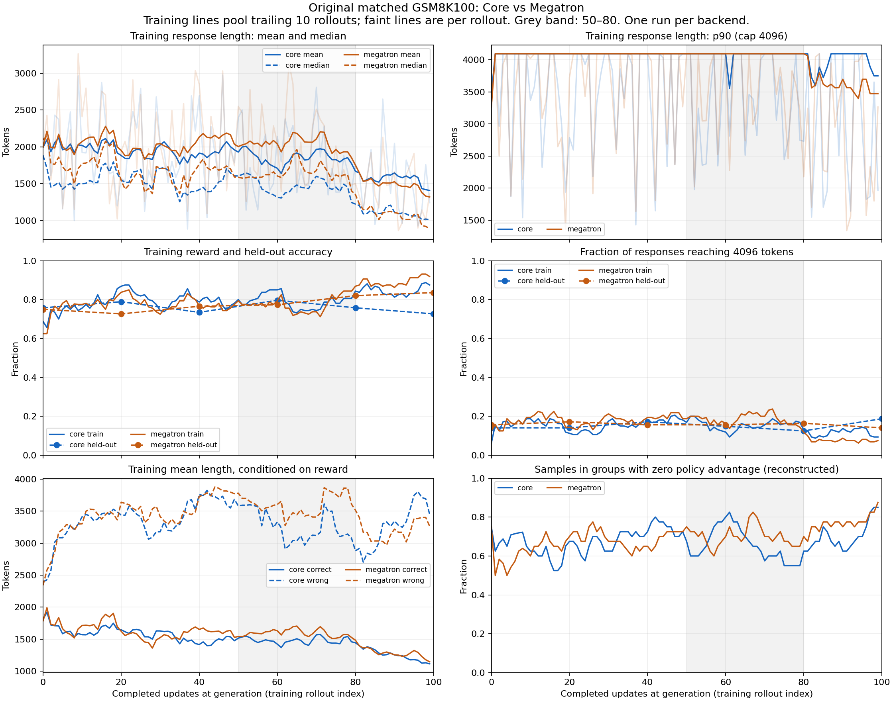

# Original GSM8K 100 response-length audit

> Historical evidence. For current operating instructions, start at the [MILES guide](../index.md).

The retained training responses do not show a simple relationship where the backend with longer answers learns better. Megatron is longer through much of the first 80 updates, but its held-out improvement from updates 60 to 100 accompanies substantially shorter answers. Core also shortens its training answers, while its held-out accuracy declines over that interval. This is descriptive evidence from one run per backend, not a causal test of response length.

[Complete JSON](response-lengths-100-20260911.json) contains every update's mean, median, p90, cap/truncation fractions, reward, correct/wrong conditional lengths, group-centered zero-advantage reconstruction, all per-sample lengths/IDs and original dump hashes. [Plot](response-lengths-100-20260911.png) pools trailing 10 training rollouts and marks the 50–80 interval; held-out points are unsmoothed. The x-axis for training is the completed-update count before the next optimizer update.

## All 100 training updates

| Metric | Core | Megatron |
|---|---:|---:|
| Training responses |1600|1600|
| Mean / median tokens |1816 /1400|1898 /1487|
| p90 tokens |4096|4096|
| Mean correct / wrong length |1455 /3323|1517 /3477|
| Correct responses |1291 /1600 (80.69%)|1289 /1600 (80.56%)|
| Response-cap fraction |14.44%|15.75%|
| Samples in uniform-reward groups |68.25%|71.00%|
| Entire updates with zero current policy advantages |21|29|

The wrong-answer median is 4096 in both arms. Long wrong answers and truncation therefore contribute heavily to aggregate length. Conditioning on correctness describes the outputs; it cannot establish that changing length would change correctness.

## The50–80 window and what follows

Each ten-rollout row below contains 160 responses, from 40 matched prompt groups per backend. These are different prompts across windows; the prompts are matched across backends.

| Training rollout indices | Core mean / median | Megatron mean / median | Core / Megatron cap fraction | Core / Megatron reward |
|---|---:|---:|---:|---:|
|50–59|1735 /1349|2087 /1660|12.50% /17.50%|85.00% /77.50%|
|60–69|1898 /1535|2062 /1637|14.38% /20.00%|75.00% /73.75%|
|70–79|1772 /1245|1852 /1402|16.88% /14.38%|80.63% /84.38%|
|80–99 (320 responses)|1512 /1071|1415 /1021|10.63% /7.50%|85.31% /89.69%|

All 50–80 pooled p90 values remain at 4096. There is no clean monotonic training-length increase in that interval; Megatron's reduction becomes strongest afterward. The 60–79 uniform-reward sample fraction is 58.75% Core versus 70.00% Megatron, so the better eventual held-out result does not coincide with more nonzero policy-advantage samples in this window.

| Held-out update | Core accuracy / mean tokens / cap fraction | Megatron accuracy / mean tokens / cap fraction |
|---|---:|---:|
|0|75.78% /1782 /14.06%|75.00% /1748 /15.63%|
|60|79.69% /1710 /14.84%|77.34% /1813 /15.63%|
|80|75.78% /1501 /12.50%|82.03% /1361 /16.41%|
|100|72.66% /1664 /18.75%|83.59% /1218 /14.06%|

The held-out set is the same 128 questions at each point. From 60 to 100, Megatron's mean answer length falls 32.8% and accuracy rises 6.25 percentage points. Core's mean length falls 2.6% net, after dipping at 80, and accuracy falls 7.03 points. Its final cap fraction rises to 18.75%. These patterns motivate examining which questions switch between correct, wrong and capped states, and whether update-zero arithmetic differences alter later trajectories; they do not identify the cause.

## Verification and scope

This audit reread the original WEKA `core/rollouts` and `megatron-r3/rollout_data` using `torch.load(map_location="cpu", weights_only=True)` inside our existing authorized container, with one CPU thread. It performed no GPU operations and made no remote writes. All 100 training dumps and all 6 held-out dumps per arm passed exact membership/multiplicity, prompt/label/verifier identity, prepared prompt-token SHA, finite response log-probability length, response status/cap, independent GSM8K reward reconstruction, and declared policy-version checks. Core version equals completed updates; Megatron version is completed updates plus 1. All 212 dump hashes match the earlier complete campaign audits. This analysis does not revalidate optimizer/publication completion records; those belong to the linked campaign audit provenance retained in JSON.

The zero-advantage share is reconstructed from four-sample groups with equal binary rewards under the configured group-centered GRPO objective. It is not a capture of internal advantage tensors, and it does not imply no parameter update: auxiliary losses and Adam momentum remain active. No statistical significance, causal claim, or length-reward change is inferred.

Reproduce collection with `python -m scripts.miles.analyze_response_lengths CAMPAIGN_ROOT > report.json` on CPU with WEKA access. Render with `python -m scripts.miles.plot_response_lengths report.json figure.png`. The collector deliberately fixes the original 100 protocol and `megatron-r3` directory; it must not be silently reused for the active 500 or light-SFT200 campaigns.
