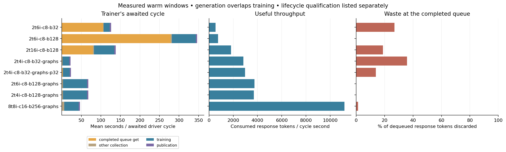
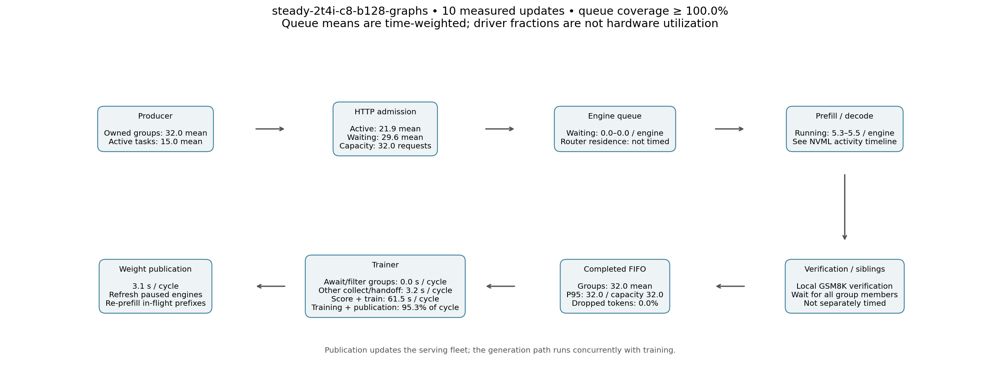
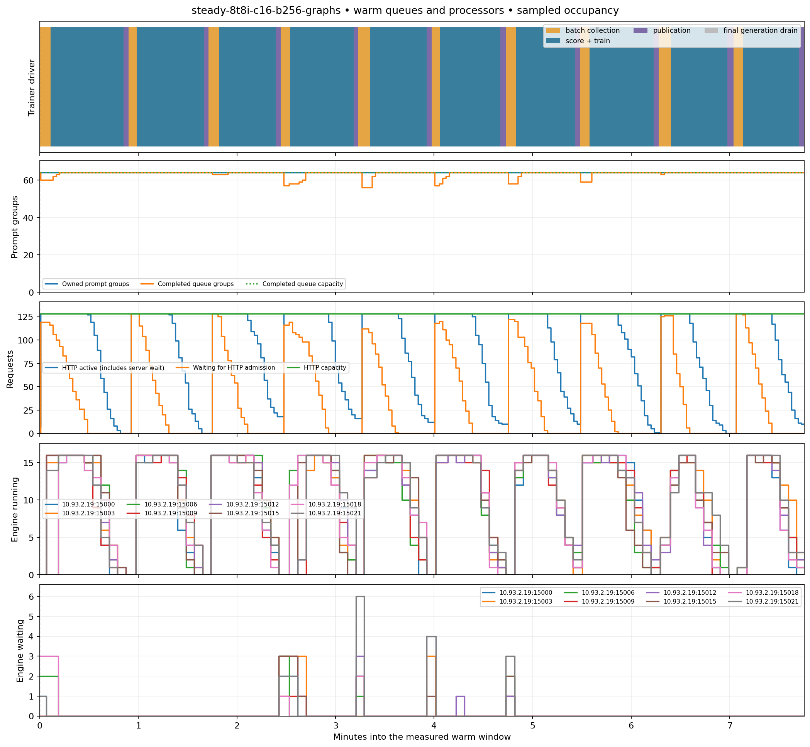
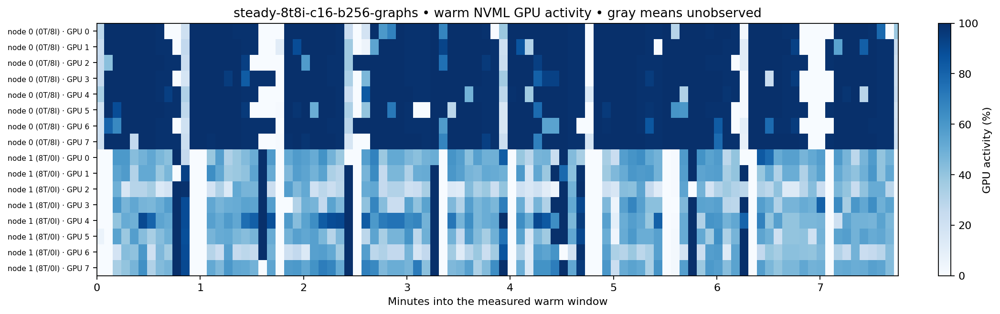
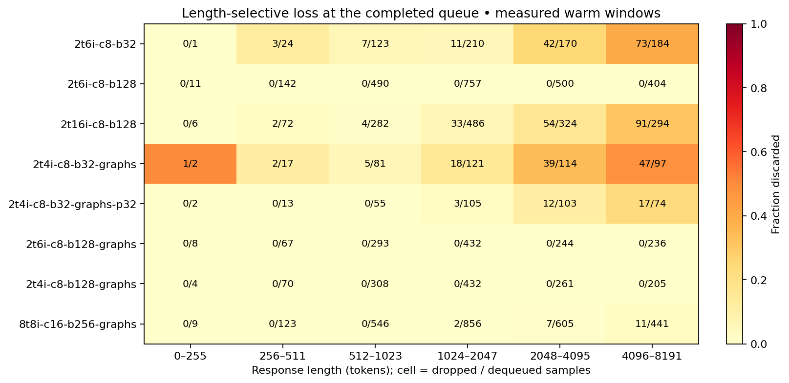

# Throughput qualification — September 13, 2026

**Follow-up:** the [concurrency-32 trial](throughput-c32-20260913.md) subsequently
matched the small configuration with two inference GPUs. The tables below
retain the original basket measurements; the current small example uses 2T/2I.

The recommended full-model starting points are **2 trainer + 4 inference GPUs at
batch 128**, and **8 trainer + 8 inference GPUs at batch 256**. Both supplied the
trainer with effectively zero completed-buffer waiting. Full decode CUDA graphs
were more useful than adding inference GPUs to the graphs-off configuration.

The final four-engine run passed all 16 updates and its replay audit, consumed
3,699 response tokens/s, and dropped no completed tokens in the ten-update warm
window. Six engines delivered 3,750 tokens/s: about 1.4% more throughput for two
extra GPUs. We therefore selected four engines for `small`. EP8 delivered 11,161
tokens/s with 1.3% discarded tokens. These are short operational measurements,
not a claim about learning per GPU-hour.

The [throughput guide](../throughput-profiles.md) gives the recommended settings;
the [campaign log](throughput-campaign-20260913.md) retains earlier measurements
and repairs. All launched trials are complete or explicitly canceled below.

## Measured scope

All full-model arms use the same 18.5B-total full-SFT KDA/latent MoE HF checkpoint,
frozen prepared GSM8K fixture, response cap 4096, context limit 6144, four responses
per prompt, learning rate 1e-6, PPO clipping 0.2/0.28, auxiliary/z coefficients
0.01/1e-5, no GRPO standard-deviation normalization, FIFO whole groups, and maximum
policy lag two. Batch size is explicit in every comparison. This is throughput
and runtime-contract qualification, not a learning or held-out-accuracy study.

The fixture is retained at
`/weka/oe-training-default/robertb/open-instruct/gsm8k-parity/20260910-core-megatron-v1`.
The [machine-readable report](../results/throughput-profiles-20260913.json) includes
per-run commit, immutable image, archive checksum, full resolved run specification,
allocation, per-update timing, token/drop/age records, and sampled occupancy.

All GPU runs use urgent Holmes placement, workspace `ai2/open-instruct-dev`, with
one-hour minimum runtime for the full-model trials. W&B project is
`ai2-llm/olmo-rl-comparison`, group `throughput-profiles-20260913-v1`.

<!-- measured-tables:start -->
## Completed steady-state comparisons

Every row here passed its intended optimizer sequence on every trainer rank and
clean workflow shutdown. Warm windows are updates 7–16, or 7–24 for the two
longer graphs-off 2T/6I controls. `B` is samples per optimizer step; `T` and `I`
are trainer and inference GPUs. GPU counts are allocated/used. Rates exclude
startup, eval, checkpointing, export and shutdown.

| Configuration | GPUs | Consumed tokens/s | Buffer get/filter | Other collection/handoff | Train + publish | Discarded tokens |
|---|---:|---:|---:|---:|---:|---:|
| [2T/6I · B32 · graphs off](https://beaker.org/ex/01M2E50PF1P60341G91J31F1SK) | 8/8 | 536 | 83.92% | 0.7% | 15.4% | 27.0% |
| [2T/6I · B128 · graphs off](https://beaker.org/ex/01M2E50T7MYJQWPY7NJ8V787E3) | 8/8 | 744 | 80.34% | 0.9% | 18.7% | 0.0% |
| [2T/16I · B128 · graphs off](https://beaker.org/ex/01M2E8YXBZ2E3B7JZW6RH6KYMV) | 24/18 | 1,816 | 57.53% | 2.0% | 40.4% | 18.9% |
| [2T/4I · B32 · graphs full](https://beaker.org/ex/01M2EC9EXRGJZBW3EPHHQRP654) | 6/6 | 2,842 | 4.80% | 3.3% | 91.9% | 35.7% |
| [2T/4I · B32 · graphs full · P32](https://beaker.org/ex/01M2EDXFC29XSYAG6KKC2E7S79) | 6/6 | 2,968 | 8.62% | 3.5% | 87.9% | 13.8% |
| [2T/6I · B128 · graphs full](https://beaker.org/ex/01M2EAA3NKFZRTS5QQ6FKGDEHB) | 8/8 | 3,750 | 0.00% | 4.7% | 95.3% | 0.0% |
| [2T/4I · B128 · graphs full](https://beaker.org/ex/01M2EFKC5B3KX2M1KQV0XYDPM5) | 6/6 | 3,699 | 0.00% | 4.7% | 95.3% | 0.0% |
| [8T/8I · B256 · graphs full](https://beaker.org/ex/01M2ECRJRWEHM8ANP5WYD4FZK1) | 16/16 | 11,161 | 0.01% | 13.1% | 86.9% | 1.3% |

Fractions are of the awaited driver cycle, except the discarded-token column,
whose denominator is delivered plus dropped tokens at completed-queue dequeue.
`P32` explicitly halves the original 64-sample producer budget. The other graph
batch-32 run uses the automatic 64-sample budget. All keep FIFO and lag two.

## Mean cycle components and allocation efficiency

| Configuration | Buffer get/filter (s) | Other collection (s) | Score + train (s) | Publish (s) | Tokens/allocated GPU-second |
|---|---:|---:|---:|---:|---:|
| 2T/6I · B32 · graphs off | 105.87 | 0.86 | 15.80 | 3.62 | 67 |
| 2T/6I · B128 · graphs off | 278.45 | 3.18 | 61.34 | 3.60 | 93 |
| 2T/16I · B128 · graphs off | 79.42 | 2.82 | 51.81 | 3.99 | 76 |
| 2T/4I · B32 · graphs full | 1.06 | 0.74 | 17.24 | 3.06 | 474 |
| 2T/4I · B32 · graphs full · P32 | 2.01 | 0.82 | 17.56 | 2.94 | 495 |
| 2T/6I · B128 · graphs full | 0.00 | 3.19 | 61.34 | 3.25 | 469 |
| 2T/4I · B128 · graphs full | 0.00 | 3.16 | 61.51 | 3.05 | 616 |
| 8T/8I · B256 · graphs full | 0.00 | 6.09 | 37.32 | 3.11 | 698 |

Generation overlaps these stages. Engine processing time must not be added to
this table as a separate serial stage. Allocation efficiency uses warm-cycle
seconds and includes reserved-but-unused GPUs; it excludes cold-start costs and
is not a hardware FLOP-utilization measure.

## Warmup evidence

| Configuration | First scoring (s) | First forward/backward/optimizer (s) | Warm forward/backward range (s) | Warm updates |
|---|---:|---:|---:|---:|
| 2T/6I · B32 · graphs off | 148 | 253 | 11.5–14.0 | 18 |
| 2T/6I · B128 · graphs off | 224 | 424 | 40.0–51.4 | 18 |
| 2T/16I · B128 · graphs off | 243 | 361 | 39.4–41.5 | 10 |
| 2T/4I · B32 · graphs full | 161 | 287 | 11.8–16.8 | 10 |
| 2T/4I · B32 · graphs full · P32 | 142 | 228 | 12.1–17.1 | 10 |
| 2T/6I · B128 · graphs full | 224 | 418 | 46.1–48.2 | 10 |
| 2T/4I · B128 · graphs full | 214 | 377 | 46.3–49.5 | 10 |
| 8T/8I · B256 · graphs full | 387 | 630 | 25.8–34.8 | 10 |

The largest cold first pass was in EP8: scoring 387 seconds and the optimizer
pass 630 seconds. Subsequent forward/backward times were 135, 41, 32, 37 and 28
seconds. Later warm variation remains visible; the six-update exclusion removes
the major initialization spikes. These are observed phase times, not proof that
every initial second was compilation or that all future compiler misses cease.

## Sampled hardware activity

Ranges are per-device time-weighted means within the observed warm window.
NVML reports GPU kernel activity; it is not SM occupancy or FLOP utilization.
Missing coverage is excluded from these means and shown in the figures.

| Configuration / allocation node | Trainer GPU activity | Serving GPU activity | Reserved unused GPU activity | Minimum coverage |
|---|---:|---:|---:|---:|
| 2T/6I · B32 · graphs off, node 0 | 5.4–7.9% | 10.8–13.5% | — | 66% |
| 2T/6I · B128 · graphs off, node 0 | 6.2–9.1% | 10.3–12.5% | — | 100% |
| 2T/16I · B128 · graphs off, node 0 | — | 11.3–17.1% | — | 100% |
| 2T/16I · B128 · graphs off, node 1 | — | 11.4–18.5% | — | 100% |
| 2T/16I · B128 · graphs off, node 2 | 17.8–19.6% | — | 0.0–0.0% | 100% |
| 2T/4I · B32 · graphs full, node 0 | 22.3–45.0% | 80.2–86.6% | — | 100% |
| 2T/4I · B32 · graphs full · P32, node 0 | 28.7–50.2% | 85.8–87.3% | — | 100% |
| 2T/6I · B128 · graphs full, node 0 | 27.5–45.3% | 49.3–55.3% | — | 100% |
| 2T/4I · B128 · graphs full, node 0 | 32.3–38.9% | 73.1–76.4% | — | 100% |
| 8T/8I · B256 · graphs full, node 0 | — | 80.1–87.2% | — | 100% |
| 8T/8I · B256 · graphs full, node 1 | 32.5–54.4% | — | — | 100% |

<!-- measured-tables:end -->

## Interpreting the percentages

Training/scoring plus publication is the occupied fraction of the **driver cycle**,
not hardware GPU utilization. The enclosing `generation_wait` stage includes
completed-buffer gets and other collection/handoff work. The report separately
retains these components; completed-buffer get time includes expiry filtering.

For the original 2T/4I graph run at batch 32, 221 measured seconds comprised about
11 seconds awaiting/filtering eligible groups, 7 seconds other collection/handoff,
and 203 seconds training/scoring/publication. It delivered 320 response attempts
and discarded 112: 25.9% of attempts, representing 35.7% of tokens. Excess work and
waiting coexist because the supply is bursty and stale completed groups cannot
fill the next eligible batch.

At batch 128 with six graph-enabled engines, completed-buffer gets took only
0.014 seconds across ten measured updates. Nearly all 4.7% collection time was
outside those gets. Adding engines cannot remove that handoff or trainer work.
Every delivered group in that window was age two; no consumed tokens were sampled
under the current trainer policy. Zero drops and high throughput do not imply
on-policy sampling.

Discard fractions cover dropped plus delivered response attempts/tokens at
completed-queue dequeue. `retry` requeues the prompt after discarding its old
responses. Unfinished work and shutdown leftovers are outside this denominator.

## Queue and processor figures

The diagrams distinguish ownership, HTTP admission, engine queues, generation,
verification/group completion, the completed FIFO, trainer work and publication.
Generation runs concurrently with the trainer. Queue counts are sampled occupancy;
only the instrumented driver and completed-buffer intervals measure duration.
Router residence and local verifier time are not separately instrumented.



`c8`/`c16` denote per-engine concurrency; `b32`/`b128`/`b256` denote optimization
batch size. `graphs` denotes full decode graphs, and `p32` explicitly bounds the
producer at 32 samples. Collection is split into buffer get/filter and other work.



The small profile's completed FIFO stays full through most of the measured
window. Producer-owned groups are a separate population, including completions
blocked on insertion. HTTP-active requests can include server waiting; their
count is not the decode batch size.



EP8 shows repeated bursts of generation that refill the completed queue while
the trainer works. The blue ownership line and dotted capacity line overlap at
64 groups; those groups are not the same objects as the completed FIFO's groups.
Warm-window plots omit startup and final drain; full-run counterparts below show
both. Engine snapshots are sampled and cannot resolve every brief pause.



GPU activity is plotted on the same warm time origin. Serving devices are on
allocation node 0 and trainers on node 1 in this actual placement. Gray denotes
missing observations, not idle GPUs. Kernel activity includes communication and
must not be interpreted as achieved compute utilization.



Length cells count **attempts**, not tokens. They reveal the selective waste
hidden by a single aggregate percentage. Empty bins are unobserved, not evidence
of zero loss. The [age distribution](../images/throughput/qualified-age-distribution.png)
counts delivered/dropped attempts using the oldest behavior version in each group.
The [warmup traces](../images/throughput/qualified-warmup-and-queue-traces.png)
show cold scoring/training spikes and update-level queue/drop observations.

### Figure catalog

Every figure is retained as PNG and SVG. Warm timelines share a zero at the start
of their measured window; full timelines include cold startup and final drain.

| Configuration | Queue map | Warm queues | Warm GPUs | Full queues | Full GPUs |
|---|---|---|---|---|---|
| 2T/6I B32 graphs off | [PNG](../images/throughput/qualified-steady-2t6i-c8-b32-map.png) / [SVG](../images/throughput/qualified-steady-2t6i-c8-b32-map.svg) | [PNG](../images/throughput/qualified-steady-2t6i-c8-b32-steady-pipeline.png) / [SVG](../images/throughput/qualified-steady-2t6i-c8-b32-steady-pipeline.svg) | [PNG](../images/throughput/qualified-steady-2t6i-c8-b32-steady-gpu-activity.png) / [SVG](../images/throughput/qualified-steady-2t6i-c8-b32-steady-gpu-activity.svg) | [PNG](../images/throughput/qualified-steady-2t6i-c8-b32-pipeline.png) / [SVG](../images/throughput/qualified-steady-2t6i-c8-b32-pipeline.svg) | [PNG](../images/throughput/qualified-steady-2t6i-c8-b32-gpu-activity.png) / [SVG](../images/throughput/qualified-steady-2t6i-c8-b32-gpu-activity.svg) |
| 2T/6I B128 graphs off | [PNG](../images/throughput/qualified-steady-2t6i-c8-b128-map.png) / [SVG](../images/throughput/qualified-steady-2t6i-c8-b128-map.svg) | [PNG](../images/throughput/qualified-steady-2t6i-c8-b128-steady-pipeline.png) / [SVG](../images/throughput/qualified-steady-2t6i-c8-b128-steady-pipeline.svg) | [PNG](../images/throughput/qualified-steady-2t6i-c8-b128-steady-gpu-activity.png) / [SVG](../images/throughput/qualified-steady-2t6i-c8-b128-steady-gpu-activity.svg) | [PNG](../images/throughput/qualified-steady-2t6i-c8-b128-pipeline.png) / [SVG](../images/throughput/qualified-steady-2t6i-c8-b128-pipeline.svg) | [PNG](../images/throughput/qualified-steady-2t6i-c8-b128-gpu-activity.png) / [SVG](../images/throughput/qualified-steady-2t6i-c8-b128-gpu-activity.svg) |
| 2T/16I B128 graphs off | [PNG](../images/throughput/qualified-steady-2t16i-c8-b128-map.png) / [SVG](../images/throughput/qualified-steady-2t16i-c8-b128-map.svg) | [PNG](../images/throughput/qualified-steady-2t16i-c8-b128-steady-pipeline.png) / [SVG](../images/throughput/qualified-steady-2t16i-c8-b128-steady-pipeline.svg) | [PNG](../images/throughput/qualified-steady-2t16i-c8-b128-steady-gpu-activity.png) / [SVG](../images/throughput/qualified-steady-2t16i-c8-b128-steady-gpu-activity.svg) | [PNG](../images/throughput/qualified-steady-2t16i-c8-b128-pipeline.png) / [SVG](../images/throughput/qualified-steady-2t16i-c8-b128-pipeline.svg) | [PNG](../images/throughput/qualified-steady-2t16i-c8-b128-gpu-activity.png) / [SVG](../images/throughput/qualified-steady-2t16i-c8-b128-gpu-activity.svg) |
| 2T/4I B32 graphs | [PNG](../images/throughput/qualified-steady-2t4i-c8-b32-graphs-map.png) / [SVG](../images/throughput/qualified-steady-2t4i-c8-b32-graphs-map.svg) | [PNG](../images/throughput/qualified-steady-2t4i-c8-b32-graphs-steady-pipeline.png) / [SVG](../images/throughput/qualified-steady-2t4i-c8-b32-graphs-steady-pipeline.svg) | [PNG](../images/throughput/qualified-steady-2t4i-c8-b32-graphs-steady-gpu-activity.png) / [SVG](../images/throughput/qualified-steady-2t4i-c8-b32-graphs-steady-gpu-activity.svg) | [PNG](../images/throughput/qualified-steady-2t4i-c8-b32-graphs-pipeline.png) / [SVG](../images/throughput/qualified-steady-2t4i-c8-b32-graphs-pipeline.svg) | [PNG](../images/throughput/qualified-steady-2t4i-c8-b32-graphs-gpu-activity.png) / [SVG](../images/throughput/qualified-steady-2t4i-c8-b32-graphs-gpu-activity.svg) |
| 2T/4I B32 graphs P32 | [PNG](../images/throughput/qualified-steady-2t4i-c8-b32-graphs-p32-map.png) / [SVG](../images/throughput/qualified-steady-2t4i-c8-b32-graphs-p32-map.svg) | [PNG](../images/throughput/qualified-steady-2t4i-c8-b32-graphs-p32-steady-pipeline.png) / [SVG](../images/throughput/qualified-steady-2t4i-c8-b32-graphs-p32-steady-pipeline.svg) | [PNG](../images/throughput/qualified-steady-2t4i-c8-b32-graphs-p32-steady-gpu-activity.png) / [SVG](../images/throughput/qualified-steady-2t4i-c8-b32-graphs-p32-steady-gpu-activity.svg) | [PNG](../images/throughput/qualified-steady-2t4i-c8-b32-graphs-p32-pipeline.png) / [SVG](../images/throughput/qualified-steady-2t4i-c8-b32-graphs-p32-pipeline.svg) | [PNG](../images/throughput/qualified-steady-2t4i-c8-b32-graphs-p32-gpu-activity.png) / [SVG](../images/throughput/qualified-steady-2t4i-c8-b32-graphs-p32-gpu-activity.svg) |
| 2T/6I B128 graphs | [PNG](../images/throughput/qualified-steady-2t6i-c8-b128-graphs-map.png) / [SVG](../images/throughput/qualified-steady-2t6i-c8-b128-graphs-map.svg) | [PNG](../images/throughput/qualified-steady-2t6i-c8-b128-graphs-steady-pipeline.png) / [SVG](../images/throughput/qualified-steady-2t6i-c8-b128-graphs-steady-pipeline.svg) | [PNG](../images/throughput/qualified-steady-2t6i-c8-b128-graphs-steady-gpu-activity.png) / [SVG](../images/throughput/qualified-steady-2t6i-c8-b128-graphs-steady-gpu-activity.svg) | [PNG](../images/throughput/qualified-steady-2t6i-c8-b128-graphs-pipeline.png) / [SVG](../images/throughput/qualified-steady-2t6i-c8-b128-graphs-pipeline.svg) | [PNG](../images/throughput/qualified-steady-2t6i-c8-b128-graphs-gpu-activity.png) / [SVG](../images/throughput/qualified-steady-2t6i-c8-b128-graphs-gpu-activity.svg) |
| 2T/4I B128 graphs | [PNG](../images/throughput/qualified-steady-2t4i-c8-b128-graphs-map.png) / [SVG](../images/throughput/qualified-steady-2t4i-c8-b128-graphs-map.svg) | [PNG](../images/throughput/qualified-steady-2t4i-c8-b128-graphs-steady-pipeline.png) / [SVG](../images/throughput/qualified-steady-2t4i-c8-b128-graphs-steady-pipeline.svg) | [PNG](../images/throughput/qualified-steady-2t4i-c8-b128-graphs-steady-gpu-activity.png) / [SVG](../images/throughput/qualified-steady-2t4i-c8-b128-graphs-steady-gpu-activity.svg) | [PNG](../images/throughput/qualified-steady-2t4i-c8-b128-graphs-pipeline.png) / [SVG](../images/throughput/qualified-steady-2t4i-c8-b128-graphs-pipeline.svg) | [PNG](../images/throughput/qualified-steady-2t4i-c8-b128-graphs-gpu-activity.png) / [SVG](../images/throughput/qualified-steady-2t4i-c8-b128-graphs-gpu-activity.svg) |
| 8T/8I B256 graphs | [PNG](../images/throughput/qualified-steady-8t8i-c16-b256-graphs-map.png) / [SVG](../images/throughput/qualified-steady-8t8i-c16-b256-graphs-map.svg) | [PNG](../images/throughput/qualified-steady-8t8i-c16-b256-graphs-steady-pipeline.png) / [SVG](../images/throughput/qualified-steady-8t8i-c16-b256-graphs-steady-pipeline.svg) | [PNG](../images/throughput/qualified-steady-8t8i-c16-b256-graphs-steady-gpu-activity.png) / [SVG](../images/throughput/qualified-steady-8t8i-c16-b256-graphs-steady-gpu-activity.svg) | [PNG](../images/throughput/qualified-steady-8t8i-c16-b256-graphs-pipeline.png) / [SVG](../images/throughput/qualified-steady-8t8i-c16-b256-graphs-pipeline.svg) | [PNG](../images/throughput/qualified-steady-8t8i-c16-b256-graphs-gpu-activity.png) / [SVG](../images/throughput/qualified-steady-8t8i-c16-b256-graphs-gpu-activity.svg) |

## Correctness and lifecycle boundaries

The original 2T/4I graph trial consumed 176 mixed responses. Both trainer-rank
audits passed across all 19 routed layers, with 512 checked microbatches per rank
covering scoring, training and backward recomputation. The reduced-producer run
also passed, with 156 mixed responses. The EP8 run passed all eight rank audits,
1,024 checked microbatches per rank, and 64 mixed responses. Both batch-128 EP2 trials passed, with 2,048 checked microbatches per rank;
neither consumed mixed responses because generation finished before publication. Audit results are retained in the JSON report.

The analyzer requires every expected optimizer update on every trainer rank,
no skipped updates, delivered-token accounting agreement, complete driver stages,
and a completed workflow. The earlier five 12-update measurements failed final
shutdown and remain labeled as such. A repaired outer deadline now honors the
configured generation-drain budget; later trials passed drains longer than five
minutes and exited cleanly.

Normal-cycle performance excludes model/engine startup, compilation warmup,
checkpoint saving, evaluation, export and final drain. Tiny dev/tiny trials passed
four updates and saves; this basket does not qualify resume or HF export. Graph
qualification enables extra route diagnostics; the graph-disabled controls do not.
This is an additional trainer-overhead difference to retain when comparing cycles.

## Runtime provenance

The trials reused immutable Beaker image `01M2CJG5RQQ93GEYNYAS7ASCQJ`
(`open-instruct-miles-core-e468b2e014b4`) with a checksum-verified committed
Open-Instruct overlay and the retained MILES delta. Pinned development revisions:

| Component | Revision represented by the runtime sources/patches |
|---|---|
| MILES | `edca455105ef0fa7e703002f5fb5c9aa426f761b` |
| OLMo-core | `3d35ab326b72d92e06137cc310631d9187d8a2c5` |
| Olmo SGLang | `02ccb5dcf641cbabc9b78a5bc65dacf8690707a7` |
| Open-Instruct | Per-case committed archive and checksum in the JSON report |

The base image alone omits the qualification overlay. A normal researcher launch
should build from this branch's runtime lock and patches, or use a correspondingly
built compatible image; it should not reuse the benchmark base as though it
already contains the complete source revision.

## Reproduce the measurements

Frozen benchmark templates live in `configs/miles/qualification/throughput-*-base.toml`.
`scripts/miles/throughput_basket.py` derives each named case without changing those
historical inputs when researcher examples evolve. Launch from a committed tree
through the repository image/launch wrapper; see the campaign log for image and
overlay scope. Use a new run identity for every attempt.

Download a completed Beaker result and analyze it with:

```bash
python -m scripts.miles.throughput_basket /path/to/downloaded/run --warmup 6
```

The normal analyzer rejects failed workflows. The first six updates are an initial
warmup exclusion; inspect per-update scoring/training traces before deciding the
remaining window is stable. This is timing evidence, not an exhaustive compiler
variant count.


## What the capacity follow-up changed

Reducing the batch-32 producer from 64 to 32 samples kept the engine count,
request admission, optimization batch and lag unchanged. It reduced discarded
tokens from 35.7% to 13.8% and increased useful token throughput by about 4.5%.
Completed-buffer get time rose from 4.8% to 8.6% of the cycle. This is a useful
example of the tradeoff: a higher occupied fraction alone would have favored
the configuration doing more wasted work. The reduced budget is preferable for
this tested batch-32 comparison, but it still leaves substantial selective waste.
A two-batch capacity bound does not bound an unfinished group's age: long groups
can remain in flight while other groups finish and several updates advance the
policy. Refreshing a suffix preserves the older prefix's behavior version.

The larger-batch graph configurations had negligible completed-buffer get
time. The EP2/batch-128 run spent about 3.2 seconds per update elsewhere in
collection/handoff; EP8/batch-256 spent about 6.1 seconds. The measurement does
not further attribute that remainder to serialization, transfer, or individual
processing steps. More inference cannot remove work outside the buffer get.
Over the measured windows, the timed normal stages covered more than 99.97% of
elapsed time between the first and last selected stages.

The retained NVML observations also show room for optimization inside the
trainer: trainer-device activity was roughly 28–45% in the EP2/batch-128 graph
run and 33–54% in EP8. Those are kernel-activity percentages, including
communication, not achieved FLOPs. Keeping the trainer supplied is a prerequisite
for studying that cost, not proof that the trainer kernels saturate the device.

## Boundaries and follow-up work

* The 64-GPU candidate was not launched. The [32-GPU attempt](https://beaker.org/ex/01M2E8Z1699ZZ0H2B3ZEKQ7AYM)
  was stopped before training when only one replica could be placed under the
  workspace capacity limit. Neither is a throughput result. The 16-GPU graph
  result shows that this workload does not require a 64-GPU starting allocation.
* These are single-seed, short operational trials. Batch, completion order, policy
  age and consumed lengths can differ; useful tokens/s is not reward improvement
  per GPU-hour. No new held-out learning comparison was performed here.
* Judges, execution services, other model shapes, packing, speculative decoding,
  changed contexts and future kernel/runtime revisions need recalibration.
* Runtime roles are assigned by IP order, not Beaker replica index. Hardware
  summaries use the retained placement records to avoid swapping trainer and
  serving labels. The basket launcher now reserves enough host memory for any replica
  to receive the trainer role; earlier experiment reservations remain unchanged.
* The next measured orchestration target is collection/handoff, especially for
  EP8. A future prefetch/overlap implementation must preserve FIFO, whole-group
  membership and the age check at consumption. It is not part of this change.
