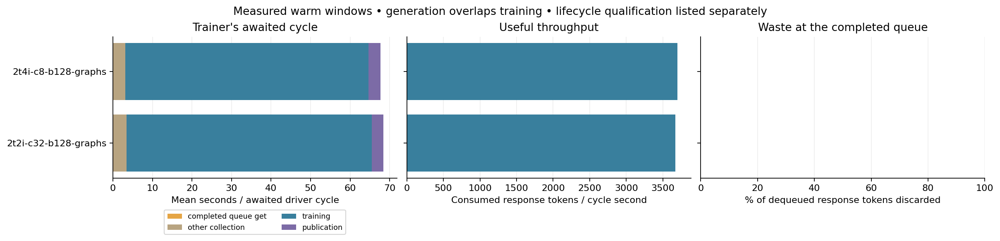
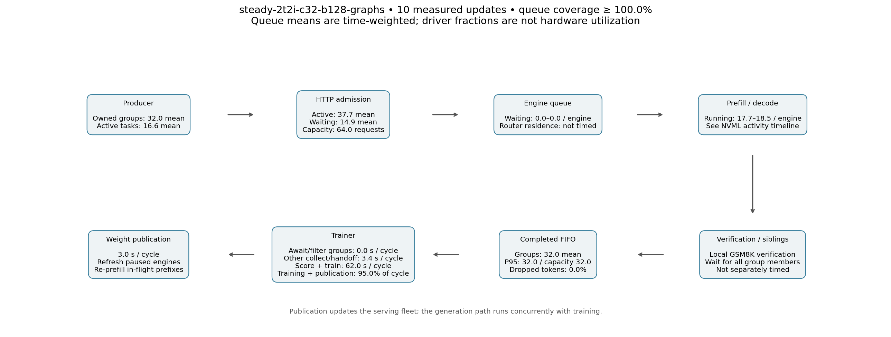
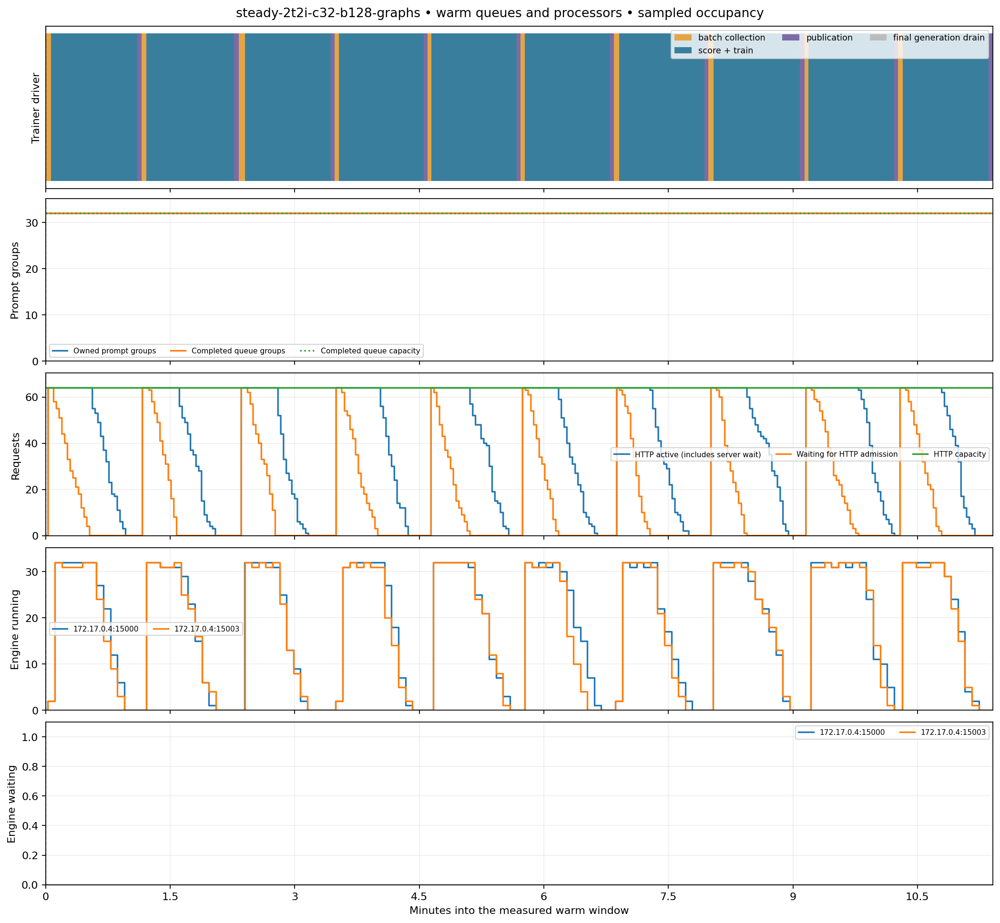
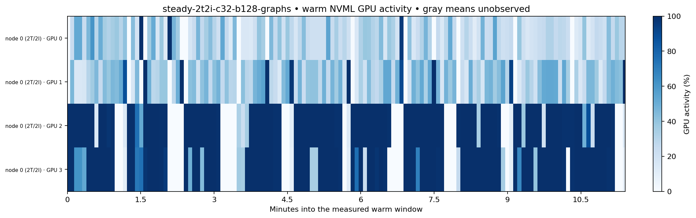

# Two-engine concurrency-32 follow-up

Compare the qualified 2T/4I, concurrency-8, batch-128 configuration with
`steady-2t2i-c32-b128-graphs`: 2 trainer GPUs and 2 TP1 inference engines.
Each engine permits 32 outstanding HTTP requests and 32 running sequences;
full decode CUDA graphs capture through batch 32, with prefill graphs disabled.
Token and recurrent-state pools increase from 131072/128 to 262144/256.

The model, prepared GSM8K fixture, objective, optimization batch 128, automatic
producer budget 128, completed FIFO capacity 128 samples, whole-group dispatch,
lag two, publication, and diagnostics match the preceding batch-128 trial.
No evaluation, save or export stages are included in the timed exercise.

Run 16 updates, exclude the first six provisionally, then inspect phase timings
for late warmup effects. Require all-rank optimizer and route-replay audits,
complete token accounting, and clean workflow shutdown. Compare useful tokens/s,
queue waiting, handoff time, drop fractions/length/age, active sequences, GPU
activity and memory. Hardware warp occupancy and achieved bandwidth are not
measured by the retained NVML sampler.

## Result

**Two inference GPUs at concurrency 32 supplied the EP2 trainer as well as four
inference GPUs at concurrency eight.** Useful throughput differed by only 0.8%,
with effectively zero completed-buffer waiting and no measured completed-token
drops in either warm window. The smaller allocation improves useful throughput
per allocated GPU by about 49%. The `small` example now uses this configuration.

| Configuration | Useful tokens/s | Tokens/allocated GPU-second | Score/train/publish fraction | Buffer get/filter seconds/update | Score/train seconds/update | Publish seconds/update | Dropped tokens |
|---|---:|---:|---:|---:|---:|---:|---:|
| 2T/4I, concurrency 8 | 3,699 | 616 | 95.34% | 0.0013 | 61.51 | 3.05 | 0.0% |
| 2T/2I, concurrency 32 | 3,670 | 917 | 95.01% | 0.0012 | 62.05 | 2.97 | 0.0% |

Both warm windows cover updates 7–16. Counts/rates exclude startup, evaluation,
checkpointing, export and shutdown. The 95% occupied fraction describes awaited
driver stages, not GPU kernel or compute utilization. Other collection/handoff
still took about 3.4 seconds per update in the two-engine run.

The new run passed all 16 optimizer updates on both ranks, token accounting,
workflow shutdown, and route-replay audits: 2,048 microbatches per rank across
19 routed layers. It consumed no mixed-policy responses, so this run adds no
new evidence for in-flight refresh correctness. Every warm consumed group was
age two; zero drops does not imply current-policy sampling. FIFO, whole-group
semantics, lag and queue budgets were unchanged.

## Capacity observations

| Per-device measurement | Four inference GPUs, concurrency 8 | Two inference GPUs, concurrency 32 |
|---|---:|---:|
| Serving kernel activity, mean by device | 73–76% | 73–74% |
| Serving memory, average / sampled peak | 43 / 46 GiB | 50 / 52 GiB |
| Serving memory remaining at sampled peak | about 223 GiB | about 216 GiB |
| Running sequences per engine, mean / maximum | 5.3–5.5 / 8 | 17.7–18.5 / 32 |
| Full-attention token-pool peak fraction | under 18% | 28.4% |
| Recurrent-state-pool peak fraction | 25% | 43.8% |
| Trainer kernel activity, mean by device | 32–39% | 28–38% |
| Trainer memory used | 191–198 GiB | 194–197 GiB |

The new engines' observed generation-throughput gauges averaged approximately
1,787–1,881 tokens/s each and peaked around 3,350 tokens/s. Useful consumed
throughput per serving GPU was 1,835 tokens/s versus 925 in the baseline.
Kernel activity barely changed while per-GPU useful throughput nearly doubled:
activity percentage alone had concealed batching headroom. This is not a
measurement of achieved warp occupancy, tensor-core utilization or bandwidth.

The explicit request/state/token limits still leave room for another admission
experiment. This trial does not establish that two inference GPUs is the minimum,
or that more concurrency would increase end-to-end throughput with these same
trainer settings. The completed FIFO already stays supplied. A trainer-side
packing or recomputation change could alter that balance.

## Figures

SVG counterparts are retained alongside the PNG figures. Raw counts, per-update
timings, topology, provenance, occupancy and audit are in the
[machine-readable campaign report](../results/throughput-profiles-20260913.json).
See the [capacity dashboard guide](../capacity-dashboard.md) for metric definitions
and the prepared W&B report's Trainer, Inference, Pipeline, Drops/freshness and
Warmup/coverage sections. Those analysis runs are postprocessed, not live data.

## Provenance and limits

* [Two-engine trial](https://beaker.org/ex/01M2EK6RP6BWMAW3373HN0P3GQ), Open-Instruct
  `620c414ebc31aacc130b44205484518314a3abf4`, immutable base image
  `01M2CJG5RQQ93GEYNYAS7ASCQJ` plus the checksum-verified committed overlay.
* [Four-engine baseline](https://beaker.org/ex/01M2EFKC5B3KX2M1KQV0XYDPM5), source
  `7320b1446fc73ea08556fbca93d0a4e02c50ff55`. Both used Holmes host 521 and the same
  two physical trainer GPUs. Full source/image/checksum records are in the JSON.
* The new first scoring pass took 204 seconds; forward/backward/optimizer took
  366, 105, then 49 seconds in its first three updates. Warm forward/backward
  ranged approximately 47–49 seconds. Cold initialization is excluded.
* Both use unpacked single-sequence microbatches. Packing is supported but remains
  a separate trainer-side experiment. The older packed async example is a
  different recipe; `small` and `large` do not enable packing.
* This is one short operational run per configuration on the existing full-SFT
  KDA/latent MoE checkpoint and GSM8K fixture. Engine batching/completion order
  changes sampled responses; rates are not a learning-quality comparison.
* The subsequent live trainer-rate additions and W&B report tooling were added
  after this trial's immutable source was launched. Their arithmetic/aggregation
  and report preparation passed local checks; their new live fields are not
  claimed as observed in this GPU run.
