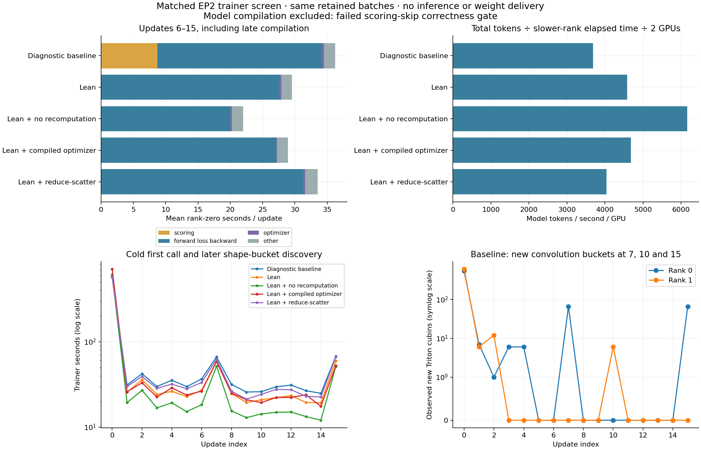

# Matched trainer optimization screen

Five of the first six EP2 trainer variants completed all sixteen retained-batch
updates. Model compilation failed its first scoring-skip check before an
optimizer update. The same full-SFT HF checkpoint, global batch 128, input
file hashes, token counts, packing at 6144, and historical replay/behavior
records were used across all successful arms. Each used two B300 GPUs and
an isolated initially cold per-rank compiler cache. Source `2fa37b831`.

## Timing

Primary window: updates 6–15, including remaining compilation. Total wall time
uses the slower rank for each update; tokens sum both ranks. Phase times are
rank-zero means and need not sum to max-rank wall time.

| Variant | Mean trainer s/update | Model tokens/s/GPU | Scoring s | Forward/loss/backward s | Optimizer s | Peak allocated GiB/rank |
| --- | ---: | ---: | ---: | ---: | ---: | ---: |
| Baseline: forced score + exhaustive replay diagnostics | 36.72 | 3,687 | 8.73 | 25.46 | 0.264 | 166.2 |
| Lean: guarded score skip + production replay diagnostics | 29.55 | 4,582 | 0 | 27.63 | 0.265 | 166.2 |
| Lean + no recomputation | 21.97 | 6,162 | 0 | 19.98 | 0.264 | 197.4 |
| Lean + compiled optimizer | 28.92 | 4,681 | 0 | 27.13 | 0.100 | 163.9 |
| Lean + reduce-scatter | 33.53 | 4,037 | 0 | 31.31 | 0.264 | 168.0 |

The lean/no-recompute arm is 40.2% faster in update wall time than baseline and
25.6% faster than lean alone. This is a trainer-only capacity measurement,
not end-to-end RL throughput or a learning-curve claim. Increased activation
memory means this choice is specific to the measured hardware, topology, and
pack budget. Optimizer compilation reduces its own phase but saves only about
0.16 seconds/update; total timing variation is larger. Reduce-scatter was slower
on this EP2 workload; this does not establish its behavior on larger DP groups.

## Compilation is observable, and warmup is not a fixed update count

The old no-grad routed SwiGLU capacity specialization did **not** recur. Every
arm retained the qualified dynamic-row forward. Warm JIT misses came from
`fla.modules.conv.triton.kernels.causal_conv1d_{fwd,bwd}_kernel`.

The pinned FLA `ops.py` computes `NB = ceil(B*T / 1024)`. `NB` is a constexpr and
part of the convolution autotune key alongside width and convolution size. On
6144-token packs it has only six possible values. On rank zero, updates 7 and
15 each caused 66 new compiled cubins when previously unseen small-pack buckets
arrived. The JIT callbacks measured about 30 seconds per burst. Rank one also
compiled six variants at update 10. These are directly observed artifact
writes, not an inference from total timing. This is bounded bucket discovery,
not a new variant for every sequence length.

The first full trainer call took roughly ten minutes in the cold screen. It
includes no-grad scoring, gradient-path KDA/attention/convolution compilation,
and first optimizer use. Triton observation does not capture all CUTLASS,
TileLang, or child-process compiler work; do not equate its recorded time with
all cold overhead. A persistent cache can reuse these variants on compatible
future allocations. Priming all reachable buckets is a possible startup
improvement; the screen has not implemented a separate warmup phase.

A secondary comparison uses the same seven batches with no observed new cubins
on either rank in any successful arm: updates 6, 8, 9, 11, 12, 13, 14.

| Variant | Mean trainer s/update | Model tokens/s/GPU |
| --- | ---: | ---: |
| Baseline | 29.54 | 4,615 |
| Lean | 22.23 | 6,131 |
| Lean + no recomputation | 14.59 | 9,341 |
| Lean + compiled optimizer | 22.66 | 6,016 |
| Lean + reduce-scatter | 25.99 | 5,244 |

This conditions on observed compiler activity and is not a substitute for the
primary complete-window result or a full warm-cache rerun.

## Correctness and limitations

All five successful arms completed sixteen unskipped optimizer updates on both
ranks. The initial scoring-skip check was bit-exact over 182,878 active tokens in
lean and its successful variants: mean and maximum absolute difference zero.
Router replay remained enabled. The exhaustive baseline checks include recorded
routes; lean arms intentionally omit those expensive per-layer diagnostic hooks.
Local policy-objective differences from baseline remained below 3.2e-5 across
all rank/update records. This is supporting evidence, not a parameter-state or
optimizer-resume equivalence test.

**Model compilation is not qualified with scoring skip.** Its first standalone
versus training-forward mean absolute log-probability difference was 0.00607925,
above the unchanged 0.001 tolerance. The guard stopped the run before an
optimizer update. The source of that numerical difference has not yet been
isolated. Neither disabling the guard nor relaxing its tolerance is part of
this change.

No defaults are promoted based solely on this screen. Follow-up requirements
include a live RL run with the selected settings and resume qualification for
optimizer/reduction changes. The worker advances a logical publication clock
without serving; retained responses are a controlled workload, not newly
sampled on-policy trajectories for each variant.

## Runs and follow-up

1. [Baseline](https://beaker.org/ex/01M2ETY4NRESA8W3JF264N6DCT)
2. [Lean](https://beaker.org/ex/01M2ETY5FV9Q7P4KEZNGYK47BN)
3. [No recomputation](https://beaker.org/ex/01M2ETY6A3HJGDAB6C62Q0J048)
4. [Optimizer compilation](https://beaker.org/ex/01M2ETY6Z989H58X34QBQXTERP)
5. [Model compilation, rejected](https://beaker.org/ex/01M2ETY7MYN7S5RVM1YYPHTMAV)
6. [Reduce-scatter](https://beaker.org/ex/01M2ETY8BF776ENTT7ZWQ32VXR)
7. [Vectorized gradient accumulation, completed](https://beaker.org/ex/01M2EWD3TREEN66GSNKXHXJX9H)
8. [Pairwise SwiGLU backward, completed](https://beaker.org/ex/01M2EWD4K3J997MTZGA58F0C2N)

The two native-kernel follow-ups use the no-recompute control. Core's pairwise
backward intentionally uses different intermediate rounding from eager BF16
autograd; it remains a numerical candidate. Neither enables rounded weight
gradients, FP8, or EMO-only behavior.

[Machine-readable timing](trainer-capacity-20260914/summary.json) and
[run provenance](trainer-capacity-20260914/runs.json).

## Native-kernel follow-up results

Both follow-ups completed all sixteen updates on both ranks. The compiler
observer confirmed that the intended `_gradient_add` and
`_swiglu_backward_pair` kernels actually ran. Their first scoring-skip checks
were bit-exact over the same 182,878 active tokens. Input hashes and token
counts match the no-recompute control.

| No-recompute configuration | Mean s/update, updates 6–15 | Model tokens/s/GPU | Mean s/update on common seven batches without new cubins | Peak allocated GiB/rank |
| --- | ---: | ---: | ---: | ---: |
| Control | 21.97 | 6,162 | 14.59 | 197.4 |
| Vectorized gradient accumulation | 25.46 | 5,316 | 17.34 | 197.4 |
| Pairwise SwiGLU backward | 23.82 | 5,683 | 16.19 | 194.2 |

Neither kernel flag improved throughput in this screen. They remain off.
One run per configuration does not establish an intrinsic slowdown on every
workload, but it gives no reason to promote them for this one. The pairwise
backward's changed rounding still requires separate numerical qualification
if revisited; forward agreement does not establish gradient equivalence.

The next step is a [live RL validation of guarded scoring skip plus no
recomputation](https://beaker.org/ex/01M2EXJV10NDMSQHXKETD3XSMV), holding the
successful packed c32 inference setup and objective fixed. Source `12b5f25c0`.
This run is in progress. The small example has adopted the packing configuration
that already passed live qualification, while retaining standalone scoring and
recomputation until this faster combination is exercised end to end.
