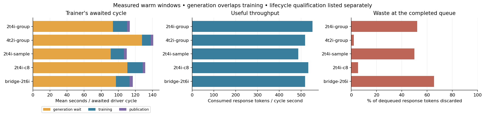
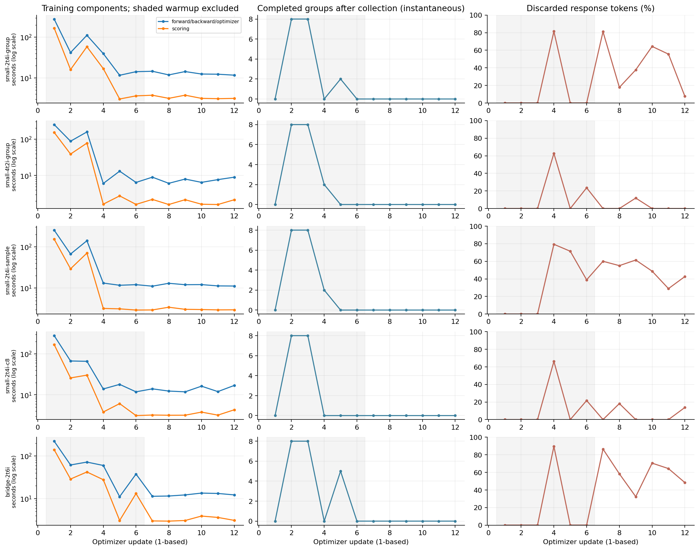
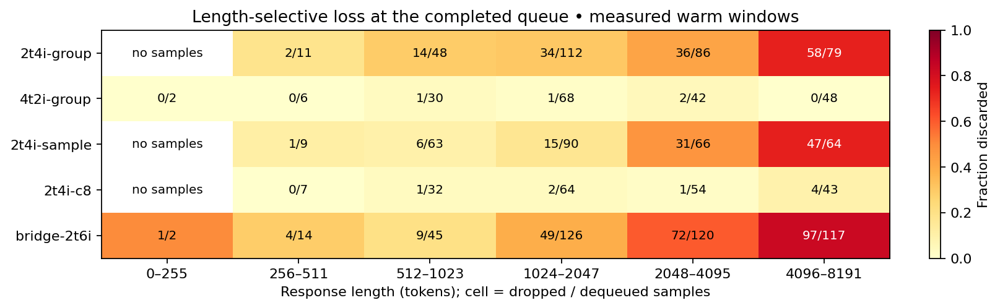
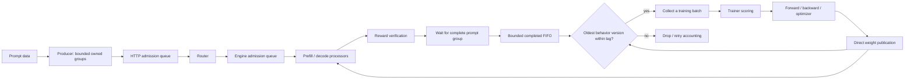
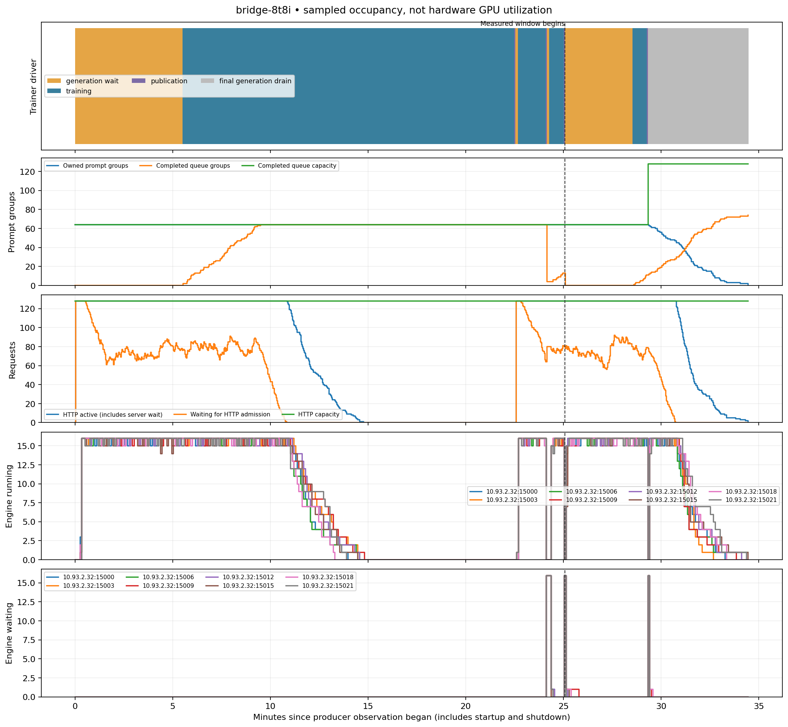
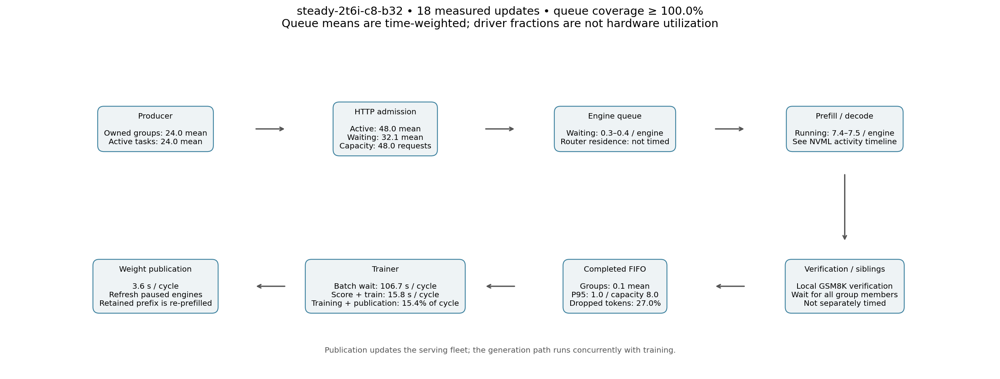
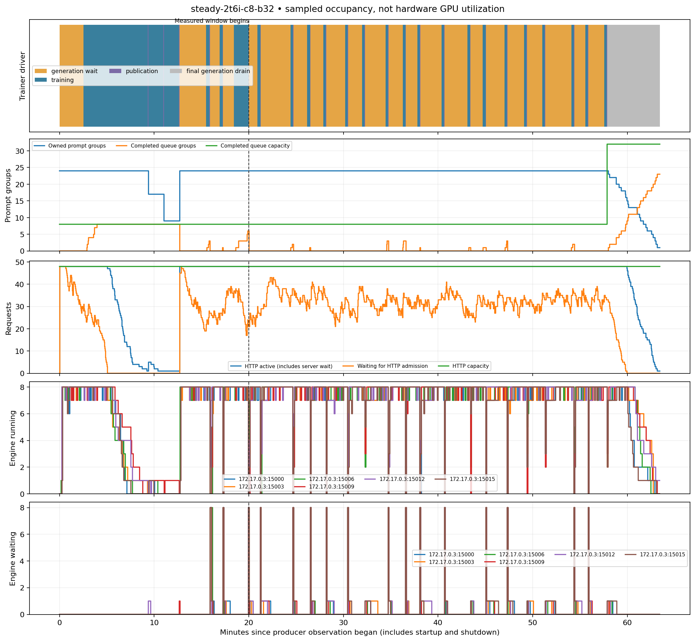
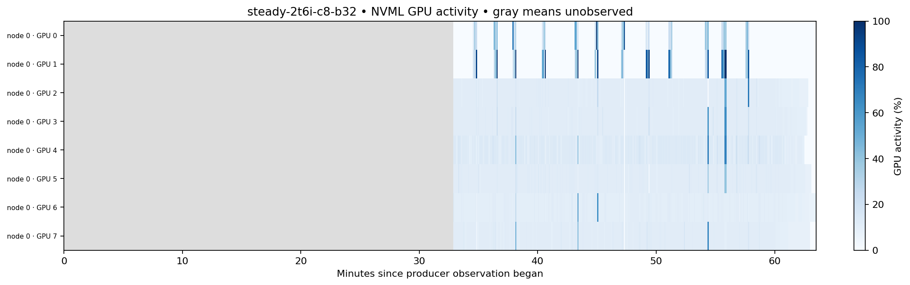

# Throughput profiles and qualification

The four new starter files are **candidates under qualification**, not measured
optimal ratios. They target Holmes B300 hardware for the full SFT model used in
the GSM8K comparison. Other model sizes, attention types, GPU memory and networks
can require different settings. Existing examples remain available.

| Profile | Placement | Purpose | Model assumption |
|---|---|---|---|
| [dev](../../configs/miles/examples/dev.toml) | 1 shared GPU | GSM8K mechanics, saving and basic data plumbing | Small MoE; Core optimizer and serving pools fit together. The qualification fixture is random and is not an accuracy model. |
| [tiny](../../configs/miles/examples/tiny.toml) | 1 trainer + 1 inference GPU | Disaggregated mechanics and very small jobs | Same small model fixture for the initial exercise. A full SFT model is not assumed to fit one trainer GPU. |
| [small](../../configs/miles/examples/small.toml) | 2 trainers + 4 inference GPUs | First useful throughput comparison | Full SFT checkpoint, EP2, TP1 engines. Ratio is compared with 4+2. |
| [large](../../configs/miles/examples/large.toml) | 8 trainers + 56 inference GPUs | 64-GPU scale target | Full SFT checkpoint, EP8 trainer node and seven inference nodes; qualification follows smaller checks. |

Small and large currently opt into experimental mixed-policy refresh. They use
radix caching, the qualified extra-buffer KDA strategy, graphs disabled as required
by refresh, direct bucketed publication, and preserved historical behavior scores.
They are not a statement that CUDA graphs, fused export, or packing are undesirable:
those should be compared in subsequent focused measurements rather than silently
combined with a new scheduling experiment.

## Selection rationale

* Dev/tiny use modest admission and short responses. We will establish a working
  configuration once, without a separate optimization campaign.
* Small uses 8 prompts × 4 responses (32 samples) per update. Its four alternatives
  retain the same full SFT weights, prepared GSM8K input, response cap 4096, seed,
  LR, clipping, and age limit. Completion order can still select different prompts.
* Large uses 64 prompts × 4 responses (256 samples) per update. This explicitly
  changes the optimization batch from small; compare useful tokens/second and
  discard rates, not update counts as though learning configurations were equal.
* Producer concurrency derives from engine count and requested admission. The
  completed FIFO holds one collection in the throughput candidates. Neither
  setting is inferred from physical node count alone.
* Requested token and recurrent-state pools cover the configured admission at
  the chosen context limit, subject to runtime GPU fit. Actual SGLang limits must
  be recorded; a configured maximum does not prove it was achieved.
* Weight publication is accepted overhead. Record its fleet-wide latency alongside
  training wait and token-discard fractions; do not hide it inside generation.
* The 64-GPU profile requires multi-node coordinated launch with auto-resume
  disabled until that restart topology is qualified. Checkpoints remain available.

## How the limits interact

| Control | What it limits | External constraint and tuning signal |
|---|---|---|
| Trainer GPUs / EP | Model and optimizer distribution, training time | Expert divisibility, model memory, collective bandwidth; compare training time at the same optimization batch. |
| Inference GPUs / engine TP | Independent engines and model fit | GPU memory and interconnect; increasing TP reduces engine count at a fixed GPU budget. |
| Producer sample budget | Unfinished generation-and-reward work | Fleet service time, grading latency and group stragglers; enough headroom to refill engines, then watch age and discarded tokens. |
| HTTP concurrency per engine | Global generation semaphore, scaled by engine count | Too low leaves serving slots empty; too high moves waiting work into the serving system without creating GPU capacity. |
| Running requests per engine | Requested decode batch admission | Effective token pool, recurrent-state pool and GPU memory can cap it further. Record the engine's resolved limit. |
| Token/context and recurrent-state pools | Capacity for active contexts and cached prefixes | Model geometry, dtype, radix strategy, overlap scheduling and memory headroom. KDA state slots are not necessarily one per request. |
| Completed-buffer factor | Whole ready groups waiting for consumption | Trainer service rate and allowed policy lag; a larger queue absorbs bursts but cannot repair a sustained rate mismatch. |
| Collection / optimization batch | Responses collected and samples per optimizer step | Trainer divisibility, memory, desired RL statistics; changing these is an optimization change, not just a throughput tweak. |
| Allowed policy lag | Which completed groups remain eligible | Current trainer version versus oldest sampled token version; raising it accepts more off-policy data rather than making generation faster. |
| Publication interval | How often serving receives current weights | Collective transfer and re-prefill latency versus policy freshness; keep this cost visible. |
| Save / eval cadence | Interruptions outside normal training cycles | Checkpoint I/O, evaluation size and draining outstanding work; compare total run time separately. |

Start with model fit and the desired optimization batch, then size engine
admission from memory. Use the topology-derived producer budget as a starting
point. If training waits and engines have spare capacity, increase admission or
backfill; if engines are already busy, compare more inference GPUs. If completed
work ages out while training stays busy, reduce ahead-of-training work before
loosening the lag limit. Report dropped tokens as well as samples: a small sample
fraction can hide substantial wasted long-response work. Keep the length/age
breakdowns alongside the aggregate so this tradeoff stays visible.

Persistent compilation caching reduces repeat startup cost; it does not increase
engine admission or buffer capacity. Keep it enabled for normal examples, while
recording cold and warm timings separately. Cache-off comparisons should use
separate run identities and private cache locations, not delete shared caches.

## Nine-case basket

| Order | Case | Question |
|---|---|---|
| 1 | dev | Does one-GPU GSM8K plumbing and small checkpoint saving work? |
| 2 | tiny | Does separating trainer and serving work without changing the model? |
| 3 | small-2t4i-group | Initial six-GPU baseline, 16 requested engine slots each |
| 4 | small-4t2i-group | Is compute or serving the limiting side at six GPUs? |
| 5 | small-2t4i-sample | Does per-sample backfill reduce sibling-straggler idle time? |
| 6 | small-2t4i-c8 | Does lower engine batch concurrency improve useful throughput/latency? |
| 7 | bridge-2t6i | Does additional inference still help the two trainers? |
| 8 | bridge-8t8i | Qualify inter-node publication and the larger training batch |
| 9 | large-8t56i | Measure 64-GPU behavior once the smaller boundaries work |

Failures are findings, not reasons to silently change a case. Any repair gets a
new run identity and records the changed setting. A result that needs a different
model must be labeled as a different qualification. We will refine ratios based
on the measured cases, not advertise the starting ratio as optimal.

The runner uses `plan/validate/train` workflow configuration, an immutable base
image plus a checksum-verified committed source archive, separate WEKA roots,
urgent Holmes placement, and W&B group `throughput-profiles-20260913-v1`.
CPU-only WEKA analysis runs on Saturn. Source inputs and earlier experiments are
not modified. The small/large benchmark disables saves and eval to isolate normal
cycles; the examples retain practical save/evaluation cadence.

Each single-node performance case and the 64-GPU candidate initially runs 12 updates and reports the window after
three warmup updates. Report per-step timings too: three warmups do not establish
that all compilation has stopped. Dev/tiny run four updates and are mechanics
checks. The 8+8 multi-node bridge runs four updates to qualify inter-node behavior;
its one post-warmup cycle is not a stable throughput estimate. A successful workflow and complete, non-skipped optimizer sequence are
required before producing a success report. This is performance qualification,
not evidence of comparable learning quality or full resume equivalence.

## Warnings, validations, and evidence

`plan` now reports `runtime.throughput` as well as `runtime.async_capacity`.
Structured `validate` and driver startup print the advisories. Whole inference
engines, positive publication intervals, and valid prefill chunk values are hard
checks. Token-pool coverage, graph coverage, resident colocation memory, reference
model cost, frequent saves/evals, diagnostics and group-straggler backfill are
warnings because intentional small/development configurations remain valid.

Read the [queue guide](async-pipeline.md) for exact producer, semaphore, engine and
completed-buffer semantics. `rollout_flow.jsonl` retains response lengths, useful
tokens, mixed-response counts, and queue discard metrics independently of W&B.
`driver_timing.jsonl` distinguishes checkpoint draining from writing checkpoints.
The analyzer reports warm consumer-wait fraction, useful response tokens/second,
discarded-token fraction, and stage medians, with all lifecycle timings separate.
Its normal-cycle sum is not an engine GPU utilization measurement: generation
runs concurrently with training. Saved evidence and Beaker links will be added
here as cases finish. Qualification is limited to the model and workload exercised.

## Results recorded September 13

[Machine-readable measurements](results/throughput-profiles-20260913.json) retain
source/image provenance and per-update records. Initial mechanics results:

| Case | Result | Warm median generation wait / training / publication | Evidence |
|---|---|---|---|
| Dev: 1 GPU colocated | Four updates and checkpoint saves passed | 2.05 / 0.38 / 0.09 s | [Beaker](https://beaker.org/ex/01M2DZWJCXVY30Q53BWAPVWJ9V) |
| Tiny: 1+1 disaggregated | Four updates and checkpoint saves passed | 2.78 / 0.42 / 0.10 s | [Beaker](https://beaker.org/ex/01M2DZWK3SAWW7AD47A3PP61PQ) |

Both used the same random small conventional MoE geometry and eight prepared
GSM8K questions, with four prompts × two responses per collection and a 256-token
response cap. These prove data/trainer/publication/save mechanics; they do not
measure GSM8K learning or qualify full SFT model fit. All four optimizer steps
were present and not skipped. Resume and export are not part of these two runs.
The modest timing difference is not an optimization finding from three warm
collections. Use dev as the minimal exercise, and tiny when the disaggregated
boundary itself matters. Full-model ratio and scale qualification remains in
progress.

The first full-model 2+4 and 4+2 attempts each completed one optimizer update
and published version 1, then failed when consuming the next collection. Refresh
had incorrectly reused `core.engine_drain_timeout=180` as a whole generation
request deadline. Slow responses timed out in the background while the cold
first training step ran. These are failed qualifications, not throughput results:
[2+4](https://beaker.org/ex/01M2DZWM5KP9V005R2BEX0ZK93),
[4+2](https://beaker.org/ex/01M2DZWNXMG5KSDA9SSM8HQWXT).

Generation now has a separate `core.refresh_request_timeout` (1800 seconds),
covering serving queue time, decoding and refresh pauses. The examples set
`core.engine_drain_timeout=900` for save/eval/shutdown; transfer time remains
bounded separately. On timeout the error identifies the request and relevant
setting. Regression tests verify that a short drain budget cannot cancel an
ordinary request and that the generation deadline cancels its HTTP task.

A separate c8 attempt was canceled because its host reported zero temporary-disk
space. Subsequent basket submissions exclude that host. Attempts stopped for
these known issues are excluded from performance comparisons; retries have new
identities and keep the same model/data/optimization settings.

## Steady-state follow-up

The target is now a small family with **1-, 2-, and 8-GPU trainers**, sizing
inference around the trainer rather than keeping a fixed total GPU count. The
one-GPU fixture remains a mechanics profile. Throughput recommendations must
identify the model, GPU type, response cap, optimization batch and policy-age
limit; changing those can change the balance substantially.

All five first-round full-model arms completed 12 updates on every trainer rank,
but failed final shutdown: the driver imposed a 60-second outer drain deadline
on refresh despite its configured 900-second drain budget. These are completed
training measurements with failed lifecycle qualification. The follow-up driver
honors the configured budget and records final drain and disposal separately.
The analyzer still rejects incomplete workflows by default. Offline investigation
can explicitly inspect complete optimizer sequences from an incomplete workflow;
the report retains `end_to_end_passed=false` and the original workflow error.

Use updates **7–12** for the initial comparison. Training time settled by updates
4–5 in most arms, but the 2+6 arm spiked at update 6. This is a timing-based warmup
estimate, not a count of all compilation events. The next performance cases run
24 updates, exclude the first six, and retain the full trace to check for late
spikes or changing queue behavior.

The first window still spends over 80% of the awaited cycle waiting for a usable
batch. More producer concurrency or more inference did not automatically improve
useful throughput: stale discarded work increased substantially in several arms.
The follow-up compares 2+6 with eight requests per engine at batches 32 and 128,
then compares the larger batch with 2+16 if multi-node qualification and capacity
permit. Batch 128 changes the RL optimization batch; it is not a pure scheduling
optimization or evidence of equal learning. This fills both inference nodes. The 2+16 launcher currently allocates
three eight-GPU replicas (24 allocated, 18 used), because trainer and inference
nodes are separate in its multi-node layout. Report both counts.

Follow-up instrumentation (`core.pipeline_observation_interval=2`) records:

* `pipeline_occupancy.jsonl`: producer ownership, active group tasks, completed
  queue occupancy/capacity, generation semaphore occupancy and waiting requests.
  The sampler does not dequeue work or reset window counters. Unavailable fields
  are null. Semaphore occupancy includes router/server wait and response handling;
  it is not GPU utilization. Sample-level unfinished counts are only available
  from the sample-backfill scheduler.
* `engine_occupancy*.jsonl` (sharded by endpoint for larger reports): each engine's Prometheus queue/admission, pool usage,
  throughput and occupancy series, sampled no more frequently than every five
  seconds with bounded HTTP requests. Series labels and missing/nonfinite values
  remain explicit. Engine-reported occupancy is distinct from hardware SM usage.
* Existing trainer stage timing and completed-work length/age counters. Sampled
  queue sizes describe instants; they do not give exact per-request queue waits.

Observation is optional and disabled by default. It terminates with the producer;
observation errors are logged without changing generation or training ownership.
The follow-up basket enables SGLang metrics. Compare observed resource activity,
trainer wait and discarded tokens together. Keep FIFO, lag limits and historical
behavior probabilities unchanged.

### First-round measurements (updates 7–12)

Every row below completed its 12 optimizer steps and failed final shutdown as
explained above. These are useful cycle measurements, not end-to-end passes.
Training includes standalone scoring; generation overlaps training. The wait
fraction is the fraction of the driver's normal cycle awaiting a batch, not a
measurement of hardware GPU idleness.

| Case | Useful response tokens/s | Trainer wait | Discarded response tokens | Producer sample budget | GPU allocation |
|---|---:|---:|---:|---:|---:|
| 2T + 4I, group, concurrency 16 | 552 | 82.6% | 52.1% | 128 | 6 |
| 4T + 2I, group, concurrency 16 | 519 | 90.8% | 2.0% | 64 | 6 |
| 2T + 4I, sample backfill, concurrency 16 | 487 | 83.1% | 50.0% | 128 | 6 |
| 2T + 4I, group, concurrency 8 | 533 | 84.2% | 5.4% | 64 | 6 |
| 2T + 6I, group, concurrency 16 | 518 | 83.1% | 65.5% | 192 | 8 |

The automatic producer budget changes with fleet size and admission. Thus the
concurrency and topology comparisons also change ahead-of-training work; they
are comparisons of complete configurations, not isolated causal measurements of
one setting. Sample backfill counts unfinished samples, whereas group submission
retains its slot until all siblings finish.

These configurations use `async_unused_samples_handler="retry"`: the generated
responses in an expired group are discarded and counted, while its prompts are
requeued for another attempt. Counts describe response attempts, not permanently
removed questions. Reattempting does not recover the spent generation time.

The discarded-token denominator is dropped plus delivered tokens at dequeue in
the selected window. It excludes final shutdown leftovers and unfinished work.
A consumed batch is not proof of equal learning, and completion order changes
which prompts reach training even with the same data and seed.

The queue snapshots above are taken **after collecting a training batch**. Zero
there does not establish an empty queue throughout the preceding interval. The
follow-up continuous sampler addresses that missing information. The shading
marks the first six updates, excluded from these aggregate comparisons.

The length breakdown confirms why discarded tokens matter. For example, among
4096-token capped responses dequeued during the measured window, the 2+4 group
arm discarded 58 of 79; concurrency 8 discarded 4 of 43. Dropping a whole group
also drops its shorter siblings. This is a short-run operational finding, not a
controlled evaluation of downstream learning quality.

With the current oldest-behavior-version age rule, more serving capacity cannot
by itself guarantee that a long response survives several rapid policy updates.
Both the service rate and time-to-complete a group matter. A larger optimization
batch can slow version advancement while providing more training work, but changes
learning. Increasing allowed lag changes the off-policy contract. These remain
explicit experimental choices; the basket does not silently alter either rule.

Reproduce the figures using `python -m scripts.miles.plot_throughput_basket
 docs/miles/results/throughput-profiles-20260913.json /tmp/throughput-figures`.
The report generator also accepts `--run-root case=/path/to/downloaded/run` for
continuous queue/processor timelines when those observations exist.

### Queue and processor map

The producer can own partly completed groups while HTTP requests wait or engines
work. A sibling that has already finished is retained until its group completes;
this is especially relevant to sample backfill. The completed FIFO is a separate
bound and can block the producer. Batch collection may consume and reject several
expired groups before it has enough eligible ones. For the GSM8K fixture,
verification is local and inexpensive; judge- or execution-heavy workloads add
another service-rate constraint and require their own measurements.

The driver timeline records the **consumer's wait for a usable batch**, then
scoring/training/publication. It does not separately time every request's semaphore,
router, engine or sibling wait. Occupancy timelines reveal where work accumulates;
exact per-request queue waits would require lifecycle traces. Do not infer hardware
utilization or exact queue residence times from these sampled counts.

Occupancy summaries use observation-time weighting and report the fraction of the
window covered. A sample is held until the next observation, for at most ten
seconds; longer gaps remain missing. Engine series keep their endpoint and rank
labels. These summaries are conditional on the observed intervals and must be
read alongside coverage, especially if an engine is unavailable. The processor
timeline labels final generation draining separately from the normal loop.

The follow-up jobs also retain direct NVML samples in `gpu_usage_node*.jsonl`:
GPU activity percentage, memory activity percentage, and used/total VRAM in MiB.
The generic SGLang utilization gauge is inactive in this configuration, so it must
not be read as zero GPU activity. NVML sampling creates no CUDA context. It was
attached partway through the first follow-up jobs; their coverage starts at the
recorded attachment time. Later basket launches start it automatically. The
[attachment record](results/gpu-observer-attachments-20260913.json) preserves the
observer source and exact job/container identities.

The remaining scale comparisons use 16 updates (ten after warmup) to bound their
cost. The already-running 2+6 batch-32 and batch-128 comparisons retain 24 updates.
If Holmes cannot place 64 GPUs, the prepared 8+24 case provides a 32-GPU
measurement; it does not qualify 8+56. Placement and reserved-but-unused GPUs
remain explicit in recommendations.

### Cross-node EP8 qualification

The [8-trainer / 8-inference run](https://beaker.org/ex/01M2E50JHXTPJTX1T6SV3WCF39)
completed all four updates and exited successfully on both nodes. All eight
trainer-rank contracts passed. The final generation drain took 309 seconds,
qualifying the corrected shutdown deadline on GPU. This basket did not exercise
checkpoint resume or HF export.

Cold training filled the completed buffer; inference then ran out of admitted
work until training caught up. Later the buffer emptied and training waited for
generation. Forward/backward/optimizer time was 642, 64, 34, and 34 seconds.
The last cycle spent 208 seconds awaiting a batch, 43 seconds scoring/training,
and 3.6 seconds publishing. One warm cycle cannot establish steady-state
throughput, but does show that equal trainer/inference GPU counts are not enough
to saturate this trainer for this workload.

Hardware sampling was attached after the normal cycles in this qualification:
its warm-window coverage is zero. The continuous engine request counts above
are available throughout; they are not GPU utilization percentages.

### Admission occupancy versus GPU activity

The completed [2+6, batch-32 run](https://beaker.org/ex/01M2E50PF1P60341G91J31F1SK)
passed 24 updates and clean shutdown. Across updates 7–24 it delivered 536 useful
response tokens/s, spent 84.6% of the driver cycle awaiting a batch, and discarded
27.0% of dequeued response tokens. The completed queue was empty 94.3% of the
observed window despite all 48 HTTP slots being occupied. Engines averaged
7.4–7.5 running requests out of eight.

NVML observations cover only the final 66% of that warm window. During those
observations the six serving devices averaged roughly 11–14% GPU activity. This
is sampled kernel activity, not SM occupancy or a direct diagnosis of CPU
overhead. It motivates a single decode-graph comparison at the same 2+6,
batch-128 geometry. That case enables full decode graphs through batch eight,
leaves prefill graphs disabled, and adds trainer replay diagnostics. Consequently
its trainer overhead is also measured; it is not a strictly single-variable
whole-cycle comparison. No change is made to FIFO, policy age, or behavior scores.

The age plot uses the **oldest behavior version anywhere in the prompt group**,
matching the queue's age gate. A group labeled age two can still contain many
newer suffix tokens after refresh. The analysis therefore also records the
fraction of consumed, unmasked tokens sampled under the trainer's current policy,
weighted across all trainer ranks. These are provenance measures, not a claim
that trainer and serving arithmetic are identical.

Pipeline timelines begin when the producer observer starts. They include first-step
training warmup and final draining, but engine/model initialization can precede
that window. Startup stages are retained separately in the driver timing report.
