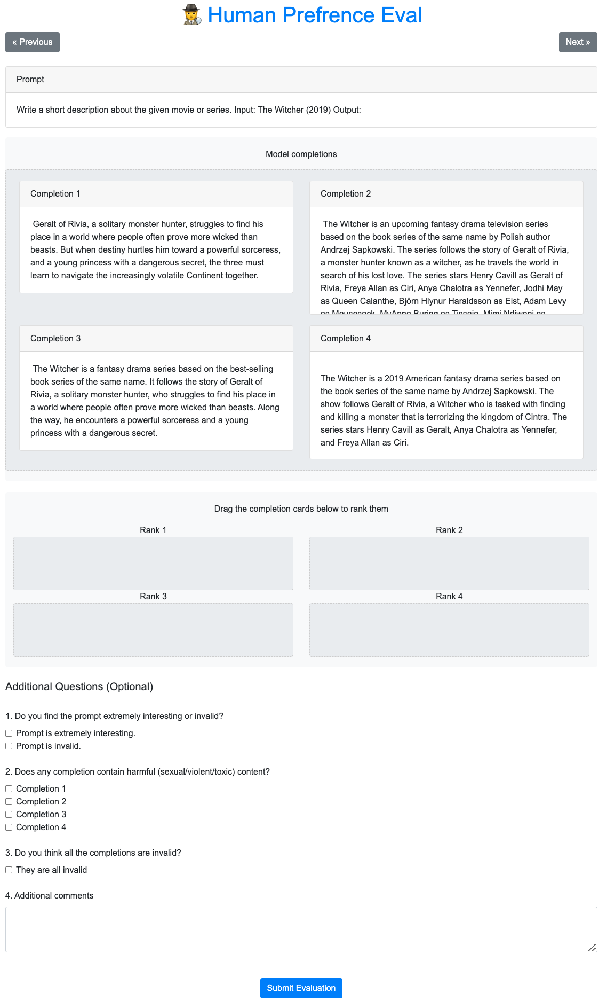

# Human Evaluation Annotation Interface

This folder contains the code for the human eval annotation interface used in the paper [How Far Can Camels Go? Exploring the State of Instruction Tuning on Open Resources](https://arxiv.org/abs/2306.04751).

## Installation

```bash
conda create -n human_eval python=3.10
conda activate human_eval
pip install -r requirements.txt
```

## Running the Interface

Before running the app, you need to put evaluation instance in the `data` folder. Each instance should have a prompt and two completions from two different models. We provide an example in `data/eval_instances_tulu_1.jsonl`.

Each line of this file should be in the following format:

```json
{
    "prompt": "prompt text",
    "completions": [
        {
            "model": "model 1 name",
            "completion": "completion text"
        },
        {
            "model": "model 2 name",
            "completion": "completion text"
        }
    ]
}
```

Now you can run the app with:

```bash
python app.py
```

You can open the app in your browser at http://localhost:5001. When doing the annotation, you can track the progress at the following url: http://localhost:5001/summary.

Here is a screenshot of the annotation interface:

<p align="center" width="100%">
      
</p>

## Post-processing and Analysis

The annotation results are saved in a database file `data/evaluation.db` by default. You can use the following command to export the results to an excel file:

```bash
python export_db.py
```

Then, you can use the following command to compute the evaluation metrics and agreements:

```bash
python compute_metrics.py
```

## Tulu 1 Annotation Results

We release the annotations that we collected for the Tulu 1 paper in `data/eval_annotations_tulu_1.xlsx`. The results include comparison of three models pairs: Tulu 65B vs ChatGPT, Tulu 65B vs Tulu 7B, and Tulu 65B vs Tulu (human only) 65B.

## Citation

If you used this code, please cite our paper:

```bibtex
@misc{wang2023far,
   title={How Far Can Camels Go? Exploring the State of Instruction Tuning on Open Resources},
   author={Yizhong Wang and Hamish Ivison and Pradeep Dasigi and Jack Hessel and Tushar Khot and Khyathi Raghavi Chandu and David Wadden and Kelsey MacMillan and Noah A. Smith and Iz Beltagy and Hannaneh Hajishirzi},
   year={2023},
   eprint={2306.04751},
   archivePrefix={arXiv},
   primaryClass={cs.CL}
}
```
