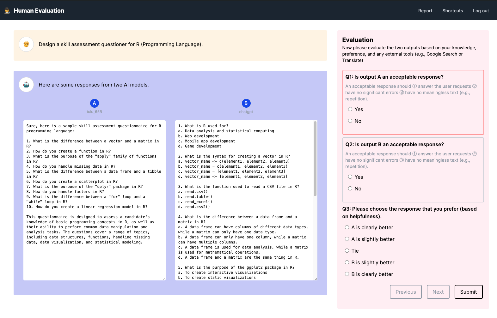
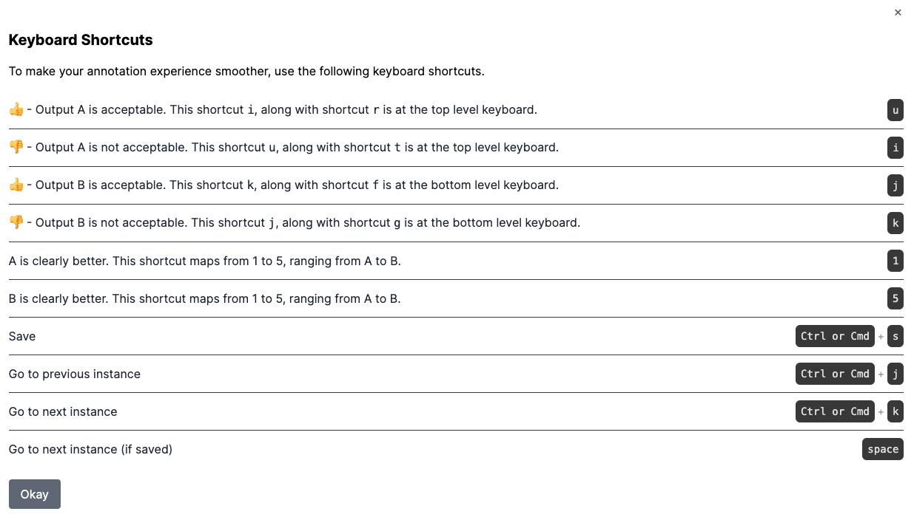
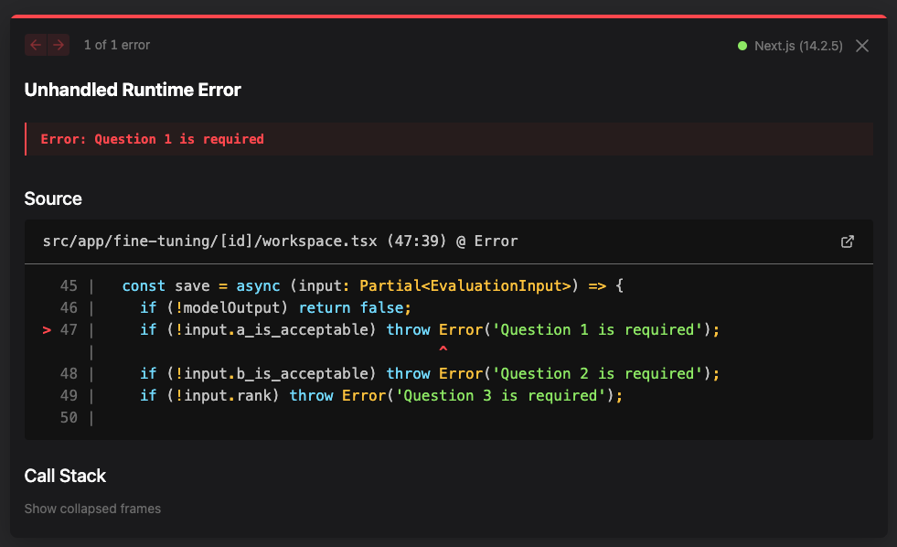
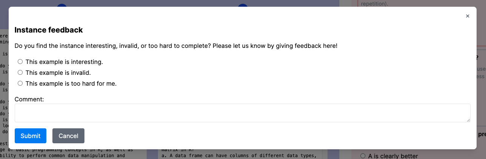

This Human Feedback Interface web application is built using [Next.js](https://nextjs.org/).

## Getting Started

To run the development server locally, you can:

```bash
npm run dev
# or
yarn dev
# or
pnpm dev
# or
bun dev
```

Note: Remember that you must also be running the backend server ([See instructions](https://github.com/allenai/open-instruct/tree/main/human_eval)) to have the functionalities for authentication, evaluation submission, and reporting.

## Usage

Visit [http://localhost:3000](http://localhost:3000) with your browser to see the result.

After logging in with the default user `admin:admin`, you'll encounter the annotation workspace:



This workspace has four sections: 

1. the nav bar - allows you to report an instance with meta feedback, view the keyboard shortcuts, or log out.
2. human prompt - the yellow section highlights the instruction/input from the user.
3. model output - the blue/purple section showcases the model's output, which the annotator is designated to evaluate.
4. evaluation section - the annotator has three questions to answer, which they can use with their mouse or their keyboard shortcuts. Users can move to the previous/next instances, or choose to submit their evaluation.

The evaluation process comes with keyboard shortcuts to make your annotation experience smoother.


## Keyboard shortcuts




The current annotation process has three questions: 

1. Whether Output A is acceptable (u) or not acceptable (i)
2. Whether Output B is acceptable (j) or not acceptable (k)
3. Whether you prefer Output A (1) or Output B (5), or if it is a tie (3)

The keyboard shortcuts are designed so that annotators can quickly label just by moving their right index and middle finger up and down (ui, jk) when labeling the questions, and their left hand resting on (1-5) for the preference ranking.

Afterwards, the user can press Cmd + S or Ctrl + S to submit the evaluation, and press Spacebar to move to the next instance (only if it has been saved successfully).

## Analytics

Another section that I plan to include here is integration with Google Analytics, to measure the time-to-evaluation. Measuring these information carefully will help optimize the interface evaluation experience, and be the foundation for A/B testing.

## Future work

Not all of the APIs have been ported into the Next.js frontend app. I focused mostly on the primary application requirements, which is authentication, labeling/evaluation experience, and evaluation submission.

### Better validation experience

Currently, the submit/save button works as intended and throws an error when the required fields are missing.

This can be further improved by presenting an error alert or highlighting the form fields with a red asterisk, signifying that the fields are required.



### Feedback reporting

Currently the Meta-feedback Report tab is visually set up but not yet functional. This is essential when cleaning datasets, when certain instance data needs to be flagged.



