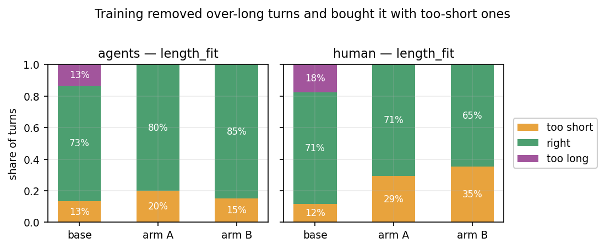
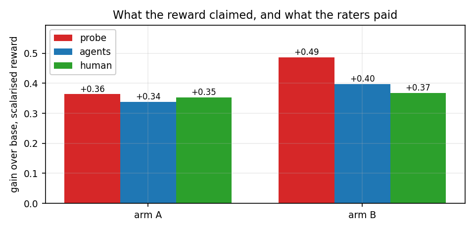

# Training a tutor against a learned reward model

**Status: both training runs finished. 180 tutor turns were then rated blind by one person and six AI raters.**

The idea: instead of asking an LLM to judge each tutor turn (slow, expensive), read the judgement
straight out of a frozen model's internal activations with a small linear fit. That fit is the
**reward model**. This report is about training a tutor against it and then checking, with people,
whether the tutor actually got better or just got better at scoring.

- Reward went **1.45 → 1.63**, and it holds up on questions the model never trained on.
- **The improvement is real.** Raters who never saw the reward model's scores agree with its
  ranking. Where the reward model claimed a gain of **+0.36**, two independent sets of raters
  paid **+0.34** and **+0.35**.
- **Preferred over the untrained model 18–10** in blind head-to-head pairs. Right direction, but
  not enough pairs to call it conclusive on its own.
- **One real regression: the turns got too short.** Too-short rose from 12% to 29–35% while
  too-long fell from 18% to zero.
- **The two training variants came out the same.** Same rated quality, and 8–9 in direct
  comparison, which is a coin flip.

## Why we don't reward the student's answer

The obvious design is: let the tutor teach a simulated student, and reward the tutor when the
student then solves the problem. **We tried that for four runs and it never worked** — the tutor
learned to stop giving answers away, and its teaching never improved on the held-out test, across
two reward designs, two datasets, and a bug fix to the leak detector.

The reason turned out to be measurable. Across the collected dialogues:

| how well it predicts the student solving | correlation |
| --- | --- |
| rated tutoring **quality** | **−0.012** (none at all) |
| rated **answer leakage** | **+0.291** |

The best-rated turns had the *worst* solve rates. Whether the student solves it carries exactly one
signal — whether they were told the answer — and the only lever a tutor has on it is giving the
answer away. Penalising leakage doesn't add a teaching signal; it removes the only signal there
was. Which is exactly what we saw: leaking fell, teaching didn't move.

Three consequences, and they shaped this project:

- **A simulated student is trapped between two failures with nothing in between.** Make it weak
  and it *can't* learn — it doesn't have the background, so no amount of good teaching moves it.
  Even expert tutoring shifted the 0.5B student's answers by only about 7 percentage points, and
  that caps anything a reward built on its accuracy could ever detect. Make it strong and it
  *already knows the answer* — asked to play a confused student, it reasons its way to the
  solution anyway, or drops the act and starts explaining like the teacher. Either way you stop
  measuring teaching and start measuring the student's own ability.

  Filtering makes the trap tighter, not looser. The problem set is filtered down to questions the
  weak student gets wrong, and those are exactly the questions a strong model gets right without
  help. The step that creates room for the weak student destroys it for the strong one. We tried a
  3B in the middle and abandoned it.
- **Fixing the reward instead didn't help either.** A learned quality score ended up detecting
  *which model wrote the turn* rather than how good it was, and drove the question-asking rate from
  79% down to 32%. Fixing the leak detector's false alarms more than doubled its precision on maths
  and moved the held-out test by 0.008.
- **So the thing you measure has to contain a teaching signal before any reward built on it can
  find one.** This project drops the student entirely and rates the tutor's turn directly. That's
  why the rubric asks whether the *tutor* said something false and never asks whether the student
  went on to answer correctly.

This history is also why the blind evaluation below matters more than the reward curve. Last time
the reward went up for four runs straight while the thing it stood for didn't budge, and only a
measurement taken outside the reward could have caught it.

## The reward model

Six qualities are rated 1–3 by people: how much the turn **leaks** the answer, how **targeted** it
is to this student's mistake, how **actionable**, how much it **elicits** the student's own
thinking, whether the **length** fits, and whether anything in it is in**correct**. A linear fit
then predicts those ratings from OLMo-7B's internal activations.

- Grey is the control: eight crude text measurements — word count, question marks, digit density —
  that know nothing about teaching. **Read this bar first.** Where grey reaches the blue bar, the
  rating is really just about the shape of the text and the activations bought nothing.
- `concise` is pure word count, 0.96 grey against 0.97 blue. **Dropped from the reward** for that.
- `targeted` is the payoff: 0.36 from crude text measurements, **0.85** from the activations.
  Whether a turn hits the student's actual mistake is nearly invisible in the shape of the text,
  and the model tracks it anyway.
- A straight-line fit beat a small neural network everywhere, so the reward costs one dot product.
- Middle layers (16–20 of 32) beat both ends. The last layer is busy predicting the next word
  rather than summarising the turn.

**The leak detector is hardened against cheating.** Pasting the answer into an
otherwise-answer-withholding turn used to fool it 93% of the time; after training it on faked
examples like that, **3%** — including on question phrasings and attack styles it never saw.
Accuracy on real turns barely moved, 0.84 → 0.82. The fitting script refuses to ship a reward model
that misses more than 15% of attacks it wasn't trained on.

## The two runs

| | arm A | arm B |
| --- | --- | --- |
| how the six scores are combined | plain average | each score rescaled first, then averaged |
| machine | 1×H100 | 1×H200 |
| W&B | [pm48fp8k](https://wandb.ai/zsophia-massachusetts-institute-of-technology/pedagogy-rm/runs/pm48fp8k) | [k77lk6tm](https://wandb.ai/zsophia-massachusetts-institute-of-technology/pedagogy-rm/runs/k77lk6tm) |

Both: OLMo-2-7B-Instruct, LoRA r=32, lr 1e-5, 32 prompts × 8 samples each, 120 steps (about 3.8
passes over 1000 prompts). The reward comes from a **separate frozen copy** of the model, so the
tutor can't raise its own score by changing its internal representations. Both loaded the identical
reward model; only the way the six scores are combined differs.

**Why arm B exists.** Averaging the scores as-is weights them by how much they happen to vary —
`elicits` varies most, `targeted` least — so a plain average leans about 1.5× harder on the quality
that crude text measurements already predict well (0.81) than on the one they barely predict at all
(0.36). Backwards for this project. Rescaling each score first makes all of them count equally.

## Training curves

- The held-out line (dashed) tracks the training line (solid) almost exactly, so **the model isn't
  memorising questions**. The 50 test questions don't overlap the 250 training ones.
- **Turns get shorter throughout.** Arm A 38 → 27 words, arm B 43 → 23. The human-rated examples
  averaged around 275 characters; arm B ends near 95.
- Arm B's reward number sits at zero by construction, because rescaling centres it. Judge arm B by
  its individual qualities, not its reward.

- `leak`, `elicits` and `actionable` all improve by roughly 0.25–0.40 points on the 1–3 scale.
- `targeted` doesn't move in either run.

**`targeted` is flat because of the ratings, not the training.** Pooled over 7 raters:

| quality | rated 1 | rated 2 | rated 3 | average |
| --- | --- | --- | --- | --- |
| `leak` | 45% | 29% | 27% | 1.82 |
| `elicits` | 41% | 29% | 30% | 1.89 |
| `actionable` | 39% | 32% | 29% | 1.89 |
| **`targeted`** | **10%** | 27% | **63%** | **2.53** |

The untrained model already scores 2.58 out of a maximum 3. There's almost no room left for an
improvement to show up, and a linear fit trained on such lopsided ratings hedges toward the middle
and never predicts a full 3.

- Arm B moves away from its starting point about **3× faster** at the same setting, because
  rescaling makes the training signal larger. Compare the two arms by how far they've drifted, not
  by step count.

## Is a reward of 1.6 high?

Against the human-rated examples the reward model was fitted on, grouped by the prompting style
that produced them:

| style | turns | average | 90th pct | max |
| --- | --- | --- | --- | --- |
| `socratic` | 146 | 1.634 | 1.834 | 1.976 |
| `brief` | 144 | 1.253 | 1.684 | 1.868 |
| `plain` | 162 | 0.851 | 1.339 | 1.680 |
| `explain` | 148 | 0.746 | 1.296 | 1.600 |

1.60 is about the **78th percentile** and still below the best style's average, so the trained
model is being scored **inside** the range the reward model actually learned from rather than off
the end of it. That stops being true above roughly 1.8, which arm A is now approaching.

## The blind evaluation — the part that decides whether any of this counts

60 held-out questions × 3 models (untrained, arm A, arm B) = 180 turns. Which model wrote each turn
and what the reward model scored it were both stripped out, and the answer key was written to a
separate file. One person rated 51 of them; six AI raters rated all 180 after being calibrated on
26 of her ratings and **checked against the 25 of hers that none of them were shown**.

Every model answered the same questions, so each comparison holds the question and the student's
situation fixed — by far the biggest source of noise in a rating.

| quality | arm A vs untrained | arm B vs untrained | her own ratings, A / B | do the AI raters match her? |
| --- | --- | --- | --- | --- |
| `leak` | **+0.39** (won 69%) | **+0.40** (72%) | +0.24 / +0.41 | 0.37 |
| `actionable` | **+0.54** (69%) | **+0.71** (82%) | **+0.53** / **+0.41** | 0.03 |
| `elicits` | **+0.41** (64%) | **+0.45** (70%) | **+0.47** / **+0.59** | 0.21 |
| `correct` | **+0.17** (65%) | **+0.27** (73%) | +0.18 / +0.12 | 0.38 |
| `targeted` | +0.01 | +0.02 | +0.18 / +0.06 | 0.24 |
| `length_fit` | +0.05 | +0.05 | +0.00 / −0.06 | 0.26 |

Bold means the gain is larger than its margin of error. Percentages are the share of questions
where that model's turn was rated better. The last column runs 0 (chance) to 1 (perfect).

**Disagreeing on individual turns and agreeing on which model is better are two different things,
and mixing them up would have thrown away the result.** On `actionable` the AI raters match the
human at 0.03 — no better than chance at ranking one turn against another. Yet both produce the
same gap between models, in the same direction, at nearly the same size (+0.54/+0.71 against
+0.53/+0.41). Ranking noise on individual turns cancels out across sixty questions; a consistent
preference for one model doesn't. So near-zero agreement rules these raters out for *labelling
training data* and says very little about *comparing two models*.

**The one regression, and the AI raters understate it.** `length_fit` scores 2 for the right length
and 1 or 3 for the two ways of being wrong, so its average is meaningless on its own — a model
split evenly between too-short and too-long averages exactly 2.0 and looks perfect. Split apart:

| | too short | right | too long |
| --- | --- | --- | --- |
| untrained | 12% | 71% | 18% |
| arm A | **29%** | 71% | 0% |
| arm B | **35%** | 65% | 0% |

Her ratings. Training wiped out over-long turns completely and paid for it with roughly triple the
too-short rate, so the net score barely moves. The AI raters put too-short at 20%/15% — about half
the real figure. This is the one place where trusting them alone would have hidden a genuine loss,
and it's the shortening visible in the training curves showing up as a measurable defect.

**The combined reward, measured three ways.** The same combination the reward model optimises,
applied to the human and AI ratings, so all three are the same quantity. The absolute levels aren't
comparable across the three (different scales), so read the gain:

| who's measuring | untrained | arm A | arm B | gain, A | gain, B |
| --- | --- | --- | --- | --- | --- |
| AI raters, 180 turns | 1.32 | 1.65 | 1.71 | +0.34 | +0.40 |
| her, 51 turns | 1.31 | 1.66 | 1.68 | +0.35 | +0.37 |
| **reward model** | 1.23 | 1.60 | 1.72 | **+0.36** | **+0.49** |

**Arm A is clean:** the reward model claims +0.36, and two independent sets of raters pay +0.34 and
+0.35. That three-way agreement is the strongest single piece of evidence here that the training
did something real. **Arm B is where a gap opens** — +0.49 claimed against +0.37 and +0.40 paid,
about a third more than anyone actually buys. Mild, but that's what it looks like when a model
starts optimising the scorer rather than the thing the scorer stands for, and it shows up in the
arm that pushed harder.

One more thing in the reward scores: the **variety across turns collapses**. Spread falls from 0.36
untrained to 0.18 and 0.13. The trained models are less than half as varied — a model settling into
one shape of answer, which is the same shortening seen from another angle.

**Head-to-head preferences, blind, same question on both sides.**

| comparison | result | probability of this by chance | picked the turn the reward model preferred |
| --- | --- | --- | --- |
| arm A vs arm B, 17 pairs | 8 – 9, no ties | 100% | 47% |
| arm A vs untrained, 30 pairs | **18 – 10**, 2 ties | 19% | **68%** |

The two arms are **the same model** as far as a person can tell. Against the untrained model,
training wins 64% of the time — right direction, but 28 decided pairs isn't enough to rule out
chance; a 64% effect needs about 60. Combined with the ratings above, which rest on many more
judgements and put arm A ahead on 76% of questions, training did beat the untrained model.

The last column is the more useful half. The reward model **can't** tell two trained models apart
(47%, and it scored the two sides within 0.07 of each other), but it **can** tell trained from
untrained (68%). That's a reward model with real but limited resolution, which is the honest
description of it.

One side note, not statistically solid either way: between two trained turns she picked the longer
one 65% of the time, and against the untrained model she picked the *shorter* one 68% of the time.
Both point at an ideal length in between the two — the same story the too-short/too-long split
tells.

**`correct` passed the bar it failed the first time, and is now in the reward model.** It was
dropped originally because raters didn't agree on it; with a rewritten definition they now do, and
the activations predict it at **0.63** against a crude-text baseline of 0.47. It's the weakest of
the five, and the only one that asks whether the tutor said something false. Saved as
`data/head5.npz`.

**Why the AI ratings weren't used to retrain the reward model.** The six models agree with each
other far more than they agree with the human, and what they agree on is largely the shape of the
text:

| quality | AI raters agree with each other | ...with the human | crude text predicts the AI raters | ...predicts the human |
| --- | --- | --- | --- | --- |
| `actionable` | 0.76 | 0.06 | **0.74** | 0.23 |
| `elicits` | 0.57 | 0.06 | **0.61** | 0.34 |
| `leak` | 0.50 | 0.22 | 0.64 | 0.28 |
| `correct` | 0.49 | 0.27 | 0.34 | 0.37 |
| `targeted` | 0.58 | 0.27 | 0.08 | 0.11 |
| `length_fit` | 0.55 | 0.26 | 0.77 | 0.72 |

Three quarters of what the AI raters collectively say about `actionable` can be reproduced by eight
crude text measurements. Train a reward model on that and run RL against it, and the tutor
optimises the shape of its text — which is the shortening already measured. `correct` and
`targeted` are the two where the AI raters are clean, and they're the two safe to average.

The other half of the story is that there's little room to disagree in: `actionable` is rated 3 on
74% of turns by the AI raters and 65% by the human, `elicits` 57% and 67%. Everyone is choosing
between 2 and 3. **And the overall distributions match on all six qualities** — the human and the
AI raters hand out the same mix of scores and differ only on which turn gets which. That's exactly
the situation where averaged AI ratings are trustworthy for comparing models and untrustworthy for
labelling individual turns.

## What we still don't know

- **The test questions were held out from the tutor, but not from the reward model.** 250 training
  and 50 test questions with no overlap — but 45 of the 50 were among the questions the reward
  model was fitted on. Nothing leaks (the reward model is frozen), but any agreement measured here
  flatters it. Next round should hold questions out from both.
- **One human, 17 questions rated and 28 pairs decided.** Every claim about which model is better
  rests on 60 questions rated by AI raters whose per-turn agreement with her is weak, plus her own
  17. The two agree, which is why either is believable, but neither is a large sample. The
  head-to-head test that would settle it independently is underpowered; the remaining 30 pairs
  already exist and would get there.
- **Only the final checkpoint was tested.** Checkpoints were saved every 10 steps, so if quality
  peaked before step 120 while the reward kept climbing, we wouldn't know.
- **Why nobody agrees on `elicits` and `actionable` per turn is unexplained.** Both are nearly
  maxed out on these turns, so what's left to disagree about may just be personal taste rather than
  a signal anything could learn.

## What to do next

1. **Run arm C: the five-quality reward model plus an explicit length penalty.** Both changes come
   straight from the measurements above. Adding `correct` means nothing pushes the tutor toward
   confident falsehoods. And the too-short problem should be penalised directly rather than learned
   — crude text measurements predict her own length judgements at 0.72, so a simple length rule
   tuned to her ideal does the job with no reward model and no new ratings.
2. **Drop the rescaled arm.** 8–9 head to head, one quality out of six on ratings, and the wider
   claimed-versus-paid gap of the two. It costs a GPU to answer a question that's now answered.
3. **Test the step-30 and step-50 checkpoints the same way.** If quality peaks before the reward
   does, that's where to stop — and finding that is a better result than a run that happened to
   stop early and looked fine.
4. **Hold some questions back from the reward model too**, so future human-vs-model agreement
   numbers mean what they appear to mean.

## Engineering notes

Two genuine bugs and six environment failures stood between the LoRA setup and a single training
step.

- **`grpo_fast.save_model` referenced `self.stage`**, an attribute the class never had, inside a
  branch that was unreachable until this project added LoRA. It fires at the *first checkpoint* —
  so the run dies exactly when it first tries to make itself resumable.
- **vLLM 0.21 requires `start_weight_update` / `finish_weight_update`** around `update_weights`;
  0.19.1, which the project pins, did not. Without them the engine reports ready and then refuses
  every weight sync.
- The rest: DeepSpeed won't import without `nvcc`; Triton needs `Python.h`, which isn't installed
  here; Ray can't serialise the trainer class because it reaches torch's config modules;
  `--push_to_hub` defaults to true and calls out to the network; local `.jsonl` files loaded fine
  in one code path and not in another.

Every run records its commit, how many files differ from that commit, and checksums of the reward
model and the prompts. The dirty-file count is included deliberately — a tag naming a commit the
working tree doesn't match is worse than no tag at all.
