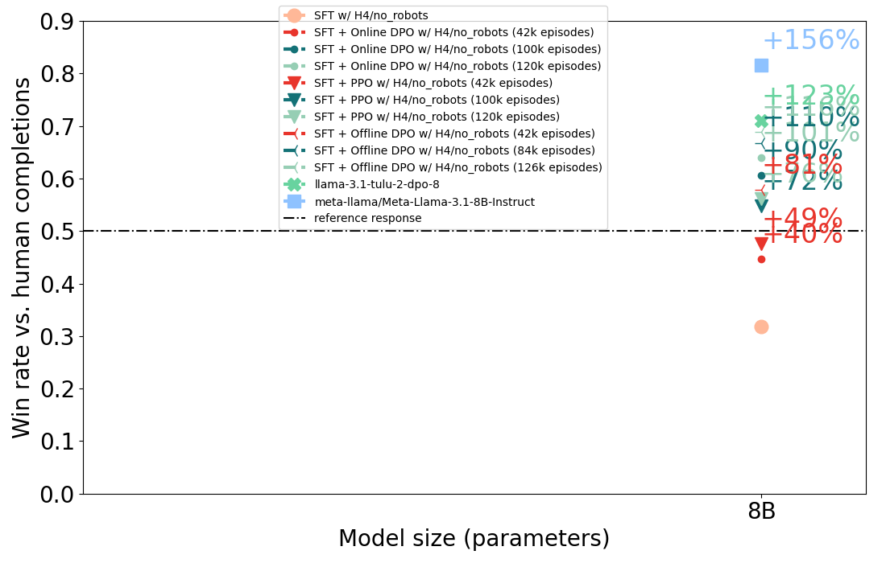
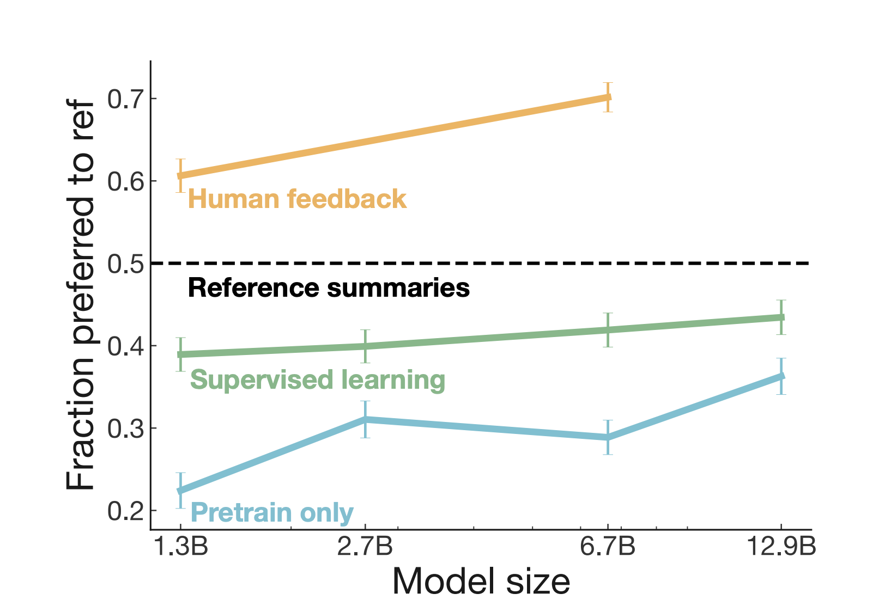

# Can our model generate better responses than human?

This repository contains some experimental script to do gpt 4 as a judge to see if gpt 4 prefers our model response over human-written responses. We use https://huggingface.co/datasets/HuggingFaceH4/no_robots which contains only human-written responses.


## Get started

First navigate to this directory.


```bash
python -i generate_and_eval.py \
    --model_name_or_path allenai/open_instruct_dev \
    --model_revision costa_finetune_tulu3_8b_norobot__meta-llama_Meta-Llama-3.1-8B__42__1725559869 \
    --n 500
# preferred
# response1    0.682
# response0    0.318
# Name: proportion, dtype: float64
# df['model_response_len'].mean()=198.402

python -i generate_and_eval.py \
    --model_name_or_path allenai/llama-3.1-tulu-2-dpo-8b \
    --n 500
# preferred
# response0    0.71
# response1    0.29
# Name: proportion, dtype: float64
# df['model_response_len'].mean()=320.09

python -i generate_and_eval.py \
    --model_name_or_path meta-llama/Meta-Llama-3.1-8B-Instruct \
    --n 500
# preferred
# response0    0.816
# response1    0.184
# Name: proportion, dtype: float64
# df['model_response_len'].mean()=309.322

# https://wandb.ai/ai2-llm/open_instruct_internal/runs/do4nuqhh
python -i generate_and_eval.py \
    --model_name_or_path vwxyzjn/online_dpo_vllm_thread_beta_0.03__allenai_open_instruct_dev \
    --model_revision online_dpo_vllm_thread_beta_0.03__3__1726200312 \
    --n 500
# preferred
# response0    0.606
# response1    0.394
# Name: proportion, dtype: float64
# df['model_response_len'].mean()=303.176

# https://wandb.ai/ai2-llm/open_instruct_internal/runs/jvjegpcq/
python -i generate_and_eval.py \
    --model_name_or_path vwxyzjn/ppo_vllm_thread_beta_0.03__allenai_open_instruct_dev \
    --model_revision ppo_vllm_thread_beta_0.03__3__1726244716 \
    --n 500
# preferred
# response0    0.548
# response1    0.452
# Name: proportion, dtype: float64
# df['model_response_len'].mean()=233.058

# https://wandb.ai/ai2-llm/open_instruct_internal/runs/97i9hdk3
python -i generate_and_eval.py \
    --model_name_or_path allenai/open_instruct_dev \
    --model_revision costa_offline_dpo_norobot_3pair__allenai_open_instruct_dev__42__1726174531 \
    --n 500
# preferred
# response0    0.578
# response1    0.422
# Name: proportion, dtype: float64
# df['model_response_len'].mean()=273.732

# https://wandb.ai/ai2-llm/open_instruct_internal/runs/w21rugjl
python -i generate_and_eval.py \
    --model_name_or_path allenai/open_instruct_dev \
    --model_revision costa_offline_dpo_norobot_3pair_2peoch__allenai_open_instruct_dev__42__1726241871 \
    --n 500
# preferred
# response0    0.668
# response1    0.332
# Name: proportion, dtype: float64
# df['model_response_len'].mean()=215.136

# https://wandb.ai/ai2-llm/open_instruct_internal/runs/g70g1coa/overview
python -i generate_and_eval.py \
    --model_name_or_path allenai/open_instruct_dev \
    --model_revision costa_offline_dpo_norobot_3pair_3peoch__allenai_open_instruct_dev__42__1726354080 \
    --n 500
# preferred
# response0    0.688
# response1    0.312
# Name: proportion, dtype: float64
# df['model_response_len'].mean()=186.848

# https://wandb.ai/ai2-llm/open_instruct_internal/runs/twxhblyw
python -i generate_and_eval.py \
    --model_name_or_path vwxyzjn/ppo_vllm_thread_beta_0.03_episode_42000__allenai_open_instruct_dev \
    --model_revision ppo_vllm_thread_beta_0.03_episode_42000__3__1726543996 \
    --n 500
# preferred
# response1    0.554
# response0    0.446
# Name: proportion, dtype: float64
# df['model_response_len'].mean()=238.528

# https://wandb.ai/ai2-llm/open_instruct_internal/runs/i2ubt8zy
python -i generate_and_eval.py \
    --model_name_or_path vwxyzjn/ppo_vllm_thread_beta_0.03_episode_126000__allenai_open_instruct_dev \
    --model_revision ppo_vllm_thread_beta_0.03_episode_126000__3__1726543993 \
    --n 500
# preferred
# response0    0.562
# response1    0.438
# Name: proportion, dtype: float64
# df['model_response_len'].mean()=226.956


# https://wandb.ai/ai2-llm/open_instruct_internal/runs/qminkg08/overview
python -i generate_and_eval.py \
    --model_name_or_path vwxyzjn/online_dpo_vllm_thread_beta_0.03_episode_42000__allenai_open_instruct_dev \
    --model_revision online_dpo_vllm_thread_beta_0.03_episode_42000__3__1726546910 \
    --n 500
# preferred
# response1    0.524
# response0    0.476
# Name: proportion, dtype: float64
# df['model_response_len'].mean()=222.886


# https://wandb.ai/ai2-llm/open_instruct_internal/runs/2mtdilmj
python -i generate_and_eval.py \
    --model_name_or_path vwxyzjn/online_dpo_vllm_thread_beta_0.03_episode_126000__allenai_open_instruct_dev \
    --model_revision online_dpo_vllm_thread_beta_0.03_episode_126000__3__1726559254 \
    --n 500
# referred
# response0    0.64
# response1    0.36
# Name: proportion, dtype: float64
# df['model_response_len'].mean()=314.074

python plot_winrate.py
```




It is basically the same thing as the win rate in https://arxiv.org/abs/2009.01325

